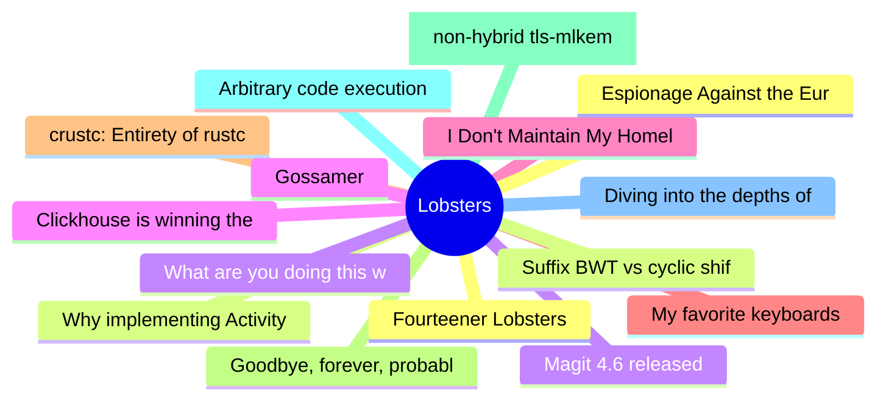

# Lobsters Top 15 (2026-07-04)

## 思维导图

## 列表（15 条）

### 1. Fourteener Lobsters
- **链接**: [https://lobste.rs/s/zwz0wh/fourteener_lobsters](https://lobste.rs/s/zwz0wh/fourteener_lobsters)
- **作者**:  | **评论**: 0
- **摘要**: 
Hey folks,

Once more around the sun, today is 14 years since Lobsters launched in 2012.

Like the the <a href="https://en.wikipedia.org/wiki/Fourteener" rel="ugc">American fourteeners<

### 2. Why implementing ActivityPub is hard, and why it doesn't have to be
- **链接**: [https://hackers.pub/@fedify/2026/why-activitypub-is-hard](https://hackers.pub/@fedify/2026/why-activitypub-is-hard)
- **作者**:  | **评论**: 0
- **摘要**: 
<a href="https://lobste.rs/s/1g5bum/why_implementing_activitypub_is_hard_why">Comments</a>

### 3. Magit 4.6 released
- **链接**: [https://emacsair.me/2026/07/01/magit-4.6/](https://emacsair.me/2026/07/01/magit-4.6/)
- **作者**:  | **评论**: 0
- **摘要**: 
<a href="https://lobste.rs/s/wbpoiy/magit_4_6_released">Comments</a>

### 4. Clickhouse is winning the Observability Wars
- **链接**: [https://matduggan.com/clickhouse-is-winning-the-observability-wars/](https://matduggan.com/clickhouse-is-winning-the-observability-wars/)
- **作者**:  | **评论**: 0
- **摘要**: 
<a href="https://lobste.rs/s/asi79o/clickhouse_is_winning_observability">Comments</a>

### 5. I Don't Maintain My Homelab
- **链接**: [https://cleberg.net/blog/homelab-maintenance.html](https://cleberg.net/blog/homelab-maintenance.html)
- **作者**:  | **评论**: 0
- **摘要**: 
<a href="https://lobste.rs/s/fx5e0f/i_don_t_maintain_my_homelab">Comments</a>

### 6. My favorite keyboards
- **链接**: [https://fabiensanglard.net/keyboards/index.html](https://fabiensanglard.net/keyboards/index.html)
- **作者**:  | **评论**: 0
- **摘要**: 
<a href="https://lobste.rs/s/i7klfz/my_favorite_keyboards">Comments</a>

### 7. crustc: Entirety of rustc, translated to C
- **链接**: [https://github.com/FractalFir/crustc](https://github.com/FractalFir/crustc)
- **作者**:  | **评论**: 0
- **摘要**: 
<a href="https://lobste.rs/s/ryny2c/crustc_entirety_rustc_translated_c">Comments</a>

### 8. Goodbye, forever, probably
- **链接**: [https://whitep4nth3r.com/blog/goodbye-forever-probably/](https://whitep4nth3r.com/blog/goodbye-forever-probably/)
- **作者**:  | **评论**: 0
- **摘要**: 
<a href="https://lobste.rs/s/skwy7v/goodbye_forever_probably">Comments</a>

### 9. A [non-hybrid tls-mlkem] standard by any other name: How IETF evades responsibility for its actions
- **链接**: [https://blog.cr.yp.to/20260702-standard.html](https://blog.cr.yp.to/20260702-standard.html)
- **作者**:  | **评论**: 0
- **摘要**: 
<a href="https://lobste.rs/s/munamr/non_hybrid_tls_mlkem_standard_by_any_other">Comments</a>

### 10. Arbitrary code execution breaking sandboxes in KDE Plasma
- **链接**: [https://blog.kimiblock.top/2026/07/01/arbitrary-code-execution-in-kde-plasma/](https://blog.kimiblock.top/2026/07/01/arbitrary-code-execution-in-kde-plasma/)
- **作者**:  | **评论**: 0
- **摘要**: 
<a href="https://lobste.rs/s/ovcwkm/arbitrary_code_execution_breaking">Comments</a>

### 11. Diving into the depths of Widevine L3
- **链接**: [https://neodyme.io/en/blog/widevine_l3](https://neodyme.io/en/blog/widevine_l3)
- **作者**:  | **评论**: 0
- **摘要**: 
<a href="https://lobste.rs/s/fuyanm/diving_into_depths_widevine_l3">Comments</a>

### 12. Espionage Against the European Parliament: Member of Committee Investigating Spyware Hacked with Pegasus
- **链接**: [https://citizenlab.ca/research/member-of-committee-investigating-spyware-hacked-with-pegasus/](https://citizenlab.ca/research/member-of-committee-investigating-spyware-hacked-with-pegasus/)
- **作者**:  | **评论**: 0
- **摘要**: 
<a href="https://lobste.rs/s/xwsfs3/espionage_against_european_parliament">Comments</a>

### 13. Suffix BWT vs cyclic shift BWT, and fast computation
- **链接**: [https://purplesyringa.moe/blog/suffix-bwt-vs-cyclic-shift-bwt-and-fast-computation/](https://purplesyringa.moe/blog/suffix-bwt-vs-cyclic-shift-bwt-and-fast-computation/)
- **作者**:  | **评论**: 0
- **摘要**: 
<a href="https://lobste.rs/s/suucvi/suffix_bwt_vs_cyclic_shift_bwt_fast">Comments</a>

### 14. What are you doing this weekend?
- **链接**: [https://lobste.rs/s/rhgehk/what_are_you_doing_this_weekend](https://lobste.rs/s/rhgehk/what_are_you_doing_this_weekend)
- **作者**:  | **评论**: 0
- **摘要**: 
Feel free to tell what you plan on doing this weekend and even ask for help or feedback.

Please keep in mind it’s more than OK to do nothing at all too!

### 15. Gossamer
- **链接**: [https://gossamer-lang.org/](https://gossamer-lang.org/)
- **作者**:  | **评论**: 0
- **摘要**: 
A Rust-flavoured language with real goroutines and a Swift-like memory model

<a href="https://lobste.rs/s/e6k4z1/gossamer">Comments</a>

