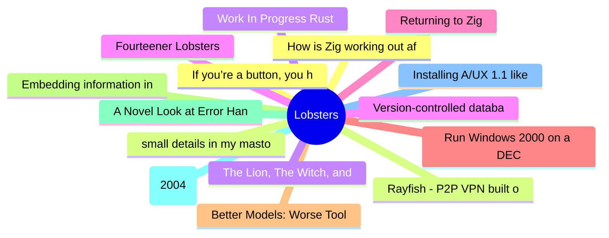

# Lobsters Top 15 (2026-07-06)

## 思维导图

## 列表（15 条）

### 1. If you’re a button, you have one job
- **链接**: [https://unsung.aresluna.org/if-youre-a-button-you-have-one-job/](https://unsung.aresluna.org/if-youre-a-button-you-have-one-job/)
- **作者**:  | **评论**: 0
- **摘要**: 
<a href="https://lobste.rs/s/zhizsf/if_you_re_button_you_have_one_job">Comments</a>

### 2. Rayfish - P2P VPN built on top of Iroh
- **链接**: [https://rayfish.xyz/blog/01-introducing-rayfish](https://rayfish.xyz/blog/01-introducing-rayfish)
- **作者**:  | **评论**: 0
- **摘要**: 
<a href="https://lobste.rs/s/4behtu/rayfish_p2p_vpn_built_on_top_iroh">Comments</a>

### 3. Work In Progress Rust
- **链接**: [https://blog.dureuill.net/articles/wip/](https://blog.dureuill.net/articles/wip/)
- **作者**:  | **评论**: 0
- **摘要**: 
<a href="https://lobste.rs/s/qu1bwq/work_progress_rust">Comments</a>

### 4. Fourteener Lobsters
- **链接**: [https://lobste.rs/s/zwz0wh/fourteener_lobsters](https://lobste.rs/s/zwz0wh/fourteener_lobsters)
- **作者**:  | **评论**: 0
- **摘要**: 
Hey folks,

Once more around the sun, today is 14 years since Lobsters launched in 2012.

Like the the <a href="https://en.wikipedia.org/wiki/Fourteener" rel="ugc">American fourteeners<

### 5. Returning to Zig
- **链接**: [https://gracefulliberty.com/articles/return-to-zig/](https://gracefulliberty.com/articles/return-to-zig/)
- **作者**:  | **评论**: 0
- **摘要**: 
<a href="https://lobste.rs/s/svm2dp/returning_zig">Comments</a>

### 6. Run Windows 2000 on a DEC Alpha with a new es40 fork
- **链接**: [https://raymii.org/s/blog/Run_Windows_2000_for_Dec_Alpha_on_a_new_es40_fork.html](https://raymii.org/s/blog/Run_Windows_2000_for_Dec_Alpha_on_a_new_es40_fork.html)
- **作者**:  | **评论**: 0
- **摘要**: 
<a href="https://lobste.rs/s/ywehuv/run_windows_2000_on_dec_alpha_with_new_es40">Comments</a>

### 7. Better Models: Worse Tools
- **链接**: [https://lucumr.pocoo.org/2026/7/4/better-models-worse-tools/](https://lucumr.pocoo.org/2026/7/4/better-models-worse-tools/)
- **作者**:  | **评论**: 0
- **摘要**: 
A rare case where I want to put a post of mine here. Reason being that I was hunting down tool calling behavior regressions with the latest generation of Anthropic models and I found the resulting

### 8. Embedding information in disorder
- **链接**: [https://thoughts.hmmz.org/2026-07-05.html](https://thoughts.hmmz.org/2026-07-05.html)
- **作者**:  | **评论**: 0
- **摘要**: 
<a href="https://lobste.rs/s/ssvgqs/embedding_information_disorder">Comments</a>

### 9. A Novel Look at Error Handling in Rust
- **链接**: [https://jtjlehi.github.io/2026/06/25/novel-rust-error-handling.html](https://jtjlehi.github.io/2026/06/25/novel-rust-error-handling.html)
- **作者**:  | **评论**: 0
- **摘要**: 
<a href="https://lobste.rs/s/l0yqco/novel_look_at_error_handling_rust">Comments</a>

### 10. ABI vs. API (2004)
- **链接**: [https://lists.debian.org/debian-user/2004/02/msg00648.html](https://lists.debian.org/debian-user/2004/02/msg00648.html)
- **作者**:  | **评论**: 0
- **摘要**: 
<a href="https://lobste.rs/s/k9yyfs/abi_vs_api_2004">Comments</a>

### 11. Installing A/UX 1.1 like it’s the 90s
- **链接**: [https://thomasw.dev/post/aux11/](https://thomasw.dev/post/aux11/)
- **作者**:  | **评论**: 0
- **摘要**: 
<a href="https://lobste.rs/s/dvn3hl/installing_ux_1_1_like_it_s_90s">Comments</a>

### 12. How is Zig working out after 3 years and 100k lines of game code?
- **链接**: [https://www.youtube.com/watch?v=HXpUShkr2VQ](https://www.youtube.com/watch?v=HXpUShkr2VQ)
- **作者**:  | **评论**: 0
- **摘要**: 
<a href="https://lobste.rs/s/q8eiqk/how_is_zig_working_out_after_3_years_100k">Comments</a>

### 13. small details in my mastodon client that i wanted more people to notice
- **链接**: [https://w.on-t.work/outpost-frontend-details](https://w.on-t.work/outpost-frontend-details)
- **作者**:  | **评论**: 0
- **摘要**: 
<a href="https://lobste.rs/s/ai5zlv/small_details_my_mastodon_client_i_wanted">Comments</a>

### 14. The Lion, The Witch, and the audacity of recruiters
- **链接**: [https://hauleth.dev/post/the-lion-the-witch-and-the-aduacity-of-recruiter/](https://hauleth.dev/post/the-lion-the-witch-and-the-aduacity-of-recruiter/)
- **作者**:  | **评论**: 0
- **摘要**: 
<a href="https://lobste.rs/s/5akjfx/lion_witch_audacity_recruiters">Comments</a>

### 15. Version-controlled databases using Prolly trees
- **链接**: [https://lwn.net/Articles/1068864/](https://lwn.net/Articles/1068864/)
- **作者**:  | **评论**: 0
- **摘要**: 
<a href="https://lobste.rs/s/st8bqf/version_controlled_databases_using">Comments</a>

