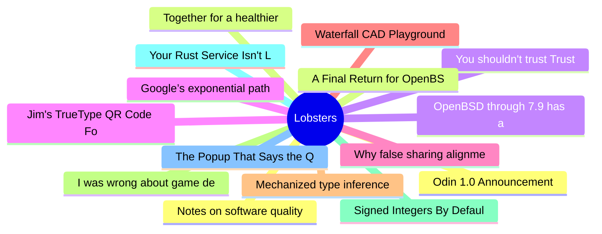

# Lobsters Top 15 (2026-07-08)

## 思维导图

## 列表（15 条）

### 1. Odin 1.0 Announcement
- **链接**: [https://www.youtube.com/watch?v=dLPAqXi9In0](https://www.youtube.com/watch?v=dLPAqXi9In0)
- **作者**:  | **评论**: 0
- **摘要**: 
<a href="https://lobste.rs/s/5rvgim/odin_1_0_announcement">Comments</a>

### 2. Together for a healthier Clippy
- **链接**: [https://blog.rust-lang.org/inside-rust/2026/07/06/unite-for-clippy/](https://blog.rust-lang.org/inside-rust/2026/07/06/unite-for-clippy/)
- **作者**:  | **评论**: 0
- **摘要**: 
<a href="https://lobste.rs/s/709awc/together_for_healthier_clippy">Comments</a>

### 3. You shouldn't trust Trusted Publishing
- **链接**: [https://blog.yossarian.net/2026/07/07/You-shouldnt-trust-trusted-publishing](https://blog.yossarian.net/2026/07/07/You-shouldnt-trust-trusted-publishing)
- **作者**:  | **评论**: 0
- **摘要**: 
<a href="https://lobste.rs/s/8d9pgd/you_shouldn_t_trust_trusted_publishing">Comments</a>

### 4. Google’s exponential path to climate-wrecking digital bloat
- **链接**: [https://ketanjoshi.co/2026/07/01/googles-exponential-path-to-climate-wrecking-digital-bloat/](https://ketanjoshi.co/2026/07/01/googles-exponential-path-to-climate-wrecking-digital-bloat/)
- **作者**:  | **评论**: 0
- **摘要**: 
<a href="https://lobste.rs/s/v8hk8q/google_s_exponential_path_climate">Comments</a>

### 5. Why false sharing alignment should be 128 bytes on x64
- **链接**: [https://monoid.github.io/posts/false-sharing-alignment/](https://monoid.github.io/posts/false-sharing-alignment/)
- **作者**:  | **评论**: 0
- **摘要**: 
<a href="https://lobste.rs/s/no3kkj/why_false_sharing_alignment_should_be_128">Comments</a>

### 6. Waterfall CAD Playground - A Haskell powered programmable-CAD environment, in the browser with WASM
- **链接**: [https://doscienceto.it/waterpark](https://doscienceto.it/waterpark)
- **作者**:  | **评论**: 0
- **摘要**: 
<a href="https://lobste.rs/s/hfiihu/waterfall_cad_playground_haskell">Comments</a>

### 7. Mechanized type inference for record concatenation
- **链接**: [https://haskellforall.com/2026/07/mechanized-type-inference-for-record-concatenation](https://haskellforall.com/2026/07/mechanized-type-inference-for-record-concatenation)
- **作者**:  | **评论**: 0
- **摘要**: 
<a href="https://lobste.rs/s/zffug6/mechanized_type_inference_for_record">Comments</a>

### 8. I was wrong about game development
- **链接**: [https://mijndertstuij.nl/posts/i-was-wrong-about-game-development/](https://mijndertstuij.nl/posts/i-was-wrong-about-game-development/)
- **作者**:  | **评论**: 0
- **摘要**: 
<a href="https://lobste.rs/s/n3iqxi/i_was_wrong_about_game_development">Comments</a>

### 9. Signed Integers By Default
- **链接**: [https://www.gingerbill.org/article/2026/05/03/signed-by-default/](https://www.gingerbill.org/article/2026/05/03/signed-by-default/)
- **作者**:  | **评论**: 0
- **摘要**: 
<a href="https://lobste.rs/s/asnoqy/signed_integers_by_default">Comments</a>

### 10. Your Rust Service Isn't Leaking — It Could Be the Allocator
- **链接**: [https://pranitha.dev/posts/rust-and-memory-allocators/](https://pranitha.dev/posts/rust-and-memory-allocators/)
- **作者**:  | **评论**: 0
- **摘要**: 
<a href="https://lobste.rs/s/srmkur/your_rust_service_isn_t_leaking_it_could_be">Comments</a>

### 11. The Popup That Says the Quiet Part Out Loud
- **链接**: [https://blog.ppb1701.com/the-popup-that-says-the-quiet-part-out-loud](https://blog.ppb1701.com/the-popup-that-says-the-quiet-part-out-loud)
- **作者**:  | **评论**: 0
- **摘要**: 
<a href="https://lobste.rs/s/hq8i1h/popup_says_quiet_part_out_loud">Comments</a>

### 12. Notes on software quality
- **链接**: [https://anthonyhobday.com/blog/20260410](https://anthonyhobday.com/blog/20260410)
- **作者**:  | **评论**: 0
- **摘要**: 
<a href="https://lobste.rs/s/swqkt0/notes_on_software_quality">Comments</a>

### 13. A Final Return for OpenBSD Anti-Return-Oriented Programming Mitigations
- **链接**: [https://papers.ssrn.com/sol3/papers.cfm?abstract_id=6869668](https://papers.ssrn.com/sol3/papers.cfm?abstract_id=6869668)
- **作者**:  | **评论**: 0
- **摘要**: 
<a href="https://lobste.rs/s/xclcel/final_return_for_openbsd_anti_return">Comments</a>

### 14. OpenBSD through 7.9 has a use-after-free allowing local privilege escalation to root (CVE-2026-57589)
- **链接**: [https://nvd.nist.gov/vuln/detail/cve-2026-57589](https://nvd.nist.gov/vuln/detail/cve-2026-57589)
- **作者**:  | **评论**: 0
- **摘要**: 
<a href="https://lobste.rs/s/7hmu0w/openbsd_through_7_9_has_use_after_free">Comments</a>

### 15. Jim's TrueType QR Code Font
- **链接**: [https://qr.jim.sh/](https://qr.jim.sh/)
- **作者**:  | **评论**: 0
- **摘要**: 
<a href="https://lobste.rs/s/y0tvll/jim_s_truetype_qr_code_font">Comments</a>

