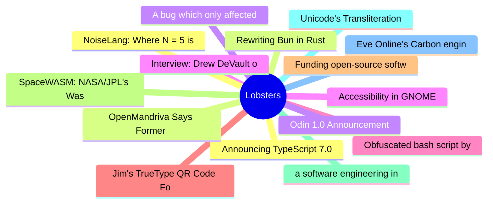

# Lobsters Top 15 (2026-07-09)

## 思维导图

## 列表（15 条）

### 1. Announcing TypeScript 7.0
- **链接**: [https://devblogs.microsoft.com/typescript/announcing-typescript-7-0/](https://devblogs.microsoft.com/typescript/announcing-typescript-7-0/)
- **作者**:  | **评论**: 0
- **摘要**: 
<a href="https://lobste.rs/s/txmyod/announcing_typescript_7_0">Comments</a>

### 2. Rewriting Bun in Rust
- **链接**: [https://bun.com/blog/bun-in-rust](https://bun.com/blog/bun-in-rust)
- **作者**:  | **评论**: 0
- **摘要**: 
<a href="https://lobste.rs/s/6rkdik/rewriting_bun_rust">Comments</a>

### 3. A bug which only affected left-handed users
- **链接**: [https://shkspr.mobi/blog/2026/07/a-bug-which-only-affected-left-handed-users/](https://shkspr.mobi/blog/2026/07/a-bug-which-only-affected-left-handed-users/)
- **作者**:  | **评论**: 0
- **摘要**: 
<a href="https://lobste.rs/s/oj9lal/bug_which_only_affected_left_handed_users">Comments</a>

### 4. Interview: Drew DeVault on an AI-free version of Vim
- **链接**: [https://jasonpolak.substack.com/p/interview-drew-devault-on-an-ai-free](https://jasonpolak.substack.com/p/interview-drew-devault-on-an-ai-free)
- **作者**:  | **评论**: 0
- **摘要**: 
<a href="https://lobste.rs/s/dbakbg/interview_drew_devault_on_ai_free_version">Comments</a>

### 5. Obfuscated bash script by Akamai being supplied to consumers via retail stores
- **链接**: [https://tris.sherliker.net/blog/obfuscated-self-evaluating-bash-script-by-cdn-akamai-being-supplied-to-consumers-via-retail-stores/](https://tris.sherliker.net/blog/obfuscated-self-evaluating-bash-script-by-cdn-akamai-being-supplied-to-consumers-via-retail-stores/)
- **作者**:  | **评论**: 0
- **摘要**: 
<a href="https://lobste.rs/s/mp42ys/obfuscated_bash_script_by_akamai_being">Comments</a>

### 6. Jim's TrueType QR Code Font
- **链接**: [https://qr.jim.sh/](https://qr.jim.sh/)
- **作者**:  | **评论**: 0
- **摘要**: 
<a href="https://lobste.rs/s/y0tvll/jim_s_truetype_qr_code_font">Comments</a>

### 7. Funding open-source software without compromising it
- **链接**: [https://yorickpeterse.com/articles/funding-open-source-software-without-compromising-it/](https://yorickpeterse.com/articles/funding-open-source-software-without-compromising-it/)
- **作者**:  | **评论**: 0
- **摘要**: 
<a href="https://lobste.rs/s/qmzekw/funding_open_source_software_without">Comments</a>

### 8. SpaceWASM: NASA/JPL's Wasm interpreter for spacecraft sequencing
- **链接**: [https://github.com/nasa/spacewasm](https://github.com/nasa/spacewasm)
- **作者**:  | **评论**: 0
- **摘要**: 
<a href="https://lobste.rs/s/bbhgr9/spacewasm_nasa_jpl_s_wasm_interpreter_for">Comments</a>

### 9. a software engineering interview question I like: computing the median
- **链接**: [https://krisshamloo.com/blog/007](https://krisshamloo.com/blog/007)
- **作者**:  | **评论**: 0
- **摘要**: 
<a href="https://lobste.rs/s/8kxouk/software_engineering_interview">Comments</a>

### 10. Unicode's Transliteration Rules Are Turing-Complete
- **链接**: [https://seriot.ch/computation/uts35/](https://seriot.ch/computation/uts35/)
- **作者**:  | **评论**: 0
- **摘要**: 
<a href="https://lobste.rs/s/zrvoqb/unicode_s_transliteration_rules_are">Comments</a>

### 11. Eve Online's Carbon engine is now open source: Fenris Creations explains why
- **链接**: [https://www.gamesindustry.biz/eve-onlines-carbon-engine-is-now-open-source-fenris-creations-explains-why](https://www.gamesindustry.biz/eve-onlines-carbon-engine-is-now-open-source-fenris-creations-explains-why)
- **作者**:  | **评论**: 0
- **摘要**: 
<a href="https://lobste.rs/s/nritf1/eve_online_s_carbon_engine_is_now_open">Comments</a>

### 12. NoiseLang: Where N = 5 is a Dirac delta
- **链接**: [https://manualmeida.dev/articles/noiselang/](https://manualmeida.dev/articles/noiselang/)
- **作者**:  | **评论**: 0
- **摘要**: 
<a href="https://lobste.rs/s/tvvosc/noiselang_where_n_5_is_dirac_delta">Comments</a>

### 13. OpenMandriva Says Former Contributor Sabotaged Its Repositories
- **链接**: [https://linuxiac.com/openmandriva-says-former-contributor-sabotaged-its-repositories/](https://linuxiac.com/openmandriva-says-former-contributor-sabotaged-its-repositories/)
- **作者**:  | **评论**: 0
- **摘要**: 
<a href="https://lobste.rs/s/q5vga3/openmandriva_says_former_contributor">Comments</a>

### 14. Odin 1.0 Announcement
- **链接**: [https://www.youtube.com/watch?v=dLPAqXi9In0](https://www.youtube.com/watch?v=dLPAqXi9In0)
- **作者**:  | **评论**: 0
- **摘要**: 
<a href="https://lobste.rs/s/5rvgim/odin_1_0_announcement">Comments</a>

### 15. Accessibility in GNOME
- **链接**: [https://blogs.gnome.org/sophieh/2026/07/07/accessibility-in-gnome/](https://blogs.gnome.org/sophieh/2026/07/07/accessibility-in-gnome/)
- **作者**:  | **评论**: 0
- **摘要**: 
<a href="https://lobste.rs/s/8dadel/accessibility_gnome">Comments</a>

