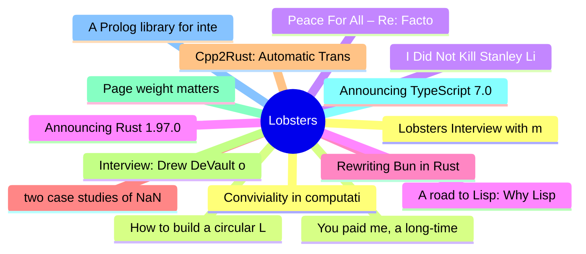

# Lobsters Top 15 (2026-07-10)

## 思维导图

## 列表（15 条）

### 1. Lobsters Interview with mitchellh
- **链接**: [https://alexalejandre.com/programming/interview-with-mitchell-hashimoto/](https://alexalejandre.com/programming/interview-with-mitchell-hashimoto/)
- **作者**:  | **评论**: 0
- **摘要**: 
<a href="https://lobste.rs/~mitchellh" rel="ugc">@mitchellh</a> (<a href="https://mitchellh.com/" rel="ugc">blog</a>) was behind <a href="https://vagrantup.com" rel="ugc">Vagrant</a>, <a href="http

### 2. You paid me, a long-time Linux user, to use Windows 11 exclusively for a month: here’s how it went
- **链接**: [https://www.osnews.com/story/145459/you-paid-me-a-long-time-linux-user-to-use-windows-11-exclusively-for-a-month-heres-how-it-went/](https://www.osnews.com/story/145459/you-paid-me-a-long-time-linux-user-to-use-windows-11-exclusively-for-a-month-heres-how-it-went/)
- **作者**:  | **评论**: 0
- **摘要**: 
<a href="https://lobste.rs/s/tedi5h/you_paid_me_long_time_linux_user_use">Comments</a>

### 3. I Did Not Kill Stanley Lieber: How to draw (with 9front)
- **链接**: [https://triapul.cz/automa/i_did_not_kill_stanley_lieber](https://triapul.cz/automa/i_did_not_kill_stanley_lieber)
- **作者**:  | **评论**: 0
- **摘要**: 
<a href="https://lobste.rs/s/3eo2nv/i_did_not_kill_stanley_lieber_how_draw_with">Comments</a>

### 4. Announcing Rust 1.97.0
- **链接**: [https://blog.rust-lang.org/2026/07/09/Rust-1.97.0/](https://blog.rust-lang.org/2026/07/09/Rust-1.97.0/)
- **作者**:  | **评论**: 0
- **摘要**: 
<a href="https://lobste.rs/s/o9edbl/announcing_rust_1_97_0">Comments</a>

### 5. Rewriting Bun in Rust
- **链接**: [https://bun.com/blog/bun-in-rust](https://bun.com/blog/bun-in-rust)
- **作者**:  | **评论**: 0
- **摘要**: 
<a href="https://lobste.rs/s/6rkdik/rewriting_bun_rust">Comments</a>

### 6. two case studies of NaN
- **链接**: [https://sebsite.pw/w/20260709-nan.html](https://sebsite.pw/w/20260709-nan.html)
- **作者**:  | **评论**: 0
- **摘要**: 
<a href="https://lobste.rs/s/v5hkjy/two_case_studies_nan">Comments</a>

### 7. Cpp2Rust: Automatic Translation of C++ to Safe Rust
- **链接**: [https://github.com/Cpp2Rust/cpp2rust](https://github.com/Cpp2Rust/cpp2rust)
- **作者**:  | **评论**: 0
- **摘要**: 
<a href="https://lobste.rs/s/xyotoa/cpp2rust_automatic_translation_c_safe">Comments</a>

### 8. Interview: Drew DeVault on an AI-free version of Vim
- **链接**: [https://jasonpolak.substack.com/p/interview-drew-devault-on-an-ai-free](https://jasonpolak.substack.com/p/interview-drew-devault-on-an-ai-free)
- **作者**:  | **评论**: 0
- **摘要**: 
<a href="https://lobste.rs/s/dbakbg/interview_drew_devault_on_ai_free_version">Comments</a>

### 9. Page weight matters
- **链接**: [https://nh3.dev/blog/05-bloat](https://nh3.dev/blog/05-bloat)
- **作者**:  | **评论**: 0
- **摘要**: 
<a href="https://lobste.rs/s/eehcpl/page_weight_matters">Comments</a>

### 10. Announcing TypeScript 7.0
- **链接**: [https://devblogs.microsoft.com/typescript/announcing-typescript-7-0/](https://devblogs.microsoft.com/typescript/announcing-typescript-7-0/)
- **作者**:  | **评论**: 0
- **摘要**: 
<a href="https://lobste.rs/s/txmyod/announcing_typescript_7_0">Comments</a>

### 11. A Prolog library for interfacing with LLMs
- **链接**: [https://github.com/vagos/llmpl](https://github.com/vagos/llmpl)
- **作者**:  | **评论**: 0
- **摘要**: 
<a href="https://lobste.rs/s/ad7cm6/prolog_library_for_interfacing_with_llms">Comments</a>

### 12. Conviviality in computational science
- **链接**: [https://blog.khinsen.net/posts/2026/07/06/conviviality.html](https://blog.khinsen.net/posts/2026/07/06/conviviality.html)
- **作者**:  | **评论**: 0
- **摘要**: 
<a href="https://lobste.rs/s/pg7hce/conviviality_computational_science">Comments</a>

### 13. How to build a circular LCD clock
- **链接**: [https://blinry.org/lcd-clock/](https://blinry.org/lcd-clock/)
- **作者**:  | **评论**: 0
- **摘要**: 
<a href="https://lobste.rs/s/lep7wh/how_build_circular_lcd_clock">Comments</a>

### 14. Peace For All – Re: Factor
- **链接**: [https://re.factorcode.org/2026/07/peace-for-all.html](https://re.factorcode.org/2026/07/peace-for-all.html)
- **作者**:  | **评论**: 0
- **摘要**: 
<a href="https://lobste.rs/s/sy980q/peace_for_all_re_factor">Comments</a>

### 15. A road to Lisp: Why Lisp
- **链接**: [https://scotto.me/blog/2026-07-09-why-lisp/](https://scotto.me/blog/2026-07-09-why-lisp/)
- **作者**:  | **评论**: 0
- **摘要**: 
<a href="https://lobste.rs/s/e85zgh/road_lisp_why_lisp">Comments</a>

