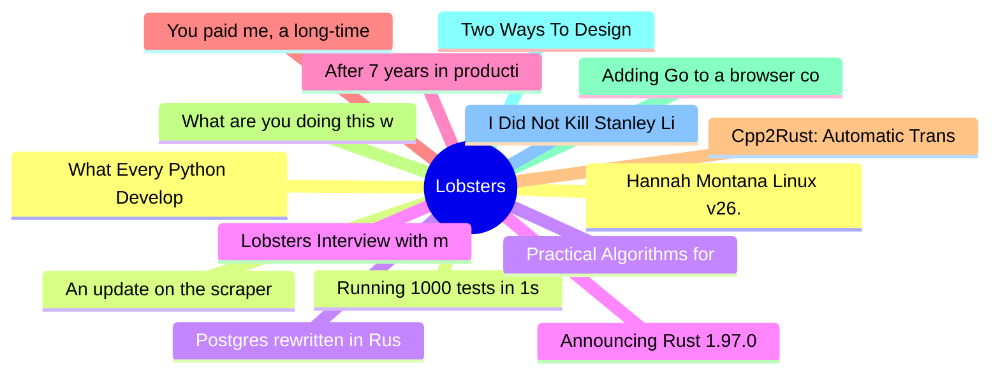

# Lobsters Top 15 (2026-07-11)

## 思维导图

## 列表（15 条）

### 1. Hannah Montana Linux v26.0
- **链接**: [https://gitlab.com/DecaCagle/hannahmontanalinux26](https://gitlab.com/DecaCagle/hannahmontanalinux26)
- **作者**:  | **评论**: 0
- **摘要**: 
<a href="https://lobste.rs/s/w8svjr/hannah_montana_linux_v26_0">Comments</a>

### 2. An update on the scraper situation
- **链接**: [https://lwn.net/SubscriberLink/1080822/990a8a5e2d379085/](https://lwn.net/SubscriberLink/1080822/990a8a5e2d379085/)
- **作者**:  | **评论**: 0
- **摘要**: 
<a href="https://lobste.rs/s/kpaxih/update_on_scraper_situation">Comments</a>

### 3. Postgres rewritten in Rust, now passing 100% of the Postgres regression tests
- **链接**: [https://github.com/malisper/pgrust](https://github.com/malisper/pgrust)
- **作者**:  | **评论**: 0
- **摘要**: 
<a href="https://lobste.rs/s/le3iri/postgres_rewritten_rust_now_passing_100">Comments</a>

### 4. Lobsters Interview with mitchellh
- **链接**: [https://alexalejandre.com/programming/interview-with-mitchell-hashimoto/](https://alexalejandre.com/programming/interview-with-mitchell-hashimoto/)
- **作者**:  | **评论**: 0
- **摘要**: 
<a href="https://lobste.rs/~mitchellh" rel="ugc">@mitchellh</a> (<a href="https://mitchellh.com/" rel="ugc">blog</a>) was behind <a href="https://vagrantup.com" rel="ugc">Vagrant</a>, <a href="http

### 5. After 7 years in production, Scarf has reluctantly moved away from Haskell
- **链接**: [https://avi.press/posts/2026-07-10-after-7-years-in-production-scarf-has-reluctantly-moved-away-from-haskell.html](https://avi.press/posts/2026-07-10-after-7-years-in-production-scarf-has-reluctantly-moved-away-from-haskell.html)
- **作者**:  | **评论**: 0
- **摘要**: 
<a href="https://lobste.rs/s/t4f6jt/after_7_years_production_scarf_has">Comments</a>

### 6. You paid me, a long-time Linux user, to use Windows 11 exclusively for a month: here’s how it went
- **链接**: [https://www.osnews.com/story/145459/you-paid-me-a-long-time-linux-user-to-use-windows-11-exclusively-for-a-month-heres-how-it-went/](https://www.osnews.com/story/145459/you-paid-me-a-long-time-linux-user-to-use-windows-11-exclusively-for-a-month-heres-how-it-went/)
- **作者**:  | **评论**: 0
- **摘要**: 
<a href="https://lobste.rs/s/tedi5h/you_paid_me_long_time_linux_user_use">Comments</a>

### 7. Cpp2Rust: Automatic Translation of C++ to Safe Rust
- **链接**: [https://github.com/Cpp2Rust/cpp2rust](https://github.com/Cpp2Rust/cpp2rust)
- **作者**:  | **评论**: 0
- **摘要**: 
<a href="https://lobste.rs/s/xyotoa/cpp2rust_automatic_translation_c_safe">Comments</a>

### 8. What are you doing this weekend?
- **链接**: [https://lobste.rs/s/u9yf5l/what_are_you_doing_this_weekend](https://lobste.rs/s/u9yf5l/what_are_you_doing_this_weekend)
- **作者**:  | **评论**: 0
- **摘要**: 
Feel free to tell what you plan on doing this weekend and even ask for help or feedback.

Please keep in mind it’s more than OK to do nothing at all too!

### 9. Adding Go to a browser code runner
- **链接**: [https://blog.lvmbdv.dev/posts/adding-go-to-a-browser-code-runner/](https://blog.lvmbdv.dev/posts/adding-go-to-a-browser-code-runner/)
- **作者**:  | **评论**: 0
- **摘要**: 
<a href="https://lobste.rs/s/qtui32/adding_go_browser_code_runner">Comments</a>

### 10. Two Ways To Design
- **链接**: [https://wiki.c2.com/?TwoWaysToDesign](https://wiki.c2.com/?TwoWaysToDesign)
- **作者**:  | **评论**: 0
- **摘要**: 
<a href="https://lobste.rs/s/ey7far/two_ways_design">Comments</a>

### 11. I Did Not Kill Stanley Lieber: How to draw (with 9front)
- **链接**: [https://triapul.cz/automa/i_did_not_kill_stanley_lieber](https://triapul.cz/automa/i_did_not_kill_stanley_lieber)
- **作者**:  | **评论**: 0
- **摘要**: 
<a href="https://lobste.rs/s/3eo2nv/i_did_not_kill_stanley_lieber_how_draw_with">Comments</a>

### 12. What Every Python Developer Should Know About the CPython ABI
- **链接**: [https://labs.quansight.org/blog/python-abi-abi3t](https://labs.quansight.org/blog/python-abi-abi3t)
- **作者**:  | **评论**: 0
- **摘要**: 
<a href="https://lobste.rs/s/fxuz6h/what_every_python_developer_should_know">Comments</a>

### 13. Running 1000 tests in 1s (2022)
- **链接**: [https://marvinh.dev/blog/running-1000-test-in-1s/](https://marvinh.dev/blog/running-1000-test-in-1s/)
- **作者**:  | **评论**: 0
- **摘要**: 
<a href="https://lobste.rs/s/mcrqed/running_1000_tests_1s_2022">Comments</a>

### 14. Practical Algorithms for Incremental Software Development Environments
- **链接**: [https://www2.eecs.berkeley.edu/Pubs/TechRpts/1997/Archive/CSD-97-946.pdf](https://www2.eecs.berkeley.edu/Pubs/TechRpts/1997/Archive/CSD-97-946.pdf)
- **作者**:  | **评论**: 0
- **摘要**: 
<a href="https://lobste.rs/s/cq3mft/practical_algorithms_for_incremental">Comments</a>

### 15. Announcing Rust 1.97.0
- **链接**: [https://blog.rust-lang.org/2026/07/09/Rust-1.97.0/](https://blog.rust-lang.org/2026/07/09/Rust-1.97.0/)
- **作者**:  | **评论**: 0
- **摘要**: 
<a href="https://lobste.rs/s/o9edbl/announcing_rust_1_97_0">Comments</a>

