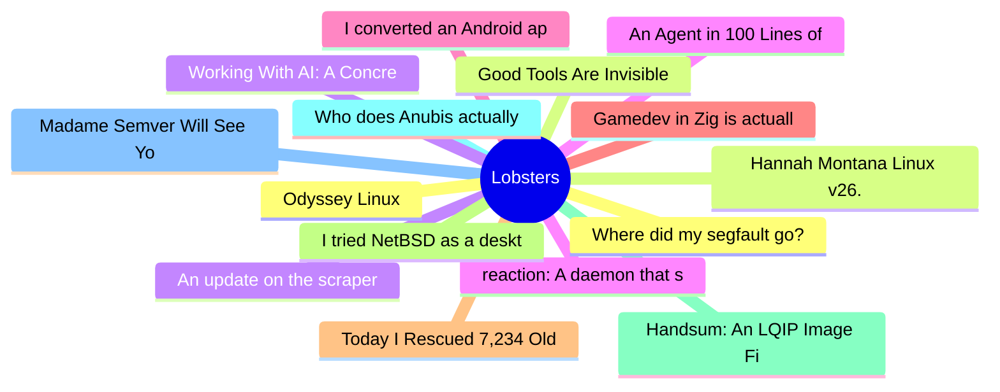

# Lobsters Top 15 (2026-07-12)

## 思维导图

## 列表（15 条）

### 1. Where did my segfault go?
- **链接**: [https://rmpr.xyz/Where-did-my-segfault-go/](https://rmpr.xyz/Where-did-my-segfault-go/)
- **作者**:  | **评论**: 0
- **摘要**: 
<a href="https://lobste.rs/s/tedtzz/where_did_my_segfault_go">Comments</a>

### 2. Good Tools Are Invisible
- **链接**: [https://www.gingerbill.org/article/2026/07/10/good-tools-are-invisible/](https://www.gingerbill.org/article/2026/07/10/good-tools-are-invisible/)
- **作者**:  | **评论**: 0
- **摘要**: 
<a href="https://lobste.rs/s/ydjxee/good_tools_are_invisible">Comments</a>

### 3. An update on the scraper situation
- **链接**: [https://lwn.net/SubscriberLink/1080822/990a8a5e2d379085/](https://lwn.net/SubscriberLink/1080822/990a8a5e2d379085/)
- **作者**:  | **评论**: 0
- **摘要**: 
<a href="https://lobste.rs/s/kpaxih/update_on_scraper_situation">Comments</a>

### 4. reaction: A daemon that scans program outputs for repeated patterns, and takes action
- **链接**: [https://framagit.org/ppom/reaction](https://framagit.org/ppom/reaction)
- **作者**:  | **评论**: 0
- **摘要**: 
<a href="https://lobste.rs/s/zzdc8x/reaction_daemon_scans_program_outputs">Comments</a>

### 5. I converted an Android app to a webpage
- **链接**: [https://danq.me/2026/07/09/your-app-could-have-been-a-webpage/](https://danq.me/2026/07/09/your-app-could-have-been-a-webpage/)
- **作者**:  | **评论**: 0
- **摘要**: 
<a href="https://lobste.rs/s/vhbvwc/i_converted_android_app_webpage">Comments</a>

### 6. Gamedev in Zig is actually pretty good (2025)
- **链接**: [https://www.youtube.com/watch?v=-xIFpg7sBVs](https://www.youtube.com/watch?v=-xIFpg7sBVs)
- **作者**:  | **评论**: 0
- **摘要**: 
<a href="https://lobste.rs/s/y23kkm/gamedev_zig_is_actually_pretty_good_2025">Comments</a>

### 7. Today I Rescued 7,234 Old GIFs
- **链接**: [https://danq.me/2026/07/10/rescuing-7234-gifs/](https://danq.me/2026/07/10/rescuing-7234-gifs/)
- **作者**:  | **评论**: 0
- **摘要**: 
<a href="https://lobste.rs/s/pdbktp/today_i_rescued_7_234_old_gifs">Comments</a>

### 8. I tried NetBSD as a desktop, and it felt like stepping into the '90s in a good way
- **链接**: [https://www.howtogeek.com/i-tried-netbsd-as-a-desktop-and-it-felt-like-stepping-into-the-90s-in-a-good-way/](https://www.howtogeek.com/i-tried-netbsd-as-a-desktop-and-it-felt-like-stepping-into-the-90s-in-a-good-way/)
- **作者**:  | **评论**: 0
- **摘要**: 
<a href="https://lobste.rs/s/ovbeds/i_tried_netbsd_as_desktop_it_felt_like">Comments</a>

### 9. Handsum: An LQIP Image File Format
- **链接**: [https://nigeltao.github.io/blog/2026/handsum.html](https://nigeltao.github.io/blog/2026/handsum.html)
- **作者**:  | **评论**: 0
- **摘要**: 
<a href="https://lobste.rs/s/gmzzeb/handsum_lqip_image_file_format">Comments</a>

### 10. Who does Anubis actually stop?
- **链接**: [https://fzakaria.com/2026/07/09/who-does-anubis-actually-stop](https://fzakaria.com/2026/07/09/who-does-anubis-actually-stop)
- **作者**:  | **评论**: 0
- **摘要**: 
<a href="https://lobste.rs/s/ktew3s/who_does_anubis_actually_stop">Comments</a>

### 11. Madame Semver Will See You Now
- **链接**: [https://nesbitt.io/2026/05/10/madame-semver-will-see-you-now.html](https://nesbitt.io/2026/05/10/madame-semver-will-see-you-now.html)
- **作者**:  | **评论**: 0
- **摘要**: 
<a href="https://lobste.rs/s/wjr8hw/madame_semver_will_see_you_now">Comments</a>

### 12. Odyssey Linux
- **链接**: [https://odysseylinux.org/](https://odysseylinux.org/)
- **作者**:  | **评论**: 0
- **摘要**: 
<a href="https://lobste.rs/s/q4fx6x/odyssey_linux">Comments</a>

### 13. Hannah Montana Linux v26.0
- **链接**: [https://gitlab.com/DecaCagle/hannahmontanalinux26](https://gitlab.com/DecaCagle/hannahmontanalinux26)
- **作者**:  | **评论**: 0
- **摘要**: 
<a href="https://lobste.rs/s/w8svjr/hannah_montana_linux_v26_0">Comments</a>

### 14. Working With AI: A Concrete Example
- **链接**: [https://htmx.org/essays/working-with-ai/](https://htmx.org/essays/working-with-ai/)
- **作者**:  | **评论**: 0
- **摘要**: 
<a href="https://lobste.rs/s/my94an/working_with_ai_concrete_example">Comments</a>

### 15. An Agent in 100 Lines of Lisp
- **链接**: [https://thebeach.dev/posts/lisp-agent/](https://thebeach.dev/posts/lisp-agent/)
- **作者**:  | **评论**: 0
- **摘要**: 
<a href="https://lobste.rs/s/wsw7tq/agent_100_lines_lisp">Comments</a>

