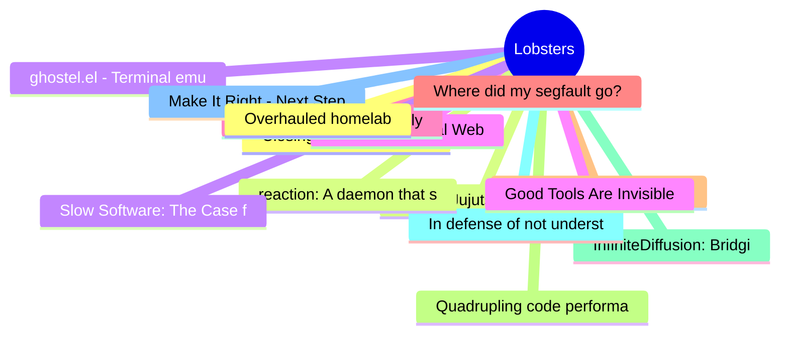

# Lobsters Top 15 (2026-07-13)

## 思维导图

## 列表（15 条）

### 1. Closing a three-year-old issue using Rust arenas
- **链接**: [https://giacomocavalieri.me/writing/gleam-rust-arenas](https://giacomocavalieri.me/writing/gleam-rust-arenas)
- **作者**:  | **评论**: 0
- **摘要**: 
<a href="https://lobste.rs/s/7840ca/closing_three_year_old_issue_using_rust">Comments</a>

### 2. Evan's Jujutsu Tutorial
- **链接**: [https://evmar.github.io/jjtut/](https://evmar.github.io/jjtut/)
- **作者**:  | **评论**: 0
- **摘要**: 
<a href="https://lobste.rs/s/beqyuc/evan_s_jujutsu_tutorial">Comments</a>

### 3. ghostel.el - Terminal emulator powered by libghostty
- **链接**: [https://dakra.github.io/ghostel/](https://dakra.github.io/ghostel/)
- **作者**:  | **评论**: 0
- **摘要**: 
<a href="https://lobste.rs/s/xgdsao/ghostel_el_terminal_emulator_powered_by">Comments</a>

### 4. The Proportional Web
- **链接**: [https://owickstrom.github.io/the-proportional-web/](https://owickstrom.github.io/the-proportional-web/)
- **作者**:  | **评论**: 0
- **摘要**: 
<a href="https://lobste.rs/s/2vsvdm/proportional_web">Comments</a>

### 5. Who does Anubis actually stop?
- **链接**: [https://fzakaria.com/2026/07/09/who-does-anubis-actually-stop](https://fzakaria.com/2026/07/09/who-does-anubis-actually-stop)
- **作者**:  | **评论**: 0
- **摘要**: 
<a href="https://lobste.rs/s/ktew3s/who_does_anubis_actually_stop">Comments</a>

### 6. Where did my segfault go?
- **链接**: [https://rmpr.xyz/Where-did-my-segfault-go/](https://rmpr.xyz/Where-did-my-segfault-go/)
- **作者**:  | **评论**: 0
- **摘要**: 
<a href="https://lobste.rs/s/tedtzz/where_did_my_segfault_go">Comments</a>

### 7. Know thine enemy: A critical engagement with AI-assisted software development
- **链接**: [https://medium.com/bits-and-behavior/know-thine-enemy-a-critical-engagement-with-ai-assisted-software-development-e41d9b058ab1](https://medium.com/bits-and-behavior/know-thine-enemy-a-critical-engagement-with-ai-assisted-software-development-e41d9b058ab1)
- **作者**:  | **评论**: 0
- **摘要**: 
<a href="https://lobste.rs/s/7ke9cs/know_thine_enemy_critical_engagement">Comments</a>

### 8. Quadrupling code performance with a "useless" if
- **链接**: [https://purplesyringa.moe/blog/quadrupling-code-performance-with-a-useless-if/](https://purplesyringa.moe/blog/quadrupling-code-performance-with-a-useless-if/)
- **作者**:  | **评论**: 0
- **摘要**: 
<a href="https://lobste.rs/s/1an425/quadrupling_code_performance_with">Comments</a>

### 9. InfiniteDiffusion: Bridging Learned Fidelity and Procedural Utility for Open-World Terrain Generation
- **链接**: [https://xandergos.github.io/terrain-diffusion/](https://xandergos.github.io/terrain-diffusion/)
- **作者**:  | **评论**: 0
- **摘要**: 
<a href="https://lobste.rs/s/ncsslp/infinitediffusion_bridging_learned">Comments</a>

### 10. In defense of not understanding your codebase
- **链接**: [https://www.seangoedecke.com/in-defense-of-not-understanding-your-codebase/](https://www.seangoedecke.com/in-defense-of-not-understanding-your-codebase/)
- **作者**:  | **评论**: 0
- **摘要**: 
<a href="https://lobste.rs/s/elhi7o/defense_not_understanding_your_codebase">Comments</a>

### 11. Make It Right - Next Steps With CTRAN
- **链接**: [https://thelastpsion.com/posts/make-it-right-next-steps-with-ctran/](https://thelastpsion.com/posts/make-it-right-next-steps-with-ctran/)
- **作者**:  | **评论**: 0
- **摘要**: 
<a href="https://lobste.rs/s/x1a86b/make_it_right_next_steps_with_ctran">Comments</a>

### 12. Overhauled homelab
- **链接**: [https://timharek.no/blog/kaizen-4/](https://timharek.no/blog/kaizen-4/)
- **作者**:  | **评论**: 0
- **摘要**: 
<a href="https://lobste.rs/s/feikm9/overhauled_homelab">Comments</a>

### 13. reaction: A daemon that scans program outputs for repeated patterns, and takes action
- **链接**: [https://framagit.org/ppom/reaction](https://framagit.org/ppom/reaction)
- **作者**:  | **评论**: 0
- **摘要**: 
<a href="https://lobste.rs/s/zzdc8x/reaction_daemon_scans_program_outputs">Comments</a>

### 14. Slow Software: The Case for High-latency Systems Development
- **链接**: [https://www.sigops.org/2026/slow-software-the-case-for-high-latency-systems-development/](https://www.sigops.org/2026/slow-software-the-case-for-high-latency-systems-development/)
- **作者**:  | **评论**: 0
- **摘要**: 
<a href="https://lobste.rs/s/3v4hbc/slow_software_case_for_high_latency">Comments</a>

### 15. Good Tools Are Invisible
- **链接**: [https://www.gingerbill.org/article/2026/07/10/good-tools-are-invisible/](https://www.gingerbill.org/article/2026/07/10/good-tools-are-invisible/)
- **作者**:  | **评论**: 0
- **摘要**: 
<a href="https://lobste.rs/s/ydjxee/good_tools_are_invisible">Comments</a>

