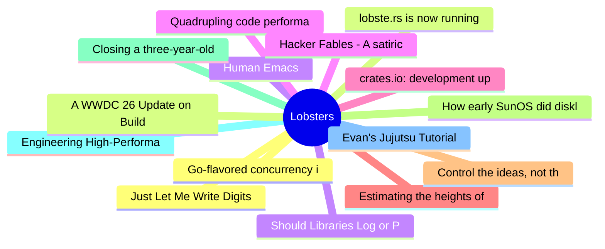

# Lobsters Top 15 (2026-07-14)

## 思维导图

## 列表（15 条）

### 1. Just Let Me Write Digits
- **链接**: [https://gendignoux.com/blog/2026/07/13/input-digits.html](https://gendignoux.com/blog/2026/07/13/input-digits.html)
- **作者**:  | **评论**: 0
- **摘要**: 
<a href="https://lobste.rs/s/yf6vbc/just_let_me_write_digits">Comments</a>

### 2. lobste.rs is now running on SQLite
- **链接**: [https://lobste.rs/s/ko1ji1/lobste_rs_is_now_running_on_sqlite](https://lobste.rs/s/ko1ji1/lobste_rs_is_now_running_on_sqlite)
- **作者**:  | **评论**: 0
- **摘要**: 
This past Saturday, <a href="https://lobste.rs/~pushcx" rel="ugc">@pushcx</a> and I deployed the <a href="https://github.com/lobsters/lobsters/pull/1927" rel="ugc">SQLite pull request</a> to produc

### 3. Human Emacs
- **链接**: [https://human-emacs.org/](https://human-emacs.org/)
- **作者**:  | **评论**: 0
- **摘要**: 
LLM-generated contributions free (possible) fork of GNU Emacs.

<a href="https://lobste.rs/s/t0aqzy/human_emacs">Comments</a>

### 4. Quadrupling code performance with a "useless" if
- **链接**: [https://purplesyringa.moe/blog/quadrupling-code-performance-with-a-useless-if/](https://purplesyringa.moe/blog/quadrupling-code-performance-with-a-useless-if/)
- **作者**:  | **评论**: 0
- **摘要**: 
<a href="https://lobste.rs/s/1an425/quadrupling_code_performance_with">Comments</a>

### 5. crates.io: development update
- **链接**: [https://blog.rust-lang.org/2026/07/13/crates-io-development-update/](https://blog.rust-lang.org/2026/07/13/crates-io-development-update/)
- **作者**:  | **评论**: 0
- **摘要**: 
<a href="https://lobste.rs/s/posxmd/crates_io_development_update">Comments</a>

### 6. Estimating the heights of New Yorkers from their scuff marks
- **链接**: [https://blog.jse.li/posts/smith9street/](https://blog.jse.li/posts/smith9street/)
- **作者**:  | **评论**: 0
- **摘要**: 
<a href="https://lobste.rs/s/rtegvw/estimating_heights_new_yorkers_from">Comments</a>

### 7. Control the ideas, not the code
- **链接**: [https://antirez.com/news/169](https://antirez.com/news/169)
- **作者**:  | **评论**: 0
- **摘要**: 
<a href="https://lobste.rs/s/5t3wzn/control_ideas_not_code">Comments</a>

### 8. How early SunOS did diskless workstations before NFS
- **链接**: [https://utcc.utoronto.ca/~cks/space/blog/solaris/SunOSDisklessWithoutNFS](https://utcc.utoronto.ca/~cks/space/blog/solaris/SunOSDisklessWithoutNFS)
- **作者**:  | **评论**: 0
- **摘要**: 
<a href="https://lobste.rs/s/abza3v/how_early_sunos_did_diskless">Comments</a>

### 9. Closing a three-year-old issue using Rust arenas
- **链接**: [https://giacomocavalieri.me/writing/gleam-rust-arenas](https://giacomocavalieri.me/writing/gleam-rust-arenas)
- **作者**:  | **评论**: 0
- **摘要**: 
<a href="https://lobste.rs/s/7840ca/closing_three_year_old_issue_using_rust">Comments</a>

### 10. Engineering High-Performance Parsers with Data-Oriented Design
- **链接**: [https://arshad.fyi/writings/engineering-high-performance-parsers](https://arshad.fyi/writings/engineering-high-performance-parsers)
- **作者**:  | **评论**: 0
- **摘要**: 
<a href="https://lobste.rs/s/4smkjv/engineering_high_performance_parsers">Comments</a>

### 11. Evan's Jujutsu Tutorial
- **链接**: [https://evmar.github.io/jjtut/](https://evmar.github.io/jjtut/)
- **作者**:  | **评论**: 0
- **摘要**: 
<a href="https://lobste.rs/s/beqyuc/evan_s_jujutsu_tutorial">Comments</a>

### 12. Go-flavored concurrency in C
- **链接**: [https://antonz.org/concurrency-in-c/](https://antonz.org/concurrency-in-c/)
- **作者**:  | **评论**: 0
- **摘要**: 
<a href="https://lobste.rs/s/lzls6z/go_flavored_concurrency_c">Comments</a>

### 13. A WWDC 26 Update on Building a Mac-assed App with SwiftUI
- **链接**: [https://pfandrade.me/blog/swiftui-mac-assed-wwdc27-update/](https://pfandrade.me/blog/swiftui-mac-assed-wwdc27-update/)
- **作者**:  | **评论**: 0
- **摘要**: 
<a href="https://lobste.rs/s/temfk6/wwdc_26_update_on_building_mac_assed_app">Comments</a>

### 14. Should Libraries Log or Propagate Errors?
- **链接**: [https://lobste.rs/s/v3avrp/should_libraries_log_propagate_errors](https://lobste.rs/s/v3avrp/should_libraries_log_propagate_errors)
- **作者**:  | **评论**: 0
- **摘要**: 
My assumption was always: Applications log (and err), libraries err.

Today, I was <em>shocked</em> to learn that various ecosystems love logging things in libraries (such that silencing thos

### 15. Hacker Fables - A satirical cyberpunk novella you can read as a man page
- **链接**: [https://hacker-fables.onrender.com](https://hacker-fables.onrender.com)
- **作者**:  | **评论**: 0
- **摘要**: 
And with "GNU Info" too

<a href="https://lobste.rs/s/sca1qx/hacker_fables_satirical_cyberpunk">Comments</a>

