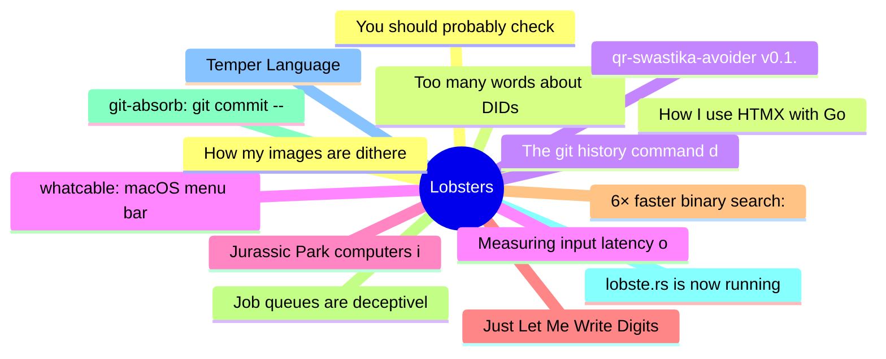

# Lobsters Top 15 (2026-07-15)

## 思维导图

## 列表（15 条）

### 1. You should probably check on your smart appliances
- **链接**: [https://xeiaso.net/notes/2026/check-your-smart-tv/](https://xeiaso.net/notes/2026/check-your-smart-tv/)
- **作者**:  | **评论**: 0
- **摘要**: 
<a href="https://lobste.rs/s/slrak5/you_should_probably_check_on_your_smart">Comments</a>

### 2. Too many words about DIDs
- **链接**: [https://steveklabnik.com/writing/too-many-words-about-dids/](https://steveklabnik.com/writing/too-many-words-about-dids/)
- **作者**:  | **评论**: 0
- **摘要**: 
<a href="https://lobste.rs/s/86lwsv/too_many_words_about_dids">Comments</a>

### 3. qr-swastika-avoider v0.1.0
- **链接**: [https://crates.io/crates/qr-swastika-avoider](https://crates.io/crates/qr-swastika-avoider)
- **作者**:  | **评论**: 0
- **摘要**: 
<a href="https://lobste.rs/s/h7pett/qr_swastika_avoider_v0_1_0">Comments</a>

### 4. whatcable: macOS menu bar app that tells you, in plain English, what each USB-C cable plugged into your Mac can actually do
- **链接**: [https://github.com/darrylmorley/whatcable](https://github.com/darrylmorley/whatcable)
- **作者**:  | **评论**: 0
- **摘要**: 
<a href="https://lobste.rs/s/tzzarv/whatcable_macos_menu_bar_app_tells_you">Comments</a>

### 5. Jurassic Park computers in excruciating detail
- **链接**: [https://fabiensanglard.net/jurrasic_park_computers/index.html](https://fabiensanglard.net/jurrasic_park_computers/index.html)
- **作者**:  | **评论**: 0
- **摘要**: 
<a href="https://lobste.rs/s/xv8dix/jurassic_park_computers_excruciating">Comments</a>

### 6. Just Let Me Write Digits
- **链接**: [https://gendignoux.com/blog/2026/07/13/input-digits.html](https://gendignoux.com/blog/2026/07/13/input-digits.html)
- **作者**:  | **评论**: 0
- **摘要**: 
<a href="https://lobste.rs/s/yf6vbc/just_let_me_write_digits">Comments</a>

### 7. 6× faster binary search: from compiled code to mechanical sympathy
- **链接**: [https://pythonspeed.com/articles/branchless-binary-search/](https://pythonspeed.com/articles/branchless-binary-search/)
- **作者**:  | **评论**: 0
- **摘要**: 
<a href="https://lobste.rs/s/czbhmr/6x_faster_binary_search_from_compiled">Comments</a>

### 8. Job queues are deceptively tricky
- **链接**: [https://typesanitizer.com/blog/job-queues.html](https://typesanitizer.com/blog/job-queues.html)
- **作者**:  | **评论**: 0
- **摘要**: 
<a href="https://lobste.rs/s/k3frwc/job_queues_are_deceptively_tricky">Comments</a>

### 9. git-absorb: git commit --fixup, but automatic
- **链接**: [https://github.com/tummychow/git-absorb](https://github.com/tummychow/git-absorb)
- **作者**:  | **评论**: 0
- **摘要**: 
<a href="https://lobste.rs/s/nprldj/git_absorb_git_commit_fixup_automatic">Comments</a>

### 10. lobste.rs is now running on SQLite
- **链接**: [https://lobste.rs/s/ko1ji1/lobste_rs_is_now_running_on_sqlite](https://lobste.rs/s/ko1ji1/lobste_rs_is_now_running_on_sqlite)
- **作者**:  | **评论**: 0
- **摘要**: 
This past Saturday, <a href="https://lobste.rs/~pushcx" rel="ugc">@pushcx</a> and I deployed the <a href="https://github.com/lobsters/lobsters/pull/1927" rel="ugc">SQLite pull request</a> to produc

### 11. Temper Language
- **链接**: [https://temperlang.dev/](https://temperlang.dev/)
- **作者**:  | **评论**: 0
- **摘要**: 
<a href="https://lobste.rs/s/in1oer/temper_language">Comments</a>

### 12. How my images are dithered
- **链接**: [https://dead.garden/blog/how-my-images-are-dithered.html](https://dead.garden/blog/how-my-images-are-dithered.html)
- **作者**:  | **评论**: 0
- **摘要**: 
<a href="https://lobste.rs/s/2gbb6l/how_my_images_are_dithered">Comments</a>

### 13. How I use HTMX with Go
- **链接**: [https://www.alexedwards.net/blog/how-i-use-htmx-with-go](https://www.alexedwards.net/blog/how-i-use-htmx-with-go)
- **作者**:  | **评论**: 0
- **摘要**: 
<a href="https://lobste.rs/s/rg1wee/how_i_use_htmx_with_go">Comments</a>

### 14. The git history command deserves more attention
- **链接**: [https://lalitm.com/post/git-history/](https://lalitm.com/post/git-history/)
- **作者**:  | **评论**: 0
- **摘要**: 
<a href="https://lobste.rs/s/tb3el5/git_history_command_deserves_more">Comments</a>

### 15. Measuring input latency on Linux: X11 vs Wayland, VRR, and DXVK
- **链接**: [https://marco-nett.de/blog/measuring-input-latency-on-linux-x11-vs-wayland-vrr-dxvk/](https://marco-nett.de/blog/measuring-input-latency-on-linux-x11-vs-wayland-vrr-dxvk/)
- **作者**:  | **评论**: 0
- **摘要**: 
<a href="https://lobste.rs/s/pw5yuk/measuring_input_latency_on_linux_x11_vs">Comments</a>

