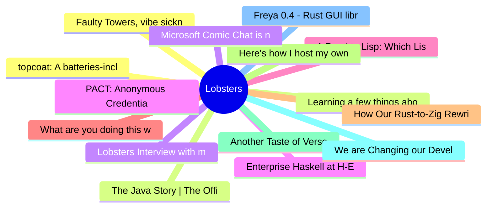

# Lobsters Top 15 (2026-07-18)

## 思维导图

## 列表（15 条）

### 1. Faulty Towers, vibe sickness, and the vibe bobsled
- **链接**: [https://dustycloud.org/blog/faulty-towers-vibe-sickness-and-the-vibe-bobsled/](https://dustycloud.org/blog/faulty-towers-vibe-sickness-and-the-vibe-bobsled/)
- **作者**:  | **评论**: 0
- **摘要**: 
<a href="https://lobste.rs/s/nwp3sm/faulty_towers_vibe_sickness_vibe_bobsled">Comments</a>

### 2. Learning a few things about running SQLite
- **链接**: [https://jvns.ca/blog/2026/07/17/learning-about-running-sqlite/](https://jvns.ca/blog/2026/07/17/learning-about-running-sqlite/)
- **作者**:  | **评论**: 0
- **摘要**: 
<a href="https://lobste.rs/s/ryksor/learning_few_things_about_running_sqlite">Comments</a>

### 3. Lobsters Interview with matheusmoreira about Lone Lisp
- **链接**: [https://alexalejandre.com/interviews/interview-with-matheus-moreira/](https://alexalejandre.com/interviews/interview-with-matheus-moreira/)
- **作者**:  | **评论**: 0
- **摘要**: 
<a href="https://lobste.rs/~matheusmoreira" rel="ugc">@matheusmoreira</a>  (<a href="https://www.matheusmoreira.com/" rel="ugc">blog</a>) built <a href="https://github.com/lone-lang/lone" rel="ugc"

### 4. Enterprise Haskell at H-E-B
- **链接**: [https://blog.haskell.org/enterprise-haskell-at-h-e-b/](https://blog.haskell.org/enterprise-haskell-at-h-e-b/)
- **作者**:  | **评论**: 0
- **摘要**: 
<a href="https://lobste.rs/s/zar7fc/enterprise_haskell_at_h_e_b">Comments</a>

### 5. A Road to Lisp: Which Lisp
- **链接**: [https://scotto.me/blog/2026-07-17-which-lisp/](https://scotto.me/blog/2026-07-17-which-lisp/)
- **作者**:  | **评论**: 0
- **摘要**: 
<a href="https://lobste.rs/s/ycqq4r/road_lisp_which_lisp">Comments</a>

### 6. What are you doing this weekend?
- **链接**: [https://lobste.rs/s/1vplvg/what_are_you_doing_this_weekend](https://lobste.rs/s/1vplvg/what_are_you_doing_this_weekend)
- **作者**:  | **评论**: 0
- **摘要**: 
Feel free to tell what you plan on doing this weekend and even ask for help or feedback.

Please keep in mind it’s more than OK to do nothing at all too!

### 7. How Our Rust-to-Zig Rewrite is Going
- **链接**: [https://rtfeldman.com/rust-to-zig](https://rtfeldman.com/rust-to-zig)
- **作者**:  | **评论**: 0
- **摘要**: 
<a href="https://lobste.rs/s/axdfjx/how_our_rust_zig_rewrite_is_going">Comments</a>

### 8. Here's how I host my own AIM server
- **链接**: [https://veronicaexplains.net/open-oscar-server/](https://veronicaexplains.net/open-oscar-server/)
- **作者**:  | **评论**: 0
- **摘要**: 
<a href="https://lobste.rs/s/4dcp6w/here_s_how_i_host_my_own_aim_server">Comments</a>

### 9. Another Taste of Verse
- **链接**: [https://www.youtube.com/watch?v=QIiU-QGzcqc&list=PLQtDWkrawhsE&index=2](https://www.youtube.com/watch?v=QIiU-QGzcqc&list=PLQtDWkrawhsE&index=2)
- **作者**:  | **评论**: 0
- **摘要**: 
<a href="https://lobste.rs/s/jvg8cy/another_taste_verse">Comments</a>

### 10. We are Changing our Developer Productivity Experiment Design
- **链接**: [https://metr.org/blog/2026-02-24-uplift-update/](https://metr.org/blog/2026-02-24-uplift-update/)
- **作者**:  | **评论**: 0
- **摘要**: 
Followup to <a href="https://lobste.rs/s/1batvy" rel="ugc">their 2025 study that showed a 19% decrease in productivity</a>.

<a href="https://github.com/METR/Measuring-Late-2025-AI-on-OSS-Dev

### 11. Freya 0.4 - Rust GUI library
- **链接**: [https://freyaui.dev/posts/0.4](https://freyaui.dev/posts/0.4)
- **作者**:  | **评论**: 0
- **摘要**: 
<a href="https://lobste.rs/s/x3xvou/freya_0_4_rust_gui_library">Comments</a>

### 12. topcoat: A batteries-included framework for building web apps
- **链接**: [https://github.com/tokio-rs/topcoat](https://github.com/tokio-rs/topcoat)
- **作者**:  | **评论**: 0
- **摘要**: 
<a href="https://lobste.rs/s/zmg7ot/topcoat_batteries_included_framework">Comments</a>

### 13. The Java Story | The Official Documentary
- **链接**: [https://www.youtube.com/watch?v=ZqGSg4b_cZA](https://www.youtube.com/watch?v=ZqGSg4b_cZA)
- **作者**:  | **评论**: 0
- **摘要**: 
<a href="https://lobste.rs/s/31bikj/java_story_official_documentary">Comments</a>

### 14. Microsoft Comic Chat is now open source
- **链接**: [https://opensource.microsoft.com/blog/2026/07/16/microsoft-comic-chat-is-now-open-source/](https://opensource.microsoft.com/blog/2026/07/16/microsoft-comic-chat-is-now-open-source/)
- **作者**:  | **评论**: 0
- **摘要**: 
<a href="https://lobste.rs/s/qbvfll/microsoft_comic_chat_is_now_open_source">Comments</a>

### 15. PACT: Anonymous Credentials for the Web – Mozilla Hacks
- **链接**: [https://hacks.mozilla.org/2026/06/pact-anonymous-credentials-for-the-web/](https://hacks.mozilla.org/2026/06/pact-anonymous-credentials-for-the-web/)
- **作者**:  | **评论**: 0
- **摘要**: 
<a href="https://lobste.rs/s/6pdyiy/pact_anonymous_credentials_for_web">Comments</a>

