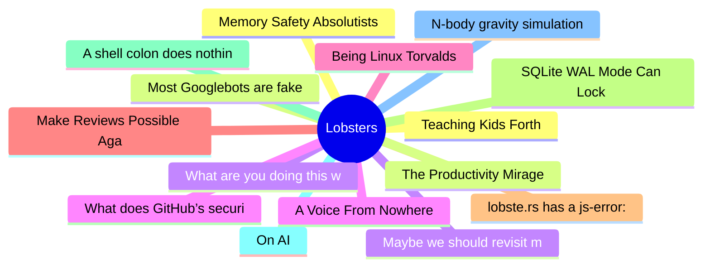

# Lobsters Top 15 (2026-07-27)

## 思维导图

## 列表（15 条）

### 1. Teaching Kids Forth
- **链接**: [https://gracefulliberty.com/articles/teaching-kids-forth/](https://gracefulliberty.com/articles/teaching-kids-forth/)
- **作者**:  | **评论**: 0
- **摘要**: 
<a href="https://lobste.rs/s/n3dz7x/teaching_kids_forth">Comments</a>

### 2. Most Googlebots are fake
- **链接**: [https://digitalseams.com/blog/most-googlebots-are-fake](https://digitalseams.com/blog/most-googlebots-are-fake)
- **作者**:  | **评论**: 0
- **摘要**: 
<a href="https://lobste.rs/s/h9hdzg/most_googlebots_are_fake">Comments</a>

### 3. Maybe we should revisit microkernels
- **链接**: [https://notes.hella.cheap/maybe-we-should-revisit-microkernels.html](https://notes.hella.cheap/maybe-we-should-revisit-microkernels.html)
- **作者**:  | **评论**: 0
- **摘要**: 
<a href="https://lobste.rs/s/krsvrp/maybe_we_should_revisit_microkernels">Comments</a>

### 4. A Voice From Nowhere
- **链接**: [https://zanlib.dev/blog/a-voice-from-nowhere/](https://zanlib.dev/blog/a-voice-from-nowhere/)
- **作者**:  | **评论**: 0
- **摘要**: 
<a href="https://lobste.rs/s/jz5sd1/voice_from_nowhere">Comments</a>

### 5. Being Linux Torvalds
- **链接**: [https://antirez.com/news/171](https://antirez.com/news/171)
- **作者**:  | **评论**: 0
- **摘要**: 
<a href="https://lobste.rs/s/uwhqhi/being_linux_torvalds">Comments</a>

### 6. Make Reviews Possible Again With This One Simple Trick
- **链接**: [https://silky.github.io/posts/reviews-one-simple-trick.html](https://silky.github.io/posts/reviews-one-simple-trick.html)
- **作者**:  | **评论**: 0
- **摘要**: 
<a href="https://lobste.rs/s/2shapa/make_reviews_possible_again_with_this_one">Comments</a>

### 7. lobste.rs has a js-error: here is a mitigation
- **链接**: [https://lobste.rs/s/llf3mg/lobste_rs_has_js_error_here_is_mitigation](https://lobste.rs/s/llf3mg/lobste_rs_has_js_error_here_is_mitigation)
- **作者**:  | **评论**: 0
- **摘要**: <strong>Introduction</strong>

<a href="https://lobste.rs" rel="ugc">https://lobste.rs</a> – at the time of writing – has a javascript error on load for logged in users:

<pre><code>Uncaught Refe

### 8. SQLite WAL Mode Can Lock Short-Lived Readers
- **链接**: [https://hynek.me/til/sqlite-read-only-wal-locked/](https://hynek.me/til/sqlite-read-only-wal-locked/)
- **作者**:  | **评论**: 0
- **摘要**: 
<a href="https://lobste.rs/s/uusfyj/sqlite_wal_mode_can_lock_short_lived">Comments</a>

### 9. A shell colon does nothing. Use it anyway
- **链接**: [https://refp.se/articles/your-shell-and-the-magic-colon](https://refp.se/articles/your-shell-and-the-magic-colon)
- **作者**:  | **评论**: 0
- **摘要**: 
<a href="https://lobste.rs/s/eidh3u/shell_colon_does_nothing_use_it_anyway">Comments</a>

### 10. On AI
- **链接**: [https://jcs.org/2026/07/23/ai](https://jcs.org/2026/07/23/ai)
- **作者**:  | **评论**: 0
- **摘要**: 
<a href="https://lobste.rs/s/zljfgp/on_ai">Comments</a>

### 11. N-body gravity simulation in O(N)
- **链接**: [https://www.youtube.com/watch?v=FhMftauQZqU](https://www.youtube.com/watch?v=FhMftauQZqU)
- **作者**:  | **评论**: 0
- **摘要**: 
<a href="https://lobste.rs/s/v1ejq9/n_body_gravity_simulation_o_n">Comments</a>

### 12. Memory Safety Absolutists
- **链接**: [https://itsallaboutthebit.com/memory-safety-absolutists/](https://itsallaboutthebit.com/memory-safety-absolutists/)
- **作者**:  | **评论**: 0
- **摘要**: 
<a href="https://lobste.rs/s/x7jtkt/memory_safety_absolutists">Comments</a>

### 13. The Productivity Mirage
- **链接**: [https://frantic.im/mirage](https://frantic.im/mirage)
- **作者**:  | **评论**: 0
- **摘要**: 
<a href="https://lobste.rs/s/gicomw/productivity_mirage">Comments</a>

### 14. What are you doing this week?
- **链接**: [https://lobste.rs/s/r7zjlm/what_are_you_doing_this_week](https://lobste.rs/s/r7zjlm/what_are_you_doing_this_week)
- **作者**:  | **评论**: 0
- **摘要**: 
What are you doing this week? Feel free to share!

Keep in mind it’s OK to do nothing at all, too.

### 15. What does GitHub’s security team even do?
- **链接**: [https://orchidfiles.com/github-security-team/](https://orchidfiles.com/github-security-team/)
- **作者**:  | **评论**: 0
- **摘要**: 
<a href="https://lobste.rs/s/jnhyrh/what_does_github_s_security_team_even_do">Comments</a>

