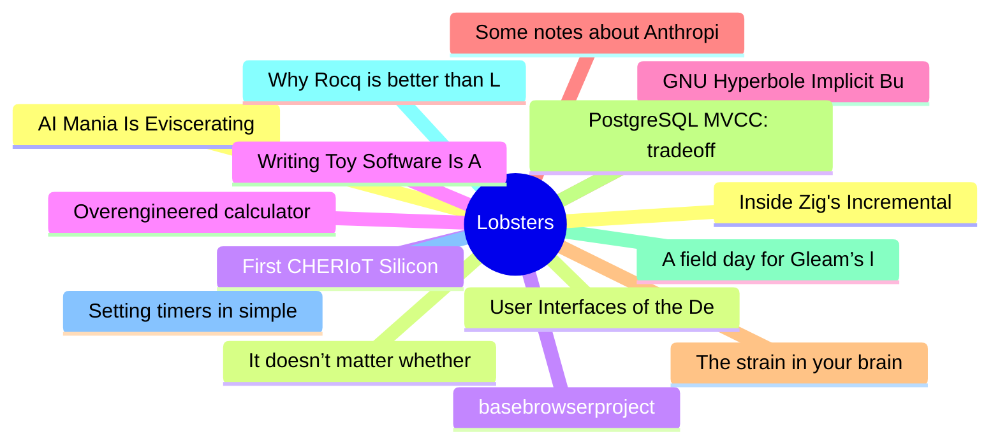

# Lobsters Top 15 (2026-07-30)

## 思维导图

## 列表（15 条）

### 1. AI Mania Is Eviscerating Global Decision-Making
- **链接**: [https://hermit-tech.com/blog/ai-mania-is-eviscerating-global-decisionmaking](https://hermit-tech.com/blog/ai-mania-is-eviscerating-global-decisionmaking)
- **作者**:  | **评论**: 0
- **摘要**: 
<a href="https://lobste.rs/s/xi6azw/ai_mania_is_eviscerating_global_decision">Comments</a>

### 2. It doesn’t matter whether “Matz is nice”
- **链接**: [https://po-ru.com/2026/07/29/it-doesnt-matter-whether-matz-is-nice](https://po-ru.com/2026/07/29/it-doesnt-matter-whether-matz-is-nice)
- **作者**:  | **评论**: 0
- **摘要**: 
<a href="https://lobste.rs/s/w1va9j/it_doesn_t_matter_whether_matz_is_nice">Comments</a>

### 3. First CHERIoT Silicon
- **链接**: [https://cheriot.org/silicon/2026/03/04/cheriot-first-silicon.html](https://cheriot.org/silicon/2026/03/04/cheriot-first-silicon.html)
- **作者**:  | **评论**: 0
- **摘要**: 
<a href="https://lobste.rs/s/l3sj7g/first_cheriot_silicon">Comments</a>

### 4. Overengineered calculator: Zig + QBE
- **链接**: [https://tomekw.com/overengineered-calculator-zig-qbe/](https://tomekw.com/overengineered-calculator-zig-qbe/)
- **作者**:  | **评论**: 0
- **摘要**: 
<a href="https://lobste.rs/s/ozules/overengineered_calculator_zig_qbe">Comments</a>

### 5. GNU Hyperbole Implicit Buttons: Build your Hyperverse
- **链接**: [https://www.chiply.dev/post-hyperbole-implicit-buttons](https://www.chiply.dev/post-hyperbole-implicit-buttons)
- **作者**:  | **评论**: 0
- **摘要**: 
<a href="https://lobste.rs/s/5z7akz/gnu_hyperbole_implicit_buttons_build">Comments</a>

### 6. Some notes about Anthropic’s new results
- **链接**: [https://blog.cryptographyengineering.com/2026/07/29/some-notes-about-anthropics-new-results/](https://blog.cryptographyengineering.com/2026/07/29/some-notes-about-anthropics-new-results/)
- **作者**:  | **评论**: 0
- **摘要**: 
<a href="https://lobste.rs/s/g9bkak/some_notes_about_anthropic_s_new_results">Comments</a>

### 7. The strain in your brain
- **链接**: [https://anirudh.fi/strain](https://anirudh.fi/strain)
- **作者**:  | **评论**: 0
- **摘要**: 
<a href="https://lobste.rs/s/rulynz/strain_your_brain">Comments</a>

### 8. PostgreSQL MVCC: tradeoffs compared to other engines
- **链接**: [https://boringsql.com/posts/mvcc-bad-bad/](https://boringsql.com/posts/mvcc-bad-bad/)
- **作者**:  | **评论**: 0
- **摘要**: 
<a href="https://lobste.rs/s/vjelns/postgresql_mvcc_tradeoffs_compared">Comments</a>

### 9. A field day for Gleam’s language server | Gleam v.1.18.0 release
- **链接**: [https://gleam.run/news/a-field-day-for-gleams-language-server/](https://gleam.run/news/a-field-day-for-gleams-language-server/)
- **作者**:  | **评论**: 0
- **摘要**: 
<a href="https://lobste.rs/s/r9zgni/field_day_for_gleam_s_language_server">Comments</a>

### 10. Why Rocq is better than Lean for program verification
- **链接**: [https://joomy.korkutblech.com/posts/2026-07-28-why-rocq-is-better.html](https://joomy.korkutblech.com/posts/2026-07-28-why-rocq-is-better.html)
- **作者**:  | **评论**: 0
- **摘要**: 
A write-up on why I don't give in to the hype and switch to Lean for formal verification of programs.

<a href="https://lobste.rs/s/vnh6b2/why_rocq_is_better_than_lean_for_program">Comments</

### 11. Setting timers in simple games (feat. the frame rule)
- **链接**: [https://lynn.github.io/blog/pico-timers/](https://lynn.github.io/blog/pico-timers/)
- **作者**:  | **评论**: 0
- **摘要**: 
<a href="https://lobste.rs/s/1efcss/setting_timers_simple_games_feat_frame">Comments</a>

### 12. Inside Zig's Incremental Compilation
- **链接**: [https://mlugg.co.uk/posts/incremental-compilation-internals/](https://mlugg.co.uk/posts/incremental-compilation-internals/)
- **作者**:  | **评论**: 0
- **摘要**: 
<a href="https://lobste.rs/s/rmzzdb/inside_zig_s_incremental_compilation">Comments</a>

### 13. User Interfaces of the Demo Scene
- **链接**: [https://datagubbe.se/scenegui/](https://datagubbe.se/scenegui/)
- **作者**:  | **评论**: 0
- **摘要**: 
<a href="https://lobste.rs/s/csff09/user_interfaces_demo_scene">Comments</a>

### 14. basebrowserproject
- **链接**: [https://mastodon.social/@sarahjamielewis/116965925134524215](https://mastodon.social/@sarahjamielewis/116965925134524215)
- **作者**:  | **评论**: 0
- **摘要**: 
A Firefox hard-fork, stripped of people-hostile "features", developed and maintained by humans.

<a href="https://lobste.rs/s/s78pit/basebrowserproject">Comments</a>

### 15. Writing Toy Software Is A Joy (2025)
- **链接**: [https://blog.jsbarretto.com/post/software-is-joy](https://blog.jsbarretto.com/post/software-is-joy)
- **作者**:  | **评论**: 0
- **摘要**: 
<a href="https://lobste.rs/s/ax6col/writing_toy_software_is_joy_2025">Comments</a>

