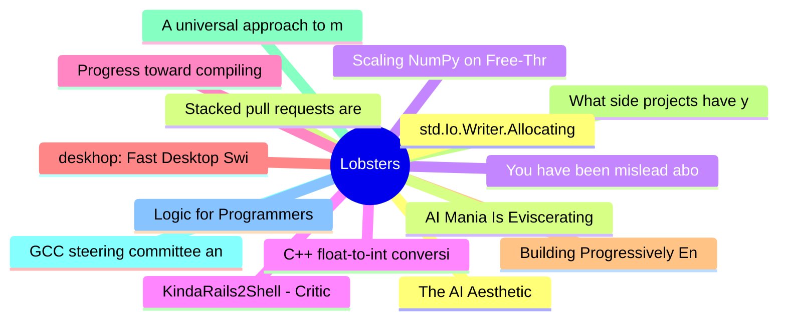

# Lobsters Top 15 (2026-07-31)

## 思维导图

## 列表（15 条）

### 1. The AI Aesthetic
- **链接**: [https://blog.jim-nielsen.com/2026/ai-aesthetic/](https://blog.jim-nielsen.com/2026/ai-aesthetic/)
- **作者**:  | **评论**: 0
- **摘要**: 
<a href="https://lobste.rs/s/wxmi0v/ai_aesthetic">Comments</a>

### 2. Stacked pull requests are now in public preview
- **链接**: [https://github.blog/changelog/2026-07-30-stacked-pull-requests-are-now-in-public-preview/](https://github.blog/changelog/2026-07-30-stacked-pull-requests-are-now-in-public-preview/)
- **作者**:  | **评论**: 0
- **摘要**: 
<a href="https://lobste.rs/s/pzl6f0/stacked_pull_requests_are_now_public">Comments</a>

### 3. You have been mislead about lightbulbs
- **链接**: [https://maurycyz.com/misc/tungsten/](https://maurycyz.com/misc/tungsten/)
- **作者**:  | **评论**: 0
- **摘要**: 
<a href="https://lobste.rs/s/uzcxat/you_have_been_mislead_about_lightbulbs">Comments</a>

### 4. C++ float-to-int conversion can be undefined behavior
- **链接**: [https://kttnr.net/blog/cpp-float-to-int-conversion-undefined-behavior/](https://kttnr.net/blog/cpp-float-to-int-conversion-undefined-behavior/)
- **作者**:  | **评论**: 0
- **摘要**: 
<a href="https://lobste.rs/s/ba2yfy/c_float_int_conversion_can_be_undefined">Comments</a>

### 5. Progress toward compiling Linux with gccrs
- **链接**: [https://lwn.net/SubscriberLink/1083202/f1ba926cd57ac5c5/](https://lwn.net/SubscriberLink/1083202/f1ba926cd57ac5c5/)
- **作者**:  | **评论**: 0
- **摘要**: 
<a href="https://lobste.rs/s/cpyuub/progress_toward_compiling_linux_with">Comments</a>

### 6. deskhop: Fast Desktop Switching Device
- **链接**: [https://github.com/hrvach/deskhop](https://github.com/hrvach/deskhop)
- **作者**:  | **评论**: 0
- **摘要**: 
<a href="https://lobste.rs/s/zk0qqe/deskhop_fast_desktop_switching_device">Comments</a>

### 7. Building Progressively Enhanced Forms Using htmx
- **链接**: [https://www.rafa.ee/articles/progressive-enhanced-forms-htmx/](https://www.rafa.ee/articles/progressive-enhanced-forms-htmx/)
- **作者**:  | **评论**: 0
- **摘要**: 
<a href="https://lobste.rs/s/4bvpqh/building_progressively_enhanced_forms">Comments</a>

### 8. What side projects have you enjoyed the most?
- **链接**: [https://lobste.rs/s/mbk56v/what_side_projects_have_you_enjoyed_most](https://lobste.rs/s/mbk56v/what_side_projects_have_you_enjoyed_most)
- **作者**:  | **评论**: 0
- **摘要**: 
In the spirit of <a href="https://blog.jsbarretto.com/post/software-is-joy" rel="ugc">https://blog.jsbarretto.com/post/software-is-joy</a>, what side projects have you enjoyed working on the most?<

### 9. A universal approach to mocking with continuations
- **链接**: [https://crowdhailer.me/2026-07-30/a-universal-approach-to-mocking/](https://crowdhailer.me/2026-07-30/a-universal-approach-to-mocking/)
- **作者**:  | **评论**: 0
- **摘要**: 
<a href="https://lobste.rs/s/01n0ss/universal_approach_mocking_with">Comments</a>

### 10. GCC steering committee announces AI policy
- **链接**: [https://lwn.net/Articles/1086041/](https://lwn.net/Articles/1086041/)
- **作者**:  | **评论**: 0
- **摘要**: 
<a href="https://lobste.rs/s/fbqlpy/gcc_steering_committee_announces_ai">Comments</a>

### 11. Logic for Programmers
- **链接**: [https://logicforprogrammers.com/](https://logicforprogrammers.com/)
- **作者**:  | **评论**: 0
- **摘要**: 
<a href="https://lobste.rs/s/l03yv1/logic_for_programmers">Comments</a>

### 12. std.Io.Writer.Allocating ate all my memory
- **链接**: [https://www.openmymind.net/std-io-writer-allocating-ate-my-memory/](https://www.openmymind.net/std-io-writer-allocating-ate-my-memory/)
- **作者**:  | **评论**: 0
- **摘要**: 
<a href="https://lobste.rs/s/eelfmn/std_io_writer_allocating_ate_all_my_memory">Comments</a>

### 13. AI Mania Is Eviscerating Global Decision-Making
- **链接**: [https://hermit-tech.com/blog/ai-mania-is-eviscerating-global-decisionmaking](https://hermit-tech.com/blog/ai-mania-is-eviscerating-global-decisionmaking)
- **作者**:  | **评论**: 0
- **摘要**: 
<a href="https://lobste.rs/s/xi6azw/ai_mania_is_eviscerating_global_decision">Comments</a>

### 14. Scaling NumPy on Free-Threaded Python
- **链接**: [https://labs.quansight.org/blog/scaling-numpy-on-free-threaded-python](https://labs.quansight.org/blog/scaling-numpy-on-free-threaded-python)
- **作者**:  | **评论**: 0
- **摘要**: 
<a href="https://lobste.rs/s/3s9cva/scaling_numpy_on_free_threaded_python">Comments</a>

### 15. KindaRails2Shell - Critical RCE in Rails via Active Storage (CVE-2026-66066)
- **链接**: [https://ethiack.com/info-hub/research/kindarails2shell-rails-rce-cve-2026-66066](https://ethiack.com/info-hub/research/kindarails2shell-rails-rce-cve-2026-66066)
- **作者**:  | **评论**: 0
- **摘要**: 
<a href="https://lobste.rs/s/kkobew/kindarails2shell_critical_rce_rails_via">Comments</a>

