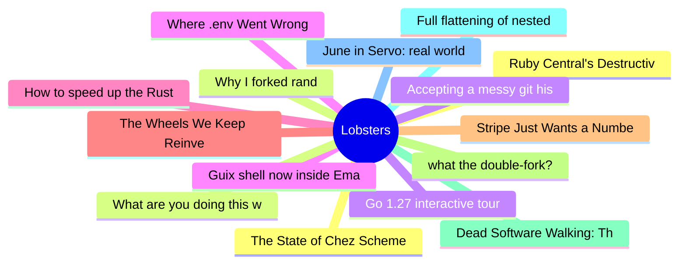

# Lobsters Top 15 (2026-08-01)

## 思维导图

## 列表（15 条）

### 1. Ruby Central's Destructive Legacy
- **链接**: [https://andre.arko.net/2026/07/30/ruby-centrals-destructive-legacy/](https://andre.arko.net/2026/07/30/ruby-centrals-destructive-legacy/)
- **作者**:  | **评论**: 0
- **摘要**: 
<a href="https://lobste.rs/s/qvbkpa/ruby_central_s_destructive_legacy">Comments</a>

### 2. Why I forked rand
- **链接**: [https://casualhacks.net/blog/2026-07-27-why-i-forked-rand.html](https://casualhacks.net/blog/2026-07-27-why-i-forked-rand.html)
- **作者**:  | **评论**: 0
- **摘要**: 
<a href="https://lobste.rs/s/kvxee3/why_i_forked_rand">Comments</a>

### 3. Go 1.27 interactive tour
- **链接**: [https://victoriametrics.com/blog/go-1-27/](https://victoriametrics.com/blog/go-1-27/)
- **作者**:  | **评论**: 0
- **摘要**: 
<a href="https://lobste.rs/s/7ibjyl/go_1_27_interactive_tour">Comments</a>

### 4. Guix shell now inside Emacs
- **链接**: [https://tusharhero.codeberg.page/guix-shell-in-emacs.html](https://tusharhero.codeberg.page/guix-shell-in-emacs.html)
- **作者**:  | **评论**: 0
- **摘要**: 
<a href="https://lobste.rs/s/uxsmk6/guix_shell_now_inside_emacs">Comments</a>

### 5. How to speed up the Rust compiler in July 2026
- **链接**: [https://nnethercote.github.io/2026/07/31/how-to-speed-up-the-rust-compiler-in-july-2026.html](https://nnethercote.github.io/2026/07/31/how-to-speed-up-the-rust-compiler-in-july-2026.html)
- **作者**:  | **评论**: 0
- **摘要**: 
<a href="https://lobste.rs/s/ycsivx/how_speed_up_rust_compiler_july_2026">Comments</a>

### 6. The Wheels We Keep Reinventing
- **链接**: [https://blainsmith.com/articles/reinventing-the-wheel/](https://blainsmith.com/articles/reinventing-the-wheel/)
- **作者**:  | **评论**: 0
- **摘要**: 
<a href="https://lobste.rs/s/nw7rzu/wheels_we_keep_reinventing">Comments</a>

### 7. Stripe Just Wants a Number
- **链接**: [https://blog.exe.dev/billable-facts](https://blog.exe.dev/billable-facts)
- **作者**:  | **评论**: 0
- **摘要**: 
<a href="https://lobste.rs/s/ri8bav/stripe_just_wants_number">Comments</a>

### 8. what the double-fork?
- **链接**: [https://bower.sh/what-the-double-fork](https://bower.sh/what-the-double-fork)
- **作者**:  | **评论**: 0
- **摘要**: 
<a href="https://lobste.rs/s/qwytlf/what_double_fork">Comments</a>

### 9. Dead Software Walking: The ongoing evolution of relayd(8) and httpd(8)
- **链接**: [https://rsadowski.de/posts/2026/dead-software-walking-relayd-and-httpd/](https://rsadowski.de/posts/2026/dead-software-walking-relayd-and-httpd/)
- **作者**:  | **评论**: 0
- **摘要**: 
<a href="https://lobste.rs/s/i6e5wp/dead_software_walking_ongoing_evolution">Comments</a>

### 10. Full flattening of nested data parallelism
- **链接**: [https://futhark-lang.org/blog/2026-07-31-full-flattening.html](https://futhark-lang.org/blog/2026-07-31-full-flattening.html)
- **作者**:  | **评论**: 0
- **摘要**: 
<a href="https://lobste.rs/s/91tzqg/full_flattening_nested_data_parallelism">Comments</a>

### 11. June in Servo: real world compat, media queries, SharedWorker, and more
- **链接**: [https://servo.org/blog/2026/07/31/june-in-servo/](https://servo.org/blog/2026/07/31/june-in-servo/)
- **作者**:  | **评论**: 0
- **摘要**: 
<a href="https://lobste.rs/s/7tggvc/june_servo_real_world_compat_media">Comments</a>

### 12. The State of Chez Scheme in Debian
- **链接**: [https://weinholt.se/articles/state-of-chezscheme-in-debian/](https://weinholt.se/articles/state-of-chezscheme-in-debian/)
- **作者**:  | **评论**: 0
- **摘要**: 
<a href="https://lobste.rs/s/ecd44o/state_chez_scheme_debian">Comments</a>

### 13. What are you doing this weekend?
- **链接**: [https://lobste.rs/s/won0b2/what_are_you_doing_this_weekend](https://lobste.rs/s/won0b2/what_are_you_doing_this_weekend)
- **作者**:  | **评论**: 0
- **摘要**: 
Feel free to tell what you plan on doing this weekend and even ask for help or feedback.

Please keep in mind it’s more than OK to do nothing at all too!

(Seems this is the first time

### 14. Accepting a messy git history
- **链接**: [https://beza1e1.tuxen.de/git_two_users.html](https://beza1e1.tuxen.de/git_two_users.html)
- **作者**:  | **评论**: 0
- **摘要**: 
<a href="https://lobste.rs/s/aj7msu/accepting_messy_git_history">Comments</a>

### 15. Where .env Went Wrong
- **链接**: [https://secretspec.dev/blog/where-env-went-wrong/](https://secretspec.dev/blog/where-env-went-wrong/)
- **作者**:  | **评论**: 0
- **摘要**: 
<a href="https://lobste.rs/s/xieltq/where_env_went_wrong">Comments</a>

