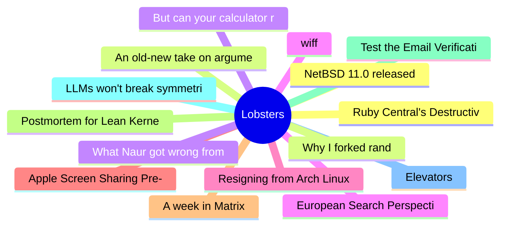

# Lobsters Top 15 (2026-08-02)

## 思维导图

## 列表（15 条）

### 1. NetBSD 11.0 released
- **链接**: [https://blog.netbsd.org/tnf/entry/netbsd_11_0_released](https://blog.netbsd.org/tnf/entry/netbsd_11_0_released)
- **作者**:  | **评论**: 0
- **摘要**: 
<a href="https://lobste.rs/s/pvrnor/netbsd_11_0_released">Comments</a>

### 2. An old-new take on argument parsing in Rust
- **链接**: [https://jmmv.dev/2026/07/hello-getoptsargs.html](https://jmmv.dev/2026/07/hello-getoptsargs.html)
- **作者**:  | **评论**: 0
- **摘要**: 
<a href="https://lobste.rs/s/vrd28h/old_new_take_on_argument_parsing_rust">Comments</a>

### 3. But can your calculator run Linux?
- **链接**: [https://raymii.org/s/articles/But_can_your_calculator_run_Linux.html](https://raymii.org/s/articles/But_can_your_calculator_run_Linux.html)
- **作者**:  | **评论**: 0
- **摘要**: 
<a href="https://lobste.rs/s/voozor/can_your_calculator_run_linux">Comments</a>

### 4. wiff
- **链接**: [https://wezfurlong.org/wiff/](https://wezfurlong.org/wiff/)
- **作者**:  | **评论**: 0
- **摘要**: 
<a href="https://lobste.rs/s/tc82u0/wiff">Comments</a>

### 5. Resigning from Arch Linux
- **链接**: [https://linderud.dev/blog/resigning-from-arch-linux/](https://linderud.dev/blog/resigning-from-arch-linux/)
- **作者**:  | **评论**: 0
- **摘要**: 
<a href="https://lobste.rs/s/ectcmr/resigning_from_arch_linux">Comments</a>

### 6. Apple Screen Sharing Pre-Auth RCE
- **链接**: [https://warez.sl0p.foo/apple-screensharing-rce/](https://warez.sl0p.foo/apple-screensharing-rce/)
- **作者**:  | **评论**: 0
- **摘要**: 
<a href="https://lobste.rs/s/t1wy9l/apple_screen_sharing_pre_auth_rce">Comments</a>

### 7. A week in Matrix
- **链接**: [https://piegames.de/dumps/a-week-in-matrix/](https://piegames.de/dumps/a-week-in-matrix/)
- **作者**:  | **评论**: 0
- **摘要**: 
<a href="https://lobste.rs/s/obipgm/week_matrix">Comments</a>

### 8. Postmortem for Lean Kernel Soundness Bug #14576
- **链接**: [https://leodemoura.github.io/blog/2026-8-1-postmortem-for-kernel-soundness-bug-14576/](https://leodemoura.github.io/blog/2026-8-1-postmortem-for-kernel-soundness-bug-14576/)
- **作者**:  | **评论**: 0
- **摘要**: 
<a href="https://lobste.rs/s/ojcl8j/postmortem_for_lean_kernel_soundness_bug">Comments</a>

### 9. Test the Email Verification Protocol with an origin trial
- **链接**: [https://developer.chrome.com/blog/email-verification-protocol-origin-trial](https://developer.chrome.com/blog/email-verification-protocol-origin-trial)
- **作者**:  | **评论**: 0
- **摘要**: 
<a href="https://lobste.rs/s/72ni5s/test_email_verification_protocol_with">Comments</a>

### 10. LLMs won't break symmetric crypto
- **链接**: [https://www.bfswa.blog/p/llms-wont-break-symmetric-crypto](https://www.bfswa.blog/p/llms-wont-break-symmetric-crypto)
- **作者**:  | **评论**: 0
- **摘要**: 
<a href="https://lobste.rs/s/tstkqk/llms_won_t_break_symmetric_crypto">Comments</a>

### 11. Elevators
- **链接**: [https://john.fun/elevators](https://john.fun/elevators)
- **作者**:  | **评论**: 0
- **摘要**: 
<a href="https://lobste.rs/s/jxqf1w/elevators">Comments</a>

### 12. Ruby Central's Destructive Legacy
- **链接**: [https://andre.arko.net/2026/07/30/ruby-centrals-destructive-legacy/](https://andre.arko.net/2026/07/30/ruby-centrals-destructive-legacy/)
- **作者**:  | **评论**: 0
- **摘要**: 
<a href="https://lobste.rs/s/qvbkpa/ruby_central_s_destructive_legacy">Comments</a>

### 13. Why I forked rand
- **链接**: [https://casualhacks.net/blog/2026-07-27-why-i-forked-rand.html](https://casualhacks.net/blog/2026-07-27-why-i-forked-rand.html)
- **作者**:  | **评论**: 0
- **摘要**: 
<a href="https://lobste.rs/s/kvxee3/why_i_forked_rand">Comments</a>

### 14. What Naur got wrong from The concept of mind
- **链接**: [https://tssm.neocities.org/what-naur-got-wrong-from-the-concept-of-mind](https://tssm.neocities.org/what-naur-got-wrong-from-the-concept-of-mind)
- **作者**:  | **评论**: 0
- **摘要**: 
<a href="https://lobste.rs/s/6yrhha/what_naur_got_wrong_from_concept_mind">Comments</a>

### 15. European Search Perspective
- **链接**: [https://www.eu-searchperspective.com/](https://www.eu-searchperspective.com/)
- **作者**:  | **评论**: 0
- **摘要**: 
<a href="https://lobste.rs/s/2xyz5h/european_search_perspective">Comments</a>

