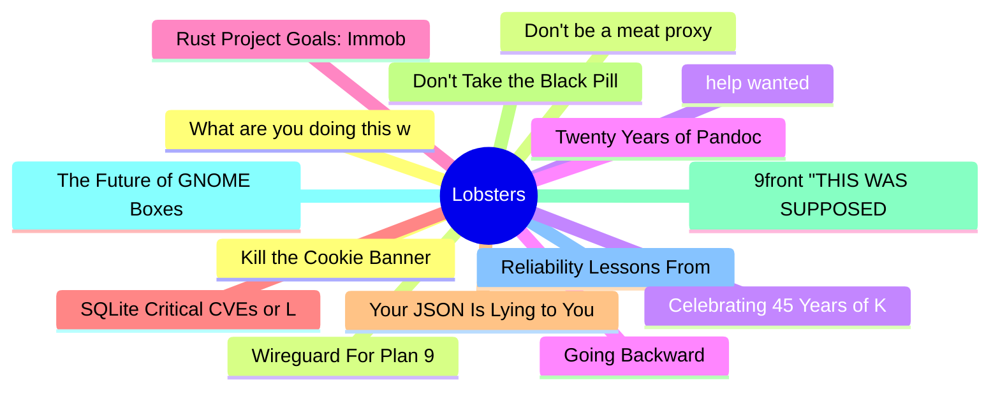

# Lobsters Top 15 (2026-08-04)

## 思维导图

## 列表（15 条）

### 1. Kill the Cookie Banner
- **链接**: [https://killthecookiebanner.eu/](https://killthecookiebanner.eu/)
- **作者**:  | **评论**: 0
- **摘要**: 
<a href="https://lobste.rs/s/aftrcr/kill_cookie_banner">Comments</a>

### 2. Don't be a meat proxy
- **链接**: [https://gruhn.me/blog/2026-08-03/](https://gruhn.me/blog/2026-08-03/)
- **作者**:  | **评论**: 0
- **摘要**: 
<a href="https://lobste.rs/s/hfbqr3/don_t_be_meat_proxy">Comments</a>

### 3. help wanted
- **链接**: [https://lake.computer/blog/help-wanted/](https://lake.computer/blog/help-wanted/)
- **作者**:  | **评论**: 0
- **摘要**: 
<a href="https://lobste.rs/s/a355zh/help_wanted">Comments</a>

### 4. Twenty Years of Pandoc
- **链接**: [https://pandoc.org/twenty-years-of-pandoc.html](https://pandoc.org/twenty-years-of-pandoc.html)
- **作者**:  | **评论**: 0
- **摘要**: 
<a href="https://lobste.rs/s/blflqs/twenty_years_pandoc">Comments</a>

### 5. Rust Project Goals: Immobile types and guaranteed destructors
- **链接**: [https://github.com/rust-lang/rust-project-goals/blob/main/src/2026/move-trait.md](https://github.com/rust-lang/rust-project-goals/blob/main/src/2026/move-trait.md)
- **作者**:  | **评论**: 0
- **摘要**: 
<a href="https://lobste.rs/s/sp2wji/rust_project_goals_immobile_types">Comments</a>

### 6. SQLite Critical CVEs or LLM Slop?
- **链接**: [https://research.jfrog.com/post/sqlite-critical-cves-or-llm-slops/](https://research.jfrog.com/post/sqlite-critical-cves-or-llm-slops/)
- **作者**:  | **评论**: 0
- **摘要**: 
<a href="https://lobste.rs/s/9nxwpi/sqlite_critical_cves_llm_slop">Comments</a>

### 7. Your JSON Is Lying to You
- **链接**: [https://blog.gaborkoos.com/posts/2026-08-03-Your-JSON-Is-Lying-to-You/](https://blog.gaborkoos.com/posts/2026-08-03-Your-JSON-Is-Lying-to-You/)
- **作者**:  | **评论**: 0
- **摘要**: 
<a href="https://lobste.rs/s/tjgemj/your_json_is_lying_you">Comments</a>

### 8. Don't Take the Black Pill (Text Adaptation)
- **链接**: [https://andrewkelley.me/post/dont-take-black-pill.html](https://andrewkelley.me/post/dont-take-black-pill.html)
- **作者**:  | **评论**: 0
- **摘要**: 
<a href="https://lobste.rs/s/tqcwbi/don_t_take_black_pill_text_adaptation">Comments</a>

### 9. 9front "THIS WAS SUPPOSED TO BE FUN" Released
- **链接**: [https://9front.org/releases/2026/08/02/0/](https://9front.org/releases/2026/08/02/0/)
- **作者**:  | **评论**: 0
- **摘要**: 
<a href="https://lobste.rs/s/peqq4p/9front_this_was_supposed_be_fun_released">Comments</a>

### 10. The Future of GNOME Boxes
- **链接**: [https://blogs.gnome.org/feborges/future-of-boxes/](https://blogs.gnome.org/feborges/future-of-boxes/)
- **作者**:  | **评论**: 0
- **摘要**: 
<a href="https://lobste.rs/s/3umxr8/future_gnome_boxes">Comments</a>

### 11. Reliability Lessons From SQLite
- **链接**: [https://www.youtube.com/watch?v=V_qzqY1bb7I](https://www.youtube.com/watch?v=V_qzqY1bb7I)
- **作者**:  | **评论**: 0
- **摘要**: 
<a href="https://lobste.rs/s/kprcuc/reliability_lessons_from_sqlite">Comments</a>

### 12. What are you doing this week?
- **链接**: [https://lobste.rs/s/foxgva/what_are_you_doing_this_week](https://lobste.rs/s/foxgva/what_are_you_doing_this_week)
- **作者**:  | **评论**: 0
- **摘要**: 
What are you doing this week? Feel free to share!

Keep in mind it’s OK to do nothing at all, too.

### 13. Wireguard For Plan 9
- **链接**: [http://shithub.us/moody/wg/HEAD/info.html](http://shithub.us/moody/wg/HEAD/info.html)
- **作者**:  | **评论**: 0
- **摘要**: 
<a href="https://lobste.rs/s/fse0eh/wireguard_for_plan_9">Comments</a>

### 14. Celebrating 45 Years of Kermit with the First New C-Kermit Release in 15 Years
- **链接**: [https://changelog.complete.org/archives/44456-celebrating-45-years-of-kermit-with-the-first-new-c-kermit-release-in-15-years-and-working-with-a-decades-old-c-codebase](https://changelog.complete.org/archives/44456-celebrating-45-years-of-kermit-with-the-first-new-c-kermit-release-in-15-years-and-working-with-a-decades-old-c-codebase)
- **作者**:  | **评论**: 0
- **摘要**: 
<a href="https://lobste.rs/s/stoy9n/celebrating_45_years_kermit_with_first">Comments</a>

### 15. Going Backward
- **链接**: [https://antonz.org/going-backward/](https://antonz.org/going-backward/)
- **作者**:  | **评论**: 0
- **摘要**: 
<a href="https://lobste.rs/s/zxhcbu/going_backward">Comments</a>

