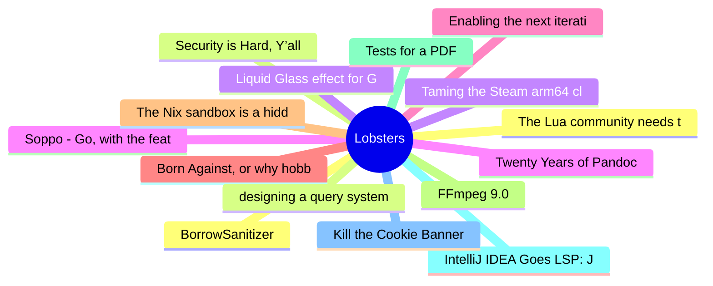

# Lobsters Top 15 (2026-08-05)

## 思维导图

## 列表（15 条）

### 1. The Lua community needs to learn to move on
- **链接**: [https://hisham.hm/2026/08/04/the-lua-community-needs-to-learn-to-move-on/](https://hisham.hm/2026/08/04/the-lua-community-needs-to-learn-to-move-on/)
- **作者**:  | **评论**: 0
- **摘要**: 
<a href="https://lobste.rs/s/t7wzko/lua_community_needs_learn_move_on">Comments</a>

### 2. Security is Hard, Y’all
- **链接**: [https://textslashplain.com/2026/08/04/security-is-hard-yall/](https://textslashplain.com/2026/08/04/security-is-hard-yall/)
- **作者**:  | **评论**: 0
- **摘要**: 
<a href="https://lobste.rs/s/qoptbx/security_is_hard_y_all">Comments</a>

### 3. Liquid Glass effect for GNU/Emacs
- **链接**: [https://github.com/larrasket/emacs-liquid-glass](https://github.com/larrasket/emacs-liquid-glass)
- **作者**:  | **评论**: 0
- **摘要**: 
<a href="https://lobste.rs/s/2avtyb/liquid_glass_effect_for_gnu_emacs">Comments</a>

### 4. Soppo - Go, with the features it's missing
- **链接**: [https://soppolang.dev/](https://soppolang.dev/)
- **作者**:  | **评论**: 0
- **摘要**: 
<a href="https://lobste.rs/s/0ykmyt/soppo_go_with_features_it_s_missing">Comments</a>

### 5. Enabling the next iteration of the borrow checker on nightly
- **链接**: [https://blog.rust-lang.org/2026/08/04/enabling-polonius-alpha-on-nighty/](https://blog.rust-lang.org/2026/08/04/enabling-polonius-alpha-on-nighty/)
- **作者**:  | **评论**: 0
- **摘要**: 
<a href="https://lobste.rs/s/skft2i/enabling_next_iteration_borrow_checker">Comments</a>

### 6. Born Against, or why hobby programming communities are aggressively against LLM usage
- **链接**: [https://blog.fogus.me/llm/born-against.html](https://blog.fogus.me/llm/born-against.html)
- **作者**:  | **评论**: 0
- **摘要**: 
<a href="https://lobste.rs/s/3d3wbr/born_against_why_hobby_programming">Comments</a>

### 7. The Nix sandbox is a hidden input
- **链接**: [https://fzakaria.com/2026/07/30/the-nix-sandbox-is-a-hidden-input](https://fzakaria.com/2026/07/30/the-nix-sandbox-is-a-hidden-input)
- **作者**:  | **评论**: 0
- **摘要**: 
<a href="https://lobste.rs/s/4w9m07/nix_sandbox_is_hidden_input">Comments</a>

### 8. FFmpeg 9.0
- **链接**: [https://github.com/FFmpeg/FFmpeg/blob/n9.0/RELEASE_NOTES](https://github.com/FFmpeg/FFmpeg/blob/n9.0/RELEASE_NOTES)
- **作者**:  | **评论**: 0
- **摘要**: 
Changelog: <a href="https://github.com/FFmpeg/FFmpeg/blob/n9.0/Changelog" rel="ugc">https://github.com/FFmpeg/FFmpeg/blob/n9.0/Changelog</a>

<a href="https://lobste.rs/s/jvgi1u/ffmpeg_9_0">C

### 9. Tests for a PDF
- **链接**: [https://blog.lvmbdv.dev/posts/tests-for-a-pdf/](https://blog.lvmbdv.dev/posts/tests-for-a-pdf/)
- **作者**:  | **评论**: 0
- **摘要**: 
<a href="https://lobste.rs/s/98zvnf/tests_for_pdf">Comments</a>

### 10. IntelliJ IDEA Goes LSP: Java and Kotlin Intelligence Comes to VS Code, Cursor, and Agentic Flows
- **链接**: [https://blog.jetbrains.com/idea/2026/08/intellij-idea-goes-lsp/](https://blog.jetbrains.com/idea/2026/08/intellij-idea-goes-lsp/)
- **作者**:  | **评论**: 0
- **摘要**: 
<a href="https://lobste.rs/s/culsub/intellij_idea_goes_lsp_java_kotlin">Comments</a>

### 11. Kill the Cookie Banner
- **链接**: [https://killthecookiebanner.eu/](https://killthecookiebanner.eu/)
- **作者**:  | **评论**: 0
- **摘要**: 
<a href="https://lobste.rs/s/aftrcr/kill_cookie_banner">Comments</a>

### 12. BorrowSanitizer
- **链接**: [https://borrowsanitizer.com/](https://borrowsanitizer.com/)
- **作者**:  | **评论**: 0
- **摘要**: 
<a href="https://lobste.rs/s/jkv2du/borrowsanitizer">Comments</a>

### 13. designing a query system
- **链接**: [https://bal-e.org/speed/krabby/2026/query-system-design/](https://bal-e.org/speed/krabby/2026/query-system-design/)
- **作者**:  | **评论**: 0
- **摘要**: 
<a href="https://lobste.rs/s/awdorz/designing_query_system">Comments</a>

### 14. Taming the Steam arm64 client (on pmOS)
- **链接**: [https://blog.drakulix.de/taming-the-steam-arm64-client-on-pmos/](https://blog.drakulix.de/taming-the-steam-arm64-client-on-pmos/)
- **作者**:  | **评论**: 0
- **摘要**: 
<a href="https://lobste.rs/s/dpn8yn/taming_steam_arm64_client_on_pmos">Comments</a>

### 15. Twenty Years of Pandoc
- **链接**: [https://pandoc.org/twenty-years-of-pandoc.html](https://pandoc.org/twenty-years-of-pandoc.html)
- **作者**:  | **评论**: 0
- **摘要**: 
<a href="https://lobste.rs/s/blflqs/twenty_years_pandoc">Comments</a>

