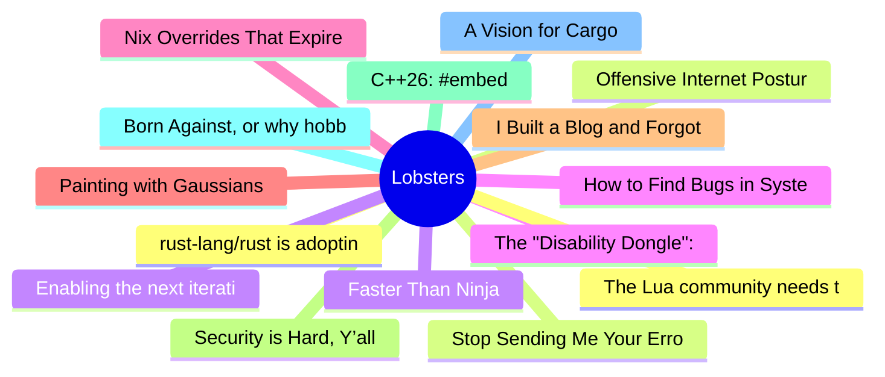

# Lobsters Top 15 (2026-08-06)

## 思维导图

## 列表（15 条）

### 1. rust-lang/rust is adopting an LLM policy
- **链接**: [https://blog.rust-lang.org/inside-rust/2026/08/05/rust-langrust-is-adopting-an-llm-policy/](https://blog.rust-lang.org/inside-rust/2026/08/05/rust-langrust-is-adopting-an-llm-policy/)
- **作者**:  | **评论**: 0
- **摘要**: 
<a href="https://lobste.rs/s/czvkjy/rust_lang_rust_is_adopting_llm_policy">Comments</a>

### 2. Offensive Internet Posture
- **链接**: [https://bruceediger.com/posts/offensive-machine/](https://bruceediger.com/posts/offensive-machine/)
- **作者**:  | **评论**: 0
- **摘要**: 
<a href="https://lobste.rs/s/fgcrj0/offensive_internet_posture">Comments</a>

### 3. Faster Than Ninja
- **链接**: [https://build2.org/blog/faster-than-ninja.xhtml](https://build2.org/blog/faster-than-ninja.xhtml)
- **作者**:  | **评论**: 0
- **摘要**: 
<a href="https://lobste.rs/s/31hk9y/faster_than_ninja">Comments</a>

### 4. The "Disability Dongle": Why Silicon Valley Hates Me and you
- **链接**: [https://sightlessscribbles.com/disability-dongle/](https://sightlessscribbles.com/disability-dongle/)
- **作者**:  | **评论**: 0
- **摘要**: 
<a href="https://lobste.rs/s/lzupt0/disability_dongle_why_silicon_valley">Comments</a>

### 5. Nix Overrides That Expire Themselves
- **链接**: [https://jezenthomas.com/2026/07/nix-overrides-that-expire-themselves/](https://jezenthomas.com/2026/07/nix-overrides-that-expire-themselves/)
- **作者**:  | **评论**: 0
- **摘要**: 
<a href="https://lobste.rs/s/wnyesi/nix_overrides_expire_themselves">Comments</a>

### 6. Painting with Gaussians
- **链接**: [https://yogthos.net/posts/2026-08-03-splat-painter.html](https://yogthos.net/posts/2026-08-03-splat-painter.html)
- **作者**:  | **评论**: 0
- **摘要**: 
<a href="https://lobste.rs/s/wkujx7/painting_with_gaussians">Comments</a>

### 7. I Built a Blog and Forgot to Write
- **链接**: [https://benjcal.space/blog/i-built-a-blog-and-forgot-to-write/](https://benjcal.space/blog/i-built-a-blog-and-forgot-to-write/)
- **作者**:  | **评论**: 0
- **摘要**: 
<a href="https://lobste.rs/s/qamm7j/i_built_blog_forgot_write">Comments</a>

### 8. Security is Hard, Y’all
- **链接**: [https://textslashplain.com/2026/08/04/security-is-hard-yall/](https://textslashplain.com/2026/08/04/security-is-hard-yall/)
- **作者**:  | **评论**: 0
- **摘要**: 
<a href="https://lobste.rs/s/qoptbx/security_is_hard_y_all">Comments</a>

### 9. C++26: #embed
- **链接**: [https://www.sandordargo.com/blog/2026/08/05/cpp26-embed](https://www.sandordargo.com/blog/2026/08/05/cpp26-embed)
- **作者**:  | **评论**: 0
- **摘要**: 
<a href="https://lobste.rs/s/0j5jx5/c_26_embed">Comments</a>

### 10. Born Against, or why hobby programming communities are aggressively against LLM usage
- **链接**: [https://blog.fogus.me/llm/born-against.html](https://blog.fogus.me/llm/born-against.html)
- **作者**:  | **评论**: 0
- **摘要**: 
<a href="https://lobste.rs/s/3d3wbr/born_against_why_hobby_programming">Comments</a>

### 11. A Vision for Cargo
- **链接**: [https://epage.github.io/blog/2026/08/cargo-vision/](https://epage.github.io/blog/2026/08/cargo-vision/)
- **作者**:  | **评论**: 0
- **摘要**: 
<a href="https://lobste.rs/s/mgr9lc/vision_for_cargo">Comments</a>

### 12. The Lua community needs to learn to move on
- **链接**: [https://hisham.hm/2026/08/04/the-lua-community-needs-to-learn-to-move-on/](https://hisham.hm/2026/08/04/the-lua-community-needs-to-learn-to-move-on/)
- **作者**:  | **评论**: 0
- **摘要**: 
<a href="https://lobste.rs/s/t7wzko/lua_community_needs_learn_move_on">Comments</a>

### 13. Stop Sending Me Your Errors
- **链接**: [https://kramkow.ski/article/2026/08/05/stop_sending_me_your_errors.html](https://kramkow.ski/article/2026/08/05/stop_sending_me_your_errors.html)
- **作者**:  | **评论**: 0
- **摘要**: 
<a href="https://lobste.rs/s/gk08tu/stop_sending_me_your_errors">Comments</a>

### 14. Enabling the next iteration of the borrow checker on nightly
- **链接**: [https://blog.rust-lang.org/2026/08/04/enabling-polonius-alpha-on-nighty/](https://blog.rust-lang.org/2026/08/04/enabling-polonius-alpha-on-nighty/)
- **作者**:  | **评论**: 0
- **摘要**: 
<a href="https://lobste.rs/s/skft2i/enabling_next_iteration_borrow_checker">Comments</a>

### 15. How to Find Bugs in Systems That Don't Exist
- **链接**: [https://www.youtube.com/watch?v=zSZkLyD9ILI](https://www.youtube.com/watch?v=zSZkLyD9ILI)
- **作者**:  | **评论**: 0
- **摘要**: 
<a href="https://lobste.rs/s/izdtd6/how_find_bugs_systems_don_t_exist">Comments</a>

