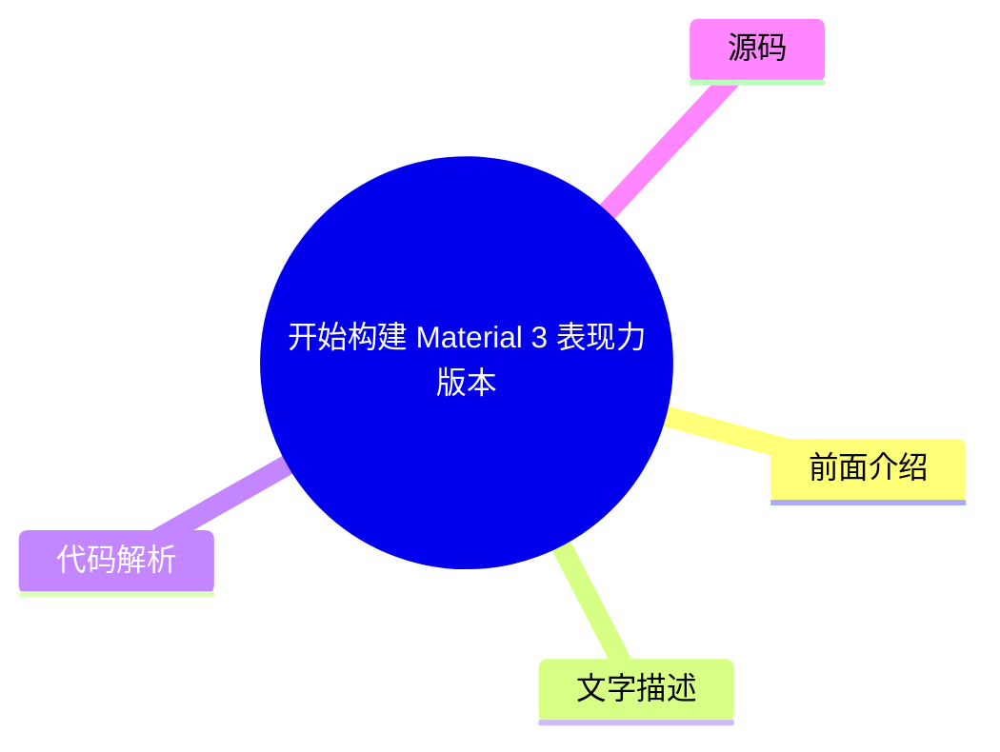
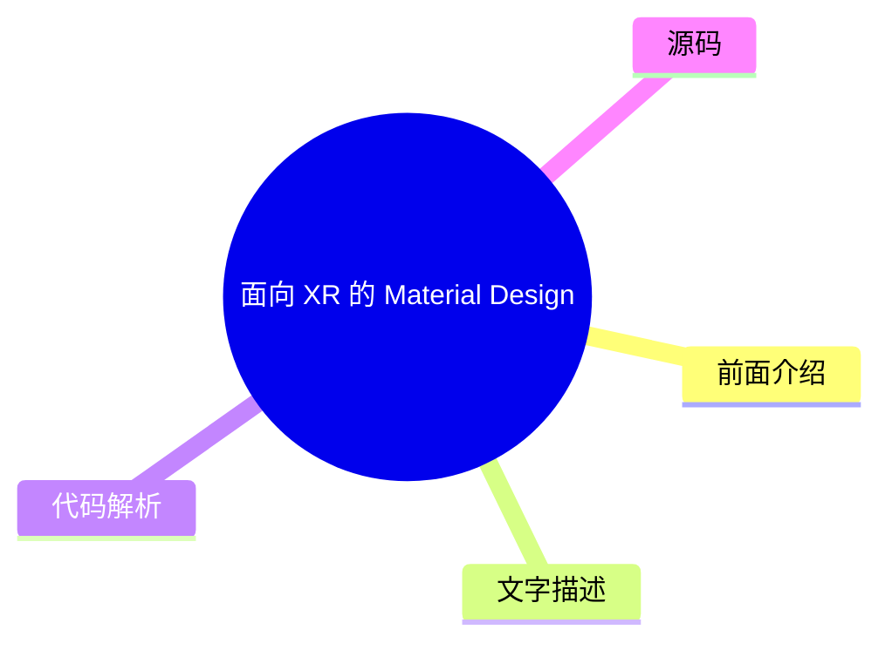
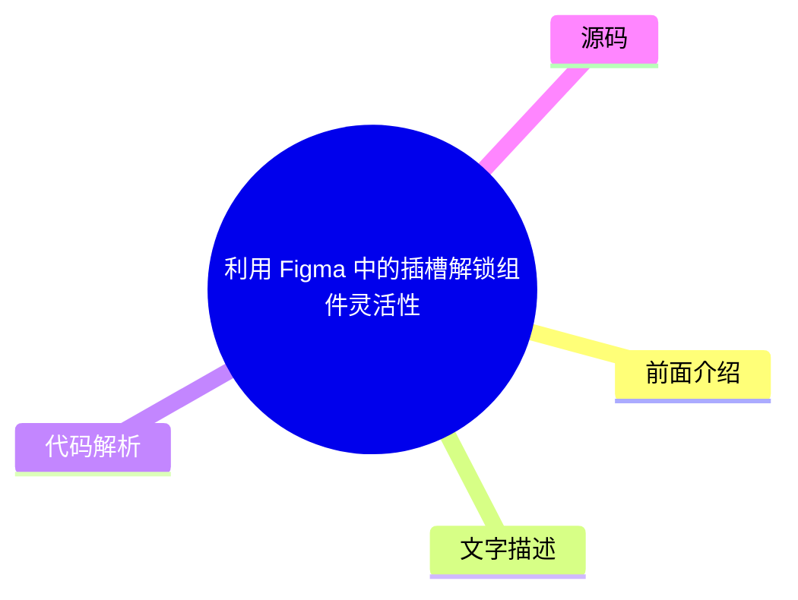

# 🎨 Material Design Top 5 (2026-07-18)

## 前面介绍

- 数据源：Material Design
- 抓取日期：2026-07-18
- 条目数：5
- 含完整正文：0
- 含代码片段：0
- 组织方式：前面介绍 / 树状图 / 文字描述 / 代码解析 / 源码

## 思维导图

```mermaid
mindmap
  root((Material Design))
    使用 Jetpack Compose 添加运动物理效果
    开始构建 Material 3 表现力版本
    面向 XR 的 Material Design (开发者
    利用 Figma 中的插槽解锁组件灵活性
    适用于 Compose 1.3 的 Material D
```

## 详细整理（5 条，0 条含全文，0 条含代码）

### 1. 使用 Jetpack Compose 添加运动物理效果
- **链接**: [https://material.io/blog/m3-expressive-motion-theming](https://material.io/blog/m3-expressive-motion-theming)
- **发布**: 2025-05-20T08:00:00Z

#### 前面介绍

- 探索 Jetpack Compose 中的物理运动效果
- 提升应用交互体验

#### 树状图


#### 文字描述

- 介绍如何在 Jetpack Compose 中利用物理引擎创建流畅的动画效果
- 详细讲解如何配置弹簧和阻尼参数
- 展示如何将物理效果应用于组件的过渡和交互中
- 提供代码示例以实现自定义的物理动画

#### 代码解析

- 本文未提供源码，以下为实现思路或结构解析
- 通过使用 `animateFloatAsState` 或自定义动画控制器来应用物理运动
- 利用 `spring` 动画参数控制动画的弹性与阻尼特性

#### 源码

未抓到可展示源码或原文节选。


### 2. 开始构建 Material 3 表现力版本
- **链接**: [https://material.io/blog/building-with-m3-expressive](https://material.io/blog/building-with-m3-expressive)
- **发布**: 2025-05-13T08:00:00Z

#### 前面介绍

- 探索 Material 3 表现力版本的特性
- 获取最新的设计语言指南

#### 树状图



#### 文字描述

- 介绍 Material 3 表现力版本的设计理念与核心组件
- 展示如何利用新的排版、色彩和形状系统构建现代界面
- 提供设计规范与实现指南
- 帮助开发者快速上手 Material 3 的最新设计趋势

#### 代码解析

- 本文未提供源码，以下为实现思路或结构解析
- 重点关注 `Material3Theme` 的配置与自定义
- 利用表现力组件如 `Surface` 和 `ElevatedButton` 改善视觉层次

#### 源码

未抓到可展示源码或原文节选。


### 3. 面向 XR 的 Material Design (开发者预览)
- **链接**: [https://material.io/blog/material-design-xr-dev-preview](https://material.io/blog/material-design-xr-dev-preview)
- **发布**: 2024-12-12T13:00:00Z

#### 前面介绍

- 探索扩展现实 (XR) 环境下的设计指南
- 获取开发者预览版文档

#### 树状图



#### 文字描述

- 发布面向 XR 设备（如 VR 和 AR）的 Material Design 设计规范
- 提供针对空间交互、3D 界面和沉浸式体验的设计建议
- 包含开发者预览版的工具包与示例代码
- 旨在为构建下一代空间计算应用提供设计支持

#### 代码解析

- 本文未提供源码，以下为实现思路或结构解析
- 重点在于理解空间 UI 的布局与交互逻辑
- 参考文档中的 3D 组件与空间导航设计模式

#### 源码

未抓到可展示源码或原文节选。


### 4. 利用 Figma 中的插槽解锁组件灵活性
- **链接**: [https://material.io/blog/material-3-slot-components-figma](https://material.io/blog/material-3-slot-components-figma)
- **发布**: 2024-11-04T13:00:00Z

#### 前面介绍

- 掌握 Figma 组件插槽的高级用法
- 提升设计系统的可扩展性

#### 树状图



#### 文字描述

- 解释 Figma 组件插槽的概念及其在构建灵活设计系统中的作用
- 展示如何使用插槽创建可自定义的组件实例
- 提供关于插槽嵌套与条件可见性的最佳实践
- 帮助设计师构建更加模块化和可复用的设计资产

#### 代码解析

- 本文未提供源码，以下为实现思路或结构解析
- 通过在组件定义中预留插槽区域来增加灵活性
- 利用组件实例的属性面板动态调整插槽内容

#### 源码

未抓到可展示源码或原文节选。


### 5. 适用于 Compose 1.3 的 Material Design 3
- **链接**: [https://material.io/blog/material-3-compose-1-3](https://material.io/blog/material-3-compose-1-3)
- **发布**: 2024-09-10T13:00:00Z

#### 前面介绍

- 更新 Compose 库以支持 Material 3
- 获取最新的 Material Design 组件

#### 树状图


#### 文字描述

- 发布 Material Design 3 对应的 Jetpack Compose 库 1.3 版本
- 包含对 Material 3 设计系统的完整支持
- 更新了基础组件、排版和色彩系统
- 提供迁移指南以帮助现有项目升级

#### 代码解析

- 本文未提供源码，以下为实现思路或结构解析
- 在 `build.gradle` 中更新依赖版本至 1.3.x
- 使用 `Material3Theme` 替换原有的 Material 2 主题配置

#### 源码

未抓到可展示源码或原文节选。

