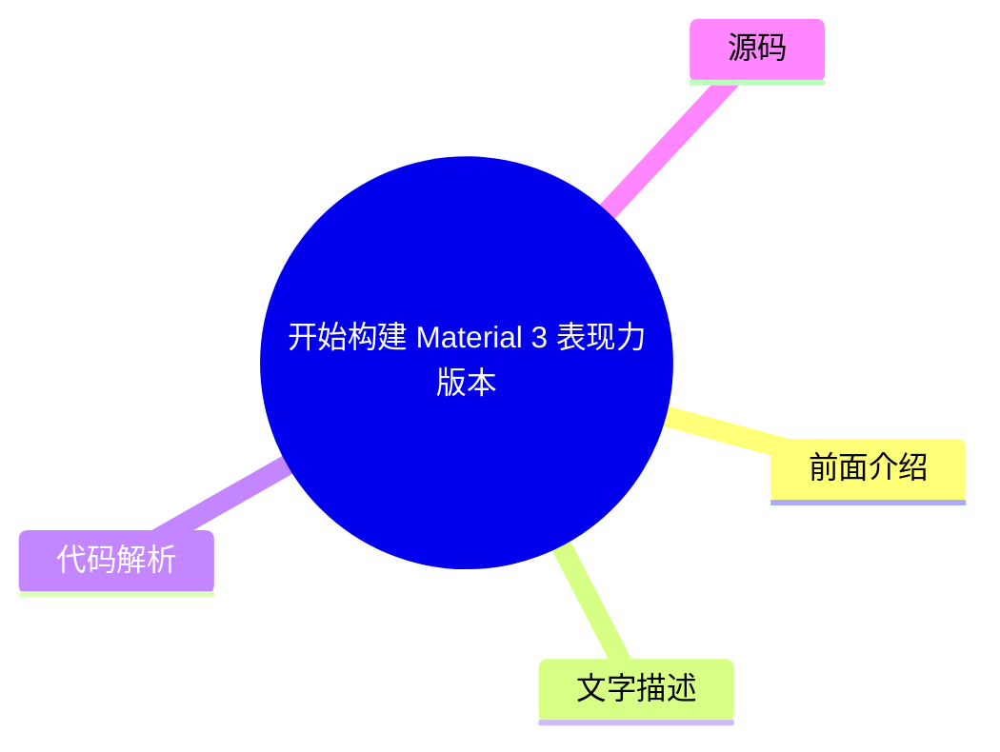
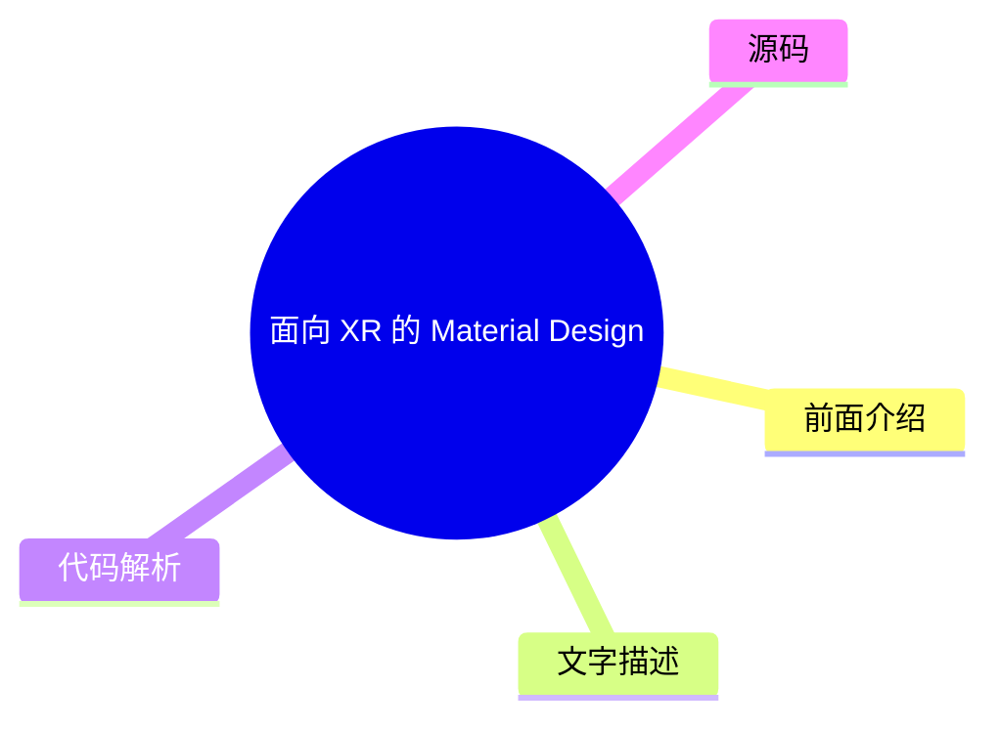
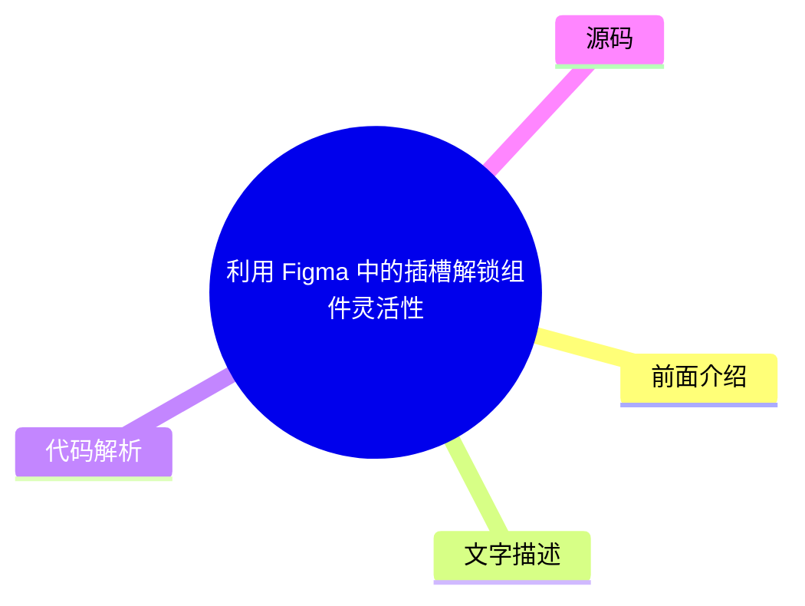

# 🎨 Material Design Top 5 (2026-07-27)

## 前面介绍

- 数据源：Material Design
- 抓取日期：2026-07-27
- 条目数：5
- 含完整正文：0
- 含代码片段：0
- 组织方式：前面介绍 / 树状图 / 文字描述 / 代码解析 / 源码

## 思维导图

```mermaid
mindmap
  root((Material Design))
    使用 Jetpack Compose 添加运动物理效果
    开始构建 Material 3 表现力版本
    面向 XR 的 Material Design (开发者
    利用 Figma 中的插槽解锁组件灵活性
    适用于 Compose 1.3 版本的 Material
```

## 详细整理（5 条，0 条含全文，0 条含代码）

### 1. 使用 Jetpack Compose 添加运动物理效果
- **链接**: [https://material.io/blog/m3-expressive-motion-theming](https://material.io/blog/m3-expressive-motion-theming)
- **发布**: 2025-05-20T08:00:00Z

#### 前面介绍

- 利用 Jetpack Compose 实现流畅的动画效果
- 引入物理引擎模拟真实世界的运动规律

#### 树状图


#### 文字描述

- Jetpack Compose 提供了强大的动画 API，可以轻松实现复杂的 UI 变换
- 通过引入物理引擎，可以让界面元素的移动、缩放和旋转更加自然逼真
- 开发者可以自定义阻尼、弹簧等物理参数，创造出符合用户直觉的交互体验

#### 代码解析

- 本文未提供源码，以下为实现思路或结构解析

#### 源码

未抓到可展示源码或原文节选。


### 2. 开始构建 Material 3 表现力版本
- **链接**: [https://material.io/blog/building-with-m3-expressive](https://material.io/blog/building-with-m3-expressive)
- **发布**: 2025-05-13T08:00:00Z

#### 前面介绍

- 探索 Material Design 3 的新特性
- 为应用带来更具表现力的视觉风格

#### 树状图



#### 文字描述

- Material 3 Expressive 旨在打破传统设计规范，提供更灵活的视觉语言
- 该版本强调情感化设计和动态交互，允许开发者根据品牌调性定制组件外观
- 通过引入新的色彩系统和排版层级，提升用户界面的吸引力和可读性

#### 代码解析

- 本文未提供源码，以下为实现思路或结构解析

#### 源码

未抓到可展示源码或原文节选。


### 3. 面向 XR 的 Material Design (开发者预览)
- **链接**: [https://material.io/blog/material-design-xr-dev-preview](https://material.io/blog/material-design-xr-dev-preview)
- **发布**: 2024-12-12T13:00:00Z

#### 前面介绍

- 为扩展现实 (XR) 设备设计界面
- 探索沉浸式交互的新范式

#### 树状图



#### 文字描述

- Material Design for XR 专为虚拟现实 (VR) 和增强现实 (AR) 设备设计
- 该指南提供了在三维空间中构建用户界面的最佳实践和设计原则
- 重点解决了空间音频、手势交互以及如何在虚拟环境中保持视觉清晰度的问题

#### 代码解析

- 本文未提供源码，以下为实现思路或结构解析

#### 源码

未抓到可展示源码或原文节选。


### 4. 利用 Figma 中的插槽解锁组件灵活性
- **链接**: [https://material.io/blog/material-3-slot-components-figma](https://material.io/blog/material-3-slot-components-figma)
- **发布**: 2024-11-04T13:00:00Z

#### 前面介绍

- 提升 Figma 组件的可复用性
- 优化设计系统的层级结构

#### 树状图



#### 文字描述

- 插槽机制允许设计者将组件划分为不同的区域，这些区域可以独立替换内容
- 通过定义插槽，可以创建高度灵活的组件库，同时保持设计的一致性
- 这种方法简化了设计交付流程，使得开发人员能够更准确地还原设计稿

#### 代码解析

- 本文未提供源码，以下为实现思路或结构解析

#### 源码

未抓到可展示源码或原文节选。


### 5. 适用于 Compose 1.3 版本的 Material Design 3
- **链接**: [https://material.io/blog/material-3-compose-1-3](https://material.io/blog/material-3-compose-1-3)
- **发布**: 2024-09-10T13:00:00Z

#### 前面介绍

- 更新 Material Design 3 组件库
- 适配最新的 Jetpack Compose 版本

#### 树状图


#### 文字描述

- Material Design 3 for Compose 1.3 提供了最新的组件实现和样式定义
- 该版本修复了多个已知问题，并优化了性能表现
- 开发者可以利用这些更新后的组件快速构建符合 Material Design 3 规范的现代化应用

#### 代码解析

- 本文未提供源码，以下为实现思路或结构解析

#### 源码

未抓到可展示源码或原文节选。

