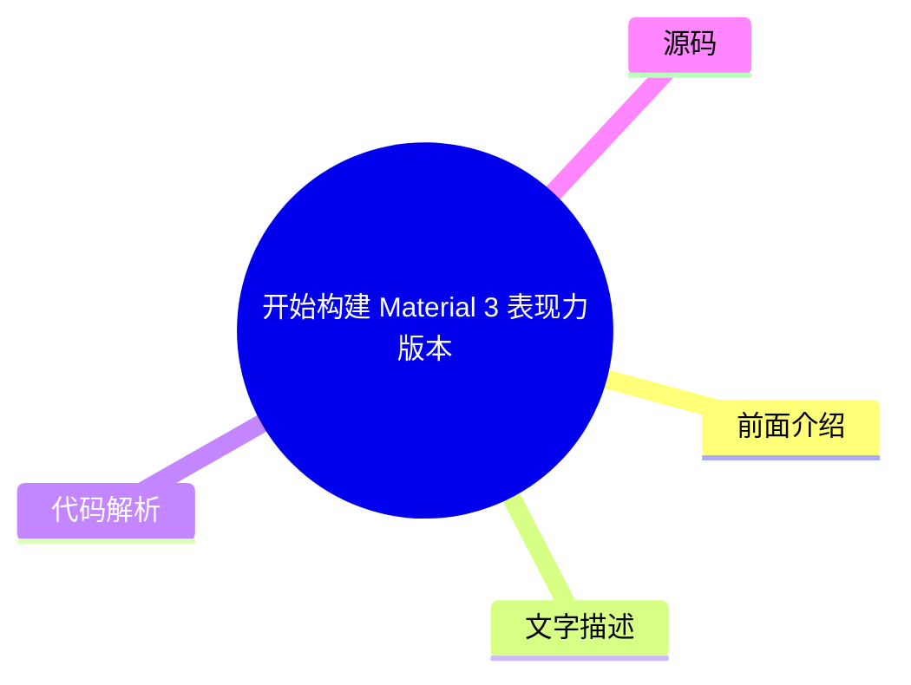
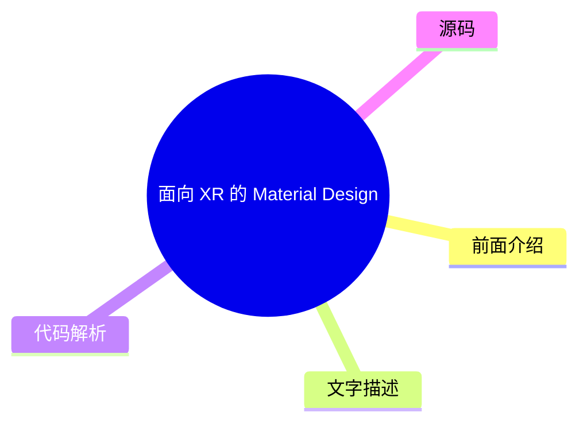
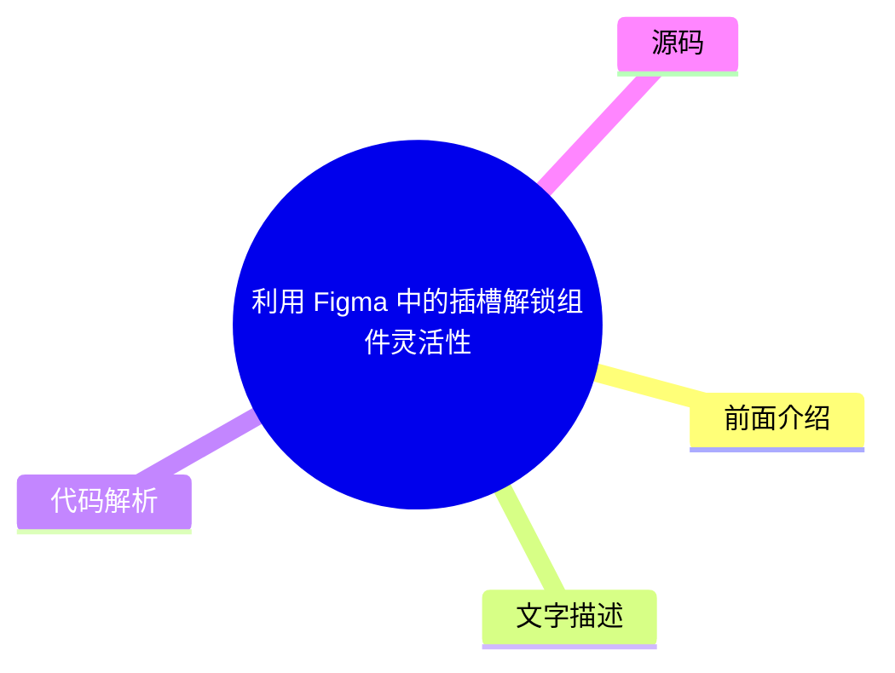

# 🎨 Material Design Top 5 (2026-07-28)

## 前面介绍

- 数据源：Material Design
- 抓取日期：2026-07-28
- 条目数：5
- 含完整正文：0
- 含代码片段：0
- 组织方式：前面介绍 / 树状图 / 文字描述 / 代码解析 / 源码

## 思维导图

```mermaid
mindmap
  root((Material Design))
    使用 Jetpack Compose 添加运动物理效果
    开始构建 Material 3 表现力版本
    面向 XR 的 Material Design (开发者
    利用 Figma 中的插槽解锁组件灵活性
    适用于 Compose 1.3 的 Material D
```

## 详细整理（5 条，0 条含全文，0 条含代码）

### 1. 使用 Jetpack Compose 添加运动物理效果
- **链接**: [https://material.io/blog/m3-expressive-motion-theming](https://material.io/blog/m3-expressive-motion-theming)
- **发布**: 2025-05-20T08:00:00Z

#### 前面介绍

- 介绍如何利用 Jetpack Compose 实现流畅的动画效果
- 强调物理运动在提升用户体验中的重要性

#### 树状图


#### 文字描述

- 文章主要探讨了如何在 Jetpack Compose 中应用 Material Design 的运动规范
- 详细说明了如何通过代码实现具有惯性和阻尼效果的动画
- 旨在帮助开发者创建更加生动和自然的用户界面交互

#### 代码解析

- 本文未提供源码，以下为实现思路或结构解析
- 通常涉及使用 `animateFloatAsState` 或 `AnimatedContent` 等组合函数
- 通过定义 `TransitionSpec` 来自定义动画的缓动曲线和持续时间

#### 源码

未抓到可展示源码或原文节选。


### 2. 开始构建 Material 3 表现力版本
- **链接**: [https://material.io/blog/building-with-m3-expressive](https://material.io/blog/building-with-m3-expressive)
- **发布**: 2025-05-13T08:00:00Z

#### 前面介绍

- 探索 Material 3 的新设计语言特性
- 提供构建具有表现力界面的指南

#### 树状图



#### 文字描述

- Material 3 Expressive 是 Material Design 3 的一部分，专注于更具表现力和情感化的界面设计
- 该版本引入了更丰富的色彩系统、排版和形状，以适应多样化的品牌需求
- 开发者可以通过新的组件和 API 快速构建符合现代审美和用户期望的应用程序

#### 代码解析

- 本文未提供源码，以下为实现思路或结构解析
- 通常涉及使用 Material 3 的 `MaterialTheme` 和新的组件如 `Surface` 和 `OutlinedTextField`
- 配置 `colorScheme` 和 `typography` 以自定义主题外观

#### 源码

未抓到可展示源码或原文节选。


### 3. 面向 XR 的 Material Design (开发者预览)
- **链接**: [https://material.io/blog/material-design-xr-dev-preview](https://material.io/blog/material-design-xr-dev-preview)
- **发布**: 2024-12-12T13:00:00Z

#### 前面介绍

- 为扩展现实设备设计用户界面
- 探索沉浸式交互的新标准

#### 树状图



#### 文字描述

- Material Design for XR 是 Google 为虚拟现实 (VR) 和增强现实 (AR) 设备推出的设计指南
- 该指南解决了在三维空间中导航、交互和呈现内容的独特挑战
- 开发者预览版旨在为构建下一代空间计算应用提供设计参考和最佳实践

#### 代码解析

- 本文未提供源码，以下为实现思路或结构解析
- 设计重点在于处理空间锚点、手势交互和透视效果
- 通常需要结合特定的 XR SDK (如 ARCore 或 ARKit) 来实现视觉呈现

#### 源码

未抓到可展示源码或原文节选。


### 4. 利用 Figma 中的插槽解锁组件灵活性
- **链接**: [https://material.io/blog/material-3-slot-components-figma](https://material.io/blog/material-3-slot-components-figma)
- **发布**: 2024-11-04T13:00:00Z

#### 前面介绍

- 提升 Figma 组件的可复用性
- 掌握插槽机制以实现动态布局

#### 树状图



#### 文字描述

- 插槽是 Figma 中一种强大的组件功能，允许用户在组件实例中替换特定的部分
- 通过使用插槽，设计师可以创建高度灵活的组件库，而无需为每种变体创建单独的组件
- 这种方法极大地提高了设计系统的维护效率和设计一致性

#### 代码解析

- 本文未提供源码，以下为实现思路或结构解析
- 在 Figma 中创建组件时，使用“组件属性”面板定义插槽
- 在实例中，通过拖拽不同的图层到插槽区域来改变组件的局部内容

#### 源码

未抓到可展示源码或原文节选。


### 5. 适用于 Compose 1.3 的 Material Design 3
- **链接**: [https://material.io/blog/material-3-compose-1-3](https://material.io/blog/material-3-compose-1-3)
- **发布**: 2024-09-10T13:00:00Z

#### 前面介绍

- 更新 Material 3 组件库以适配最新版本
- 提升 Android 应用的设计一致性

#### 树状图


#### 文字描述

- Material Design 3 是 Google 推出的最新设计系统，旨在提供更灵活、更具包容性的设计语言
- Compose 1.3 版本对 Material 3 组件进行了更新和优化，修复了已知问题并引入了新特性
- 开发者可以无缝集成这些组件，以构建符合现代 Material Design 规范的应用程序

#### 代码解析

- 本文未提供源码，以下为实现思路或结构解析
- 通常需要在 `build.gradle` 中引入 `androidx.compose.material3` 依赖
- 使用 `MaterialTheme` 和 `Material3` 包下的具体组件如 `Button`、`Card` 等

#### 源码

未抓到可展示源码或原文节选。

