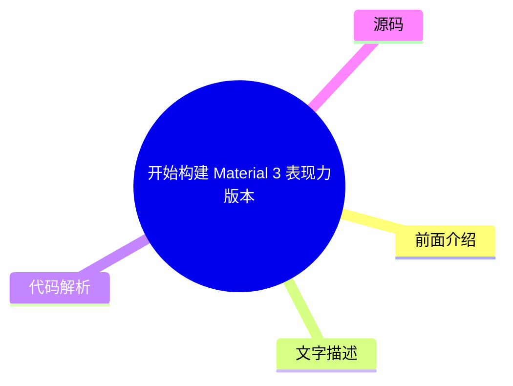
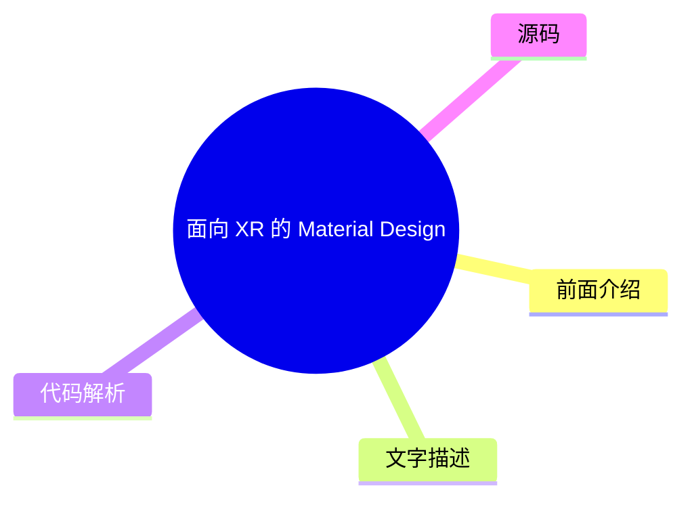
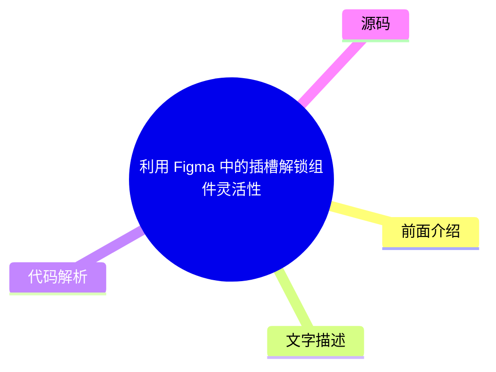

# 🎨 Material Design Top 5 (2026-07-29)

## 前面介绍

- 数据源：Material Design
- 抓取日期：2026-07-29
- 条目数：5
- 含完整正文：0
- 含代码片段：0
- 组织方式：前面介绍 / 树状图 / 文字描述 / 代码解析 / 源码

## 思维导图

```mermaid
mindmap
  root((Material Design))
    使用 Jetpack Compose 添加物理运动效果
    开始构建 Material 3 表现力版本
    面向 XR 的 Material Design (开发者
    利用 Figma 中的插槽解锁组件灵活性
    适用于 Compose 1.3 的 Material D
```

## 详细整理（5 条，0 条含全文，0 条含代码）

### 1. 使用 Jetpack Compose 添加物理运动效果
- **链接**: [https://material.io/blog/m3-expressive-motion-theming](https://material.io/blog/m3-expressive-motion-theming)
- **发布**: 2025-05-20T08:00:00Z

#### 前面介绍

- 介绍如何在 Jetpack Compose 中应用物理运动效果。
- 提升应用界面的流畅度和自然感。

#### 树状图


#### 文字描述

- Jetpack Compose 提供了强大的动画 API，允许开发者定义复杂的物理运动。
- 通过使用 `AnimatedVisibility`、`AnimatedContent` 等组件，可以轻松实现元素的进入和退出动画。
- 开发者可以利用 `spring` 和 `tween` 等缓动函数来模拟真实的物理阻尼和弹性。
- 这种物理运动效果能显著改善用户体验，使界面交互更加生动。

#### 代码解析

- 本文未提供源码，以下为实现思路或结构解析
- 使用 `animateFloatAsState` 控制组件的位移和透明度。
- 利用 `spring` 参数配置弹簧的刚度、阻尼和重量。
- 结合 `Transition` API 管理多个状态变化，实现复杂的组合动画。

#### 源码

未抓到可展示源码或原文节选。


### 2. 开始构建 Material 3 表现力版本
- **链接**: [https://material.io/blog/building-with-m3-expressive](https://material.io/blog/building-with-m3-expressive)
- **发布**: 2025-05-13T08:00:00Z

#### 前面介绍

- 探索 Material 3 的新设计语言。
- 提供更具表现力和情感化的界面组件。

#### 树状图



#### 文字描述

- Material 3 Expressive 是 Material Design 3 的一部分，专注于提供更具表现力的设计。
- 该版本引入了新的色彩系统、排版和形状，允许设计师创造更具情感共鸣的界面。
- 它支持更广泛的设备形态和交互模式，强调个性化和适应性。
- 开发者可以利用 Compose 的 Material 3 库快速实现这些设计规范。

#### 代码解析

- 本文未提供源码，以下为实现思路或结构解析
- 使用 `MaterialTheme` 定制颜色和形状。
- 应用 `Surface` 和 `Card` 组件展示新的圆角和阴影效果。
- 利用 `Typography` 类定义自定义的排版样式。
- 探索 `ElevatedButton` 和 `FilledTonalButton` 等新组件的视觉差异。

#### 源码

未抓到可展示源码或原文节选。


### 3. 面向 XR 的 Material Design (开发者预览)
- **链接**: [https://material.io/blog/material-design-xr-dev-preview](https://material.io/blog/material-design-xr-dev-preview)
- **发布**: 2024-12-12T13:00:00Z

#### 前面介绍

- 为扩展现实 (XR) 设备设计界面。
- 探索空间计算环境下的交互模式。

#### 树状图



#### 文字描述

- Material Design for XR 是 Google 为虚拟现实 (VR) 和增强现实 (AR) 设备推出的设计规范。
- 它解决了在三维空间中呈现 UI 的挑战，包括深度感知、空间导航和手部追踪交互。
- 该规范强调 UI 元素应漂浮在空间中，并支持非接触式交互。
- 开发者预览版旨在为构建下一代沉浸式应用提供设计指导。

#### 代码解析

- 本文未提供源码，以下为实现思路或结构解析
- 设计 UI 时需考虑景深和透视效果。
- 交互元素应支持手势识别，如捏合、滑动和旋转。
- UI 布局应适应头部移动和视线追踪。
- 构建悬浮在空中的面板和菜单系统。

#### 源码

未抓到可展示源码或原文节选。


### 4. 利用 Figma 中的插槽解锁组件灵活性
- **链接**: [https://material.io/blog/material-3-slot-components-figma](https://material.io/blog/material-3-slot-components-figma)
- **发布**: 2024-11-04T13:00:00Z

#### 前面介绍

- 掌握 Figma 组件的高级用法。
- 通过插槽实现高度可定制的组件库。

#### 树状图



#### 文字描述

- 插槽是 Figma 组件系统中的一个强大功能，允许用户在实例化组件时替换特定部分。
- 这比传统的嵌套组件更灵活，因为用户可以完全控制被替换部分的内容和样式。
- 开发者可以使用插槽来创建可复用的 UI 模板，如卡片、按钮组或导航栏。
- 通过插槽，设计系统可以保持一致性，同时允许用户进行个性化定制。

#### 代码解析

- 本文未提供源码，以下为实现思路或结构解析
- 在 Figma 组件画板中创建名为 'Slot' 的组件实例。
- 在组件属性面板中定义插槽的默认内容。
- 在组件实例中，通过右键菜单选择 'Replace Instance' 来更改插槽内容。
- 利用插槽创建动态的布局结构，如可变高度的列表项。

#### 源码

未抓到可展示源码或原文节选。


### 5. 适用于 Compose 1.3 的 Material Design 3
- **链接**: [https://material.io/blog/material-3-compose-1-3](https://material.io/blog/material-3-compose-1-3)
- **发布**: 2024-09-10T13:00:00Z

#### 前面介绍

- Material Design 3 的最新更新。
- 增强 Compose 中的 Material 组件功能。

#### 树状图


#### 文字描述

- Material Design 3 for Compose 版本 1.3 带来了多项改进和新特性。
- 更新包括对动态颜色、新的图标集和改进的排版系统的支持。
- 该版本修复了多个已知问题，并优化了性能。
- 开发者现在可以使用更现代的设计语言来构建 Android 应用。

#### 代码解析

- 本文未提供源码，以下为实现思路或结构解析
- 更新 `MaterialTheme` 以支持动态颜色系统。
- 使用新的 `Icon` 组件和图标集。
- 应用 `OutlinedTextField` 和 `TextField` 的改进样式。
- 检查并迁移到最新的 Material 3 组件 API。

#### 源码

未抓到可展示源码或原文节选。

