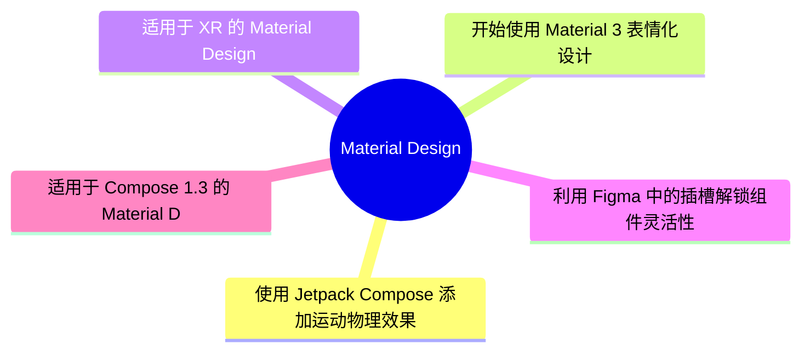
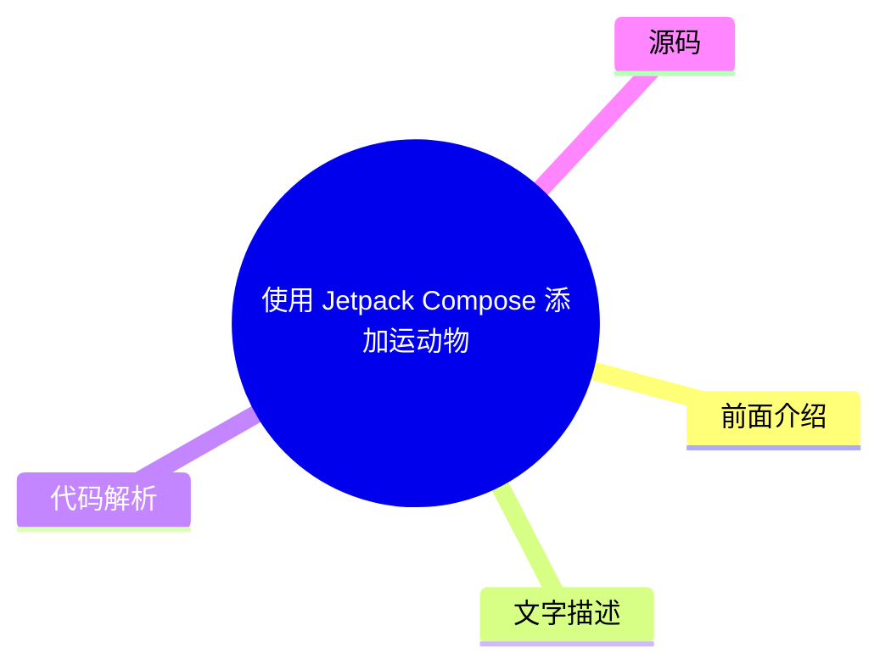
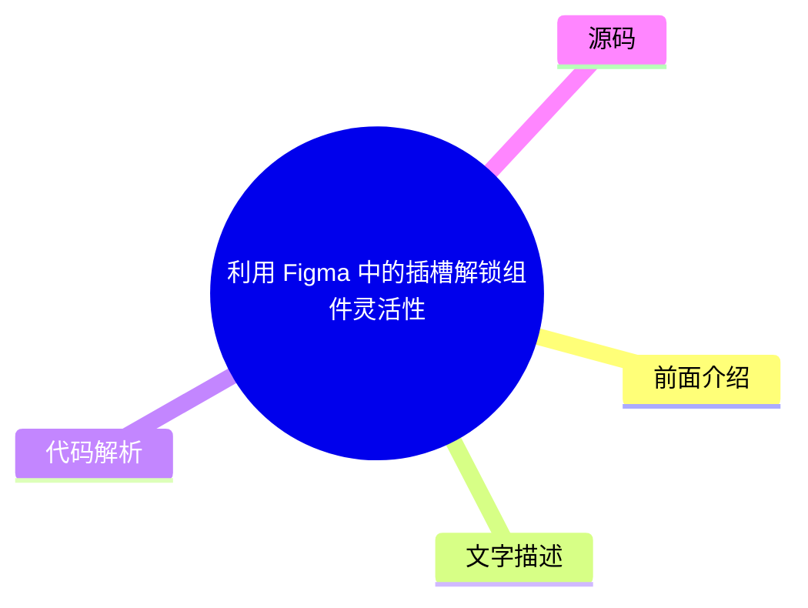

# 🎨 Material Design Top 5 (2026-08-01)

## 前面介绍

- 数据源：Material Design
- 抓取日期：2026-08-01
- 条目数：5
- 含完整正文：0
- 含代码片段：0
- 组织方式：前面介绍 / 树状图 / 文字描述 / 代码解析 / 源码

## 思维导图

## 详细整理（5 条，0 条含全文，0 条含代码）

### 1. 使用 Jetpack Compose 添加运动物理效果
- **链接**: [https://material.io/blog/m3-expressive-motion-theming](https://material.io/blog/m3-expressive-motion-theming)
- **发布**: 2025-05-20T08:00:00Z

#### 前面介绍

- 介绍如何在 Jetpack Compose 中利用物理引擎实现流畅的动画效果
- 提升应用交互体验的关键技术

#### 树状图

#### 文字描述

- Jetpack Compose 提供了强大的动画系统，允许开发者定义复杂的物理运动轨迹
- 通过 Material Motion 库，可以轻松实现符合物理定律的过渡效果
- 开发者可以自定义阻尼、弹簧等物理参数来控制动画的节奏和质感
- 这种物理运动效果能够显著增强用户界面的沉浸感和自然感

#### 代码解析

- 本文未提供源码，以下为实现思路或结构解析

#### 源码

未抓到可展示源码或原文节选。

### 2. 开始使用 Material 3 表情化设计
- **链接**: [https://material.io/blog/building-with-m3-expressive](https://material.io/blog/building-with-m3-expressive)
- **发布**: 2025-05-13T08:00:00Z

#### 前面介绍

- 探索 Material 3 中的表情化设计语言
- 为应用界面注入个性与情感

#### 树状图

#### 文字描述

- Material 3 引入了更丰富的色彩、形状和排版系统，强调设计的个性化和情感表达
- 开发者可以利用新的组件和主题系统快速构建具有独特风格的用户界面
- 该设计系统旨在打破传统设计的限制，提供更灵活的视觉语言

#### 代码解析

- 本文未提供源码，以下为实现思路或结构解析

#### 源码

未抓到可展示源码或原文节选。

### 3. 适用于 XR 的 Material Design
- **链接**: [https://material.io/blog/material-design-xr-dev-preview](https://material.io/blog/material-design-xr-dev-preview)
- **发布**: 2024-12-12T13:00:00Z

#### 前面介绍

- 探索扩展现实（XR）环境下的设计指南
- 为 VR 和 AR 应用构建沉浸式体验

#### 树状图

#### 文字描述

- Material Design for XR 专为虚拟现实和增强现实环境设计，解决了传统 UI 在 3D 空间中的适配问题
- 该指南提供了关于空间导航、手部追踪交互以及 3D 界面布局的最佳实践
- 旨在帮助开发者创建直观、安全且引人入胜的 XR 应用体验

#### 代码解析

- 本文未提供源码，以下为实现思路或结构解析

#### 源码

未抓到可展示源码或原文节选。

### 4. 利用 Figma 中的插槽解锁组件灵活性
- **链接**: [https://material.io/blog/material-3-slot-components-figma](https://material.io/blog/material-3-slot-components-figma)
- **发布**: 2024-11-04T13:00:00Z

#### 前面介绍

- 掌握 Figma 组件插槽的高级用法
- 实现高度可复用的设计系统

#### 树状图

#### 文字描述

- 插槽允许设计师在组件内部定义可变区域，从而在不破坏组件结构的情况下进行个性化定制
- 这种机制极大地提高了设计系统的灵活性和可扩展性，便于团队协作和维护
- 通过插槽，可以轻松创建出适应不同内容场景的通用组件模板

#### 代码解析

- 本文未提供源码，以下为实现思路或结构解析

#### 源码

未抓到可展示源码或原文节选。

### 5. 适用于 Compose 1.3 的 Material Design 3
- **链接**: [https://material.io/blog/material-3-compose-1-3](https://material.io/blog/material-3-compose-1-3)
- **发布**: 2024-09-10T13:00:00Z

#### 前面介绍

- 了解 Material Design 3 在 Compose 1.3 版本中的最新更新
- 获取最新的设计组件和主题支持

#### 树状图

#### 文字描述

- Material 3 for Compose 1.3 版本带来了最新的设计规范实现，包括动态色彩和新的排版层级
- 开发者可以无缝集成这些组件，以符合最新的 Material Design 3 标准
- 该更新确保了 Android 应用界面的一致性和现代感，同时简化了开发流程

#### 代码解析

- 本文未提供源码，以下为实现思路或结构解析

#### 源码

未抓到可展示源码或原文节选。

