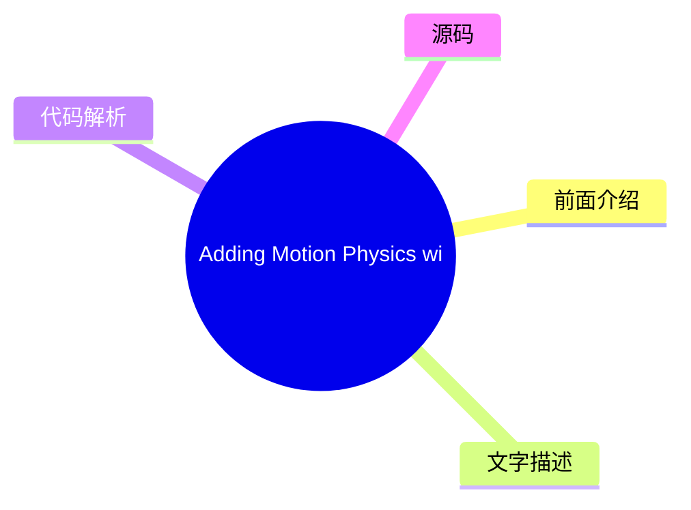
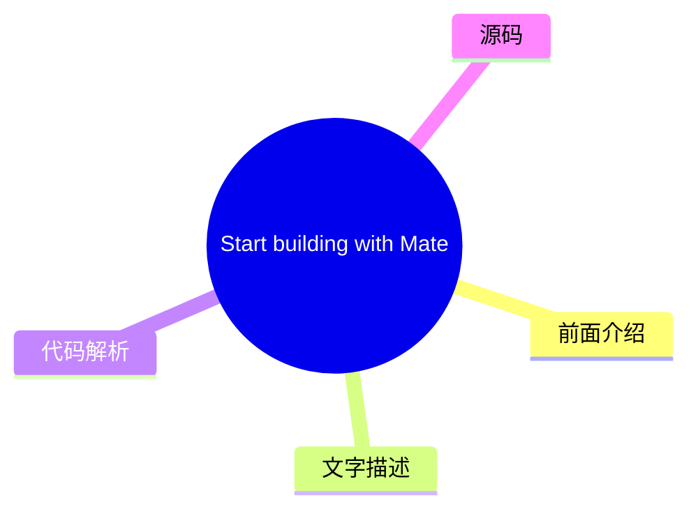
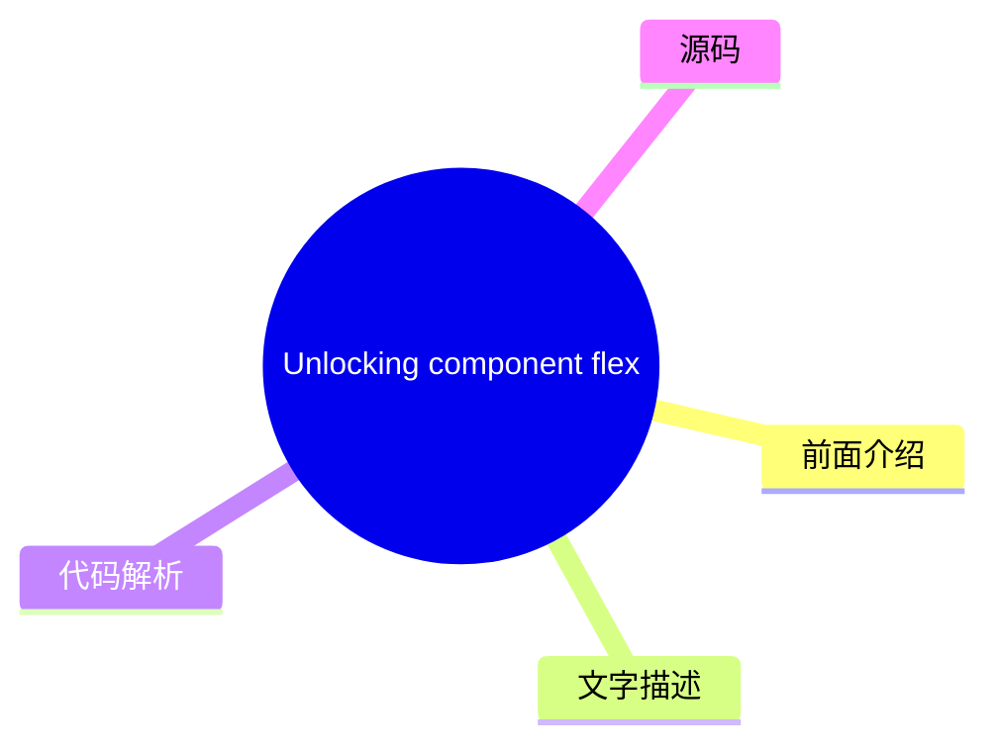
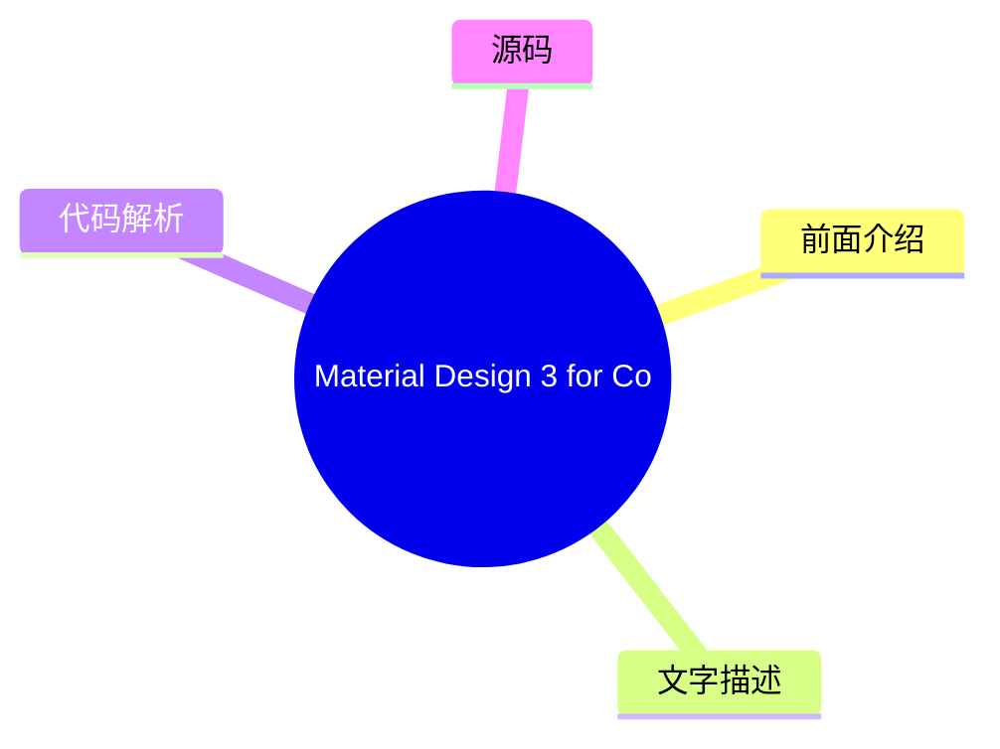

# 🎨 Material Design Top 5 (2026-08-02)

## 前面介绍

- 数据源：Material Design
- 抓取日期：2026-08-02
- 条目数：5
- 含完整正文：0
- 含代码片段：0
- 组织方式：前面介绍 / 树状图 / 文字描述 / 代码解析 / 源码

## 思维导图

```mermaid
mindmap
  root((Material Design))
    Adding Motion Physics with J
    Start building with Material
    Material Design for XR (Deve
    Unlocking component flexibil
    Material Design 3 for Compos
```

## 详细整理（5 条，0 条含全文，0 条含代码）

### 1. Adding Motion Physics with Jetpack Compose
- **链接**: [https://material.io/blog/m3-expressive-motion-theming](https://material.io/blog/m3-expressive-motion-theming)
- **发布**: 2025-05-20T08:00:00Z

#### 前面介绍

- 发布时间：2025-05-20T08:00:00Z

#### 树状图



#### 文字描述

- 未抓到可展开正文。

#### 代码解析

- 本文未检测到明确代码块，内容更偏新闻、观点或方法论。

#### 源码

未抓到可展示源码或原文节选。


### 2. Start building with Material 3 Expressive
- **链接**: [https://material.io/blog/building-with-m3-expressive](https://material.io/blog/building-with-m3-expressive)
- **发布**: 2025-05-13T08:00:00Z

#### 前面介绍

- 发布时间：2025-05-13T08:00:00Z

#### 树状图



#### 文字描述

- 未抓到可展开正文。

#### 代码解析

- 本文未检测到明确代码块，内容更偏新闻、观点或方法论。

#### 源码

未抓到可展示源码或原文节选。


### 3. Material Design for XR (Developer Preview)
- **链接**: [https://material.io/blog/material-design-xr-dev-preview](https://material.io/blog/material-design-xr-dev-preview)
- **发布**: 2024-12-12T13:00:00Z

#### 前面介绍

- 发布时间：2024-12-12T13:00:00Z

#### 树状图

```mermaid
mindmap
  root((Material Design for XR ())
    前面介绍
    文字描述
    代码解析
    源码
```

#### 文字描述

- 未抓到可展开正文。

#### 代码解析

- 本文未检测到明确代码块，内容更偏新闻、观点或方法论。

#### 源码

未抓到可展示源码或原文节选。


### 4. Unlocking component flexibility with slots in Figma
- **链接**: [https://material.io/blog/material-3-slot-components-figma](https://material.io/blog/material-3-slot-components-figma)
- **发布**: 2024-11-04T13:00:00Z

#### 前面介绍

- 发布时间：2024-11-04T13:00:00Z

#### 树状图



#### 文字描述

- 未抓到可展开正文。

#### 代码解析

- 本文未检测到明确代码块，内容更偏新闻、观点或方法论。

#### 源码

未抓到可展示源码或原文节选。


### 5. Material Design 3 for Compose version 1.3
- **链接**: [https://material.io/blog/material-3-compose-1-3](https://material.io/blog/material-3-compose-1-3)
- **发布**: 2024-09-10T13:00:00Z

#### 前面介绍

- 发布时间：2024-09-10T13:00:00Z

#### 树状图



#### 文字描述

- 未抓到可展开正文。

#### 代码解析

- 本文未检测到明确代码块，内容更偏新闻、观点或方法论。

#### 源码

未抓到可展示源码或原文节选。

