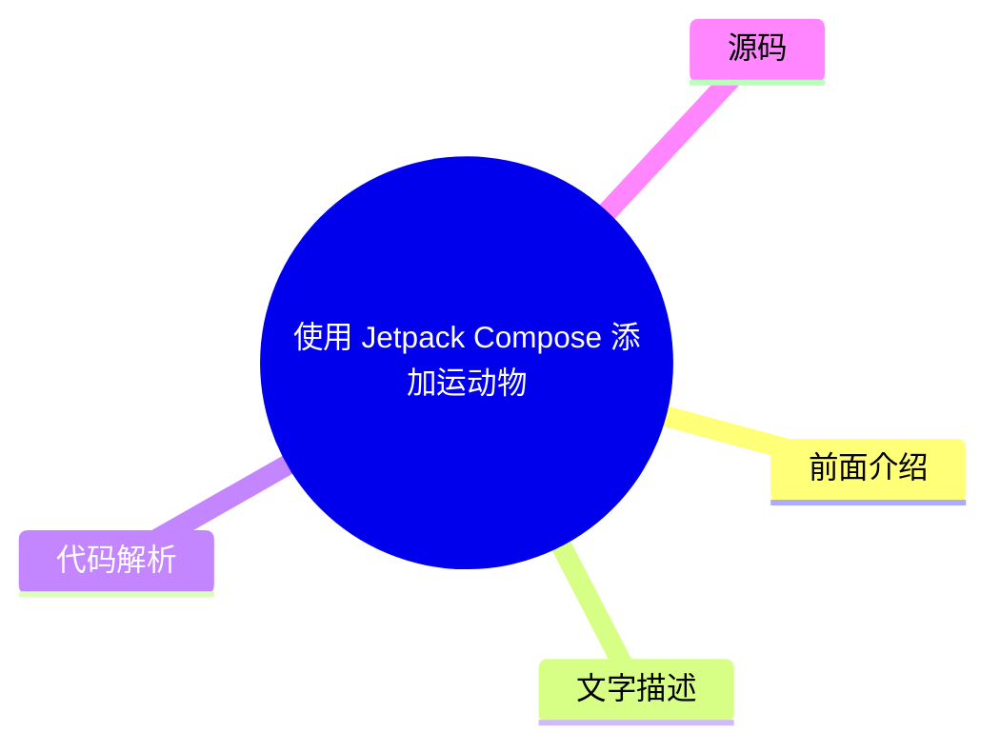
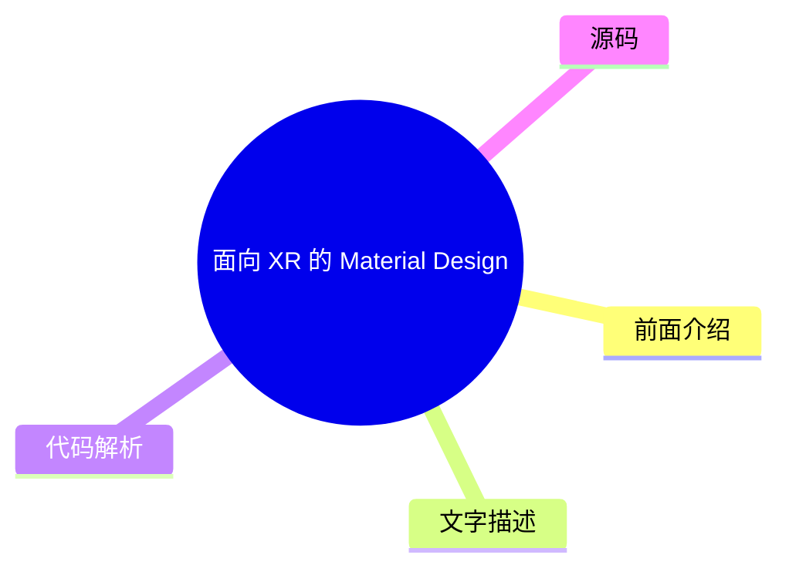
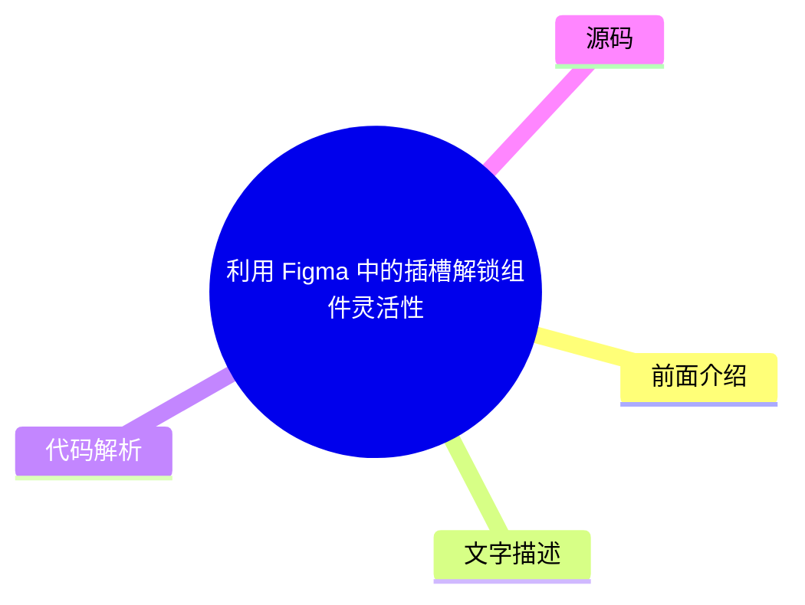

# 🎨 Material Design Top 5 (2026-08-04)

## 前面介绍

- 数据源：Material Design
- 抓取日期：2026-08-04
- 条目数：5
- 含完整正文：0
- 含代码片段：0
- 组织方式：前面介绍 / 树状图 / 文字描述 / 代码解析 / 源码

## 思维导图

```mermaid
mindmap
  root((Material Design))
    使用 Jetpack Compose 添加运动物理效果
    开始使用 Material 3 Expressive 构
    面向 XR 的 Material Design (开发者
    利用 Figma 中的插槽解锁组件灵活性
    适用于 Compose 1.3 的 Material D
```

## 详细整理（5 条，0 条含全文，0 条含代码）

### 1. 使用 Jetpack Compose 添加运动物理效果
- **链接**: [https://material.io/blog/m3-expressive-motion-theming](https://material.io/blog/m3-expressive-motion-theming)
- **发布**: 2025-05-20T08:00:00Z

#### 前面介绍

- 介绍如何利用 Jetpack Compose 实现流畅的动画效果
- 包含物理运动模拟与交互反馈

#### 树状图



#### 文字描述

- 本文主要探讨如何在 Jetpack Compose 中引入物理运动概念
- 通过代码示例展示如何创建具有惯性和阻尼效果的动画
- 强调现代声明式 UI 在处理复杂动画时的优势
- 展示了如何结合动画库实现更自然的用户界面交互

#### 代码解析

- 本文未提供源码，以下为实现思路或结构解析
- 核心逻辑通常涉及使用 `Animatable` 或 `AnimatedContent` 来控制状态变化
- 物理效果通常通过自定义 `Transition` 或引入第三方物理引擎库来实现
- 通过 `Modifier.animateFloat` 等修饰符来驱动视图的平滑过渡

#### 源码

未抓到可展示源码或原文节选。


### 2. 开始使用 Material 3 Expressive 构建
- **链接**: [https://material.io/blog/building-with-m3-expressive](https://material.io/blog/building-with-m3-expressive)
- **发布**: 2025-05-13T08:00:00Z

#### 前面介绍

- 探索 Material Design 3 的新特性
- 体验更具表现力的设计语言

#### 树状图


#### 文字描述

- Material 3 Expressive 是 Material Design 3 的一部分，旨在提供更丰富的视觉表现
- 该版本引入了新的色彩系统、排版和组件样式
- 开发者可以通过新的工具包快速构建符合现代审美的高质量应用界面
- Expressive 模式特别强调情感化和个性化的用户体验

#### 代码解析

- 本文未提供源码，以下为实现思路或结构解析
- 通常需要更新 Android Studio 版本以支持最新的 Material 3 组件库
- 在布局文件中使用 `MaterialTheme` 并指定 `expressive` 主题变体
- 利用新的 `OutlinedTextField` 或 `FloatingActionButton` 等组件替换旧版设计
- 通过调整 `colorScheme` 和 `typography` 来定制品牌色彩和字体

#### 源码

未抓到可展示源码或原文节选。


### 3. 面向 XR 的 Material Design (开发者预览)
- **链接**: [https://material.io/blog/material-design-xr-dev-preview](https://material.io/blog/material-design-xr-dev-preview)
- **发布**: 2024-12-12T13:00:00Z

#### 前面介绍

- 扩展 Material Design 到 XR 设备
- 为虚拟现实和增强现实提供设计规范

#### 树状图



#### 文字描述

- Material Design for XR 是 Google 为虚拟现实 (VR) 和增强现实 (AR) 设备发布的设计系统
- 该规范解决了在三维空间中导航、交互和呈现内容的独特挑战
- 它提供了关于如何在 XR 环境中处理空间音频、手势识别和透视效果的建议
- 开发者预览版旨在收集反馈，以便在正式发布前完善设计指南

#### 代码解析

- 本文未提供源码，以下为实现思路或结构解析
- 设计重点在于处理 3D 空间中的 UI 布局和透视遮挡关系
- 交互方式通常涉及手势识别（如捏合、拖拽）而非传统的触摸屏操作
- 视觉反馈需要考虑头部运动和空间深度对用户感知的影响
- 开发者需参考官方发布的 XR 设计规范文档来构建应用界面

#### 源码

未抓到可展示源码或原文节选。


### 4. 利用 Figma 中的插槽解锁组件灵活性
- **链接**: [https://material.io/blog/material-3-slot-components-figma](https://material.io/blog/material-3-slot-components-figma)
- **发布**: 2024-11-04T13:00:00Z

#### 前面介绍

- 掌握 Figma 组件的高级用法
- 提升设计系统的可扩展性

#### 树状图



#### 文字描述

- 插槽是 Figma 组件系统中的一个强大功能，允许在组件实例中嵌入其他组件
- 通过使用插槽，设计师可以创建高度灵活且可复用的组件库
- 这种方法使得在不修改组件源文件的情况下，可以动态更改组件的内部结构
- 它极大地提高了设计协作的效率，减少了重复劳动

#### 代码解析

- 本文未提供源码，以下为实现思路或结构解析
- 在 Figma 中创建一个父组件，并在其中预留一个名为 'Slot' 的占位符区域
- 在组件实例中，将其他组件拖入该插槽区域以替换默认内容
- 可以通过设置插槽的默认值来确保组件在未填充时的可用性
- 利用插槽可以轻松实现如按钮内的图标、卡片内的图片等动态内容的替换

#### 源码

未抓到可展示源码或原文节选。


### 5. 适用于 Compose 1.3 的 Material Design 3
- **链接**: [https://material.io/blog/material-3-compose-1-3](https://material.io/blog/material-3-compose-1-3)
- **发布**: 2024-09-10T13:00:00Z

#### 前面介绍

- Material Design 3 与 Compose 的深度集成
- 获取最新的设计系统支持

#### 树状图


#### 文字描述

- 本文介绍了 Material Design 3 (Material You) 在 Jetpack Compose 1.3 版本中的具体应用
- 涵盖了最新的颜色系统、形状和排版规范
- 展示了如何使用 Compose 的 Material 3 库来构建符合设计规范的应用
- 强调了动态配色方案在提升用户个性化体验方面的重要性

#### 代码解析

- 本文未提供源码，以下为实现思路或结构解析
- 确保项目依赖中包含最新的 `androidx.compose.material3` 库
- 使用 `MaterialTheme` 定义全局的颜色、形状和字体配置
- 利用 `ColorScheme` 实现基于用户壁纸的动态配色功能
- 使用 `Surface` 和 `Card` 等组件自动应用 Material 3 的默认样式和圆角

#### 源码

未抓到可展示源码或原文节选。

