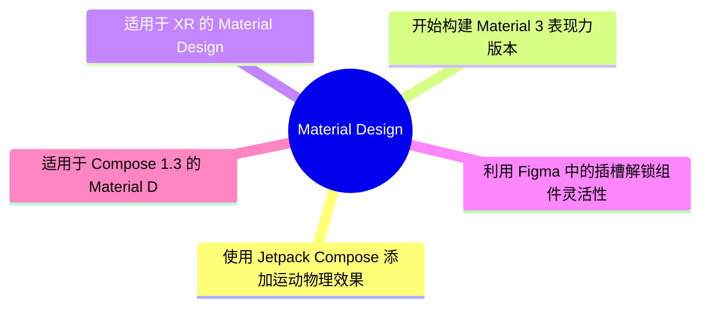
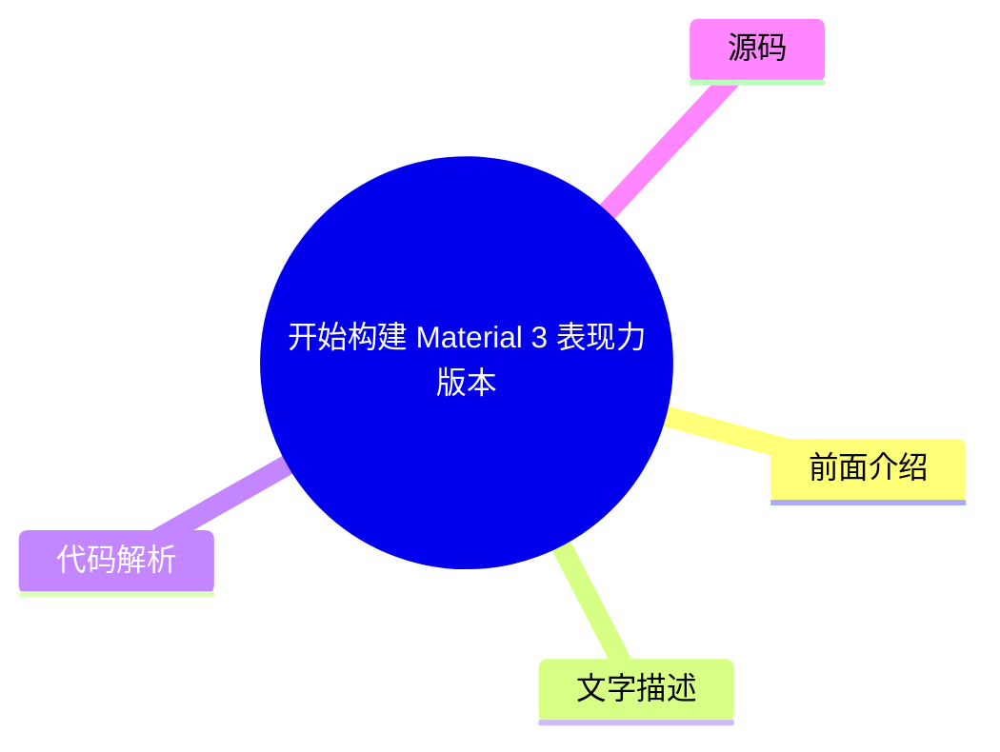
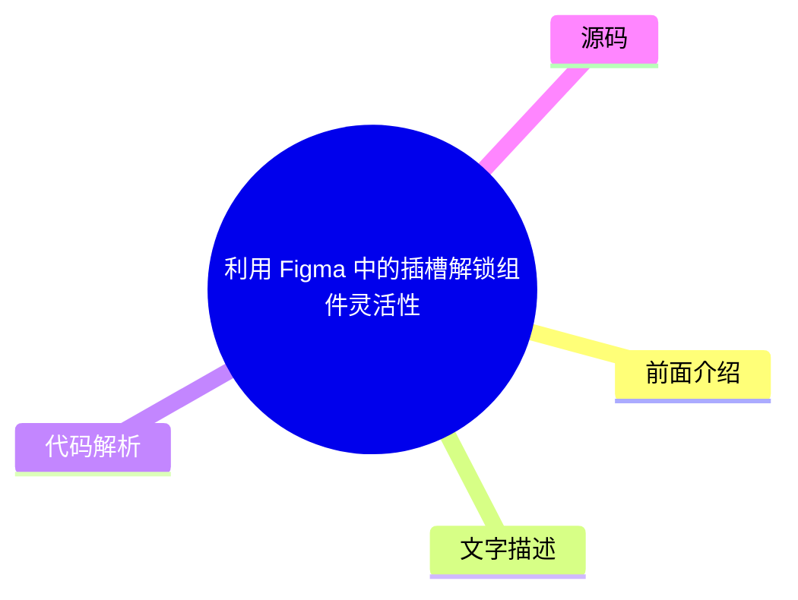

# 🎨 Material Design Top 5 (2026-08-06)

## 前面介绍

- 数据源：Material Design
- 抓取日期：2026-08-06
- 条目数：5
- 含完整正文：0
- 含代码片段：0
- 组织方式：前面介绍 / 树状图 / 文字描述 / 代码解析 / 源码

## 思维导图

## 详细整理（5 条，0 条含全文，0 条含代码）

### 1. 使用 Jetpack Compose 添加运动物理效果
- **链接**: [https://material.io/blog/m3-expressive-motion-theming](https://material.io/blog/m3-expressive-motion-theming)
- **发布**: 2025-05-20T08:00:00Z

#### 前面介绍

- 使用 Jetpack Compose 实现流畅的动画效果
- 探索物理运动规律以提升用户体验

#### 树状图

#### 文字描述

- 本文介绍了如何在 Jetpack Compose 中结合物理引擎来创建逼真的动画效果
- 通过代码示例展示了如何自定义动画行为
- 强调了物理运动在提升应用交互质感中的重要性

#### 代码解析

- 本文未提供源码，以下为实现思路或结构解析
- 通常需要使用 AnimationSpec 或自定义 Animatable 来控制位移、旋转和缩放
- 结合 Physics-based 动画库（如 spring 动画）来模拟重力、摩擦力等物理特性

#### 源码

未抓到可展示源码或原文节选。

### 2. 开始构建 Material 3 表现力版本
- **链接**: [https://material.io/blog/building-with-m3-expressive](https://material.io/blog/building-with-m3-expressive)
- **发布**: 2025-05-13T08:00:00Z

#### 前面介绍

- 探索 Material 3 的新设计语言
- 利用表现力组件打造独特的视觉风格

#### 树状图

#### 文字描述

- Material 3 Expressive 引入了更具表现力和情感化的设计元素
- 该版本旨在打破传统设计的限制，提供更灵活的视觉表达
- 开发者可以通过新的组件和样式来创建更加生动和个性化的用户界面

#### 代码解析

- 本文未提供源码，以下为实现思路或结构解析
- 主要涉及 Material3 主题配置中的自定义颜色和形状
- 使用新的表现力组件（如自定义的 FAB 或卡片）替换标准组件
- 调整排版和间距以适应新的设计规范

#### 源码

未抓到可展示源码或原文节选。

### 3. 适用于 XR 的 Material Design
- **链接**: [https://material.io/blog/material-design-xr-dev-preview](https://material.io/blog/material-design-xr-dev-preview)
- **发布**: 2024-12-12T13:00:00Z

#### 前面介绍

- 为扩展现实（XR）设备设计界面
- 探索沉浸式交互的新范式

#### 树状图

#### 文字描述

- Material Design for XR 是专门为 VR 和 AR 设备开发的一套设计指南
- 该指南关注如何在三维空间中呈现信息，以及如何处理用户在空间中的移动
- 旨在解决 XR 环境下特有的交互挑战，如视线追踪和手势识别

#### 代码解析

- 本文未提供源码，以下为实现思路或结构解析
- 设计系统需支持 3D 空间布局而非传统的 2D 屏幕布局
- 交互逻辑需适配手势控制和注视交互
- 视觉层级需考虑透视效果和空间深度

#### 源码

未抓到可展示源码或原文节选。

### 4. 利用 Figma 中的插槽解锁组件灵活性
- **链接**: [https://material.io/blog/material-3-slot-components-figma](https://material.io/blog/material-3-slot-components-figma)
- **发布**: 2024-11-04T13:00:00Z

#### 前面介绍

- 使用插槽机制增强设计组件的可复用性
- 优化 Figma 组件库的层级结构

#### 树状图

#### 文字描述

- 插槽允许设计师在组件内部定义可变区域，从而在不破坏组件结构的情况下进行自定义
- 这种方法使得组件在不同场景下可以保持一致的视觉风格，同时又能适应具体需求
- 通过插槽管理，可以大幅减少重复设计工作，提高设计系统的维护效率

#### 代码解析

- 本文未提供源码，以下为实现思路或结构解析
- 在 Figma 中创建组件时，使用“组件变体”或“实例”来定义插槽区域
- 通过嵌套组件和实例来复用插槽内容
- 利用 Figma 的“自动布局”功能来管理插槽内的内容排列

#### 源码

未抓到可展示源码或原文节选。

### 5. 适用于 Compose 1.3 的 Material Design 3
- **链接**: [https://material.io/blog/material-3-compose-1-3](https://material.io/blog/material-3-compose-1-3)
- **发布**: 2024-09-10T13:00:00Z

#### 前面介绍

- Material Design 3 与 Jetpack Compose 的最新集成
- 获取最新的设计系统和组件支持

#### 树状图

#### 文字描述

- 本文详细介绍了 Material Design 3 在 Jetpack Compose 1.3 版本中的更新内容
- 涵盖了新的颜色系统、形状和排版规范
- 展示了如何将最新的 Material 3 设计语言应用到 Android 应用开发中

#### 代码解析

- 本文未提供源码，以下为实现思路或结构解析
- 配置 MaterialTheme 以使用新的 Token（令牌）系统
- 使用 Material3 的基础组件（如 Surface, Card, Button）
- 自定义颜色和形状以符合品牌设计规范

#### 源码

未抓到可展示源码或原文节选。

