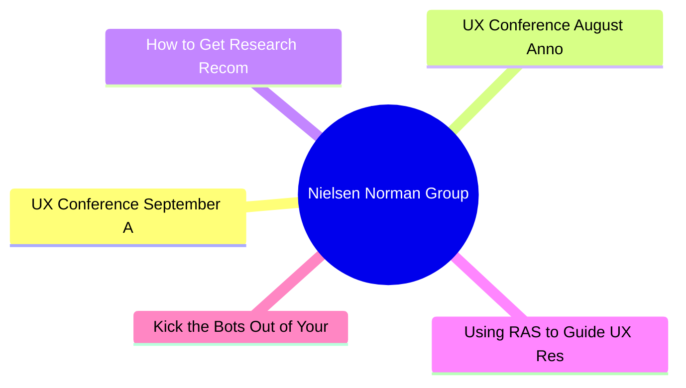

# 🔬 Nielsen Norman Group Top 5 (2026-07-01)

## 思维导图

## 列表（5 条，0 条含全文）

### 1. UX Conference September Announced (Sep 14 - Sep 25)
- **链接**: [https://www.nngroup.com/training/september/?utm_source=rss&utm_medium=feed&utm_campaign=rss-syndication](https://www.nngroup.com/training/september/?utm_source=rss&utm_medium=feed&utm_campaign=rss-syndication)
- **发布**: Wed, 03 Jun 2026 01:25:55 +0000
- **简介**: Take up to 5 in-depth training courses, teaching user experience best practices for successful design. Training focused on long-lasting skills for UX professionals. September 14 - September 25, 2026.

### 2. UX Conference August Announced (Aug 17 - Aug 28)
- **链接**: [https://www.nngroup.com/training/august/?utm_source=rss&utm_medium=feed&utm_campaign=rss-syndication](https://www.nngroup.com/training/august/?utm_source=rss&utm_medium=feed&utm_campaign=rss-syndication)
- **发布**: Tue, 19 May 2026 06:52:05 +0000
- **简介**: Take up to 5 in-depth training courses, teaching user experience best practices for successful design. Training focused on long-lasting skills for UX professionals. August 17 - August 28, 2026.

### 3. How to Get Research Recommendations on the Roadmap
- **链接**: [https://www.nngroup.com/articles/research-recommendations-roadmap/?utm_source=rss&utm_medium=feed&utm_campaign=rss-syndication](https://www.nngroup.com/articles/research-recommendations-roadmap/?utm_source=rss&utm_medium=feed&utm_campaign=rss-syndication)
- **作者**: Laura Klein
- **发布**: Fri, 29 May 2026 17:00:00 +0000
- **简介**: To influence the roadmap: join planning early, learn constraints, tie research to PM metrics, and give clear recommendations at the right time.

### 4. Using RAS to Guide UX Research Resource Allocation and Strategy
- **链接**: [https://www.nngroup.com/articles/ras-research-resource-allocation/?utm_source=rss&utm_medium=feed&utm_campaign=rss-syndication](https://www.nngroup.com/articles/ras-research-resource-allocation/?utm_source=rss&utm_medium=feed&utm_campaign=rss-syndication)
- **作者**: Brian Utesch, Tammi Fitzwater
- **发布**: Fri, 29 May 2026 17:00:00 +0000
- **简介**: RAS helps managers allocate resources based on actual impact, shifting focus from outputs to outcomes and enabling data-driven UX strategies.

### 5. Kick the Bots Out of Your Survey Data
- **链接**: [https://www.nngroup.com/articles/survey-bots/?utm_source=rss&utm_medium=feed&utm_campaign=rss-syndication](https://www.nngroup.com/articles/survey-bots/?utm_source=rss&utm_medium=feed&utm_campaign=rss-syndication)
- **作者**: Rachel Banawa
- **发布**: Fri, 26 Jun 2026 17:00:00 +0000
- **简介**: Learn to spot and filter out survey bots’ responses before analysis so fake data doesn’t distort your findings.
