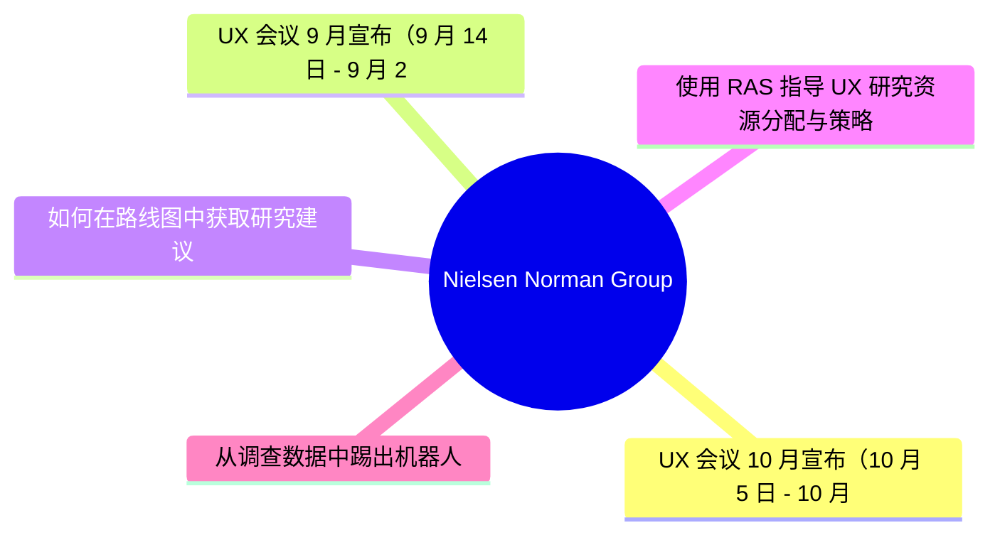
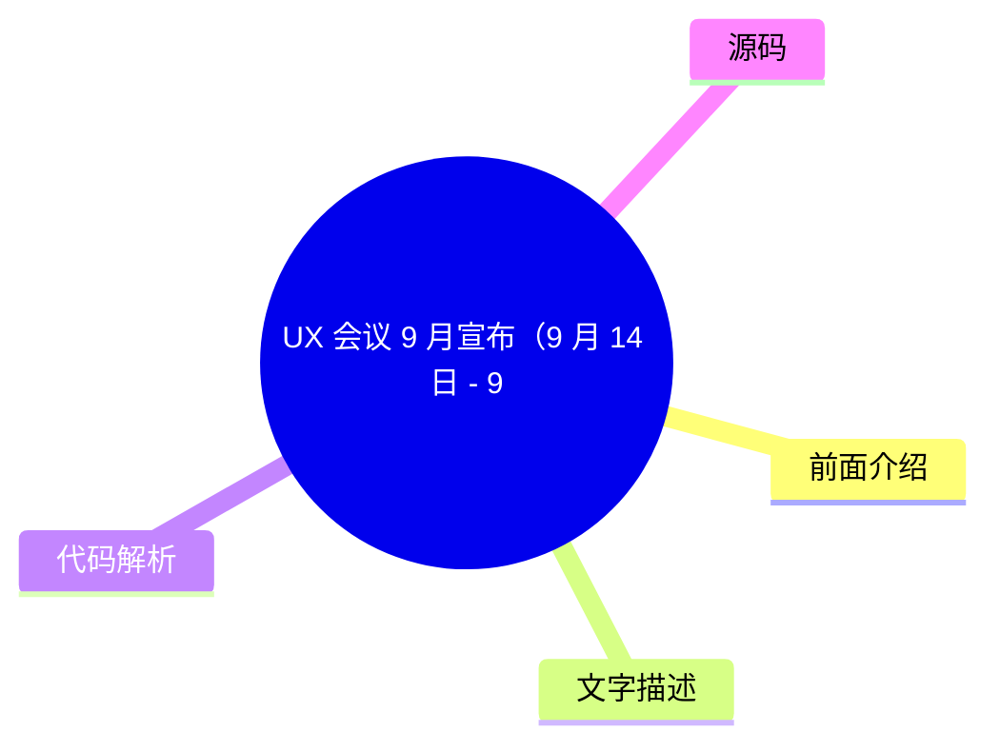
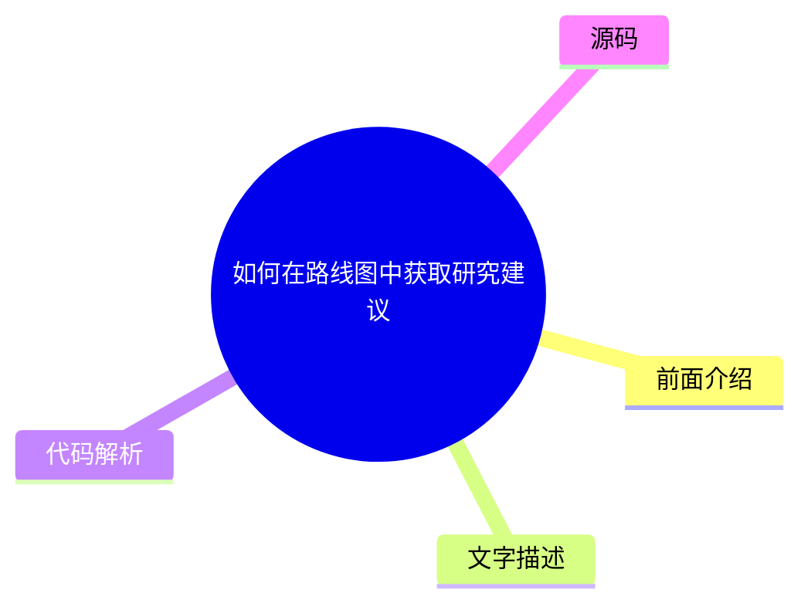
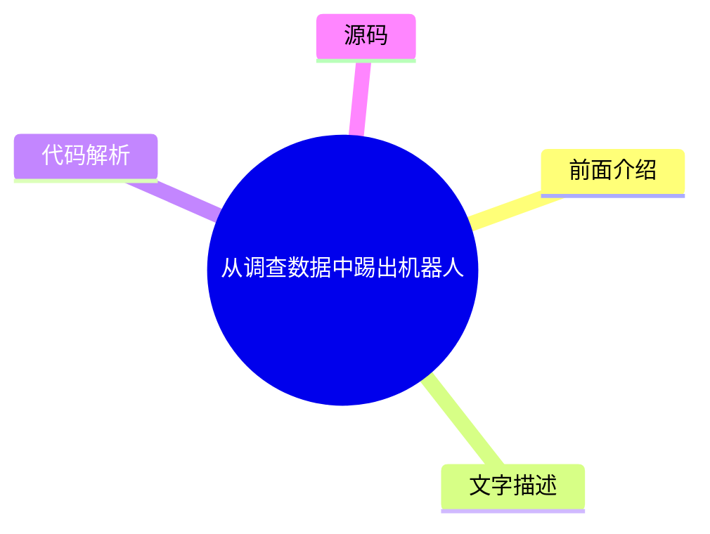

# 🔬 Nielsen Norman Group Top 5 (2026-07-18)

## 前面介绍

- 数据源：Nielsen Norman Group
- 抓取日期：2026-07-18
- 条目数：5
- 含完整正文：0
- 含代码片段：0
- 组织方式：前面介绍 / 树状图 / 文字描述 / 代码解析 / 源码

## 思维导图

## 详细整理（5 条，0 条含全文，0 条含代码）

### 1. UX 会议 10 月宣布（10 月 5 日 - 10 月 16 日）
- **链接**: [https://www.nngroup.com/training/october/?utm_source=rss&utm_medium=feed&utm_campaign=rss-syndication](https://www.nngroup.com/training/october/?utm_source=rss&utm_medium=feed&utm_campaign=rss-syndication)
- **发布**: Wed, 15 Jul 2026 06:59:07 +0000

#### 前面介绍

- 提供多达 5 门深度培训课程
- 教授成功的用户体验最佳实践
- 专注于为 UX 专业人士培养长期技能

#### 树状图

#### 文字描述

- 本次会议定于 2026 年 10 月 5 日至 10 月 16 日举行。
- 课程旨在通过深入培训，帮助设计人员掌握成功的用户体验最佳实践。
- 培训内容特别侧重于为用户体验专业人士培养能够长期受益的核心技能。

#### 代码解析

- 本文未提供源码，以下为实现思路或结构解析

#### 源码

未抓到可展示源码或原文节选。

### 2. UX 会议 9 月宣布（9 月 14 日 - 9 月 25 日）
- **链接**: [https://www.nngroup.com/training/september/?utm_source=rss&utm_medium=feed&utm_campaign=rss-syndication](https://www.nngroup.com/training/september/?utm_source=rss&utm_medium=feed&utm_campaign=rss-syndication)
- **发布**: Wed, 03 Jun 2026 01:25:55 +0000

#### 前面介绍

- 提供多达 5 门深度培训课程
- 教授成功的用户体验最佳实践
- 专注于为 UX 专业人士培养长期技能

#### 树状图

#### 文字描述

- 本次会议定于 2026 年 9 月 14 日至 9 月 25 日举行。
- 课程旨在通过深入培训，帮助设计人员掌握成功的用户体验最佳实践。
- 培训内容特别侧重于为用户体验专业人士培养能够长期受益的核心技能。

#### 代码解析

- 本文未提供源码，以下为实现思路或结构解析

#### 源码

未抓到可展示源码或原文节选。

### 3. 如何在路线图中获取研究建议
- **链接**: [https://www.nngroup.com/articles/research-recommendations-roadmap/?utm_source=rss&utm_medium=feed&utm_campaign=rss-syndication](https://www.nngroup.com/articles/research-recommendations-roadmap/?utm_source=rss&utm_medium=feed&utm_campaign=rss-syndication)
- **作者**: Laura Klein
- **发布**: Fri, 29 May 2026 17:00:00 +0000

#### 前面介绍

- 尽早参与规划以产生影响
- 学习并理解约束条件
- 将研究与产品经理指标挂钩
- 在正确的时间给出明确的建议

#### 树状图

#### 文字描述

- 为了在路线图制定过程中产生影响，研究人员需要尽早加入规划流程。
- 了解项目约束条件对于制定可行的策略至关重要。
- 将用户体验研究直接与产品经理关注的业务指标（PM metrics）联系起来，能增加研究的价值。
- 研究人员需要在恰当的时机提供清晰、可执行的建议，以推动决策。

#### 代码解析

- 本文未提供源码，以下为实现思路或结构解析

#### 源码

未抓到可展示源码或原文节选。

### 4. 使用 RAS 指导 UX 研究资源分配与策略
- **链接**: [https://www.nngroup.com/articles/ras-research-resource-allocation/?utm_source=rss&utm_medium=feed&utm_campaign=rss-syndication](https://www.nngroup.com/articles/ras-research-resource-allocation/?utm_source=rss&utm_medium=feed&utm_campaign=rss-syndication)
- **作者**: Brian Utesch, Tammi Fitzwater
- **发布**: Fri, 29 May 2026 17:00:00 +0000

#### 前面介绍

- 基于实际影响进行资源分配
- 从关注产出转向关注结果
- 支持数据驱动的 UX 策略

#### 树状图

#### 文字描述

- RAS（资源分配系统）帮助管理者根据实际影响来分配资源。
- 这种方法促使关注点从单纯的产出（如完成多少研究）转向业务结果（如用户行为改变）。
- 它使团队能够制定基于数据的用户体验策略，从而更有效地利用有限的资源。

#### 代码解析

- 本文未提供源码，以下为实现思路或结构解析

#### 源码

未抓到可展示源码或原文节选。

### 5. 从调查数据中踢出机器人
- **链接**: [https://www.nngroup.com/articles/survey-bots/?utm_source=rss&utm_medium=feed&utm_campaign=rss-syndication](https://www.nngroup.com/articles/survey-bots/?utm_source=rss&utm_medium=feed&utm_campaign=rss-syndication)
- **作者**: Rachel Banawa
- **发布**: Fri, 26 Jun 2026 17:00:00 +0000

#### 前面介绍

- 识别并过滤调查机器人响应
- 防止虚假数据扭曲研究发现
- 在分析前进行数据清洗

#### 树状图

#### 文字描述

- 本文介绍了如何在数据分析之前识别并过滤掉调查机器人的响应。
- 调查机器人会生成虚假数据，如果不加以处理，会严重扭曲研究结论。
- 掌握这一技能可以确保调查结果的准确性和可靠性，从而做出更明智的决策。

#### 代码解析

- 本文未提供源码，以下为实现思路或结构解析

#### 源码

未抓到可展示源码或原文节选。

