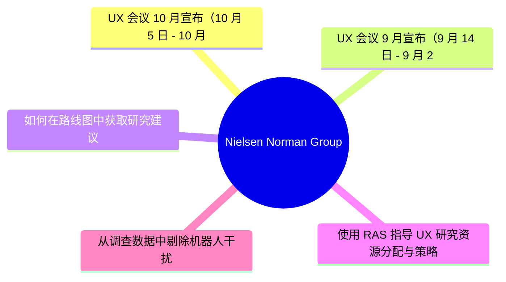
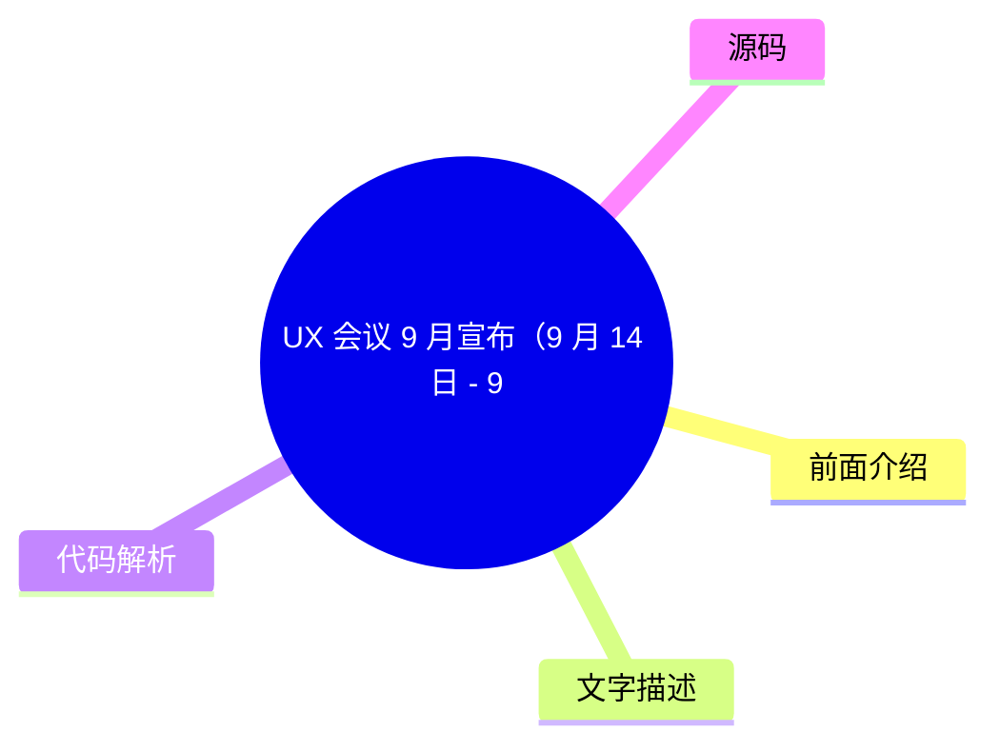
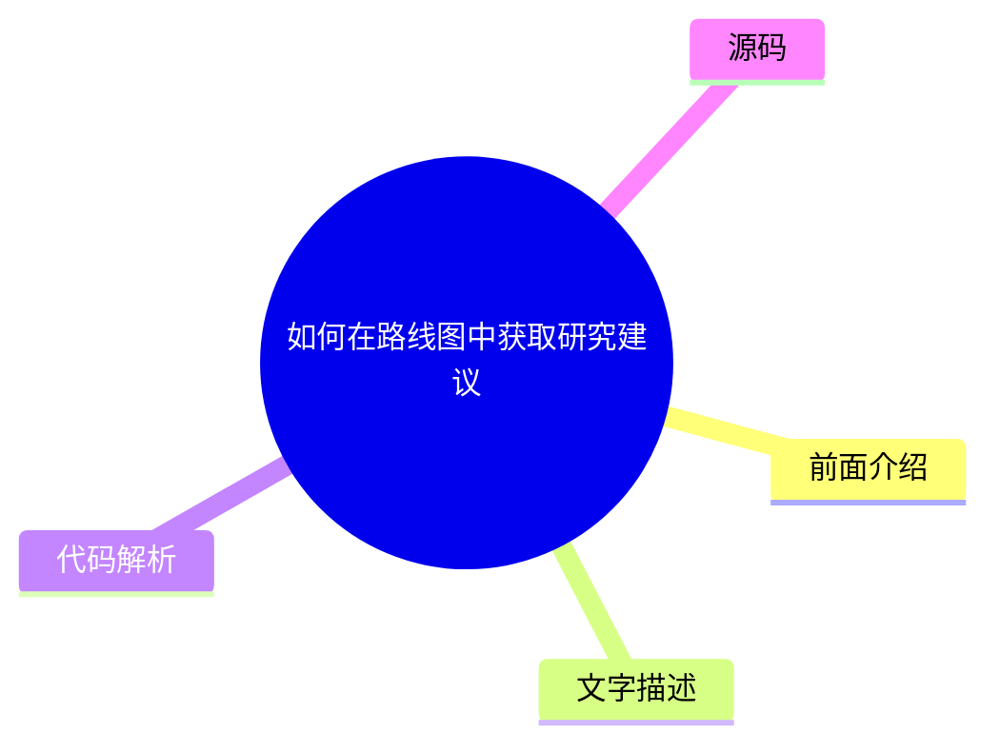

# 🔬 Nielsen Norman Group Top 5 (2026-07-28)

## 前面介绍

- 数据源：Nielsen Norman Group
- 抓取日期：2026-07-28
- 条目数：5
- 含完整正文：0
- 含代码片段：0
- 组织方式：前面介绍 / 树状图 / 文字描述 / 代码解析 / 源码

## 思维导图

## 详细整理（5 条，0 条含全文，0 条含代码）

### 1. UX 会议 10 月宣布（10 月 5 日 - 10 月 16 日）
- **链接**: [https://www.nngroup.com/training/october/?utm_source=rss&utm_medium=feed&utm_campaign=rss-syndication](https://www.nngroup.com/training/october/?utm_source=rss&utm_medium=feed&utm_campaign=rss-syndication)
- **发布**: Wed, 15 Jul 2026 06:59:07 +0000

#### 前面介绍

- 提供最多 5 门深度培训课程。
- 专注于教授用户体验最佳实践。
- 旨在培养 UX 专业人员的长期技能。

#### 树状图

#### 文字描述

- 本次会议定于 2026 年 10 月 5 日至 10 月 16 日举行。
- 会议内容涵盖用户体验设计的核心最佳实践。
- 培训重点在于传授能够长期受益的专业技能。
- 适合希望提升专业能力的 UX 从业者参加。

#### 代码解析

- 本文未提供源码，以下为实现思路或结构解析

#### 源码

未抓到可展示源码或原文节选。

### 2. UX 会议 9 月宣布（9 月 14 日 - 9 月 25 日）
- **链接**: [https://www.nngroup.com/training/september/?utm_source=rss&utm_medium=feed&utm_campaign=rss-syndication](https://www.nngroup.com/training/september/?utm_source=rss&utm_medium=feed&utm_campaign=rss-syndication)
- **发布**: Wed, 03 Jun 2026 01:25:55 +0000

#### 前面介绍

- 提供最多 5 门深度培训课程。
- 专注于教授用户体验最佳实践。
- 旨在培养 UX 专业人员的长期技能。

#### 树状图

#### 文字描述

- 本次会议定于 2026 年 9 月 14 日至 9 月 25 日举行。
- 会议内容涵盖用户体验设计的核心最佳实践。
- 培训重点在于传授能够长期受益的专业技能。
- 适合希望提升专业能力的 UX 从业者参加。

#### 代码解析

- 本文未提供源码，以下为实现思路或结构解析

#### 源码

未抓到可展示源码或原文节选。

### 3. 如何在路线图中获取研究建议
- **链接**: [https://www.nngroup.com/articles/research-recommendations-roadmap/?utm_source=rss&utm_medium=feed&utm_campaign=rss-syndication](https://www.nngroup.com/articles/research-recommendations-roadmap/?utm_source=rss&utm_medium=feed&utm_campaign=rss-syndication)
- **作者**: Laura Klein
- **发布**: Fri, 29 May 2026 17:00:00 +0000

#### 前面介绍

- 尽早加入规划流程以产生影响。
- 了解项目约束条件。
- 将研究与产品经理的关键指标挂钩。
- 在恰当的时机提供明确的建议。

#### 树状图

#### 文字描述

- 为了有效地影响产品路线图，研究人员需要采取积极的参与策略。
- 尽早介入规划阶段有助于研究人员理解项目的背景和限制条件。
- 将研究发现与产品经理关注的业务指标（如转化率、留存率）联系起来，能提升研究建议的价值。
- 研究人员应确保在决策的关键时刻提供清晰、可执行的建议，而非仅仅展示原始数据。

#### 代码解析

- 本文未提供源码，以下为实现思路或结构解析

#### 源码

未抓到可展示源码或原文节选。

### 4. 使用 RAS 指导 UX 研究资源分配与策略
- **链接**: [https://www.nngroup.com/articles/ras-research-resource-allocation/?utm_source=rss&utm_medium=feed&utm_campaign=rss-syndication](https://www.nngroup.com/articles/ras-research-resource-allocation/?utm_source=rss&utm_medium=feed&utm_campaign=rss-syndication)
- **作者**: Brian Utesch, Tammi Fitzwater
- **发布**: Fri, 29 May 2026 17:00:00 +0000

#### 前面介绍

- 基于实际影响力而非产出分配资源。
- 帮助管理者从关注输出转向关注结果。
- 支持数据驱动的用户体验策略制定。

#### 树状图

#### 文字描述

- RAS（Research Allocation Score）是一种用于指导资源分配的框架。
- 它帮助管理者根据研究活动的实际业务影响力来分配预算和人力。
- 这种方法促使团队从关注“做了多少研究”（产出）转向关注“研究带来了什么改变”（结果）。
- 通过数据驱动的策略，UX 团队可以更有效地证明其价值并优化长期规划。

#### 代码解析

- 本文未提供源码，以下为实现思路或结构解析

#### 源码

未抓到可展示源码或原文节选。

### 5. 从调查数据中剔除机器人干扰
- **链接**: [https://www.nngroup.com/articles/survey-bots/?utm_source=rss&utm_medium=feed&utm_campaign=rss-syndication](https://www.nngroup.com/articles/survey-bots/?utm_source=rss&utm_medium=feed&utm_campaign=rss-syndication)
- **作者**: Rachel Banawa
- **发布**: Fri, 26 Jun 2026 17:00:00 +0000

#### 前面介绍

- 学习识别调查机器人产生的虚假数据。
- 在分析前过滤掉机器人的响应。
- 防止虚假数据扭曲研究结论。

#### 树状图

#### 文字描述

- 调查机器人会自动生成虚假响应，严重干扰数据分析的准确性。
- 研究人员需要掌握识别这些异常响应的方法。
- 在正式分析之前，应建立过滤机制，剔除明显的机器人数据。
- 这一步骤对于确保研究结论的真实性和可靠性至关重要。

#### 代码解析

- 本文未提供源码，以下为实现思路或结构解析

#### 源码

未抓到可展示源码或原文节选。

