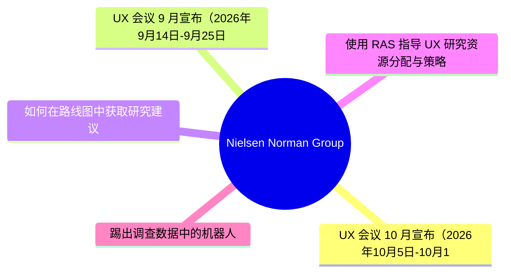
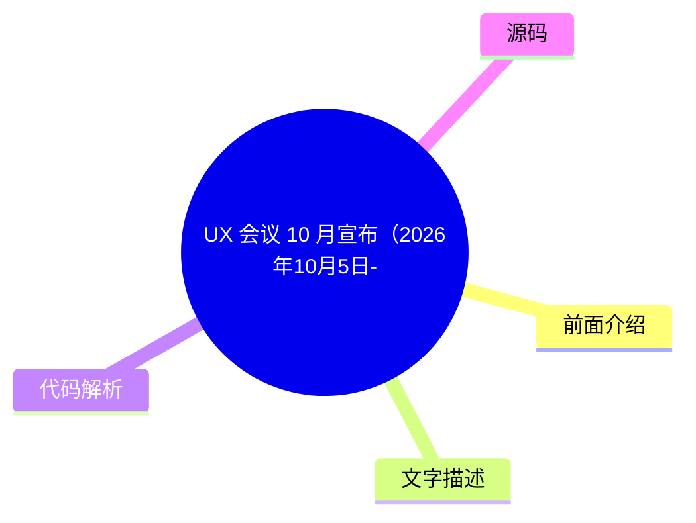
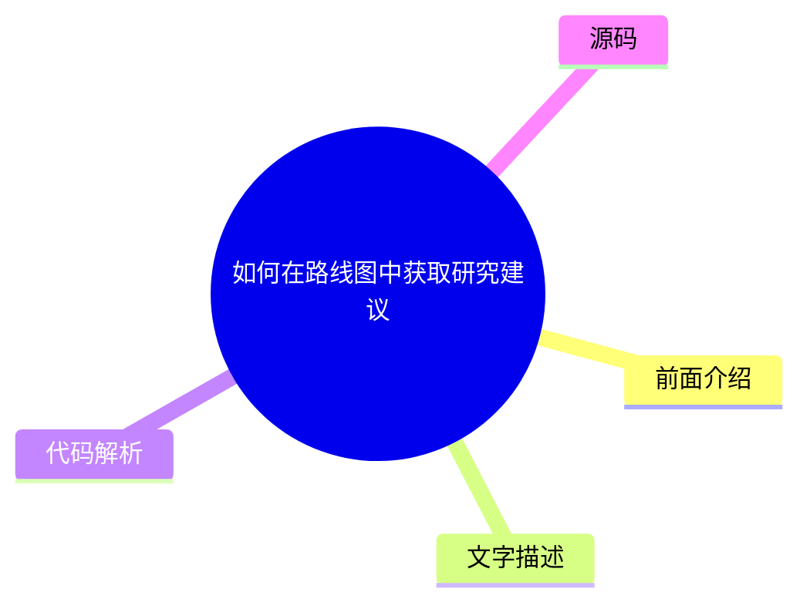
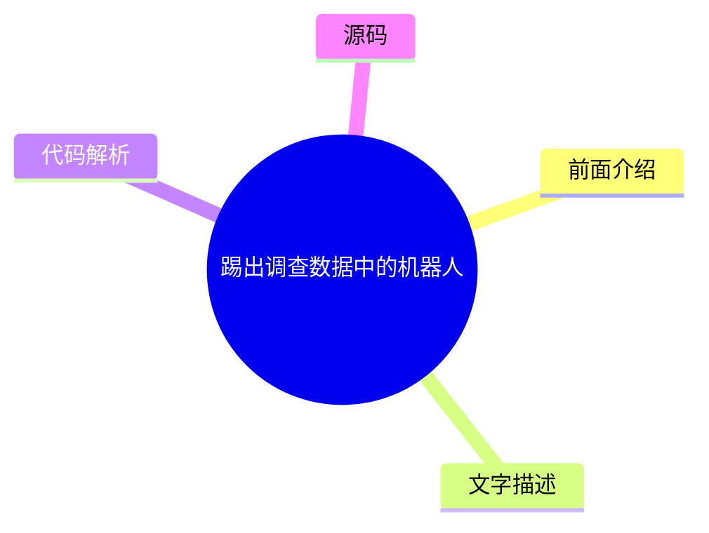

# 🔬 Nielsen Norman Group Top 5 (2026-07-29)

## 前面介绍

- 数据源：Nielsen Norman Group
- 抓取日期：2026-07-29
- 条目数：5
- 含完整正文：0
- 含代码片段：0
- 组织方式：前面介绍 / 树状图 / 文字描述 / 代码解析 / 源码

## 思维导图

## 详细整理（5 条，0 条含全文，0 条含代码）

### 1. UX 会议 10 月宣布（2026年10月5日-10月16日）
- **链接**: [https://www.nngroup.com/training/october/?utm_source=rss&utm_medium=feed&utm_campaign=rss-syndication](https://www.nngroup.com/training/october/?utm_source=rss&utm_medium=feed&utm_campaign=rss-syndication)
- **发布**: Wed, 15 Jul 2026 06:59:07 +0000

#### 前面介绍

- 提供多达5门深度培训课程
- 专注于教授用户体验最佳实践
- 旨在培养UX专业人士的长期技能

#### 树状图

#### 文字描述

- UX Conference 2026年10月版已宣布举办，时间为10月5日至10月16日。
- 该会议提供深度培训课程，学员最多可参加5门课程。
- 课程内容聚焦于用户体验设计的最佳实践，旨在帮助设计师取得成功。
- 培训重点在于传授对UX专业人士具有长期价值的技能。

#### 代码解析

- 本文未提供源码，以下为实现思路或结构解析

#### 源码

未抓到可展示源码或原文节选。

### 2. UX 会议 9 月宣布（2026年9月14日-9月25日）
- **链接**: [https://www.nngroup.com/training/september/?utm_source=rss&utm_medium=feed&utm_campaign=rss-syndication](https://www.nngroup.com/training/september/?utm_source=rss&utm_medium=feed&utm_campaign=rss-syndication)
- **发布**: Wed, 03 Jun 2026 01:25:55 +0000

#### 前面介绍

- 提供多达5门深度培训课程
- 专注于教授用户体验最佳实践
- 旨在培养UX专业人士的长期技能

#### 树状图

#### 文字描述

- UX Conference 2026年9月版已宣布举办，时间为9月14日至9月25日。
- 该会议提供深度培训课程，学员最多可参加5门课程。
- 课程内容聚焦于用户体验设计的最佳实践，旨在帮助设计师取得成功。
- 培训重点在于传授对UX专业人士具有长期价值的技能。

#### 代码解析

- 本文未提供源码，以下为实现思路或结构解析

#### 源码

未抓到可展示源码或原文节选。

### 3. 如何在路线图中获取研究建议
- **链接**: [https://www.nngroup.com/articles/research-recommendations-roadmap/?utm_source=rss&utm_medium=feed&utm_campaign=rss-syndication](https://www.nngroup.com/articles/research-recommendations-roadmap/?utm_source=rss&utm_medium=feed&utm_campaign=rss-syndication)
- **作者**: Laura Klein
- **发布**: Fri, 29 May 2026 17:00:00 +0000

#### 前面介绍

- 尽早参与规划以产生影响
- 学习并理解约束条件
- 将研究与产品经理的指标挂钩
- 在正确的时间提供明确的建议

#### 树状图

#### 文字描述

- 要在产品路线图中获得研究建议的影响力，需要采取特定策略。
- 首先，应尽早加入规划过程，以便在早期阶段产生影响。
- 其次，需要深入了解并学习项目约束条件，确保研究方案可行。
- 第三，将用户体验研究直接与产品经理关注的业务指标（PM metrics）联系起来。
- 最后，必须在正确的时间点提出清晰、可执行的研究建议，以说服决策者。

#### 代码解析

- 本文未提供源码，以下为实现思路或结构解析

#### 源码

未抓到可展示源码或原文节选。

### 4. 使用 RAS 指导 UX 研究资源分配与策略
- **链接**: [https://www.nngroup.com/articles/ras-research-resource-allocation/?utm_source=rss&utm_medium=feed&utm_campaign=rss-syndication](https://www.nngroup.com/articles/ras-research-resource-allocation/?utm_source=rss&utm_medium=feed&utm_campaign=rss-syndication)
- **作者**: Brian Utesch, Tammi Fitzwater
- **发布**: Fri, 29 May 2026 17:00:00 +0000

#### 前面介绍

- 基于实际影响分配资源
- 从关注产出转向关注结果
- 实现数据驱动的UX策略

#### 树状图

#### 文字描述

- RAS（可能是某种评估模型或框架）帮助管理者根据实际影响来分配研究资源。
- 这种方法促使管理者将关注点从单纯的“产出”（如完成了多少研究）转移到“结果”（如对业务产生的实际价值）上。
- 通过关注实际影响，企业能够制定出更加科学、数据驱动的用户体验研究策略。

#### 代码解析

- 本文未提供源码，以下为实现思路或结构解析

#### 源码

未抓到可展示源码或原文节选。

### 5. 踢出调查数据中的机器人
- **链接**: [https://www.nngroup.com/articles/survey-bots/?utm_source=rss&utm_medium=feed&utm_campaign=rss-syndication](https://www.nngroup.com/articles/survey-bots/?utm_source=rss&utm_medium=feed&utm_campaign=rss-syndication)
- **作者**: Rachel Banawa
- **发布**: Fri, 26 Jun 2026 17:00:00 +0000

#### 前面介绍

- 学会识别调查机器人
- 在分析前过滤掉机器人响应
- 防止虚假数据扭曲研究发现

#### 树状图

#### 文字描述

- 本文旨在教导如何识别并过滤掉调查机器人生成的响应。
- 在进行分析之前，需要采取步骤来检测和剔除这些虚假数据。
- 如果不处理这些机器人数据，它们可能会扭曲最终的研究发现，导致错误的结论。
- 确保调查数据的真实性对于获得准确的用户洞察至关重要。

#### 代码解析

- 本文未提供源码，以下为实现思路或结构解析

#### 源码

未抓到可展示源码或原文节选。

