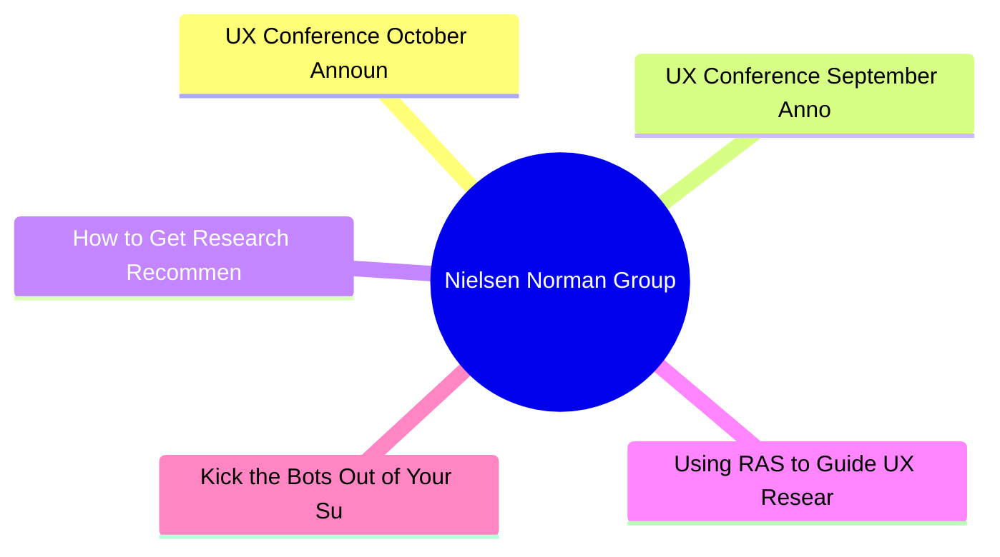
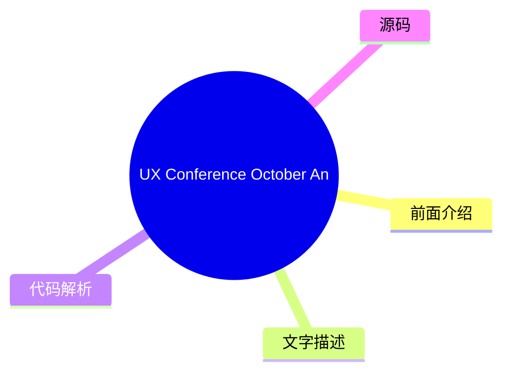
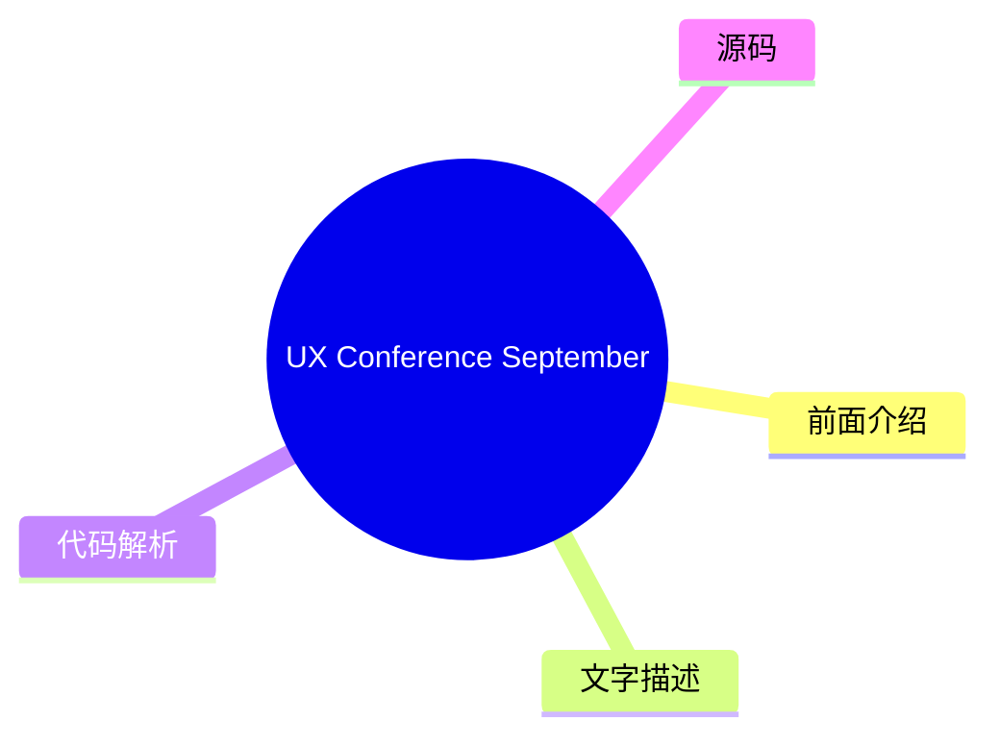
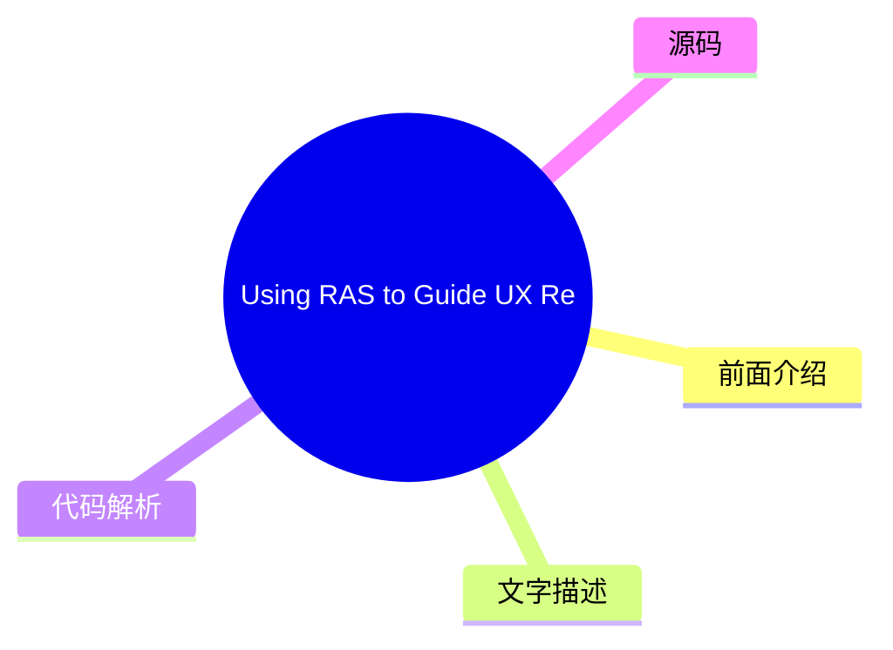
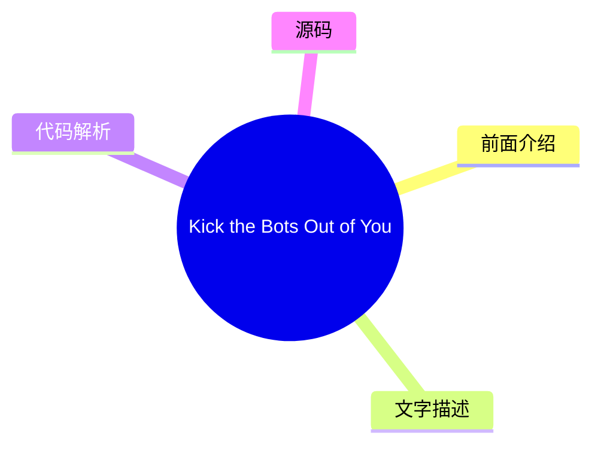

# 🔬 Nielsen Norman Group Top 5 (2026-07-30)

## 前面介绍

- 数据源：Nielsen Norman Group
- 抓取日期：2026-07-30
- 条目数：5
- 含完整正文：0
- 含代码片段：0
- 组织方式：前面介绍 / 树状图 / 文字描述 / 代码解析 / 源码

## 思维导图

## 详细整理（5 条，0 条含全文，0 条含代码）

### 1. UX Conference October Announced (Oct 5 - Oct 16)
- **链接**: [https://www.nngroup.com/training/october/?utm_source=rss&utm_medium=feed&utm_campaign=rss-syndication](https://www.nngroup.com/training/october/?utm_source=rss&utm_medium=feed&utm_campaign=rss-syndication)
- **发布**: Wed, 15 Jul 2026 06:59:07 +0000

#### 前面介绍

- Take up to 5 in-depth training courses, teaching user experience best practices for successful design. Training focused on long-lasting skills for UX professionals. October 5- October 16, 2026.
- 发布时间：Wed, 15 Jul 2026 06:59:07 +0000

#### 树状图

#### 文字描述

- Take up to 5 in-depth training courses, teaching user experience best practices for successful design. Training focused on long-lasting skills for UX professionals. October 5- October 16, 2026.

#### 代码解析

- 本文未检测到明确代码块，内容更偏新闻、观点或方法论。

#### 源码

未抓到可展示源码或原文节选。

### 2. UX Conference September Announced (Sep 14 - Sep 25)
- **链接**: [https://www.nngroup.com/training/september/?utm_source=rss&utm_medium=feed&utm_campaign=rss-syndication](https://www.nngroup.com/training/september/?utm_source=rss&utm_medium=feed&utm_campaign=rss-syndication)
- **发布**: Wed, 03 Jun 2026 01:25:55 +0000

#### 前面介绍

- Take up to 5 in-depth training courses, teaching user experience best practices for successful design. Training focused on long-lasting skills for UX professionals. September 14 - September 25, 2026.
- 发布时间：Wed, 03 Jun 2026 01:25:55 +0000

#### 树状图

#### 文字描述

- Take up to 5 in-depth training courses, teaching user experience best practices for successful design. Training focused on long-lasting skills for UX professionals. September 14 - September 25, 2026.

#### 代码解析

- 本文未检测到明确代码块，内容更偏新闻、观点或方法论。

#### 源码

未抓到可展示源码或原文节选。

### 3. How to Get Research Recommendations on the Roadmap
- **链接**: [https://www.nngroup.com/articles/research-recommendations-roadmap/?utm_source=rss&utm_medium=feed&utm_campaign=rss-syndication](https://www.nngroup.com/articles/research-recommendations-roadmap/?utm_source=rss&utm_medium=feed&utm_campaign=rss-syndication)
- **作者**: Laura Klein
- **发布**: Fri, 29 May 2026 17:00:00 +0000

#### 前面介绍

- To influence the roadmap: join planning early, learn constraints, tie research to PM metrics, and give clear recommendations at the right time.
- 作者：Laura Klein
- 发布时间：Fri, 29 May 2026 17:00:00 +0000

#### 树状图

#### 文字描述

- To influence the roadmap: join planning early, learn constraints, tie research to PM metrics, and give clear recommendations at the right time.

#### 代码解析

- 本文未检测到明确代码块，内容更偏新闻、观点或方法论。

#### 源码

未抓到可展示源码或原文节选。

### 4. Using RAS to Guide UX Research Resource Allocation and Strategy
- **链接**: [https://www.nngroup.com/articles/ras-research-resource-allocation/?utm_source=rss&utm_medium=feed&utm_campaign=rss-syndication](https://www.nngroup.com/articles/ras-research-resource-allocation/?utm_source=rss&utm_medium=feed&utm_campaign=rss-syndication)
- **作者**: Brian Utesch, Tammi Fitzwater
- **发布**: Fri, 29 May 2026 17:00:00 +0000

#### 前面介绍

- RAS helps managers allocate resources based on actual impact, shifting focus from outputs to outcomes and enabling data-driven UX strategies.
- 作者：Brian Utesch, Tammi Fitzwater
- 发布时间：Fri, 29 May 2026 17:00:00 +0000

#### 树状图

#### 文字描述

- RAS helps managers allocate resources based on actual impact, shifting focus from outputs to outcomes and enabling data-driven UX strategies.

#### 代码解析

- 本文未检测到明确代码块，内容更偏新闻、观点或方法论。

#### 源码

未抓到可展示源码或原文节选。

### 5. Kick the Bots Out of Your Survey Data
- **链接**: [https://www.nngroup.com/articles/survey-bots/?utm_source=rss&utm_medium=feed&utm_campaign=rss-syndication](https://www.nngroup.com/articles/survey-bots/?utm_source=rss&utm_medium=feed&utm_campaign=rss-syndication)
- **作者**: Rachel Banawa
- **发布**: Fri, 26 Jun 2026 17:00:00 +0000

#### 前面介绍

- Learn to spot and filter out survey bots’ responses before analysis so fake data doesn’t distort your findings.
- 作者：Rachel Banawa
- 发布时间：Fri, 26 Jun 2026 17:00:00 +0000

#### 树状图

#### 文字描述

- Learn to spot and filter out survey bots’ responses before analysis so fake data doesn’t distort your findings.

#### 代码解析

- 本文未检测到明确代码块，内容更偏新闻、观点或方法论。

#### 源码

未抓到可展示源码或原文节选。

