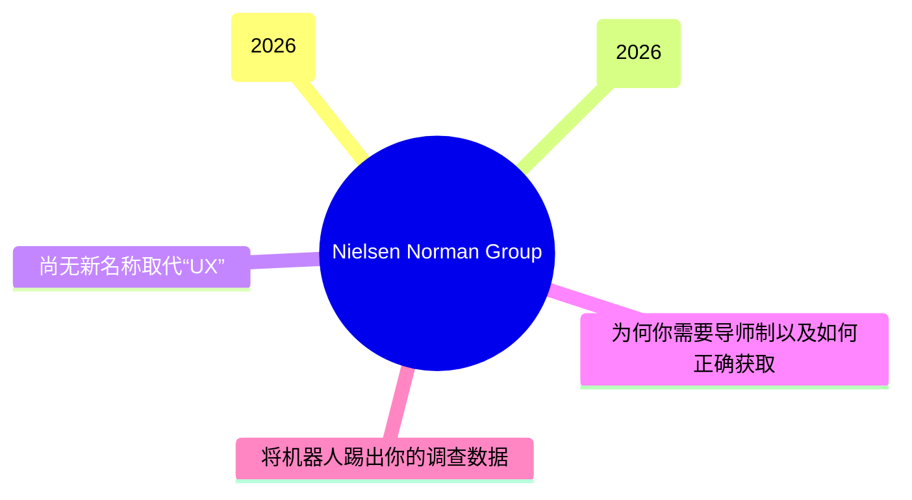
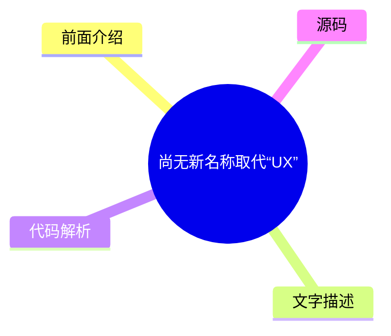
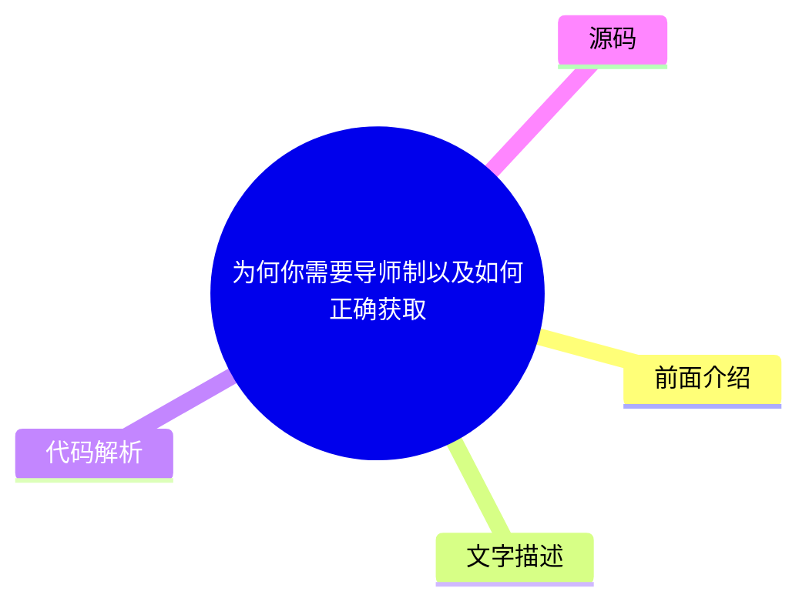
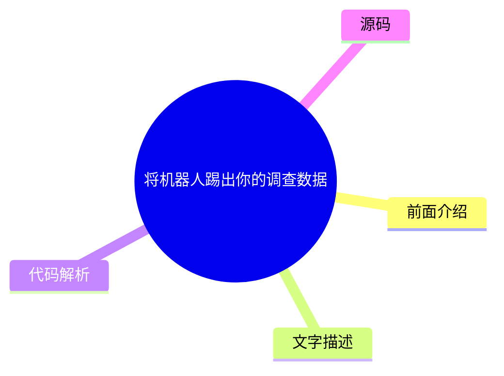

# 🔬 Nielsen Norman Group Top 5 (2026-08-01)

## 前面介绍

- 数据源：Nielsen Norman Group
- 抓取日期：2026-08-01
- 条目数：5
- 含完整正文：0
- 含代码片段：0
- 组织方式：前面介绍 / 树状图 / 文字描述 / 代码解析 / 源码

## 思维导图



## 详细整理（5 条，0 条含全文，0 条含代码）

### 1. UX 会议 10 月宣布 (2026)
- **链接**: [https://www.nngroup.com/training/october/?utm_source=rss&utm_medium=feed&utm_campaign=rss-syndication](https://www.nngroup.com/training/october/?utm_source=rss&utm_medium=feed&utm_campaign=rss-syndication)
- **发布**: Wed, 15 Jul 2026 06:59:07 +0000

#### 前面介绍

- 提供多达 5 门深度培训课程
- 专注于用户体验最佳实践
- 面向 UX 专业人士的长期技能培养

#### 树状图

```mermaid
mindmap
  root((UX 会议 10 月宣布 (2026)))
    前面介绍
    文字描述
    代码解析
    源码
```

#### 文字描述

- UX Conference 10 月版已宣布，时间为 2026 年 10 月 5 日至 10 月 16 日。
- 会议提供深度培训课程，旨在教授成功的用户体验设计最佳实践。
- 培训内容侧重于为 UX 专业人士培养长期受益的技能。
- 参会者可以选择参加最多 5 门不同的课程。

#### 代码解析

- 本文未提供源码，以下为实现思路或结构解析
- 活动日程安排通常包含具体的日期范围和课程数量限制。
- 培训课程的设计逻辑是针对特定技能的深度强化。

#### 源码

未抓到可展示源码或原文节选。


### 2. UX 会议 9 月宣布 (2026)
- **链接**: [https://www.nngroup.com/training/september/?utm_source=rss&utm_medium=feed&utm_campaign=rss-syndication](https://www.nngroup.com/training/september/?utm_source=rss&utm_medium=feed&utm_campaign=rss-syndication)
- **发布**: Wed, 03 Jun 2026 01:25:55 +0000

#### 前面介绍

- 提供多达 5 门深度培训课程
- 专注于用户体验最佳实践
- 面向 UX 专业人士的长期技能培养

#### 树状图

```mermaid
mindmap
  root((UX 会议 9 月宣布 (2026)))
    前面介绍
    文字描述
    代码解析
    源码
```

#### 文字描述

- UX Conference 9 月版已宣布，时间为 2026 年 9 月 14 日至 9 月 25 日。
- 会议提供深度培训课程，旨在教授成功的用户体验设计最佳实践。
- 培训内容侧重于为 UX 专业人士培养长期受益的技能。
- 参会者可以选择参加最多 5 门不同的课程。

#### 代码解析

- 本文未提供源码，以下为实现思路或结构解析
- 活动日程安排通常包含具体的日期范围和课程数量限制。
- 培训课程的设计逻辑是针对特定技能的深度强化。

#### 源码

未抓到可展示源码或原文节选。


### 3. 尚无新名称取代“UX”
- **链接**: [https://www.nngroup.com/articles/no-new-name-ux/?utm_source=rss&utm_medium=feed&utm_campaign=rss-syndication](https://www.nngroup.com/articles/no-new-name-ux/?utm_source=rss&utm_medium=feed&utm_campaign=rss-syndication)
- **作者**: Rachel Banawa
- **发布**: Fri, 31 Jul 2026 17:00:00 +0000

#### 前面介绍

- 针对 604 名科技与设计专业人士的调查显示“UX”仍是主流术语
- 替代性名称依然分散，未能形成统一标准
- “用户体验”在行业内仍被视为默认且最准确的称呼

#### 树状图



#### 文字描述

- 一项针对 604 名科技和设计专业人士的调查发现，“UX”仍然是该领域的默认名称。
- 尽管存在其他替代性名称，但它们依然处于碎片化状态，未能占据主导地位。
- 调查结果表明，尽管行业在演变，但“用户体验”这一术语的认可度和使用率依然稳固。
- 作者 Rachel Banawa 指出，目前的替代方案并未能有效地取代现有的行业标准。

#### 代码解析

- 本文未提供源码，以下为实现思路或结构解析
- 数据统计逻辑依赖于对特定人群的问卷调查和关键词频率分析。
- 术语的演变趋势反映了行业认知的稳定性。

#### 源码

未抓到可展示源码或原文节选。


### 4. 为何你需要导师制以及如何正确获取
- **链接**: [https://www.nngroup.com/articles/mentorship/?utm_source=rss&utm_medium=feed&utm_campaign=rss-syndication](https://www.nngroup.com/articles/mentorship/?utm_source=rss&utm_medium=feed&utm_campaign=rss-syndication)
- **作者**: Evan Sunwall
- **发布**: Fri, 31 Jul 2026 17:00:00 +0000

#### 前面介绍

- 导师制是个人和职业成长的重要工具
- 只有正确参与才能获得实质性益处
- 缺乏正确引导可能导致导师关系无效

#### 树状图



#### 文字描述

- 导师制是一种至关重要的成长工具，能为个人和职业生涯带来巨大的益处。
- 然而，这种益处只有在正确参与导师关系时才会显现。
- 文章探讨了导师制的重要性，并提供了关于如何正确获取导师的建议。
- Evan Sunwall 强调，建立有效的导师关系需要双方的主动性和明确的目标。

#### 代码解析

- 本文未提供源码，以下为实现思路或结构解析
- 职业发展建议通常包含目标设定、沟通频率和期望管理。
- 导师关系的维护机制涉及定期的反馈和复盘。

#### 源码

未抓到可展示源码或原文节选。


### 5. 将机器人踢出你的调查数据
- **链接**: [https://www.nngroup.com/articles/survey-bots/?utm_source=rss&utm_medium=feed&utm_campaign=rss-syndication](https://www.nngroup.com/articles/survey-bots/?utm_source=rss&utm_medium=feed&utm_campaign=rss-syndication)
- **作者**: Rachel Banawa
- **发布**: Fri, 26 Jun 2026 17:00:00 +0000

#### 前面介绍

- 学会识别并过滤调查机器人产生的虚假数据
- 在分析前清除虚假响应以避免结果扭曲
- 确保调查数据的真实性和有效性

#### 树状图



#### 文字描述

- 文章教导读者如何在数据分析之前识别并过滤掉调查机器人的响应。
- 如果不处理这些虚假数据，它们会扭曲调查结果，导致错误的结论。
- Rachel Banawa 提供了具体的方法来检测和剔除机器人行为。
- 这是保证用户体验研究数据质量的关键步骤。

#### 代码解析

- 本文未提供源码，以下为实现思路或结构解析
- 数据清洗逻辑通常包括检测异常响应模式、IP 地址过滤或验证码机制。
- 自动化脚本可以用于批量识别和标记可疑的问卷提交记录。

#### 源码

未抓到可展示源码或原文节选。

