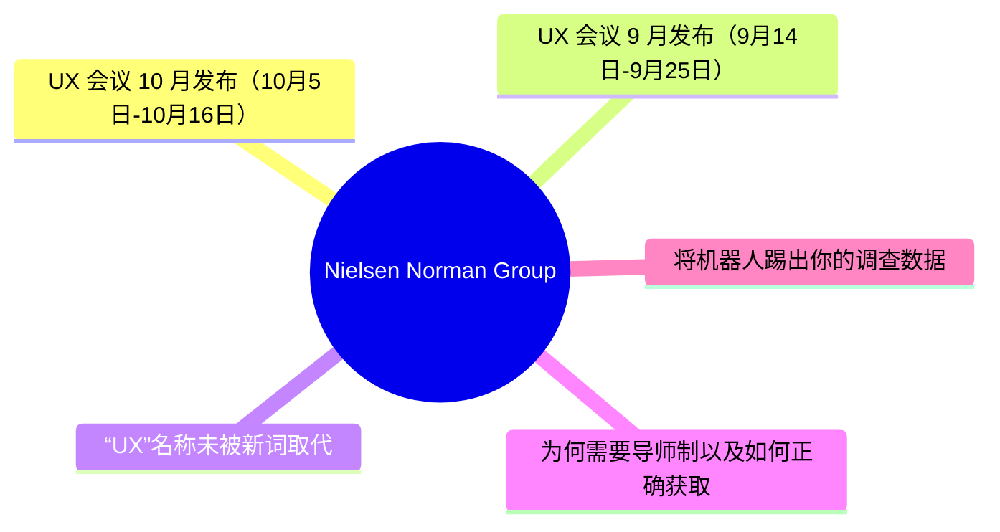
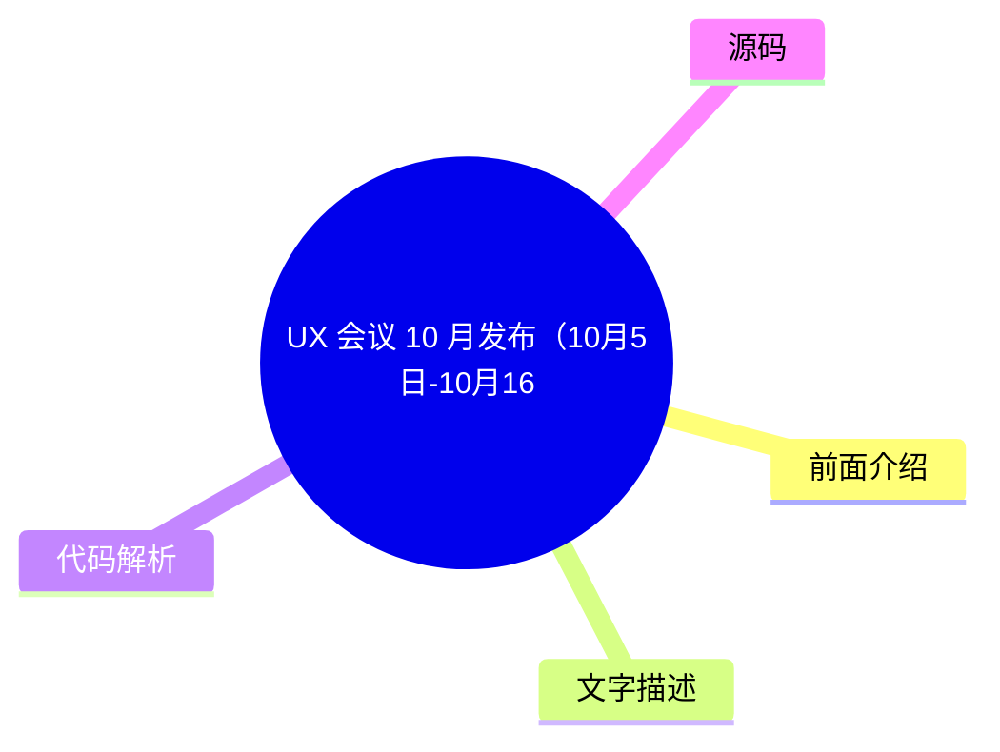
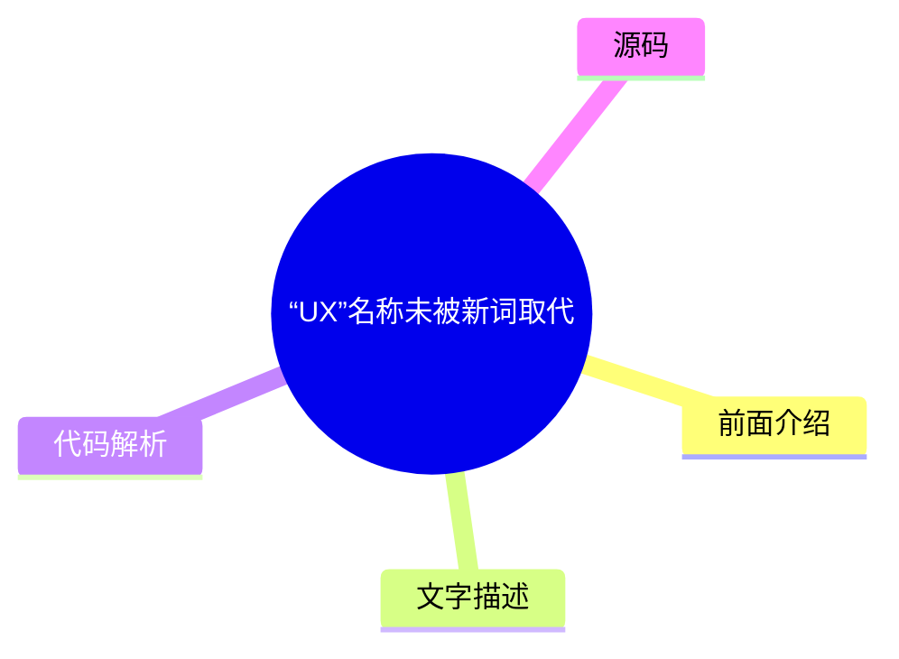
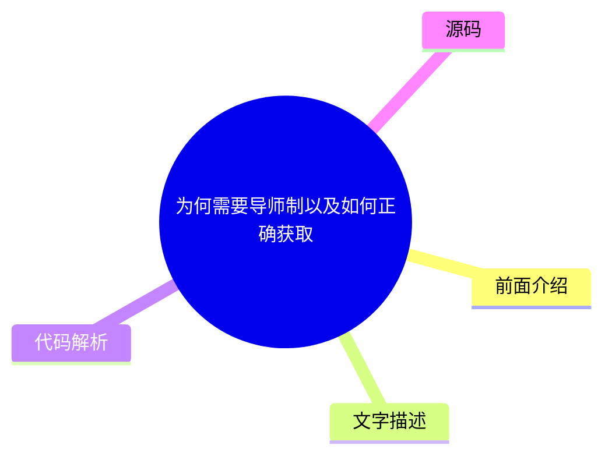
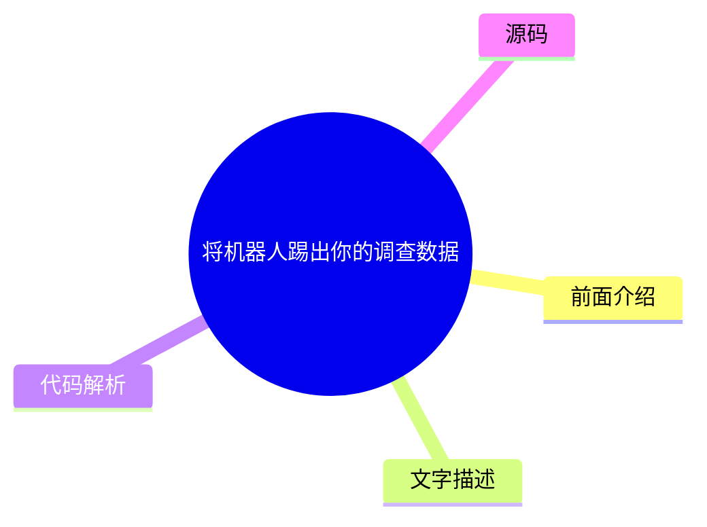

# 🔬 Nielsen Norman Group Top 5 (2026-08-02)

## 前面介绍

- 数据源：Nielsen Norman Group
- 抓取日期：2026-08-02
- 条目数：5
- 含完整正文：0
- 含代码片段：0
- 组织方式：前面介绍 / 树状图 / 文字描述 / 代码解析 / 源码

## 思维导图

## 详细整理（5 条，0 条含全文，0 条含代码）

### 1. UX 会议 10 月发布（10月5日-10月16日）
- **链接**: [https://www.nngroup.com/training/october/?utm_source=rss&utm_medium=feed&utm_campaign=rss-syndication](https://www.nngroup.com/training/october/?utm_source=rss&utm_medium=feed&utm_campaign=rss-syndication)
- **发布**: Wed, 15 Jul 2026 06:59:07 +0000

#### 前面介绍

- 提供多达5门深度培训课程
- 专注于教授用户体验最佳实践
- 旨在培养UX专业人士的长久技能

#### 树状图

#### 文字描述

- 本次会议将于2026年10月5日至10月16日举行
- 会议提供深入的用户体验培训课程
- 课程内容聚焦于成功的用户体验设计最佳实践
- 培训旨在帮助专业人士掌握可长期应用的核心技能

#### 代码解析

- 本文未提供源码，以下为实现思路或结构解析

#### 源码

未抓到可展示源码或原文节选。

### 2. UX 会议 9 月发布（9月14日-9月25日）
- **链接**: [https://www.nngroup.com/training/september/?utm_source=rss&utm_medium=feed&utm_campaign=rss-syndication](https://www.nngroup.com/training/september/?utm_source=rss&utm_medium=feed&utm_campaign=rss-syndication)
- **发布**: Wed, 03 Jun 2026 01:25:55 +0000

#### 前面介绍

- 提供多达5门深度培训课程
- 专注于教授用户体验最佳实践
- 旨在培养UX专业人士的长久技能

#### 树状图

#### 文字描述

- 本次会议将于2026年9月14日至9月25日举行
- 会议提供深入的用户体验培训课程
- 课程内容聚焦于成功的用户体验设计最佳实践
- 培训旨在帮助专业人士掌握可长期应用的核心技能

#### 代码解析

- 本文未提供源码，以下为实现思路或结构解析

#### 源码

未抓到可展示源码或原文节选。

### 3. “UX”名称未被新词取代
- **链接**: [https://www.nngroup.com/articles/no-new-name-ux/?utm_source=rss&utm_medium=feed&utm_campaign=rss-syndication](https://www.nngroup.com/articles/no-new-name-ux/?utm_source=rss&utm_medium=feed&utm_campaign=rss-syndication)
- **作者**: Rachel Banawa
- **发布**: Fri, 31 Jul 2026 17:00:00 +0000

#### 前面介绍

- 调查显示“UX”仍是该领域的默认名称
- 替代名称依然处于碎片化状态
- 604名科技与设计专业人士参与了调查

#### 树状图

#### 文字描述

- 一项针对604名科技和设计专业人士的调查显示
- “用户体验”（UX）仍然是该领域的默认名称
- 相比之下，替代名称的使用仍然较为分散和碎片化
- 这一结果反映了行业对“UX”这一术语的广泛认可和习惯性使用

#### 代码解析

- 本文未提供源码，以下为实现思路或结构解析

#### 源码

未抓到可展示源码或原文节选。

### 4. 为何需要导师制以及如何正确获取
- **链接**: [https://www.nngroup.com/articles/mentorship/?utm_source=rss&utm_medium=feed&utm_campaign=rss-syndication](https://www.nngroup.com/articles/mentorship/?utm_source=rss&utm_medium=feed&utm_campaign=rss-syndication)
- **作者**: Evan Sunwall
- **发布**: Fri, 31 Jul 2026 17:00:00 +0000

#### 前面介绍

- 导师制是重要的成长工具
- 能带来显著的个人和职业益处
- 但必须正确参与才能发挥作用

#### 树状图

#### 文字描述

- 导师制是一种至关重要的成长工具
- 它能为从业者提供实质性的个人和职业益处
- 然而，这些益处只有在正确参与导师制的情况下才能实现
- 文章探讨了如何识别并建立有效的导师关系

#### 代码解析

- 本文未提供源码，以下为实现思路或结构解析

#### 源码

未抓到可展示源码或原文节选。

### 5. 将机器人踢出你的调查数据
- **链接**: [https://www.nngroup.com/articles/survey-bots/?utm_source=rss&utm_medium=feed&utm_campaign=rss-syndication](https://www.nngroup.com/articles/survey-bots/?utm_source=rss&utm_medium=feed&utm_campaign=rss-syndication)
- **作者**: Rachel Banawa
- **发布**: Fri, 26 Jun 2026 17:00:00 +0000

#### 前面介绍

- 学会识别并过滤调查机器人响应
- 防止虚假数据扭曲分析结果
- 确保调查数据的真实性

#### 树状图

#### 文字描述

- 文章介绍了如何在分析前识别并过滤掉调查机器人的响应
- 目的是防止虚假数据扭曲调查结果
- 这对于保证研究数据的准确性和有效性至关重要
- 掌握这一技能有助于提高用户体验研究的质量

#### 代码解析

- 本文未提供源码，以下为实现思路或结构解析

#### 源码

未抓到可展示源码或原文节选。

