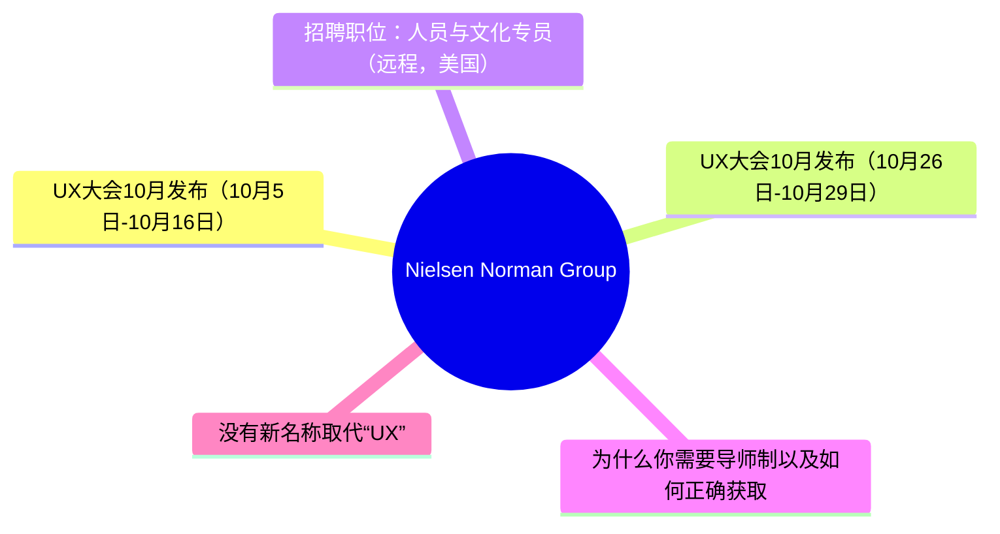
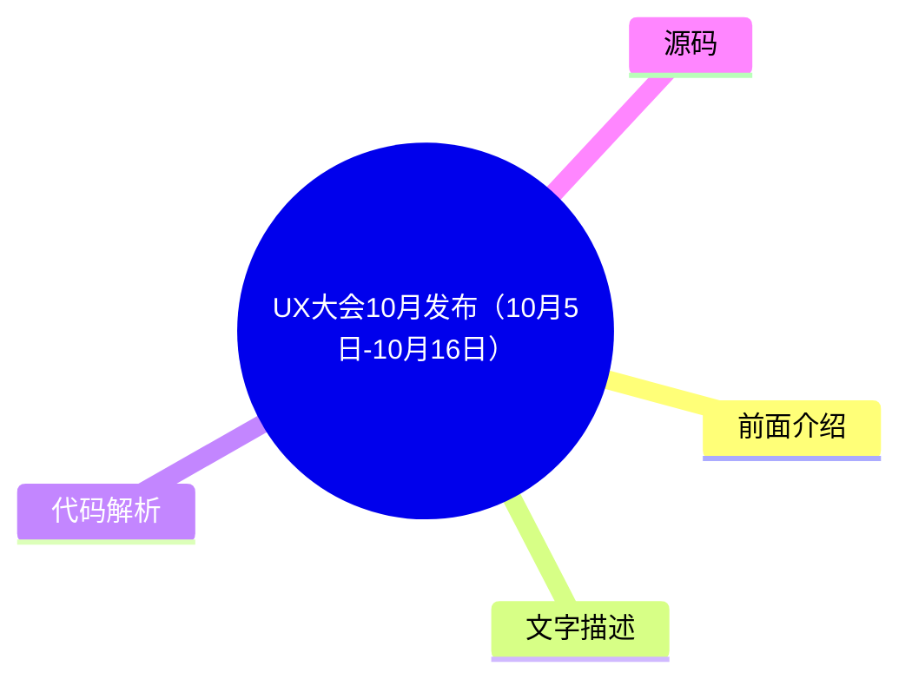
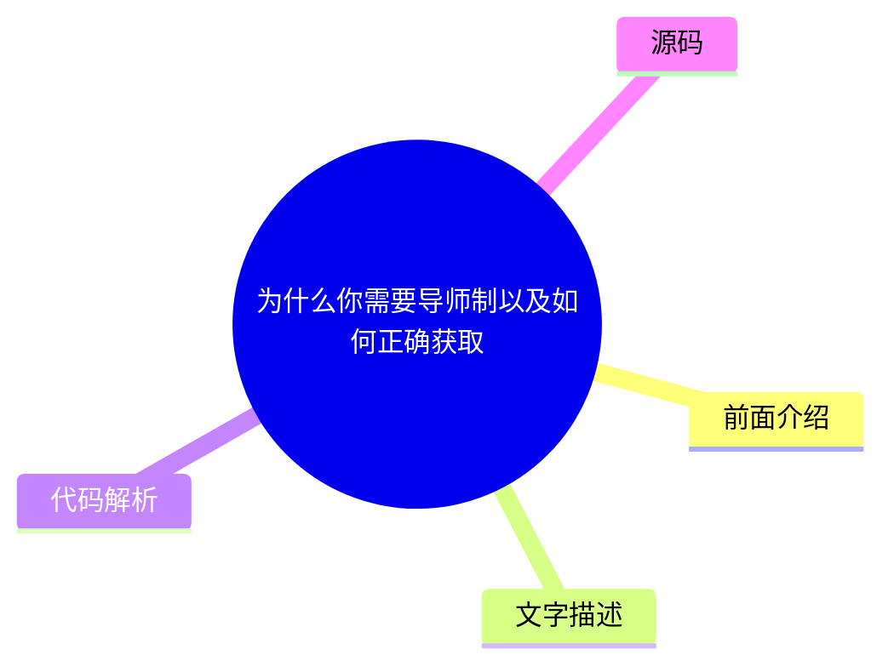
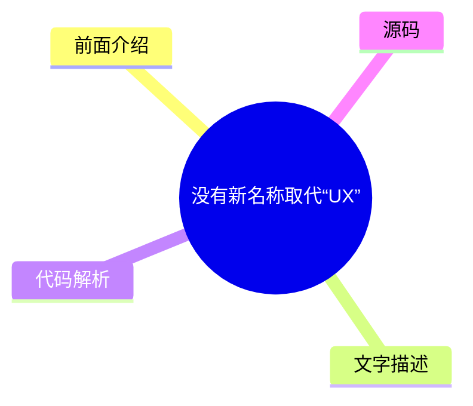

# 🔬 Nielsen Norman Group Top 5 (2026-08-05)

## 前面介绍

- 数据源：Nielsen Norman Group
- 抓取日期：2026-08-05
- 条目数：5
- 含完整正文：0
- 含代码片段：0
- 组织方式：前面介绍 / 树状图 / 文字描述 / 代码解析 / 源码

## 思维导图

## 详细整理（5 条，0 条含全文，0 条含代码）

### 1. UX大会10月发布（10月5日-10月16日）
- **链接**: [https://www.nngroup.com/training/october/?utm_source=rss&utm_medium=feed&utm_campaign=rss-syndication](https://www.nngroup.com/training/october/?utm_source=rss&utm_medium=feed&utm_campaign=rss-syndication)
- **发布**: Wed, 15 Jul 2026 06:59:07 +0000

#### 前面介绍

- 提供多达5门深度培训课程
- 教授用户体验最佳实践
- 专注于培养UX专业人士的长期技能

#### 树状图

#### 文字描述

- 本次大会将于2026年10月5日至10月16日举行。
- 参会者可以选择最多5门深度培训课程，旨在教授成功设计所需的最佳用户体验实践。
- 培训内容专注于为用户体验专业人士提供可长期受益的技能。

#### 代码解析

- 本文未提供源码，以下为实现思路或结构解析

#### 源码

未抓到可展示源码或原文节选。

### 2. UX大会10月发布（10月26日-10月29日）
- **链接**: [https://www.nngroup.com/training/october-eu/?utm_source=rss&utm_medium=feed&utm_campaign=rss-syndication](https://www.nngroup.com/training/october-eu/?utm_source=rss&utm_medium=feed&utm_campaign=rss-syndication)
- **发布**: Tue, 04 Aug 2026 08:43:32 +0000

#### 前面介绍

- 提供多达2门深度培训课程
- 教授用户体验最佳实践
- 专注于培养UX专业人士的长期技能

#### 树状图

#### 文字描述

- 本次大会将于2026年10月26日至10月29日举行。
- 参会者可以选择最多2门深度培训课程，旨在教授成功设计所需的最佳用户体验实践。
- 培训内容专注于为用户体验专业人士提供可长期受益的技能。

#### 代码解析

- 本文未提供源码，以下为实现思路或结构解析

#### 源码

未抓到可展示源码或原文节选。

### 3. 招聘职位：人员与文化专员（远程，美国）
- **链接**: [https://www.nngroup.com/news/item/people-culture-generalist-remote/?utm_source=rss&utm_medium=feed&utm_campaign=rss-syndication](https://www.nngroup.com/news/item/people-culture-generalist-remote/?utm_source=rss&utm_medium=feed&utm_campaign=rss-syndication)
- **发布**: Sat, 01 Aug 2026 19:25:00 +0000

#### 前面介绍

- NN/G正在招聘人员与文化专员
- 这是一个完全远程的永久职位
- 负责日常的人员职能工作

#### 树状图

#### 文字描述

- NN/G正在招聘一名人员与文化专员。
- 这是一个完全远程的永久职位，负责日常的人员职能工作。
- 候选人需要具备3到5年的人员运营或人力资源通才经验。
- 申请截止日期为8月28日星期五。

#### 代码解析

- 本文未提供源码，以下为实现思路或结构解析

#### 源码

未抓到可展示源码或原文节选。

### 4. 为什么你需要导师制以及如何正确获取
- **链接**: [https://www.nngroup.com/articles/mentorship/?utm_source=rss&utm_medium=feed&utm_campaign=rss-syndication](https://www.nngroup.com/articles/mentorship/?utm_source=rss&utm_medium=feed&utm_campaign=rss-syndication)
- **作者**: Evan Sunwall
- **发布**: Fri, 31 Jul 2026 17:00:00 +0000

#### 前面介绍

- 导师制是重要的成长工具
- 能带来显著的个人和职业益处
- 但必须正确参与才能发挥作用

#### 树状图

#### 文字描述

- 导师制是一种至关重要的成长工具，能提供巨大的个人和职业益处，但前提是必须正确参与。
- 文章探讨了导师制的重要性以及如何建立有效的导师关系。
- 旨在帮助读者理解如何通过导师制实现职业发展。

#### 代码解析

- 本文未提供源码，以下为实现思路或结构解析

#### 源码

未抓到可展示源码或原文节选。

### 5. 没有新名称取代“UX”
- **链接**: [https://www.nngroup.com/articles/no-new-name-ux/?utm_source=rss&utm_medium=feed&utm_campaign=rss-syndication](https://www.nngroup.com/articles/no-new-name-ux/?utm_source=rss&utm_medium=feed&utm_campaign=rss-syndication)
- **作者**: Rachel Banawa
- **发布**: Fri, 31 Jul 2026 17:00:00 +0000

#### 前面介绍

- “UX”仍是该领域的默认名称
- 调查显示604名专业人士仍使用该术语
- 替代名称仍然分散且未被广泛接受

#### 树状图

#### 文字描述

- 一项针对604名技术和设计专业人士的调查发现，“UX”仍然是该领域的默认名称。
- 尽管存在其他替代名称，但它们仍然分散，未能取代“UX”成为主流术语。
- 文章分析了行业术语的现状以及“用户体验”这一概念的持久性。

#### 代码解析

- 本文未提供源码，以下为实现思路或结构解析

#### 源码

未抓到可展示源码或原文节选。

