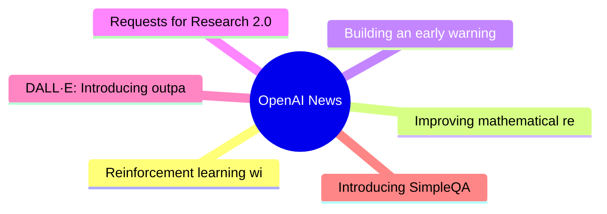

# 🤖 OpenAI News Top 6 (2026-06-19)

## 思维导图

## 列表（6 条，2 条含全文）

### 1. Reinforcement learning with prediction-based rewards
- **链接**: [https://openai.com/index/reinforcement-learning-with-prediction-based-rewards](https://openai.com/index/reinforcement-learning-with-prediction-based-rewards)
- **发布**: Wed, 31 Oct 2018 07:00:00 GMT
- **简介**: We’ve developed Random Network Distillation (RND), a prediction-based method for encouraging reinforcement learning agents to explore their environments through curiosity, which for the first time exceeds average human p

📄 全文（4022 字符，点击展开）

We’ve developed [Random Network Distillation (RND)](/index/reinforcement-learning-with-prediction-based-rewards/#RNDjump), a prediction-based method for encouraging reinforcement learning agents to explore their environments through curiosity, which for the first time exceeds average human performance on [Montezuma’s Revenge(opens in a new window)](https://www.retrogames.cz/play_124-Atari2600.php?language=EN).

We’ve developed [Random Network Distillation (RND)](/index/reinforcement-learning-with-prediction-based-rewards/#RNDjump), a prediction-based method for encouraging reinforcement learning agents to explore their environments through curiosity, which for the first time A exceeds average human performance on 

[Montezuma’s Revenge(opens in a new window)](https://www.retrogames.cz/play_124-Atari2600.php?language=EN). RND achieves state-of-the-art performance, periodically finds all 24 rooms and solves the first level without using demonstrations or having access to the underlying state of the game.

RND incentivizes visiting [unfamiliar states](/index/reinforcement-learning-with-prediction-based-rewards/#implementationjump) by measuring how hard it is to predict the output of a fixed random neural network on visited states. In unfamiliar states it’s hard to guess the output, and hence the reward is high. It can be applied to any reinforcement learning algorithm, is simple to implement and efficient to scale. Below we release a reference implementation of RND that can reproduce the results from our paper.

For an agent to achieve a desired goal it must first explore what is possible in its environment and what constitutes progress towards the goal. Many games’ reward signals provide a curriculum such that even simple exploration strategies are sufficient for achieving the game’s goal. In the [seminal work introducing DQN(opens in a new window)](https://www.nature.com/articles/nature14236), Montezuma’s Revenge was the **only game where DQN got 0% of the average human score (4.7K)**. Simple exploration strategies are highly unlikely to gather any rewards, or see more than a few of the 24 rooms in the level. Since then advances in Montezuma’s Revenge have been seen by many as synonymous with advances in exploration.

Significant progress was made in [2016(opens in a new window)](https://arxiv.org/abs/1606.01868) by combining DQN with a count-based exploration bonus, resulting in an agent that explored 15 rooms, achieved a high score of 6.6K and an average reward of around 3.7K. Since then, [significant(opens in a new window)](https://arxiv.org/abs/1805.11593) [improvement(opens in a new window)](https://arxiv.org/abs/1805.11592) in the score achieved by an RL agent has come only from exploiting access to [demonstrations(opens in a new window)](https://blog.openai.com/learning-montezumas-revenge-from-a-single-demonstration/) from human [experts(opens in a new window)](https://arxiv.org/abs/1809.03447), or access to the underlying state of the [emulator(opens in a new window)](https://blog.openai.com/learning-montezumas-revenge-from-a-single-demonstration/).

We ran a large scale RND experiment with 1024 rollout workers resulting in a **mean return of 10K over 9 runs** and a best mean return of 14.5K. Each run discovered between 20 and 22 rooms. In addition one of our smaller scale but longer running experiments yielded one run (out of 10) that achieved a **best return of 17.5K corresponding to passing the first level and finding all 24 rooms**. The graph below compares these two experiments showing the mean return as a function of parameter updates.

The visualization below shows the progress of the smaller scale experiment in discovering the rooms. Curiosity drives the agent to discover new rooms and find ways of increasing the in-game score, and this extrinsic reward drives it to revisit those rooms later in the training.

Prior to developing RND, we, together with collaborators from UC Berkeley, investigated learning without

...（截断，原文 14022+ 字符）

### 2. Improving mathematical reasoning with process supervision
- **链接**: [https://openai.com/index/improving-mathematical-reasoning-with-process-supervision](https://openai.com/index/improving-mathematical-reasoning-with-process-supervision)
- **发布**: Wed, 31 May 2023 07:00:00 GMT
- **简介**: We've trained a model to achieve a new state-of-the-art in mathematical problem solving by rewarding each correct step of reasoning (“process supervision”) instead of simply rewarding the correct final answer (“outcome s

📄 全文（3504 字符，点击展开）

We've trained a model to achieve a new state-of-the-art in mathematical problem solving by rewarding each correct step of reasoning (“process supervision”) instead of simply rewarding the correct final answer (“outcome supervision”). In addition to boosting performance relative to outcome supervision, process supervision also has an important alignment benefit: it directly trains the model to produce a chain-of-thought that is endorsed by humans.

In recent years, large language models have greatly improved in their ability to perform complex multi-step reasoning. However, even state-of-the-art models still produce logical mistakes, often called *hallucinations*. Mitigating hallucinations is a critical step towards building aligned AGI.

We can train reward models to detect hallucinations using either *outcome supervision*, which provides feedback based on a final result, or *process supervision*, which provides feedback for each individual step in a chain-of-thought. Building on previous work 1, we conduct a detailed comparison of these two methods using the MATH dataset

as our testbed. We find that process supervision leads to significantly better performance, even when judged by outcomes. To encourage related research, we release our full dataset of process supervision.

[2](#citation-bottom-2)Process supervision has several alignment advantages over outcome supervision. It directly rewards the model for following an aligned chain-of-thought, since each step in the process receives precise supervision. Process supervision is also more likely to produce interpretable reasoning, since it encourages the model to follow a human-approved process. In contrast, outcome supervision may reward an unaligned process, and it is generally harder to scrutinize.

In some cases, safer methods for AI systems can lead to reduced performance 3, a cost which is known as an 

*alignment tax*. In general, any alignment tax may hinder the adoption of alignment methods, due to pressure to deploy the most capable model. Our results below show that process supervision in fact incurs a negative alignment tax, at least in the math domain. This could increase the adoption of process supervision, which we believe would have positive alignment side-effects.

We evaluate our process-supervised and outcome-supervised reward models using problems from the MATH test set. We generate many solutions for each problem and then pick the solution ranked the highest by each reward model. The graph shows the percentage of chosen solutions that reach the correct final answer, as a function of the number of solutions considered. Not only does the process-supervised reward model perform better across the board, but the performance gap widens as we consider more solutions per problem. This shows us that the process-supervised reward model is much more reliable.

We showcase 10 problems and solutions below, along with commentary about the reward model’s strengths and weaknesses.

It is unknown how broadly these results will generalize beyond the domain of math, and we consider it important for future work to explore the impact of process supervision in other domains. If these results generalize, we may find that process supervision gives us the best of both worlds – a method that is both more performant and more aligned than outcome supervision.

## References

## Authors

## Contributors

Bowen Baker, Teddy Lee, John Schulman, Greg Brockman, Kendra Rimbach, Hannah Wong, Thomas Degry

### 3. Building an early warning system for LLM-aided biological threat creation
- **链接**: [https://openai.com/index/building-an-early-warning-system-for-llm-aided-biological-threat-creation](https://openai.com/index/building-an-early-warning-system-for-llm-aided-biological-threat-creation)
- **发布**: Wed, 31 Jan 2024 08:00:00 GMT
- **简介**: We’re developing a blueprint for evaluating the risk that a large language model (LLM) could aid someone in creating a biological threat. In an evaluation involving both biology experts and students, we found that GPT-4 

### 4. Requests for Research 2.0
- **链接**: [https://openai.com/index/requests-for-research-2](https://openai.com/index/requests-for-research-2)
- **发布**: Wed, 31 Jan 2018 08:00:00 GMT
- **简介**: We’re releasing a new batch of seven unsolved problems which have come up in the course of our research at OpenAI.

### 5. DALL·E: Introducing outpainting
- **链接**: [https://openai.com/index/dall-e-introducing-outpainting](https://openai.com/index/dall-e-introducing-outpainting)
- **发布**: Wed, 31 Aug 2022 07:00:00 GMT
- **简介**: Extend creativity and tell a bigger story with DALL·E images of any size.

### 6. Introducing SimpleQA
- **链接**: [https://openai.com/index/introducing-simpleqa](https://openai.com/index/introducing-simpleqa)
- **发布**: Wed, 30 Oct 2024 10:00:00 GMT
- **简介**: A factuality benchmark called SimpleQA that measures the ability for language models to answer short, fact-seeking questions.
