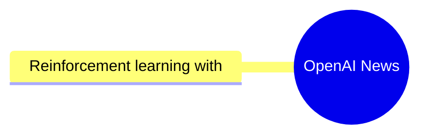
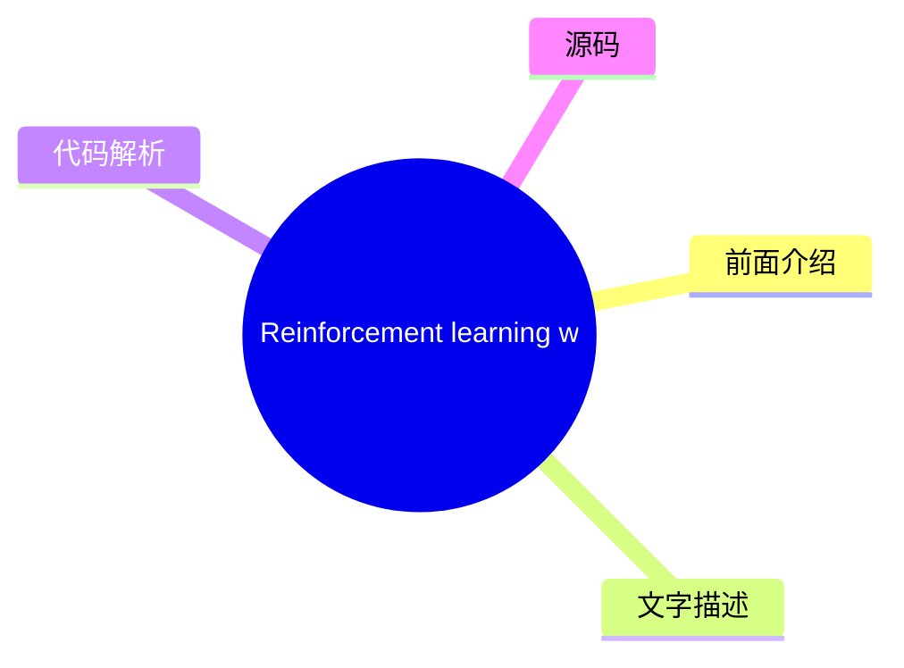

# 🤖 OpenAI News Top 1 (2026-07-17)

## 前面介绍

- 数据源：OpenAI News
- 抓取日期：2026-07-17
- 条目数：1
- 含完整正文：1
- 含代码片段：0
- 组织方式：前面介绍 / 树状图 / 文字描述 / 代码解析 / 源码

## 思维导图

## 详细整理（1 条，1 条含全文，0 条含代码）

### 1. Reinforcement learning with prediction-based rewards
- **链接**: [https://openai.com/index/reinforcement-learning-with-prediction-based-rewards](https://openai.com/index/reinforcement-learning-with-prediction-based-rewards)
- **发布**: Wed, 31 Oct 2018 07:00:00 GMT

#### 前面介绍

- We’ve developed Random Network Distillation (RND), a prediction-based method for encouraging reinforcement learning agents to explore their environments through curiosity, which for the first time exceeds average human performance on Montezuma’s Reve
- 发布时间：Wed, 31 Oct 2018 07:00:00 GMT

#### 树状图

#### 文字描述

- We’ve developed [Random Network Distillation (RND)](/index/reinforcement-learning-with-prediction-based-rewards/#RNDjump), a prediction-based method for encouraging reinforcement learning agents to explore their environments through curiosity, which for the first time exceeds average human performance on [Montezuma’s Revenge(opens in a new window)](https://www.retrogames.cz/pla

#### 代码解析

- 本文未检测到明确代码块，内容更偏新闻、观点或方法论。

#### 源码

#### 原文节选

We’ve developed [Random Network Distillation (RND)](/index/reinforcement-learning-with-prediction-based-rewards/#RNDjump), a prediction-based method for encouraging reinforcement learning agents to explore their environments through curiosity, which for the first time exceeds average human performance on [Montezuma’s Revenge(opens in a new window)](https://www.retrogames.cz/play_124-Atari2600.php?language=EN).

We’ve developed [Random Network Distillation (RND)](/index/reinforcement-learning-with-prediction-based-rewards/#RNDjump), a prediction-based method for encouraging reinforcement learning agents to explore their environments through curiosity, which for the first time A exceeds average human performance on 

[Montezuma’s Revenge(opens in a new window)](https://www.retrogames.cz/play_124-Atari2600.php?language=EN). RND achieves state-of-the-art performance, periodically finds all 24 rooms and solves the first level without using demonstrations or having access to the underlying state of the game.

RND incentivizes visiting [unfamiliar states](/index/reinforcement-learning-with-prediction-based-rewards/#implementationjump) by measuring how hard it is to predict the output of a fixed random neural network on visited states. In unfamiliar states it’s hard to guess the output, and hence the reward is high. It can be applied to any reinforcement learning algorithm, is simple to implement and efficient to scale. Below we release a reference implementation of RND that can reproduce the results from our paper.

For an agent to achieve a desired goal it must first explore what is possible in its environment and what constitutes progress towards the goal. Many games’ reward signals provide a curriculum such that even simple exploration strategies are sufficient for achieving the game’s goal. In the [seminal work introducing DQN(opens in a new window)](https://www.nature.com/articles/nature14236), Montezuma’s Revenge was the **only game where DQN got 0% of the average human score (4.7K)**. Simple exploration strategies are highly unlikely to gather any rewards, or see more than a few of the 24 rooms in the level. Since then advances in Montezuma’s Revenge have been seen by many as synonymous with advances in exploration.

Significant progress was made in [2016(opens in a new window)](https://arxiv.org/abs/1606.01868) by combining DQN with a count-based exploration bonus, resulting in an agent that explored 15 rooms, achieved a high score of 6.6K and an average reward of around 3.7K. Since then, [significant(opens in a new window)](https://arxiv.org/abs/1805.11593) [improvement(opens in a new window)](https://arxiv.org/abs/1805.11592) in the score achieved by an RL agent has come only from exploiting access to [demonstrations(opens in a new window)](https://blog.openai.com/learning-montezumas-revenge-from-a-single-demonstration/) from human [experts(opens in a new window)](https://arxiv.org/abs/1809.03447), or access to the underlying state of the [emu

#### 完整正文

We’ve developed [Random Network Distillation (RND)](/index/reinforcement-learning-with-prediction-based-rewards/#RNDjump), a prediction-based method for encouraging reinforcement learning agents to explore their environments through curiosity, which for the first time exceeds average human performance on [Montezuma’s Revenge(opens in a new window)](https://www.retrogames.cz/play_124-Atari2600.php?language=EN).

We’ve developed [Random Network Distillation (RND)](/index/reinforcement-learning-with-prediction-based-rewards/#RNDjump), a prediction-based method for encouraging reinforcement learning agents to explore their environments through curiosity, which for the first time A exceeds average human performance on 

[Montezuma’s Revenge(opens in a new window)](https://www.retrogames.cz/play_124-Atari2600.php?language=EN). RND achieves state-of-the-art performance, periodically finds all 24 rooms and solves the first level without using demonstrations or having access to the underlying state of the game.

RND incentivizes visiting [unfamiliar states](/index/reinforcement-learning-with-prediction-based-rewards/#implementationjump) by measuring how hard it is to predict the output of a fixed random neural network on visited states. In unfamiliar states it’s hard to guess the output, and hence the reward is high. It can be applied to any reinforcement learning algorithm, is simple to implement and efficient to scale. Below we release a reference implementation of RND that can reproduce the results from our paper.

For an agent to achieve a desired goal it must first explore what is possible in its environment and what constitutes progress towards the goal. Many games’ reward signals provide a curriculum such that even simple exploration strategies are sufficient for achieving the game’s goal. In the [seminal work introducing DQN(opens in a new window)](https://www.nature.com/articles/nature14236), Montezuma’s Revenge was the **only game where DQN got 0% of the average human score (4.7K)**. Simple exploration strategies are highly unlikely to gather any rewards, or see more than a few of the 24 rooms in the level. Since then advances in Montezuma’s Revenge have been seen by many as synonymous with advances in exploration.

Significant progress was made in [2016(opens in a new window)](https://arxiv.org/abs/1606.01868) by combining DQN with a count-based exploration bonus, resulting in an agent that explored 15 rooms, achieved a high score of 6.6K and an average reward of around 3.7K. Since then, [significant(opens in a new window)](https://arxiv.org/abs/1805.11593) [improvement(opens in a new window)](https://arxiv.org/abs/1805.11592) in the score achieved by an RL agent has come only from exploiting access to [demonstrations(opens in a new window)](https://blog.openai.com/learning-montezumas-revenge-from-a-single-demonstration/) from human [experts(opens in a new window)](https://arxiv.org/abs/1809.03447), or access to the underlying state of the [emulator(opens in a new window)](https://blog.openai.com/learning-montezumas-revenge-from-a-single-demonstration/).

We ran a large scale RND experiment with 1024 rollout workers resulting in a **mean return of 10K over 9 runs** and a best mean return of 14.5K. Each run discovered between 20 and 22 rooms. In addition one of our smaller scale but longer running experiments yielded one run (out of 10) that achieved a **best return of 17.5K corresponding to passing the first level and finding all 24 rooms**. The graph below compares these two experiments showing the mean return as a function of parameter updates.

The visualization below shows the progress of the smaller scale experiment in discovering the rooms. Curiosity drives the agent to discover new rooms and find ways of increasing the in-game score, and this extrinsic reward drives it to revisit those rooms later in the training.

Prior to developing RND, we, together with collaborators from UC Berkeley, investigated learning without *any* environment-specific rewards. Curiosity gives us an easier way to teach agents to interact with any environment, rather than via an extensively engineered task-specific reward function that we hope corresponds to solving a task. Projects like [ALE(opens in a new window)](https://github.com/mgbellemare/Arcade-Learning-Environment), [Universe(opens in a new window)](https://github.com/openai/universe), [Malmo(opens in a new window)](https://github.com/Microsoft/malmo), [Gym(opens in a new window)](https://github.com/openai/gym), [Gym Retro(opens in a new window)](https://github.com/openai/retro/), [Unity(opens in a new window)](https://github.com/Unity-Technologies/ml-agents), [DeepMind Lab(opens in a new window)](https://github.com/deepmind/lab), [CommAI(opens in a new window)](https://github.com/facebookresearch/CommAI-env) make a large number of simulated environments available for an agent to interact with through a standardized interface. An agent using a generic reward function not specific to the particulars of an environment can acquire a basic level of competency in a wide range of environments, resulting in the agent’s ability to determine what useful behaviors are even in the absence of carefully engineered rewards.

In standard reinforcement learning set-ups, at every discrete time-step the agent sends an action to the environment, and the environment responds by emitting the next observation, transition reward and an indicator of episode end. In our [previous paper(opens in a new window)](https://arxiv.org/abs/1808.04355) we require the environment to [output(opens in a new window)](https://arxiv.org/abs/1606.01868) [only(opens in a new window)](https://pathak22.github.io/noreward-rl/) the next observation. There, the agent learns a next-state predictor model from its experience, and uses the error of the prediction as an intrinsic reward. As a result it is attracted to the unpredictable. For example, it will find a change in a game score to be rewarding only if the score is displayed on the screen and the change is hard to predict. The agent will typically find interactions with new objects rewarding, as the outcomes of such interactions are usually harder to predict than other aspects of the environment.

Similar to [prior(opens in a new window)](https://arxiv.org/abs/1507.00814) [work(opens in a new window)](https://pathak22.github.io/noreward-rl/), we tried to avoid modeling all aspects of the environment, whether they are relevant or not, by choosing to model features of the observation. Surprisingly, we found that even *random features* worked well.

We tested our agent across 50+ different environments and observed a range of competence levels from seemingly random actions to deliberately interacting with the environment. To our surprise, in some environments the agent achieved the game’s objective even though the game’s objective was not communicated to it through an extrinsic reward.

**Breakout** The agent experiences spikes of intrinsic reward when it sees a new configuration of bricks early on in training and when it passes the level for the first time after training for several hours.

**Pong** We trained the agent to control both paddles at the same time and it learned to keep the ball in play resulting in long rallies. Even when trained against the in-game AI, the agent tried to prolong the game rather than win.

**Bowling** The agent learned to play the game better than agents trained to maximize the (clipped) extrinsic reward directly. We think this is because the agent gets attracted to the difficult-to-predict flashing of the scoreboard occurring after the strikes.

**Mario** The intrinsic reward is particularly well-aligned with the game’s objective of advancing through the levels. The agent is rewarded for finding new areas because the details of a newly found area are impossible to predict. As a result the agent discovers 11 levels, finds secret rooms, and even defeats bosses.

Like a gambler at a slot machine attracted to chance outcomes, the agent sometimes gets trapped by its curiosity as the result of the noisy-TV problem. The agent finds a source of randomness in the environment and keeps observing it, always experiencing a high intrinsic reward for such transitions. Watching a TV playing static noise is an example of such a trap. We demonstrate this literally by placing the agent in a Unity maze environment with a TV playing random channels.

While the noisy-TV problem is a concern in theory, for largely deterministic environments like Montezuma’s Revenge, we anticipated that curiosity would drive the agent to discover rooms and interact with objects. We tried several variants of next-state prediction based curiosity combining the exploration bonus with the score from the game.

In these experiments the agent controls the environment through a noisy controller that repeats the last action instead of the current one with some probability. This setup with sticky actions was [suggested(opens in a new window)](https://arxiv.org/abs/1709.06009) as a best practice for training agents on fully deterministic games like Atari to prevent memorization. Sticky actions make the transition from room to room unpredictable.

Since next-state prediction is inherently susceptible to the noisy-TV problem, we identified the following relevant sources of prediction errors:

- **Factor 1**: Prediction error is high where the predictor fails to generalize from previously seen examples. Novel experience then corresponds to high prediction error.
- **Factor 2**: Prediction error is high because the prediction target is stochastic.
- **Factor 3**: Prediction error is high because information necessary for the prediction is missing, or the model class of predictors is too limited to fit the complexity of the target function.

We determined Factor 1 is a useful source of error since it quantifies the novelty of experience, whereas Factors 2 and 3 cause the noisy-TV problem. To avoid Factors 2 and 3, we developed RND, a new exploration bonus that is based on **predicting the output of a fixed and randomly initialized neural network on the next state, given the next state itself**.

The intuition is that predictive models have low error in states similar to the ones they have been trained on. In particular the agent’s predictions of the output of a randomly initialized neural network will be less accurate in novel states than in states the agent visited frequently. The advantage of using a synthetic prediction problem is that we can have it be deterministic (bypassing Factor 2) and inside the class of functions the predictor can represent (bypassing Factor 3) by choosing the predictor to be of the same architecture as the target network. These choices make RND immune to the noisy-TV problem.

We combine the exploration bonus with the extrinsic rewards through a variant of [Proximal Policy Optimization(opens in a new window)](https://arxiv.org/abs/1707.06347) ([PPO(opens in a new window)](https://blog.openai.com/openai-baselines-ppo/#ppo)) that uses **two value heads for the two reward streams**. This allows us to use different discount rates for the different rewards, and combine episodic and non-episodic returns. **With this additional flexibility, our best agent often finds 22 out of the 24 rooms on the first level in Montezuma’s Revenge, and occasionally passes the first level after finding the remaining two rooms**. The same method gets state-of-the-art performance on Venture and Gravitar.

The visualization of the RND bonus below shows a graph of the intrinsic reward over the course of an episode of Montezuma’s Revenge where the agent finds the torch for the first time.

Big-picture considerations like susceptibility to the noisy-TV problem are important for the choice of a good exploration algorithm. However, we found that getting seemingly-small details right in our simple algorithm made the difference between an agent that never

...（截断，原文 14022+ 字符）

