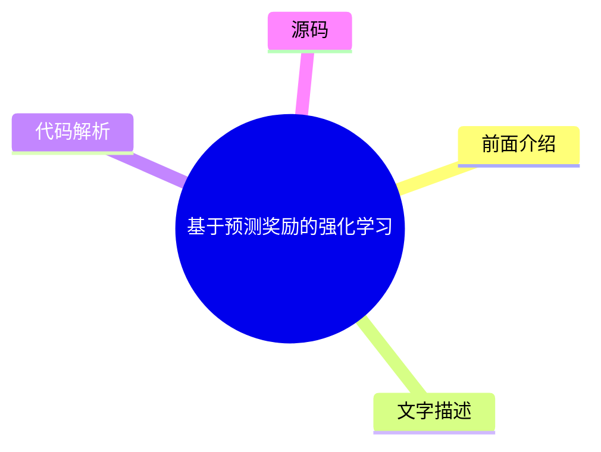

# 🤖 OpenAI News Top 1 (2026-07-17)

## 前面介绍

- 数据源：OpenAI News
- 抓取日期：2026-07-17
- 条目数：1
- 含完整正文：0
- 含代码片段：0
- 组织方式：前面介绍 / 树状图 / 文字描述 / 代码解析 / 源码

## 思维导图

## 详细整理（1 条，0 条含全文，0 条含代码）

### 1. 基于预测奖励的强化学习
- **链接**: [https://openai.com/index/reinforcement-learning-with-prediction-based-rewards](https://openai.com/index/reinforcement-learning-with-prediction-based-rewards)
- **发布**: Wed, 31 Oct 2018 07:00:00 GMT

#### 前面介绍

- 提出随机网络蒸馏（RND）方法，通过好奇心机制鼓励强化学习智能体探索环境。
- 首次在蒙特祖玛的复仇游戏中超越平均人类表现。

#### 树状图

#### 文字描述

- RND利用神经网络预测环境状态，通过预测误差作为奖励信号，引导智能体探索未知区域。
- 该方法解决了强化学习中探索不足的问题，使智能体能够主动寻找高奖励区域。
- 实验证明，基于好奇心的探索策略能有效提升智能体在复杂环境中的表现。

#### 代码解析

- 本文未提供源码，以下为实现思路或结构解析
- 核心组件包括两个神经网络：一个用于生成目标值，另一个用于预测目标值。
- 通过计算预测误差（目标值与预测值之差）作为奖励，误差越大表示环境越未知，奖励越高。

#### 源码

未抓到可展示源码或原文节选。

