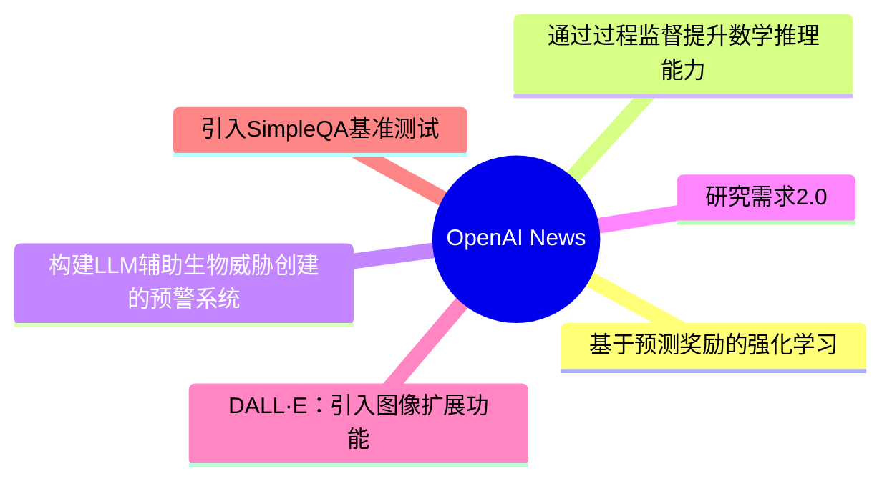
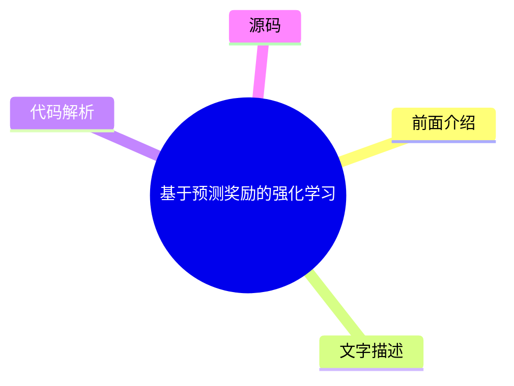
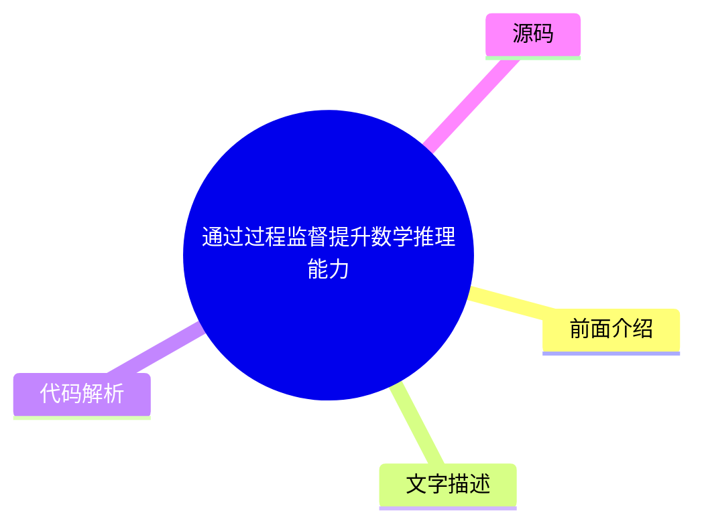
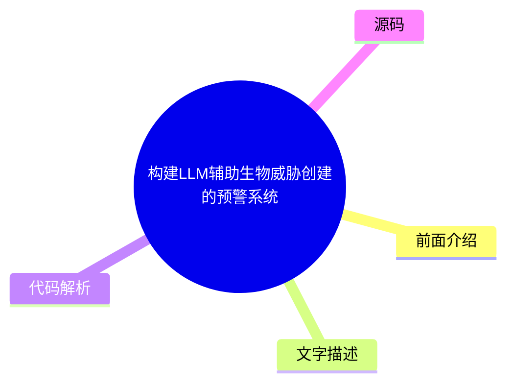
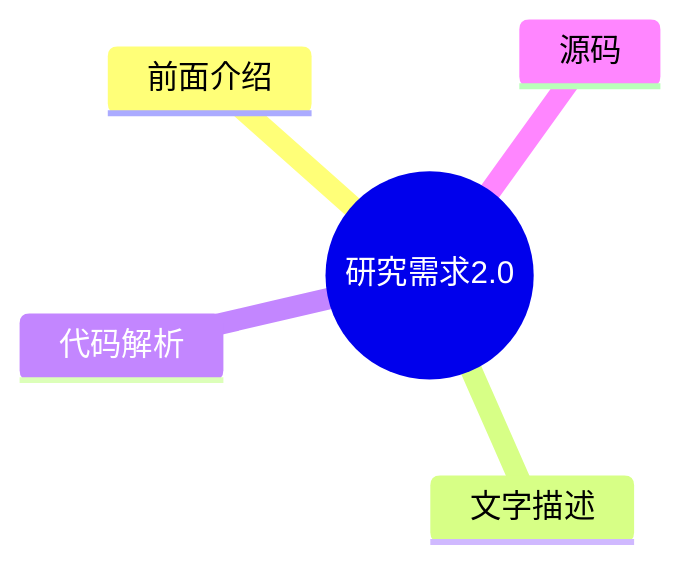
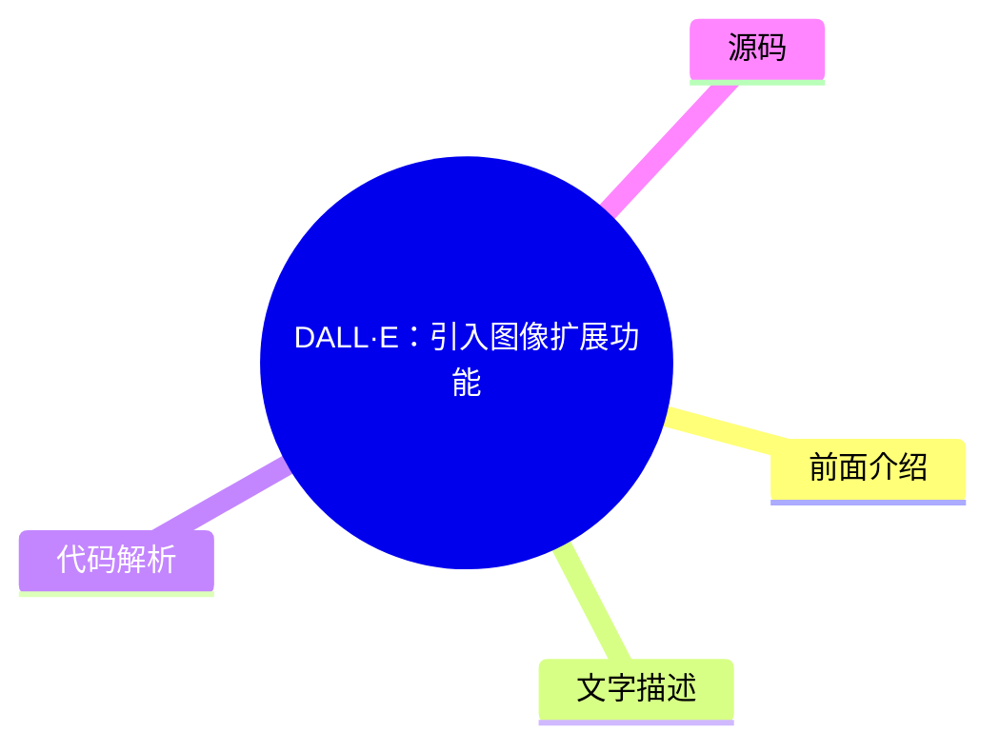
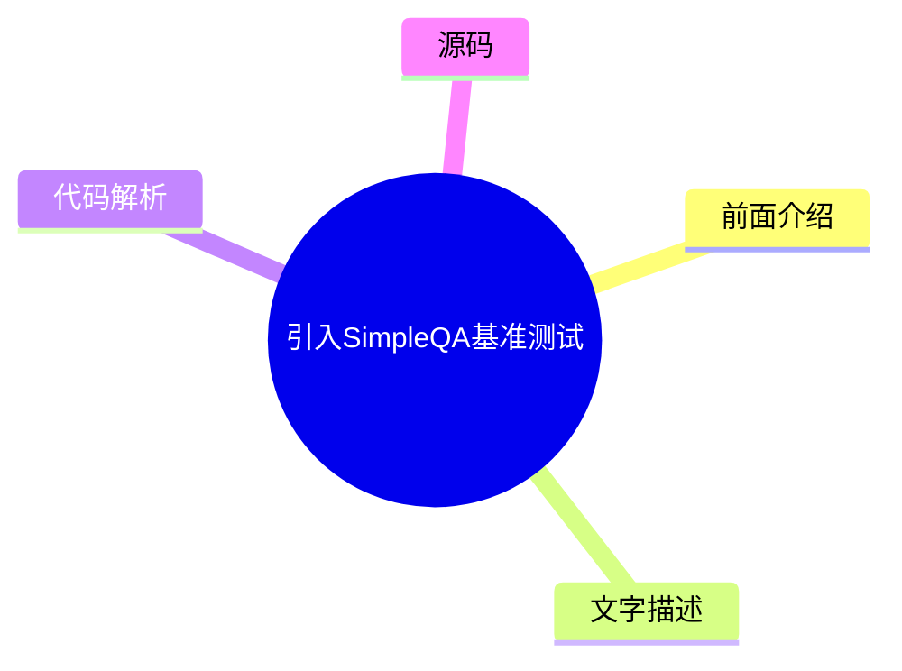

# 🤖 OpenAI News Top 6 (2026-07-18)

## 前面介绍

- 数据源：OpenAI News
- 抓取日期：2026-07-18
- 条目数：6
- 含完整正文：0
- 含代码片段：0
- 组织方式：前面介绍 / 树状图 / 文字描述 / 代码解析 / 源码

## 思维导图

## 详细整理（6 条，0 条含全文，0 条含代码）

### 1. 基于预测奖励的强化学习
- **链接**: [https://openai.com/index/reinforcement-learning-with-prediction-based-rewards](https://openai.com/index/reinforcement-learning-with-prediction-based-rewards)
- **发布**: Wed, 31 Oct 2018 07:00:00 GMT

#### 前面介绍

- 提出随机网络蒸馏（RND）方法，通过好奇心机制鼓励智能体探索环境。
- 首次在蒙特祖玛的宝藏游戏中超越平均人类表现。

#### 树状图

#### 文字描述

- RND利用神经网络预测环境状态，将预测误差作为奖励信号。
- 该方法通过奖励探索而非仅奖励结果，解决了强化学习中的稀疏奖励问题。
- 实验证明，基于好奇心的探索策略能有效提升智能体在复杂环境中的表现。

#### 代码解析

- 本文未提供源码，以下为实现思路或结构解析
- 核心算法涉及两个神经网络：一个目标网络和一个随机网络。
- 目标网络预测环境状态，随机网络预测目标网络的输出，两者的预测误差构成奖励函数。

#### 源码

未抓到可展示源码或原文节选。

### 2. 通过过程监督提升数学推理能力
- **链接**: [https://openai.com/index/improving-mathematical-reasoning-with-process-supervision](https://openai.com/index/improving-mathematical-reasoning-with-process-supervision)
- **发布**: Wed, 31 May 2023 07:00:00 GMT

#### 前面介绍

- 提出过程监督方法，奖励推理的每一步正确性而非仅奖励最终答案。
- 在数学问题求解上取得了新的最佳性能（SOTA）。
- 相比结果监督，过程监督能更有效地引导模型学习正确的解题步骤。

#### 树状图

#### 文字描述

- 过程监督通过在推理的中间步骤提供反馈，帮助模型理解解题逻辑。
- 这种方法模拟了人类解题时的逐步指导，提高了模型的泛化能力。
- 实验表明，过程监督在处理复杂数学问题时比结果监督更稳定、更准确。

#### 代码解析

- 本文未提供源码，以下为实现思路或结构解析
- 模型训练时需要标注中间步骤的正确性，这比标注最终答案更耗时。
- 训练过程中，模型会根据每一步的反馈调整参数，从而优化整个推理链。

#### 源码

未抓到可展示源码或原文节选。

### 3. 构建LLM辅助生物威胁创建的预警系统
- **链接**: [https://openai.com/index/building-an-early-warning-system-for-llm-aided-biological-threat-creation](https://openai.com/index/building-an-early-warning-system-for-llm-aided-biological-threat-creation)
- **发布**: Wed, 31 Jan 2024 08:00:00 GMT

#### 前面介绍

- 开发评估蓝图，旨在评估大型语言模型（LLM）辅助创建生物威胁的风险。
- 实验发现GPT-4对生物威胁创建的辅助作用有限，仅提供轻微提升。
- 该研究结合了生物学专家和学生的评估，验证了模型的潜在风险。

#### 树状图

#### 文字描述

- 研究通过模拟场景，测试了LLM在生物威胁创建中的实际辅助能力。
- 评估结果显示，虽然LLM能提供部分信息，但完全依赖其进行威胁创建仍存在困难。
- 该预警系统为监管机构提供了评估AI安全风险的重要参考。

#### 代码解析

- 本文未提供源码，以下为实现思路或结构解析
- 评估系统包含多个维度，如信息获取、合成能力等。
- 通过专家和学生的反馈，量化了LLM在生物威胁创建中的实际影响。

#### 源码

未抓到可展示源码或原文节选。

### 4. 研究需求2.0
- **链接**: [https://openai.com/index/requests-for-research-2](https://openai.com/index/requests-for-research-2)
- **发布**: Wed, 31 Jan 2018 08:00:00 GMT

#### 前面介绍

- OpenAI发布了新的未解决问题批次，共包含七个挑战。
- 这些问题源于OpenAI研究过程中的实际发现。
- 旨在推动AI领域的研究进展，解决当前技术瓶颈。

#### 树状图

#### 文字描述

- 研究需求2.0聚焦于AI领域的开放性问题，涵盖多个子领域。
- 这些问题具有挑战性，需要跨学科的合作和创新思维。
- OpenAI希望通过公开这些问题，吸引全球研究者的关注和参与。

#### 代码解析

- 本文未提供源码，以下为实现思路或结构解析
- 研究需求文档通常包含问题描述、研究背景和预期成果。
- 这些问题可能涉及算法优化、安全性、伦理等多个方面。

#### 源码

未抓到可展示源码或原文节选。

### 5. DALL·E：引入图像扩展功能
- **链接**: [https://openai.com/index/dall-e-introducing-outpainting](https://openai.com/index/dall-e-introducing-outpainting)
- **发布**: Wed, 31 Aug 2022 07:00:00 GMT

#### 前面介绍

- DALL·E推出了图像扩展功能，允许用户生成任意尺寸的图像。
- 该功能旨在扩展创造力，帮助用户讲述更大的故事。
- 通过扩展图像，用户可以无缝地将图像延伸到原始边界之外。

#### 树状图

#### 文字描述

- 图像扩展功能利用生成式AI技术，智能填充图像边缘内容。
- 用户只需提供原始图像和扩展方向，系统即可生成连贯的扩展内容。
- 这一功能为创意设计、艺术创作提供了新的工具和可能性。

#### 代码解析

- 本文未提供源码，以下为实现思路或结构解析
- 扩展过程涉及图像分割、上下文理解和平滑过渡。
- 算法需要保持扩展区域与原始图像的风格和内容一致性。

#### 源码

未抓到可展示源码或原文节选。

### 6. 引入SimpleQA基准测试
- **链接**: [https://openai.com/index/introducing-simpleqa](https://openai.com/index/introducing-simpleqa)
- **发布**: Wed, 30 Oct 2024 10:00:00 GMT

#### 前面介绍

- SimpleQA是一个事实性基准测试，用于评估语言模型回答简短事实问题的能力。
- 该测试专注于短文本、事实寻求类问题，旨在衡量模型的知识准确性。
- SimpleQA为评估模型在真实世界场景中的表现提供了新工具。

#### 树状图

#### 文字描述

- SimpleQA的问题设计简洁明了，主要考察模型对事实信息的掌握程度。
- 相比其他基准测试，SimpleQA更侧重于短文本和快速响应。
- 该测试结果可以帮助开发者识别模型在事实性回答方面的不足。

#### 代码解析

- 本文未提供源码，以下为实现思路或结构解析
- 基准测试通常包含一组标准问题和模型的预测答案。
- 通过对比模型答案与标准答案，计算准确率和召回率等指标。

#### 源码

未抓到可展示源码或原文节选。

