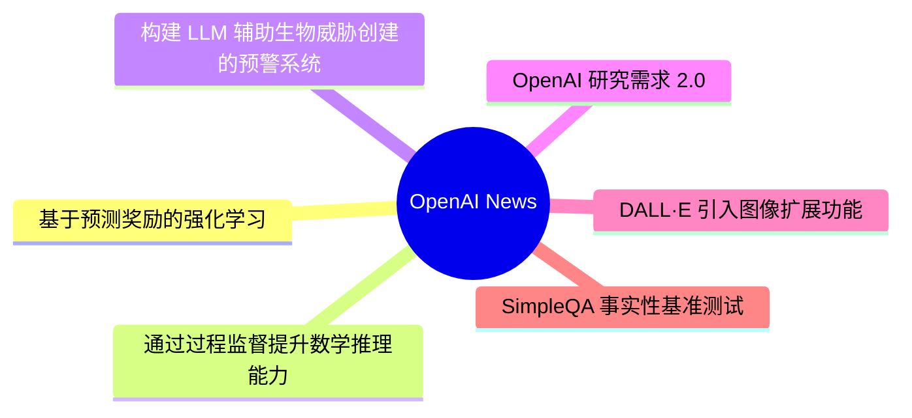
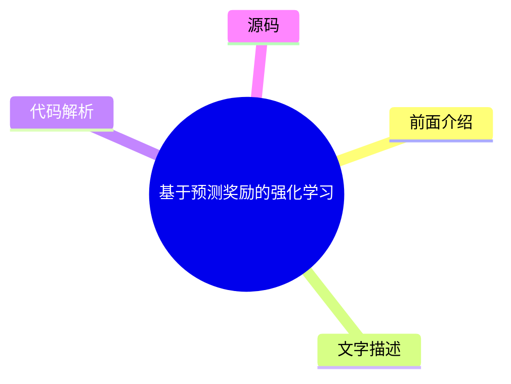
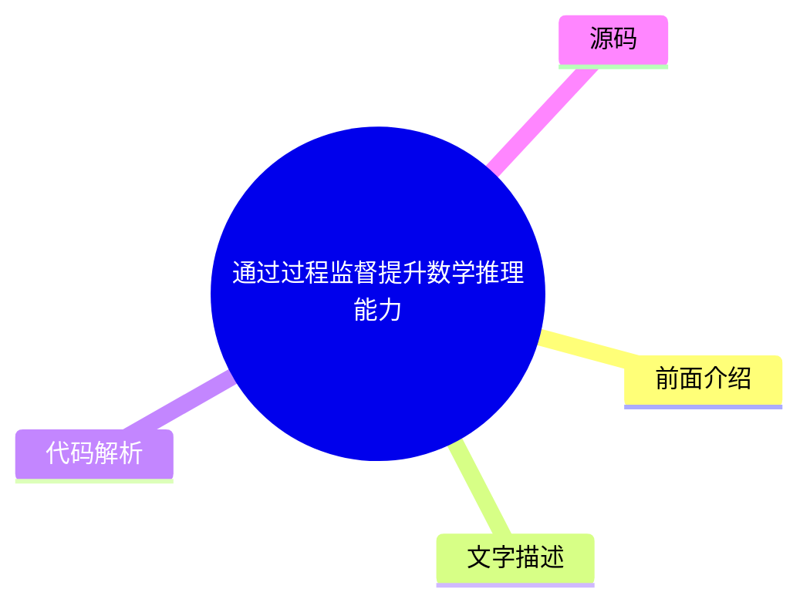
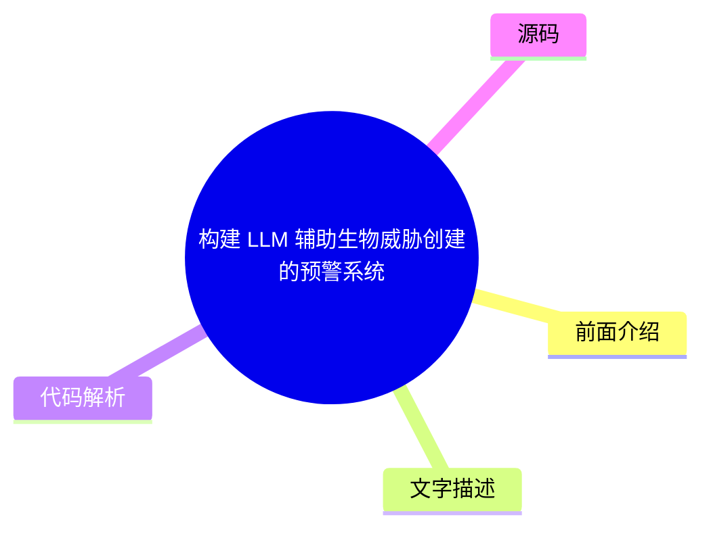
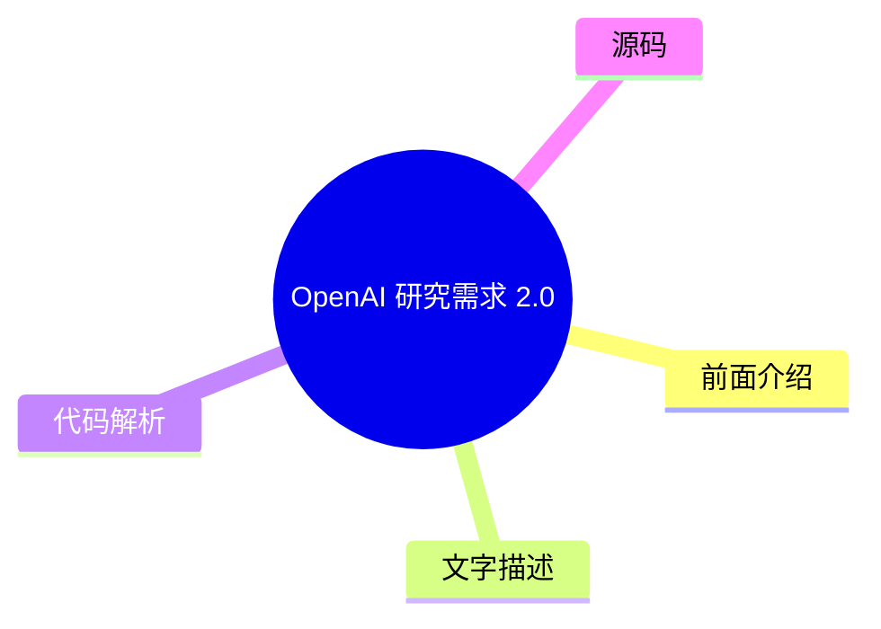
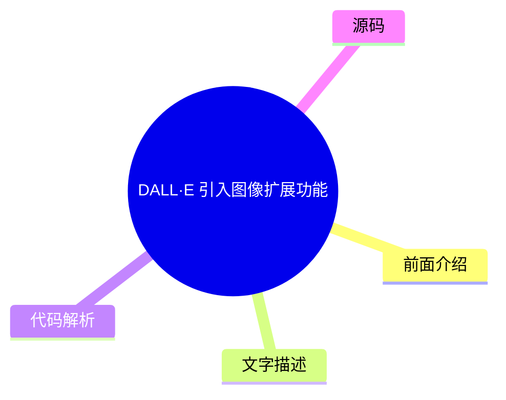
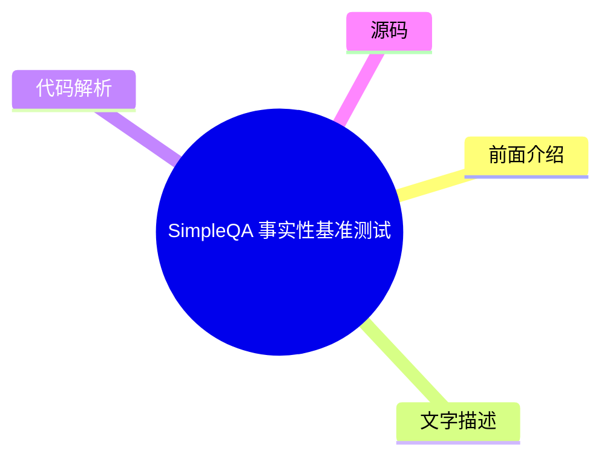

# 🤖 OpenAI News Top 6 (2026-07-28)

## 前面介绍

- 数据源：OpenAI News
- 抓取日期：2026-07-28
- 条目数：6
- 含完整正文：0
- 含代码片段：0
- 组织方式：前面介绍 / 树状图 / 文字描述 / 代码解析 / 源码

## 思维导图

## 详细整理（6 条，0 条含全文，0 条含代码）

### 1. 基于预测奖励的强化学习
- **链接**: [https://openai.com/index/reinforcement-learning-with-prediction-based-rewards](https://openai.com/index/reinforcement-learning-with-prediction-based-rewards)
- **发布**: Wed, 31 Oct 2018 07:00:00 GMT

#### 前面介绍

- 提出随机网络蒸馏（RND）方法，利用好奇心机制鼓励智能体探索环境。
- 该方法首次在蒙提祖玛的宝库游戏中超越了平均人类表现。

#### 树状图

#### 文字描述

- RND 是一种基于预测的强化学习方法，旨在通过好奇心驱动智能体进行探索。
- 核心思想是训练一个目标网络来预测环境状态，而另一个网络尝试预测该预测值。
- 如果目标网络能轻松预测当前状态，说明环境是可预测的，好奇心较低；反之则好奇心较高。
- 通过最大化这种预测误差，智能体被激励去探索那些尚未被充分探索的未知状态。

#### 代码解析

- 本文未提供源码，以下为实现思路或结构解析
- 目标网络参数固定，预测网络参数可训练。
- 计算预测误差作为奖励信号，而非传统的环境奖励。
- 结构包含两个共享输入的神经网络，分别作为目标器和预测器。

#### 源码

未抓到可展示源码或原文节选。

### 2. 通过过程监督提升数学推理能力
- **链接**: [https://openai.com/index/improving-mathematical-reasoning-with-process-supervision](https://openai.com/index/improving-mathematical-reasoning-with-process-supervision)
- **发布**: Wed, 31 May 2023 07:00:00 GMT

#### 前面介绍

- 提出过程监督方法，通过奖励推理过程中的每一步正确性来训练模型。
- 相比仅奖励最终答案的结果监督，过程监督能显著提升数学问题解决能力。

#### 树状图

#### 文字描述

- 研究提出了一种新的数学问题解决范式，不再仅仅关注最终答案的正确性。
- 模型被训练为奖励推理过程中的每一个正确步骤，即过程监督。
- 这种方法能够引导模型学习正确的解题逻辑和中间推理链条。
- 实验表明，过程监督在数学推理任务上达到了新的最先进水平。

#### 代码解析

- 本文未提供源码，以下为实现思路或结构解析
- 训练目标从单一的正确答案分类变为多步推理的序列标注。
- 需要标注数据包含推理的中间步骤，而非仅包含最终答案。
- 模型结构通常基于大型语言模型，通过微调来适应过程监督的奖励机制。

#### 源码

未抓到可展示源码或原文节选。

### 3. 构建 LLM 辅助生物威胁创建的预警系统
- **链接**: [https://openai.com/index/building-an-early-warning-system-for-llm-aided-biological-threat-creation](https://openai.com/index/building-an-early-warning-system-for-llm-aided-biological-threat-creation)
- **发布**: Wed, 31 Jan 2024 08:00:00 GMT

#### 前面介绍

- 开发了一套评估大型语言模型（LLM）辅助创建生物威胁风险的蓝图。
- 评估发现 GPT-4 在辅助生物威胁创建方面仅提供轻微的提升，风险可控。

#### 树状图

#### 文字描述

- 研究旨在评估 LLM 是否能帮助用户创建生物威胁，并为此开发了一套评估框架。
- 评估对象包括生物学专家和学生，以测试模型在不同知识水平下的辅助能力。
- 实验结果表明，GPT-4 在辅助创建生物威胁方面的能力有限，仅带来轻微的提升。
- 该研究为监管机构提供了关于 LLM 安全性和潜在风险的参考依据。

#### 代码解析

- 本文未提供源码，以下为实现思路或结构解析
- 评估框架设计包含特定的生物威胁场景和提示词。
- 通过对比模型在生成威胁内容时的表现来量化风险。
- 实验流程涉及多轮交互，以模拟真实场景下的威胁创建过程。

#### 源码

未抓到可展示源码或原文节选。

### 4. OpenAI 研究需求 2.0
- **链接**: [https://openai.com/index/requests-for-research-2](https://openai.com/index/requests-for-research-2)
- **发布**: Wed, 31 Jan 2018 08:00:00 GMT

#### 前面介绍

- OpenAI 发布了新的研究需求列表，包含七个尚未解决的难题。
- 这些需求来源于 OpenAI 在研究过程中遇到的实际问题。

#### 树状图

#### 文字描述

- OpenAI 公布了名为 Requests for Research 2.0 的新一批研究需求。
- 这些需求代表了当前人工智能研究中的七个关键未解问题。
- 发布这些需求旨在吸引全球研究者的关注和参与，共同攻克难题。
- 这表明 OpenAI 正在积极寻求外部合作，以推动人工智能领域的边界。

#### 代码解析

- 本文未提供源码，以下为实现思路或结构解析
- 内容为研究需求文档，不涉及具体代码实现。
- 列出了七个具体的未解决问题领域。
- 旨在促进学术界与工业界的交流与合作。

#### 源码

未抓到可展示源码或原文节选。

### 5. DALL·E 引入图像扩展功能
- **链接**: [https://openai.com/index/dall-e-introducing-outpainting](https://openai.com/index/dall-e-introducing-outpainting)
- **发布**: Wed, 31 Aug 2022 07:00:00 GMT

#### 前面介绍

- DALL·E 现在支持图像扩展功能，可以生成任意尺寸的图像。
- 该功能允许用户通过提示词扩展图像内容，讲述更大的故事。

#### 树状图

#### 文字描述

- DALL·E 推出了图像扩展功能，允许用户对生成的图像进行延伸。
- 用户可以输入提示词，让模型在图像原有内容的基础上进行扩展。
- 这一功能极大地拓展了图像生成的创意边界，不再局限于原始画布。
- 用户可以通过这种方式生成更大、更连贯的图像，用于叙事或设计。

#### 代码解析

- 本文未提供源码，以下为实现思路或结构解析
- 功能基于现有的 DALL·E 模型架构进行扩展。
- 算法需要理解图像边缘与提示词的对应关系。
- 生成过程涉及图像补全和风格保持的技术细节。

#### 源码

未抓到可展示源码或原文节选。

### 6. SimpleQA 事实性基准测试
- **链接**: [https://openai.com/index/introducing-simpleqa](https://openai.com/index/introducing-simpleqa)
- **发布**: Wed, 30 Oct 2024 10:00:00 GMT

#### 前面介绍

- SimpleQA 是一个用于评估语言模型回答简短事实性问题的基准测试。
- 该测试旨在衡量模型在快速、准确回答事实性问题方面的能力。

#### 树状图

#### 文字描述

- OpenAI 发布了名为 SimpleQA 的新基准测试，专注于简短的事实性问答。
- 该基准测试旨在评估语言模型在回答事实性问题时的事实准确性和响应速度。
- SimpleQA 包含大量简短的问题和答案对，用于测试模型的知识检索能力。
- 通过该基准，可以更有效地评估模型在事实性任务上的表现。

#### 代码解析

- 本文未提供源码，以下为实现思路或结构解析
- 测试集包含大量简短的事实性问题和标准答案。
- 旨在评估模型在快速回答问题时的准确性。
- 通过对比模型输出与标准答案来计算准确率。

#### 源码

未抓到可展示源码或原文节选。

