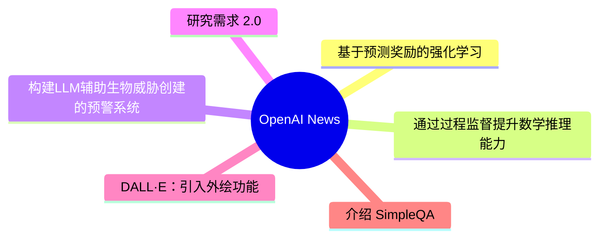
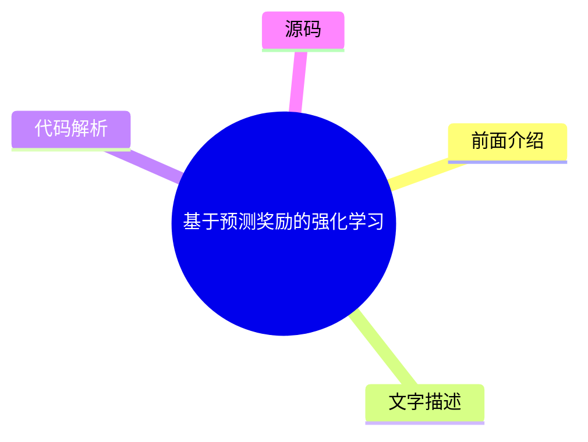
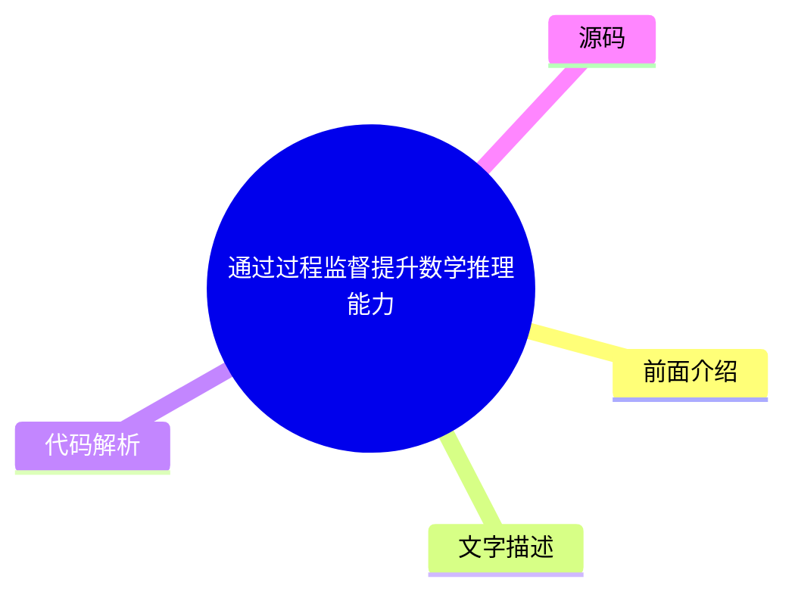
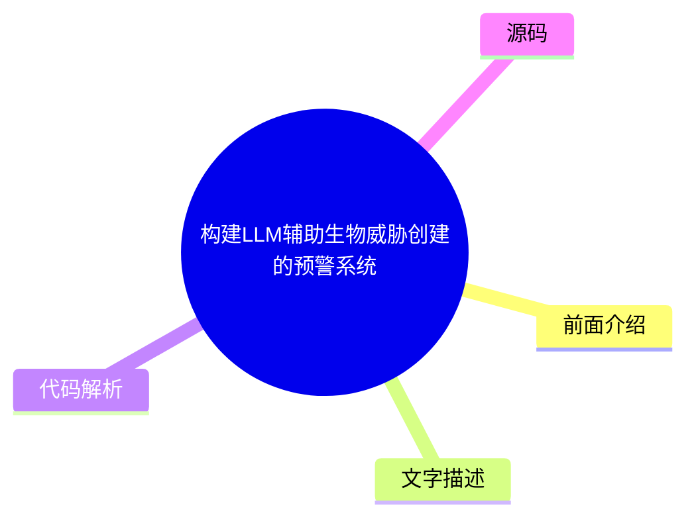
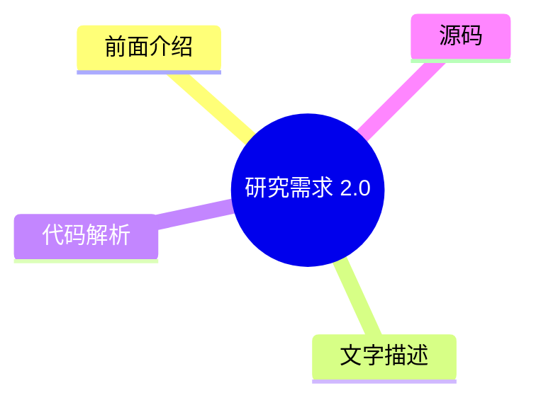
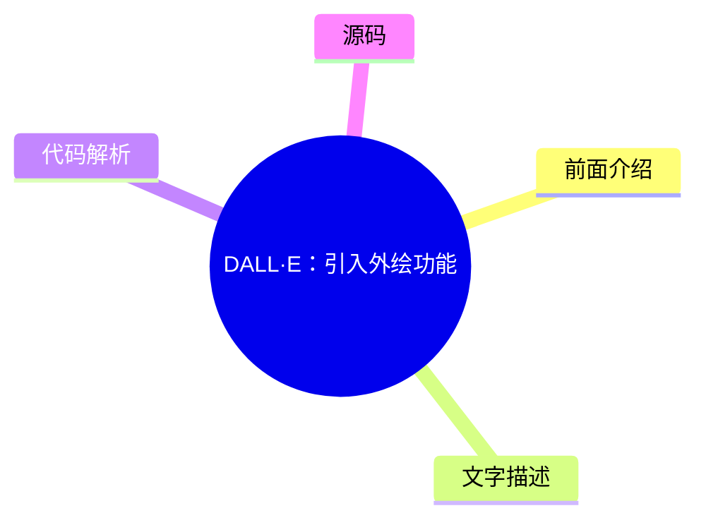
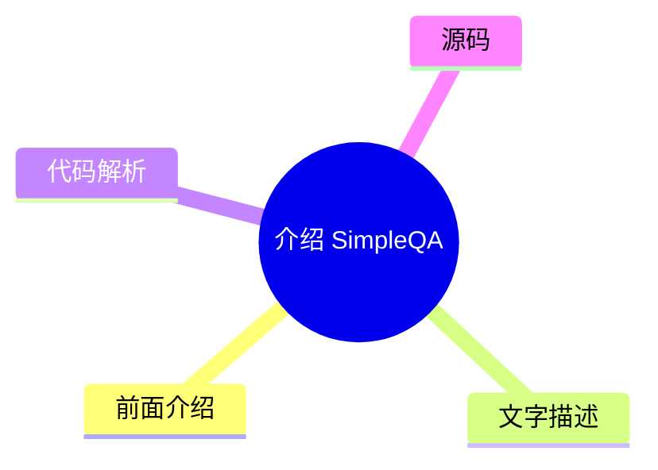

# 🤖 OpenAI News Top 6 (2026-07-29)

## 前面介绍

- 数据源：OpenAI News
- 抓取日期：2026-07-29
- 条目数：6
- 含完整正文：0
- 含代码片段：0
- 组织方式：前面介绍 / 树状图 / 文字描述 / 代码解析 / 源码

## 思维导图

## 详细整理（6 条，0 条含全文，0 条含代码）

### 1. 基于预测奖励的强化学习
- **链接**: [https://openai.com/index/reinforcement-learning-with-prediction-based-rewards](https://openai.com/index/reinforcement-learning-with-prediction-based-rewards)
- **发布**: Wed, 31 Oct 2018 07:00:00 GMT

#### 前面介绍

- 提出随机网络蒸馏（RND）方法
- 通过好奇心机制鼓励智能体探索环境
- 首次在蒙特祖玛的宝藏游戏中超越人类平均表现

#### 树状图

#### 文字描述

- 随机网络蒸馏（RND）是一种基于预测的强化学习方法。
- 该方法利用一个目标网络和一个随机网络来生成环境状态的特征表示。
- 智能体通过最小化随机网络预测值与目标网络输出值之间的差异来获得奖励。
- 这种差异充当了内在动机，激励智能体去探索那些尚未被充分探索的环境状态。
- 实验证明，这种方法能有效解决稀疏奖励问题，提升探索效率。

#### 代码解析

- 本文未提供源码，以下为实现思路或结构解析：
- 1. 初始化两个神经网络：目标网络和随机网络。
- 2. 对于每个环境状态，分别计算目标网络的输出和随机网络的输出。
- 3. 计算两者之间的均方误差（MSE）作为即时奖励。
- 4. 使用标准强化学习算法（如DQN）更新策略网络，同时冻结目标网络和随机网络。

#### 源码

未抓到可展示源码或原文节选。

### 2. 通过过程监督提升数学推理能力
- **链接**: [https://openai.com/index/improving-mathematical-reasoning-with-process-supervision](https://openai.com/index/improving-mathematical-reasoning-with-process-supervision)
- **发布**: Wed, 31 May 2023 07:00:00 GMT

#### 前面介绍

- 提出过程监督而非结果监督
- 通过奖励推理的每一步正确性来训练模型
- 在数学问题解决方面达到新的SOTA

#### 树状图

#### 文字描述

- 研究提出了一种新的数学问题解决方法，通过奖励推理的每一步正确性来训练模型。
- 与传统的仅奖励正确最终答案的“结果监督”不同，这种方法关注推理过程的正确性。
- 这种方法被称为“过程监督”，旨在让模型学会正确的解题步骤。
- 实验表明，过程监督能显著提高模型在数学推理任务上的表现。
- 这种方法不仅适用于数学，也可能适用于其他需要多步推理的任务。

#### 代码解析

- 本文未提供源码，以下为实现思路或结构解析：
- 1. 定义推理步骤的标注数据，即模型输出的每一步推理内容。
- 2. 使用奖励模型对每一步推理进行打分，判断其正确性。
- 3. 将步骤奖励作为训练信号，更新主模型的参数。
- 4. 训练过程中，模型不仅需要关注最终答案，还需要关注中间推理过程的逻辑连贯性。

#### 源码

未抓到可展示源码或原文节选。

### 3. 构建LLM辅助生物威胁创建的预警系统
- **链接**: [https://openai.com/index/building-an-early-warning-system-for-llm-aided-biological-threat-creation](https://openai.com/index/building-an-early-warning-system-for-llm-aided-biological-threat-creation)
- **发布**: Wed, 31 Jan 2024 08:00:00 GMT

#### 前面介绍

- 评估大语言模型辅助创建生物威胁的风险
- 涉及生物学专家和学生进行评估
- 发现GPT-4仅提供轻微提升

#### 树状图

#### 文字描述

- 研究旨在开发一个蓝图，用于评估大型语言模型（LLM）在辅助创建生物威胁方面的风险。
- 研究团队设计了一个评估流程，结合了生物学专家和学生的参与。
- 实验结果显示，GPT-4在辅助创建生物威胁方面仅提供了轻微的提升。
- 这一发现表明，虽然LLM具备一定的能力，但其风险仍处于可控范围内。
- 该研究为AI安全领域提供了重要的参考，有助于制定相关的监管政策。

#### 代码解析

- 本文未提供源码，以下为实现思路或结构解析：
- 1. 设计一系列涉及生物威胁创建的提示词和任务。
- 2. 让模型生成相应的回复或方案。
- 3. 由专家评估这些回复的潜在危害性和可行性。
- 4. 收集数据并分析模型表现，计算其风险等级。

#### 源码

未抓到可展示源码或原文节选。

### 4. 研究需求 2.0
- **链接**: [https://openai.com/index/requests-for-research-2](https://openai.com/index/requests-for-research-2)
- **发布**: Wed, 31 Jan 2018 08:00:00 GMT

#### 前面介绍

- OpenAI发布了新的未解决问题列表
- 包含七项在研究过程中遇到的难题
- 旨在推动社区共同解决

#### 树状图

#### 文字描述

- OpenAI发布了“Requests for Research 2.0”，列出了七项尚未解决的难题。
- 这些问题是在OpenAI的研究过程中产生的，旨在寻找新的研究方向。
- OpenAI希望通过公开这些问题，吸引全球研究者的关注和参与。
- 这七项问题涵盖了AI安全的多个方面，包括对齐、鲁棒性和可解释性。
- OpenAI表示，解决这些问题对于AI的长期发展至关重要。

#### 代码解析

- 本文未提供源码，以下为实现思路或结构解析：
- 1. 整理OpenAI研究团队在过往项目中遇到的瓶颈和挑战。
- 2. 将这些问题转化为具体的、可研究的技术问题。
- 3. 发布问题列表，并邀请学术界和工业界的研究者提出解决方案。
- 4. 建立社区协作机制，促进知识的共享和问题的解决。

#### 源码

未抓到可展示源码或原文节选。

### 5. DALL·E：引入外绘功能
- **链接**: [https://openai.com/index/dall-e-introducing-outpainting](https://openai.com/index/dall-e-introducing-outpainting)
- **发布**: Wed, 31 Aug 2022 07:00:00 GMT

#### 前面介绍

- 支持生成任意尺寸的图像
- 扩展创造力并讲述更大的故事
- 允许用户对图像进行延伸

#### 树状图

#### 文字描述

- DALL·E 现在支持外绘功能，允许用户生成任意尺寸的图像。
- 外绘功能可以扩展图像的边界，将图像内容延伸到原始画布之外。
- 用户可以通过输入提示词，控制外绘区域的内容和风格。
- 这一功能极大地扩展了创意的边界，使得用户可以讲述更完整的故事。
- 外绘功能为图像生成提供了更多的灵活性和可能性。

#### 代码解析

- 本文未提供源码，以下为实现思路或结构解析：
- 1. 接收用户输入的图像和提示词。
- 2. 使用图像处理技术识别图像的边界和内容。
- 3. 根据提示词生成新的图像内容。
- 4. 将新内容与原图进行无缝拼接，生成最终的大尺寸图像。

#### 源码

未抓到可展示源码或原文节选。

### 6. 介绍 SimpleQA
- **链接**: [https://openai.com/index/introducing-simpleqa](https://openai.com/index/introducing-simpleqa)
- **发布**: Wed, 30 Oct 2024 10:00:00 GMT

#### 前面介绍

- 一个衡量模型回答事实性问题的基准
- 专注于回答简短的事实寻求问题
- 旨在评估语言模型的事实准确性

#### 树状图

#### 文字描述

- SimpleQA 是一个用于衡量语言模型回答简短事实寻求问题能力的基准测试。
- 该基准测试的设计目的是评估模型的事实准确性和知识储备。
- 与复杂的推理任务不同，SimpleQA 专注于直接的事实查询。
- 通过 SimpleQA，可以更直观地了解模型在事实性任务上的表现。
- 这个基准测试对于评估和改进模型的知识库具有重要意义。

#### 代码解析

- 本文未提供源码，以下为实现思路或结构解析：
- 1. 构建一个包含大量简短事实问题的数据集。
- 2. 让语言模型回答这些问题。
- 3. 计算模型回答的正确率。
- 4. 将正确率作为评估模型事实准确性的指标。

#### 源码

未抓到可展示源码或原文节选。

