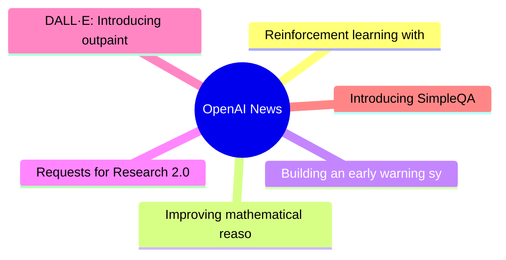
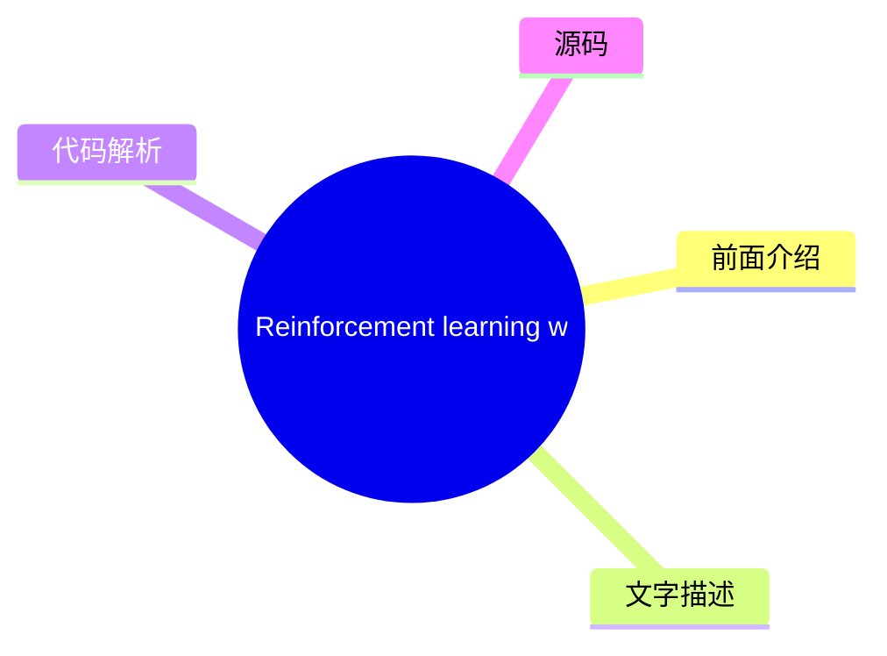
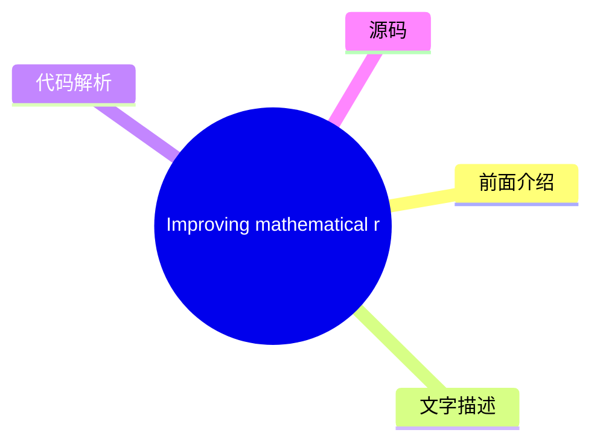
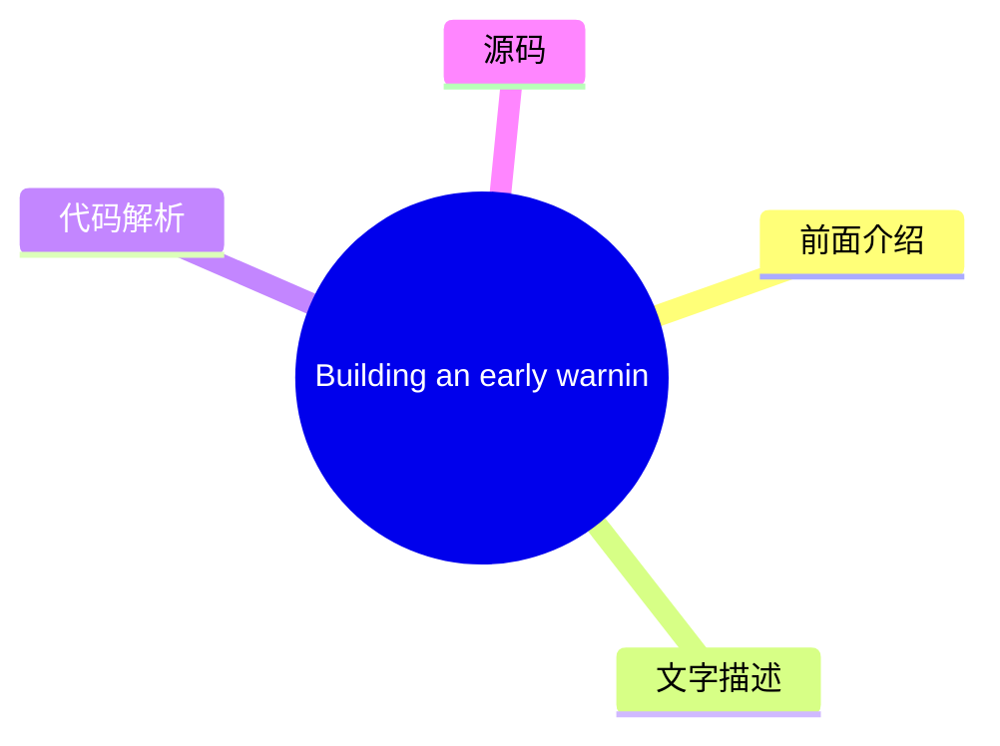
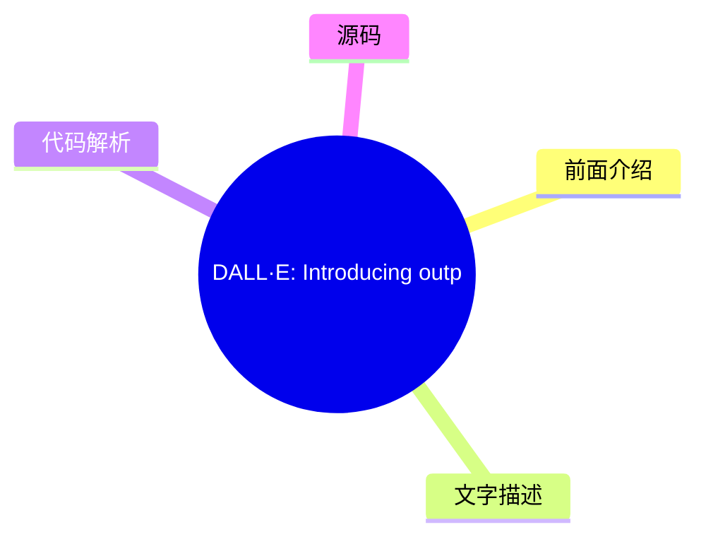

# 🤖 OpenAI News Top 6 (2026-07-30)

## 前面介绍

- 数据源：OpenAI News
- 抓取日期：2026-07-30
- 条目数：6
- 含完整正文：0
- 含代码片段：0
- 组织方式：前面介绍 / 树状图 / 文字描述 / 代码解析 / 源码

## 思维导图

## 详细整理（6 条，0 条含全文，0 条含代码）

### 1. Reinforcement learning with prediction-based rewards
- **链接**: [https://openai.com/index/reinforcement-learning-with-prediction-based-rewards](https://openai.com/index/reinforcement-learning-with-prediction-based-rewards)
- **发布**: Wed, 31 Oct 2018 07:00:00 GMT

#### 前面介绍

- We’ve developed Random Network Distillation (RND), a prediction-based method for encouraging reinforcement learning agents to explore their environments through curiosity, which for the first time exceeds average human performance on Montezuma’s Reve
- 发布时间：Wed, 31 Oct 2018 07:00:00 GMT

#### 树状图

#### 文字描述

- We’ve developed Random Network Distillation (RND), a prediction-based method for encouraging reinforcement learning agents to explore their environments through curiosity, which for the first time exceeds average human performance on Montezuma’s Reve

#### 代码解析

- 本文未检测到明确代码块，内容更偏新闻、观点或方法论。

#### 源码

未抓到可展示源码或原文节选。

### 2. Improving mathematical reasoning with process supervision
- **链接**: [https://openai.com/index/improving-mathematical-reasoning-with-process-supervision](https://openai.com/index/improving-mathematical-reasoning-with-process-supervision)
- **发布**: Wed, 31 May 2023 07:00:00 GMT

#### 前面介绍

- We’ve trained a model to achieve a new state-of-the-art in mathematical problem solving by rewarding each correct step of reasoning (“process supervision”) instead of simply rewarding the correct final answer (“outcome supervision”). In addition to b
- 发布时间：Wed, 31 May 2023 07:00:00 GMT

#### 树状图

#### 文字描述

- We’ve trained a model to achieve a new state-of-the-art in mathematical problem solving by rewarding each correct step of reasoning (“process supervision”) instead of simply rewarding the correct final answer (“outcome supervision”). In addition to b

#### 代码解析

- 本文未检测到明确代码块，内容更偏新闻、观点或方法论。

#### 源码

未抓到可展示源码或原文节选。

### 3. Building an early warning system for LLM-aided biological threat creation
- **链接**: [https://openai.com/index/building-an-early-warning-system-for-llm-aided-biological-threat-creation](https://openai.com/index/building-an-early-warning-system-for-llm-aided-biological-threat-creation)
- **发布**: Wed, 31 Jan 2024 08:00:00 GMT

#### 前面介绍

- We’re developing a blueprint for evaluating the risk that a large language model (LLM) could aid someone in creating a biological threat. In an evaluation involving both biology experts and students, we found that GPT-4 provides at most a mild uplift
- 发布时间：Wed, 31 Jan 2024 08:00:00 GMT

#### 树状图

#### 文字描述

- We’re developing a blueprint for evaluating the risk that a large language model (LLM) could aid someone in creating a biological threat. In an evaluation involving both biology experts and students, we found that GPT-4 provides at most a mild uplift

#### 代码解析

- 本文未检测到明确代码块，内容更偏新闻、观点或方法论。

#### 源码

未抓到可展示源码或原文节选。

### 4. Requests for Research 2.0
- **链接**: [https://openai.com/index/requests-for-research-2](https://openai.com/index/requests-for-research-2)
- **发布**: Wed, 31 Jan 2018 08:00:00 GMT

#### 前面介绍

- We’re releasing a new batch of seven unsolved problems which have come up in the course of our research at OpenAI.
- 发布时间：Wed, 31 Jan 2018 08:00:00 GMT

#### 树状图

#### 文字描述

- We’re releasing a new batch of seven unsolved problems which have come up in the course of our research at OpenAI.

#### 代码解析

- 本文未检测到明确代码块，内容更偏新闻、观点或方法论。

#### 源码

未抓到可展示源码或原文节选。

### 5. DALL·E: Introducing outpainting
- **链接**: [https://openai.com/index/dall-e-introducing-outpainting](https://openai.com/index/dall-e-introducing-outpainting)
- **发布**: Wed, 31 Aug 2022 07:00:00 GMT

#### 前面介绍

- Extend creativity and tell a bigger story with DALL·E images of any size.
- 发布时间：Wed, 31 Aug 2022 07:00:00 GMT

#### 树状图

#### 文字描述

- Extend creativity and tell a bigger story with DALL·E images of any size.

#### 代码解析

- 本文未检测到明确代码块，内容更偏新闻、观点或方法论。

#### 源码

未抓到可展示源码或原文节选。

### 6. Introducing SimpleQA
- **链接**: [https://openai.com/index/introducing-simpleqa](https://openai.com/index/introducing-simpleqa)
- **发布**: Wed, 30 Oct 2024 10:00:00 GMT

#### 前面介绍

- A factuality benchmark called SimpleQA that measures the ability for language models to answer short, fact-seeking questions.
- 发布时间：Wed, 30 Oct 2024 10:00:00 GMT

#### 树状图

#### 文字描述

- A factuality benchmark called SimpleQA that measures the ability for language models to answer short, fact-seeking questions.

#### 代码解析

- 本文未检测到明确代码块，内容更偏新闻、观点或方法论。

#### 源码

未抓到可展示源码或原文节选。

