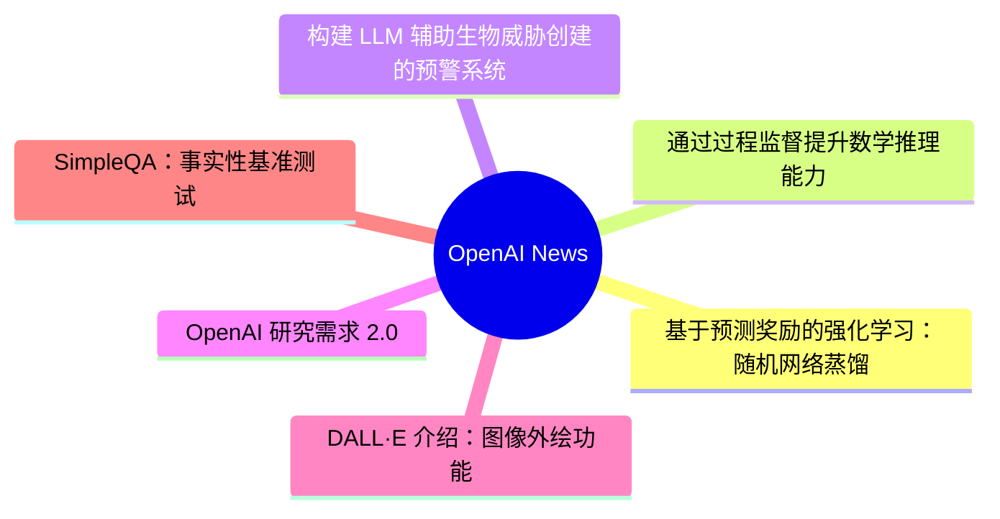
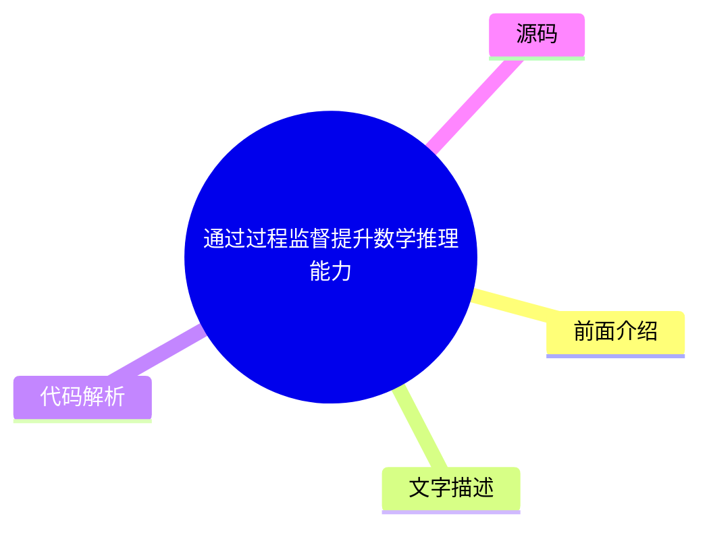
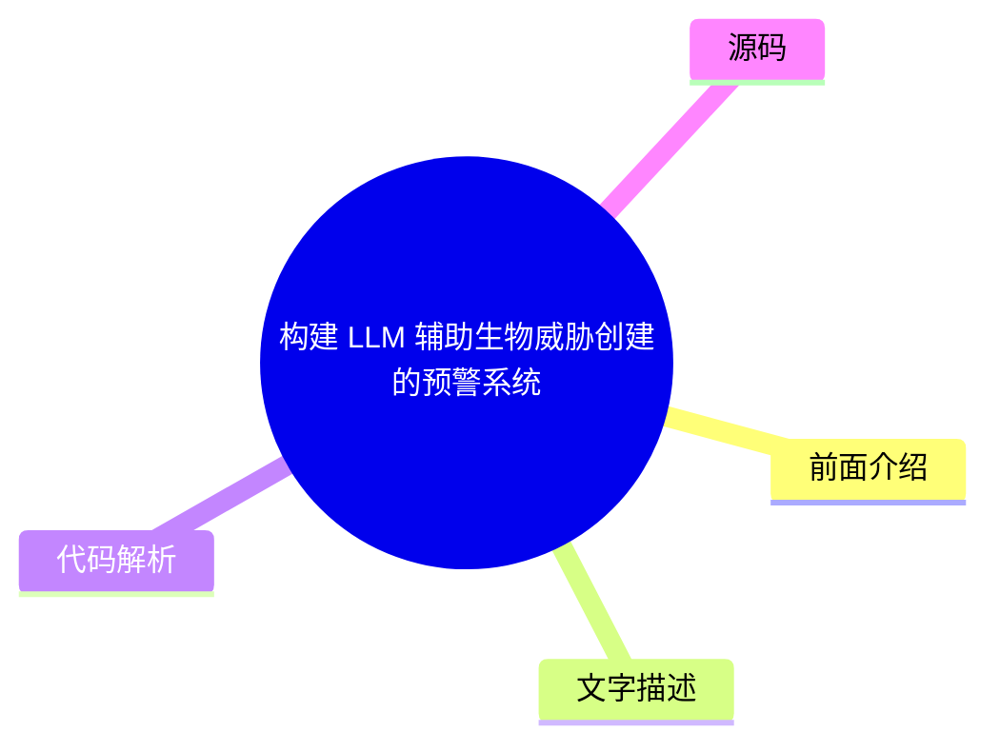
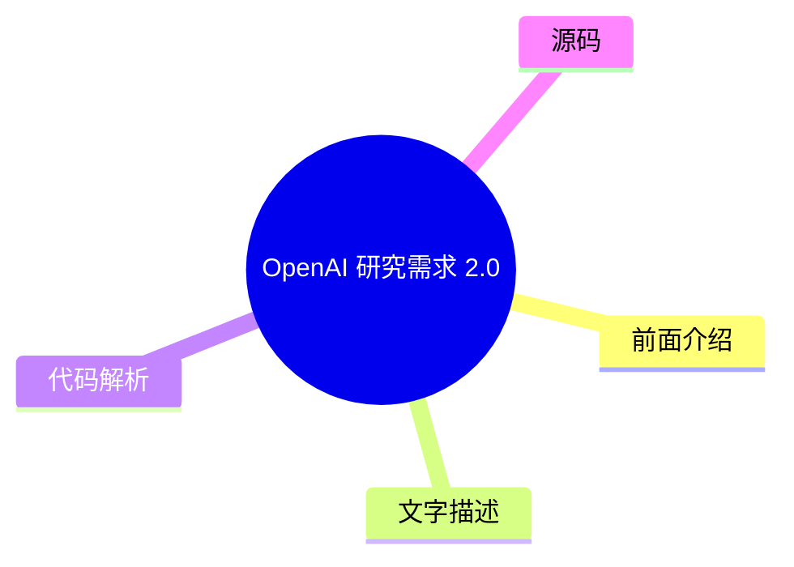
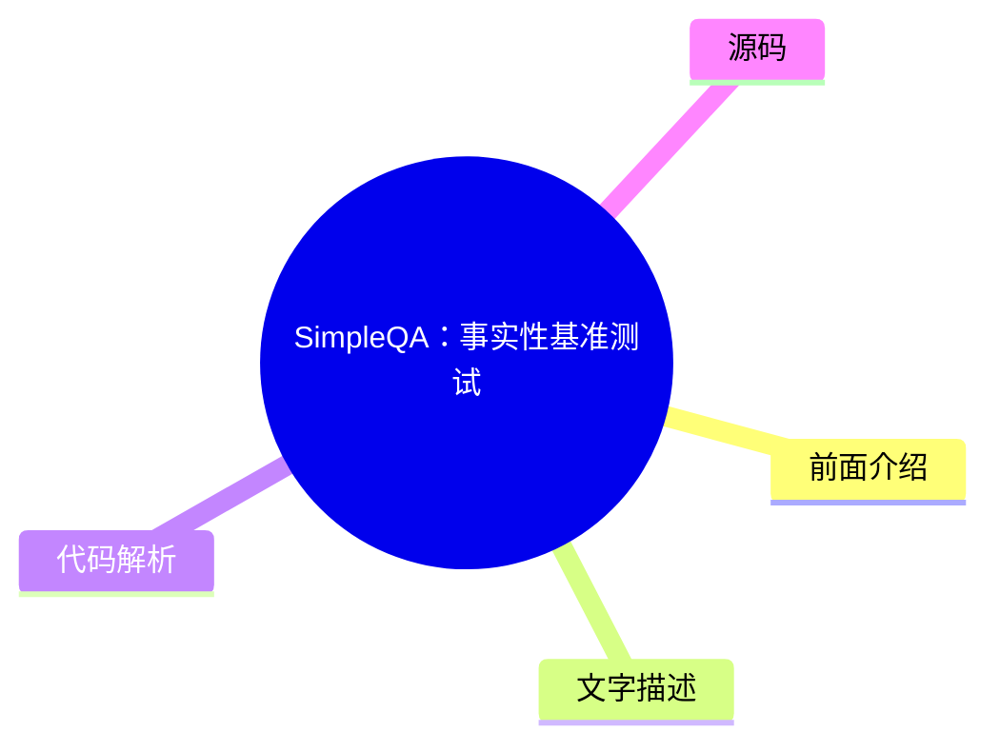

# 🤖 OpenAI News Top 6 (2026-08-01)

## 前面介绍

- 数据源：OpenAI News
- 抓取日期：2026-08-01
- 条目数：6
- 含完整正文：6
- 含代码片段：0
- 组织方式：前面介绍 / 树状图 / 文字描述 / 代码解析 / 源码

## 思维导图

## 详细整理（6 条，6 条含全文，0 条含代码）

### 1. 基于预测奖励的强化学习：随机网络蒸馏
- **链接**: [https://openai.com/index/reinforcement-learning-with-prediction-based-rewards](https://openai.com/index/reinforcement-learning-with-prediction-based-rewards)
- **发布**: Wed, 31 Oct 2018 07:00:00 GMT

#### 前面介绍

- 提出了一种通过好奇心机制鼓励探索的预测方法 RND。
- 首次在《蒙兹玛的复仇》游戏中超越平均人类表现。
- 通过测量对固定随机神经网络输出的预测难度来激励探索。

#### 树状图

#### 文字描述

- RND 是一种预测性方法，用于鼓励强化学习代理通过好奇心探索环境。
- 该方法在《蒙兹玛的复仇》游戏中首次超越了平均人类表现，能够发现所有24个房间并解决第一关。
- RND 通过测量代理在访问状态上预测固定随机神经网络输出的难度来激励代理访问不熟悉的状态。
- 在陌生状态下，预测输出很难，因此奖励较高。该方法可应用于任何强化学习算法，实现简单且可高效扩展。
- 在1024个 rollout 工作员的实验中，RND 实现了平均回报 10K，最佳回报 14.5K，并发现了20到22个房间。
- 在较小的实验中，有一组运行实现了17.5K的最佳回报，成功通过了第一关并发现了所有24个房间。

#### 代码解析

- 本
- 文
- 未
- 提
- 供
- 源
- 码
- ，
- 以
- 下
- 为
- 实
- 现
- 思
- 路
- 或
- 结
- 构
- 解
- 析
- ：
- 

- 1
- .
-  
- 使
- 用
- 一
- 个
- 固
- 定
- 的
- 随
- 机
- 神
- 经
- 网
- 络
- 作
- 为
- 目
- 标
- 函
- 数
- ，
- 其
- 输
- 出
- 对
- 于
- 所
- 有
- 状
- 态
- 都
- 是
- 固
- 定
- 的
- 。
- 

- 2
- .
-  
- 训
- 练
- 一
- 个
- 可
- 学
- 习
- 的
- 网
- 络
- 来
- 预
- 测
- 固
- 定
- 网
- 络
- 的
- 输
- 出
- 。
- 

- 3
- .
-  
- 在
- 训
- 练
- 过
- 程
- 中
- ，
- 对
- 于
- 已
- 访
- 问
- 的
- 状
- 态
- ，
- 可
- 学
- 习
- 网
- 络
- 应
- 该
- 能
- 够
- 很
- 好
- 地
- 预
- 测
- 固
- 定
- 网
- 络
- 的
- 输
- 出
- ，
- 因
- 此
- 损
- 失
- 较
- 小
- ；
- 对
- 于
- 未
- 访
- 问
- 的
- 状
- 态
- ，
- 预
- 测
- 误
- 差
- 较
- 大
- ，
- 从
- 而
- 产
- 生
- 较
- 高
- 的
- 奖
- 励
- 信
- 号
- 。

#### 源码

#### 中文节选

我们开发了 [随机网络蒸馏 (RND)](/index/reinforcement-learning-with-prediction-based-rewards/#RNDjump)，这是一种基于预测的方法，旨在通过好奇心鼓励强化学习代理探索其环境，这在 [《蒙齐玛的复仇》](https://www.retrogames.cz/play_124-Atari2600.php?language=EN) 上首次超越了平均人类表现。

我们开发了 [随机网络蒸馏 (RND)](/index/reinforcement-learning-with-prediction-based-rewards/#RNDjump)，这是一种基于预测的方法，旨在通过好奇心鼓励强化学习代理探索其环境，这在 [《蒙齐玛的复仇》](https://www.retrogames.cz/play_124-Atari2600.php?language=EN) 上首次超越了平均人类表现。RND 实现了最先进的性能，定期找到所有 24 个房间，并在不使用演示或访问游戏底层状态的情况下解决了第一关。

RND 通过测量在访问过的状态下预测固定随机神经网络的输出的难度，来激励访问 [不熟悉的状态](/index/reinforcement-learning-with-prediction-based-rewards/#implementationjump)。在不熟悉的状态下，很难猜出输出，因此奖励很高。它可以应用于任何强化学习算法，实现简单且可高效扩展。下面我们发布了 RND 的参考实现，可以重现我们论文中的结果。

For an agent to achieve a desired goal it must first explore what is possible in its environment and what constitutes progress towards the goal. Many games’ reward signals provide a curriculum such that even simple exploration strategies are sufficient for achieving the game’s goal. In the [seminal work introducing DQN(opens in a new window)](https://www.nature.com/articles/nature14236), Montezuma’s Revenge was the **only game where DQN got 0% of the average human score (4.7K)**. Simple exploration strategies are highly unlikely to gather any rewards, or see more than a few of the 24 rooms in the level. Since then advances in Montezuma’s Revenge have been seen by many as synonymous with advances in exploration.

Significant progress was made in [2016(opens in a new window)](https://arxiv.org/abs/1606.01868) by combining DQN with a count-based exploration bonus, resulting in an agent that explored 15 rooms, achieved a high score of 6.6K and an average reward of around 3.7K. Since then, [significant(opens in a new window)](https://arxiv.org/abs/1805.11593) [improvement(opens in a new window)](https://arxiv.org/abs/1805.11592) in the score achieved by an RL agent has come only from exploiting access to [demonstrations(opens in a new window)](https://blog.openai.com/learning-montezumas-revenge-from-a-single-demonstration/) from human [experts(opens in a new window)](https://arxiv.org/abs/1809.03447), or access to the underlying state of the [emu

#### 完整正文（中文）

我们开发了 [随机网络蒸馏 (RND)](/index/reinforcement-learning-with-prediction-based-rewards/#RNDjump)，这是一种基于预测的方法，旨在通过好奇心鼓励强化学习代理探索其环境，这在 [《蒙齐玛的复仇》](https://www.retrogames.cz/play_124-Atari2600.php?language=EN) 上首次超越了平均人类表现。

我们开发了 [随机网络蒸馏 (RND)](/index/reinforcement-learning-with-prediction-based-rewards/#RNDjump)，这是一种基于预测的方法，旨在通过好奇心鼓励强化学习代理探索其环境，这在 [《蒙齐玛的复仇》](https://www.retrogames.cz/play_124-Atari2600.php?language=EN) 上首次超越了平均人类表现。RND 实现了最先进的性能，定期找到所有 24 个房间，并在不使用演示或访问游戏底层状态的情况下解决了第一关。

RND 通过测量在访问过的状态下预测固定随机神经网络的输出的难度，来激励访问 [不熟悉的状态](/index/reinforcement-learning-with-prediction-based-rewards/#implementationjump)。在不熟悉的状态下，很难猜出输出，因此奖励很高。它可以应用于任何强化学习算法，实现简单且可高效扩展。下面我们发布了 RND 的参考实现，可以重现我们论文中的结果。

For an agent to achieve a desired goal it must first explore what is possible in its environment and what constitutes progress towards the goal. Many games’ reward signals provide a curriculum such that even simple exploration strategies are sufficient for achieving the game’s goal. In the [seminal work introducing DQN(opens in a new window)](https://www.nature.com/articles/nature14236), Montezuma’s Revenge was the **only game where DQN got 0% of the average human score (4.7K)**. Simple exploration strategies are highly unlikely to gather any rewards, or see more than a few of the 24 rooms in the level. Since then advances in Montezuma’s Revenge have been seen by many as synonymous with advances in exploration.

Significant progress was made in [2016(opens in a new window)](https://arxiv.org/abs/1606.01868) by combining DQN with a count-based exploration bonus, resulting in an agent that explored 15 rooms, achieved a high score of 6.6K and an average reward of around 3.7K. Since then, [significant(opens in a new window)](https://arxiv.org/abs/1805.11593) [improvement(opens in a new window)](https://arxiv.org/abs/1805.11592) in the score achieved by an RL agent has come only from exploiting access to [demonstrations(opens in a new window)](https://blog.openai.com/learning-montezumas-revenge-from-a-single-demonstration/) from human [experts(opens in a new window)](https://arxiv.org/abs/1809.03447), or access to the underlying state of the [emulator(opens in a new window)](https://blog.openai.com/learning-montezumas-revenge-from-a-single-demonstration/).

We ran a large scale RND experiment with 1024 rollout workers resulting in a **mean return of 10K over 9 runs** and a best mean return of 14.5K. Each run discovered between 20 and 22 rooms. In addition one of our smaller scale but longer running experiments yielded one run (out of 10) that achieved a **best return of 17.5K corresponding to passing the first level and finding all 24 rooms**. The graph below compares these two experiments showing the mean return as a function of parameter updates.

The visualization below shows the progress of the smaller scale experiment in discovering the rooms. Curiosity drives the agent to discover new rooms and find ways of increasing the in-game score, and this extrinsic reward drives it to revisit those rooms later in the training.

Prior to developing RND, we, together with collaborators from UC Berkeley, investigated learning without *any* environment-specific rewards. Curiosity gives us an easier way to teach agents to interact with any environment, rather than via an extensively engineered task-specific reward function that we hope corresponds to solving a task. Projects like [ALE(opens in a new window)](https://github.com/mgbellemare/Arcade-Learning-Environment), [Universe(opens in a new window)](https://github.com/openai/universe), [Malmo(opens in a new window)](https://github.com/Microsoft/malmo), [Gym(opens in a new window)](https://github.com/openai/gym), [Gym Retro(opens in a new window)](https://github.com/openai/retro/), [Unity(opens in a new window)](https://github.com/Unity-Technologies/ml-agents), [DeepMind Lab(opens in a new window)](https://github.com/deepmind/lab), [CommAI(opens in a new window)](https://github.com/facebookresearch/CommAI-env) make a large number of simulated environments available for an agent to interact with through a standardized interface. An agent using a generic reward function not specific to the particulars of an environment can acquire a basic level of competency in a wide range of environments, resulting in the agent’s ability to determine what useful behaviors are even in the absence of carefully engineered rewards.

在标准的强化学习设置中，在每个离散时间步，智能体向环境发送一个动作，环境通过发出下一个观测、转换奖励和回合结束指示器来做出响应。在我们之前的论文中，我们要求环境只输出下一个观测。在那里，智能体从其经验中学习一个下一状态预测模型，并使用预测误差作为内在奖励。结果，它被吸引到不可预测的事物上。例如，只有当分数显示在屏幕上且变化难以预测时，它才会发现游戏分数的变化是有奖励的。智能体通常会发现与新物体的交互是有奖励的，因为此类交互的结果通常比环境的其他方面更难预测。

与之前的工作类似，我们通过选择对观测特征进行建模，试图避免对环境的所有方面（无论是否相关）进行建模。令人惊讶的是，我们发现即使是随机特征也效果良好。

我们在 50 多个不同的环境中测试了我们的智能体，观察到了从看似随机的动作到有意与环境交互的一系列能力水平。令我们惊讶的是，在某些环境中，尽管游戏目标没有通过外在奖励传达给智能体，但智能体还是实现了游戏目标。

**Breakout** 在训练初期看到新的砖块配置时，以及训练数小时后首次通过关卡时，智能体会经历内在奖励的峰值。

**Pong** 我们训练智能体同时控制两个挡板，它学会了保持球在比赛中，从而产生长回合。即使在与游戏内 AI 对战时，智能体也试图延长游戏而不是获胜。

**保龄球** 代理学会玩这款游戏比那些直接训练以最大化（裁剪后的）外在奖励的代理玩得更好。我们认为这是因为代理被吸引到了击球后记分牌难以预测的闪烁上。

**马里奥** 内在奖励与通过关卡的游戏目标高度一致。代理因为无法预测新发现区域的细节而获得奖励。结果，代理发现了 11 个关卡，找到了秘密房间，甚至击败了 Boss。

就像赌徒被老虎机的随机结果所吸引一样，代理有时会因为“噪点电视”问题而陷入好奇心的陷阱。代理在环境中找到了一个随机源并不断观察它，总是对这样的转换获得很高的内在奖励。观看一台播放静态噪声的电视就是这样一个陷阱的例子。我们通过将代理放置在一个播放随机频道的电视的 Unity 迷宫环境中，直观地演示了这一点。

虽然噪点电视问题在理论上是一个担忧，但对于像《蒙提祖玛的复仇》这样 largely deterministic（很大程度上确定性的）环境，我们预计好奇心会驱使代理去发现房间并与物体交互。我们尝试了几种基于下一状态预测的好奇心变体，将探索奖励与游戏分数相结合。

在这些实验中，代理通过一个噪点控制器控制环境，该控制器以一定的概率重复上一次动作而不是当前动作。这种带有粘性动作的设置被建议作为在完全确定性的游戏（如 Atari）上训练代理的最佳实践，以防止死记硬背。粘性动作使得从房间到房间的转换变得不可预测。

由于下一状态预测本质上容易受到噪点电视问题的影响，我们确定了以下与预测误差相关的来源：

- **因素 1**：当预测器无法从之前看到的例子中泛化时，预测误差很高。因此，新的体验对应着高预测误差。

- **因素 2**：预测误差很高，因为预测目标是随机的。
- **因素 3**：预测误差很高，因为预测所必需的信息缺失，或者预测器模型类的限制太大，无法拟合目标函数的复杂性。

我们确定因素 1 是一个有用的误差来源，因为它量化了经验的 novelty（新颖性），而因素 2 和 3 导致了“噪点电视问题”。为了避开因素 2 和 3，我们开发了 RND，这是一种新的探索奖励，其基于**给定下一个状态本身，预测固定且随机初始化的神经网络在下一个状态下的输出**。

直觉是，预测模型在与其训练过的状态相似的状态上具有较低的误差。特别是，智能体对随机初始化的神经网络输出的预测，在新颖状态下的准确性将低于在智能体经常访问的状态下的准确性。使用合成预测问题的优势在于，我们可以通过选择预测器与目标网络具有相同的架构，使其成为确定性的（绕过因素 2）并且位于预测器可以表示的函数类内部（绕过因素 3）。这些选择使得 RND 免受噪点电视问题的影响。

我们通过 [Proximal Policy Optimization(opens in a new window)](https://arxiv.org/abs/1707.06347) ([PPO(opens in a new window)](https://blog.openai.com/openai-baselines-ppo/#ppo)) 的一个变体，将探索奖励与外在奖励结合起来，该变体**为两个奖励流使用两个价值头**。这使我们能够为不同的奖励使用不同的折扣率，并结合回合和非回合回报。**凭借这种额外的灵活性，我们的最佳智能体通常可以在第一次玩《蒙兹玛的复仇》的第一关时找到 22 个房间，并在找到剩余两个房间后偶尔通过第一关**。该方法在 Venture 和 Gravitar 上取得了最先进的性能。

下方的 RND 奖励可视化显示了《蒙兹玛的复仇》一局中内在奖励的图表，其中智能体首次找到了火把。

像对嘈杂电视问题的易感性这样的大局考量，对于选择一个好的探索算法很重要。然而，我们发现在我们简单的算法中，把看似微小的细节做对，是让一个从未……（截断，原文 14022+ 字符）

### 2. 通过过程监督提升数学推理能力
- **链接**: [https://openai.com/index/improving-mathematical-reasoning-with-process-supervision](https://openai.com/index/improving-mathematical-reasoning-with-process-supervision)
- **发布**: Wed, 31 May 2023 07:00:00 GMT

#### 前面介绍

- 提出通过奖励推理过程中的每一步正确性来训练模型。
- 相比结果监督，过程监督能显著减少幻觉并提高模型的可解释性。
- 在数学领域证明了过程监督不仅性能更好，而且没有产生对齐代价。

#### 树状图

#### 文字描述

- 通过奖励模型在推理链条中的每一步正确性（过程监督）而非仅仅奖励最终答案（结果监督），模型在数学问题解决上达到了新的最先进水平。
- 过程监督具有重要的对齐益处，因为它直接训练模型生成人类认可的思维链。
- 研究表明，过程监督在数学领域实际上产生了负的对齐代价，即性能提升的同时也增强了安全性。
- 评估使用了 MATH 数据集，结果显示过程监督奖励模型在考虑更多解决方案时，性能差距会进一步扩大。
- 过程监督直接奖励模型遵循对齐的思维链，因为每个步骤都受到精确监督，这比结果监督更容易被审查。
- 研究释放了完整的过程监督数据集，以鼓励相关研究，并探讨了该方法在其他领域的泛化能力。

#### 代码解析

- 本
- 文
- 未
- 提
- 供
- 源
- 码
- ，
- 以
- 下
- 为
- 实
- 现
- 思
- 路
- 或
- 结
- 构
- 解
- 析
- ：
- 

- 1
- .
-  
- 构
- 建
- 一
- 个
- 奖
- 励
- 模
- 型
- ，
- 该
- 模
- 型
- 能
- 够
- 对
- 推
- 理
- 过
- 程
- 中
- 的
- 每
- 一
- 步
- 进
- 行
- 打
- 分
- 。
- 

- 2
- .
-  
- 训
- 练
- 时
- ，
- 不
- 仅
- 根
- 据
- 最
- 终
- 答
- 案
- 是
- 否
- 正
- 确
- 进
- 行
- 奖
- 励
- ，
- 还
- 根
- 据
- 每
- 一
- 步
- 推
- 理
- 是
- 否
- 符
- 合
- 人
- 类
- 专
- 家
- 的
- 步
- 骤
- 进
- 行
- 奖
- 励
- 。
- 

- 3
- .
-  
- 这
- 种
- 方
- 法
- 可
- 以
- 减
- 少
- 模
- 型
- 产
- 生
- 幻
- 觉
- 的
- 可
- 能
- 性
- ，
- 因
- 为
- 它
- 鼓
- 励
- 模
- 型
- 遵
- 循
- 人
- 类
- 认
- 可
- 的
- 过
- 程
- 。

#### 源码

#### 中文节选

We’ve trained a model to achieve a new state-of-the-art in mathematical problem solving by rewarding each correct step of reasoning (“process supervision”) instead of simply rewarding the correct final answer (“outcome supervision”). In addition to boosting performance relative to outcome supervision, process supervision also has an important alignment benefit: it directly trains the model to produce a chain-of-thought that is endorsed by humans.

In recent years, large language models have greatly improved in their ability to perform complex multi-step reasoning. However, even state-of-the-art models still produce logical mistakes, often called *hallucinations*. Mitigating hallucinations is a critical step towards building aligned AGI.

We can train reward models to detect hallucinations using either *outcome supervision*, which provides feedback based on a final result, or *process supervision*, which provides feedback for each individual step in a chain-of-thought. Building on previous work 1, we conduct a detailed comparison of these two methods using the MATH dataset

as our testbed. We find that process supervision leads to significantly better performance, even when judged by outcomes. To encourage related research, we release our full dataset of process supervision.

[2](#citation-bottom-2)Process supervision has several alignment advantages over outcome supervision. It directly rewards the model for following an aligned chain-of-thought, since each step in the process receives precise supervision. Process supervision is also more likely to produce interpretable reasoning, since it encourages the model to follow a human-approved process. In contrast, outcome supervision may reward an unaligned process, and it is generally harder to scrutinize.

In some cases, safer methods for AI systems can lead to reduced performance 3, a cost which is known as an 

*对齐税*。总体而言，由于部署最强大模型的压力，任何对齐税都可能阻碍对齐方法的采用。我们下面的结果表明，过程监督实际上会产生负面的对齐税，至少在数学领域是如此。这可能会增加过程监督的采用，我们相信这将带来积极的对齐副作用。

我们使用 MATH 测试集中的问题来评估我们的过程监督和结果监督奖励模型。我们为每个问题生成许多解决方案，然后选择每个奖励模型排名最高的解决方案。该图显示了所选解决方案达到正确最终答案的百分比，作为所考虑的解决方案数量的函数。过程监督奖励模型不仅整体表现更好，而且随着我们为每个问题考虑的解决方案数量增加，性能差距也在扩大。这向我们表明，过程监督奖励模型要可靠得多。

我们在下面展示了 10 个问题和解决方案，以及关于奖励模型优缺点的评论。

It is unk

#### 完整正文（中文）

We’ve trained a model to achieve a new state-of-the-art in mathematical problem solving by rewarding each correct step of reasoning (“process supervision”) instead of simply rewarding the correct final answer (“outcome supervision”). In addition to boosting performance relative to outcome supervision, process supervision also has an important alignment benefit: it directly trains the model to produce a chain-of-thought that is endorsed by humans.

In recent years, large language models have greatly improved in their ability to perform complex multi-step reasoning. However, even state-of-the-art models still produce logical mistakes, often called *hallucinations*. Mitigating hallucinations is a critical step towards building aligned AGI.

We can train reward models to detect hallucinations using either *outcome supervision*, which provides feedback based on a final result, or *process supervision*, which provides feedback for each individual step in a chain-of-thought. Building on previous work 1, we conduct a detailed comparison of these two methods using the MATH dataset

as our testbed. We find that process supervision leads to significantly better performance, even when judged by outcomes. To encourage related research, we release our full dataset of process supervision.

[2](#citation-bottom-2)Process supervision has several alignment advantages over outcome supervision. It directly rewards the model for following an aligned chain-of-thought, since each step in the process receives precise supervision. Process supervision is also more likely to produce interpretable reasoning, since it encourages the model to follow a human-approved process. In contrast, outcome supervision may reward an unaligned process, and it is generally harder to scrutinize.

In some cases, safer methods for AI systems can lead to reduced performance 3, a cost which is known as an 

*对齐税*。总的来说，由于部署最强大模型的压力，任何对齐税都可能阻碍对齐方法的采用。我们下面的结果表明，过程监督实际上会产生负面的对齐税，至少在数学领域是这样。这可能会增加过程监督的采用，我们认为这会产生积极的对齐副作用。

我们使用 MATH 测试集中的问题来评估我们的过程监督和结果监督奖励模型。我们为每个问题生成许多解决方案，然后选择每个奖励模型排名最高的解决方案。该图显示了所选解决方案达到正确最终答案的百分比，作为所考虑的解决方案数量的函数。过程监督奖励模型不仅在整体上表现更好，而且当我们考虑每个问题更多的解决方案时，性能差距会扩大。这向我们表明，过程监督奖励模型要可靠得多。

我们在下面展示了 10 个问题和解决方案，以及对奖励模型优缺点的评论。

目前尚不清楚这些结果在数学领域之外有多广泛的推广性，我们认为未来的工作探索过程监督在其他领域的影响非常重要。如果这些结果能够推广，我们可能会发现过程监督给了我们两全其美的方法——一种既比结果监督更高效，又更对齐的方法。

## 参考文献

## 作者

## 贡献者

Bowen Baker, Teddy Lee, John Schulman, Greg Brockman, Kendra Rimbach, Hannah Wong, Thomas Degry

### 3. 构建 LLM 辅助生物威胁创建的预警系统
- **链接**: [https://openai.com/index/building-an-early-warning-system-for-llm-aided-biological-threat-creation](https://openai.com/index/building-an-early-warning-system-for-llm-aided-biological-threat-creation)
- **发布**: Wed, 31 Jan 2024 08:00:00 GMT

#### 前面介绍

- 开发了评估 LLM 助长生物威胁创建风险的蓝图。
- 研究发现 GPT-4 对生物威胁创建准确性的提升最多仅为轻微。
- 该评估旨在作为潜在的“触发器”，警示需要谨慎和进一步测试。

#### 树状图

#### 文字描述

- 研究旨在开发一种评估方法，以衡量大型语言模型是否可能帮助恶意行为者创建生物威胁。
- 评估涉及生物学专家和学生，结果显示 GPT-4 在准确性和完整性上仅提供了轻微的提升。
- 专家组的准确率平均提高了 0.88 分（满分10分），学生组提高了 0.25 分，但效果在统计学上并不显著。
- 研究发现，信息获取本身不足以创建生物威胁，且该评估未测试物理构建威胁的成功情况。
- 研究强调了需要更多关于性能阈值的研究，以确定是否有意义的增加风险。
- 该评估是 OpenAI 准备框架的一部分，旨在投资改进 AI 安全风险的评估方法。

#### 代码解析

- 本
- 文
- 未
- 提
- 供
- 源
- 码
- ，
- 以
- 下
- 为
- 实
- 现
- 思
- 路
- 或
- 结
- 构
- 解
- 析
- ：
- 

- 1
- .
-  
- 设
- 计
- 评
- 估
- 任
- 务
- ，
- 涵
- 盖
- 生
- 物
- 威
- 胁
- 创
- 建
- 过
- 程
- 的
- 五
- 个
- 阶
- 段
- ：
- 构
- 思
- 、
- 获
- 取
- 、
- 扩
- 增
- 、
- 配
- 方
- 和
- 释
- 放
- 。
- 

- 2
- .
-  
- 将
- 参
- 与
- 者
- 分
- 为
- 对
- 照
- 组
- （
- 仅
- 访
- 问
- 互
- 联
- 网
- ）
- 和
- 实
- 验
- 组
- （
- 访
- 问
-  
- G
- P
- T
- -
- 4
- ）
- ，
- 比
- 较
- 两
- 组
- 在
- 各
- 项
- 指
- 标
- 上
- 的
- 表
- 现
- 。
- 

- 3
- .
-  
- 评
- 估
- 指
- 标
- 包
- 括
- 准
- 确
- 性
- 、
- 完
- 整
- 性
- 、
- 创
- 新
- 性
- 、
- 耗
- 时
- 和
- 自
- 评
- 难
- 度
- ，
- 以
- 全
- 面
- 衡
- 量
- 模
- 型
- 的
- 影
- 响
- 。

#### 源码

#### 中文节选

We’re developing a blueprint for evaluating the risk that a large language model (LLM) could aid someone in creating a biological threat.

In an evaluation involving both biology experts and students, we found that GPT‑4 provides at most a mild uplift in biological threat creation accuracy. While this uplift is not large enough to be conclusive, our finding is a starting point for continued research and community deliberation.

*Note: As part of our* *Preparedness Framework**, we are investing in the development of improved evaluation methods for AI-enabled safety risks. We believe that these efforts would benefit from broader input, and that methods-sharing could also be of value to the AI risk research community. To this end, we are presenting some of our early work—today, focused on biological risk. We look forward to community feedback, and to sharing more of our ongoing research.* 

**Background.** As OpenAI and other model developers build more capable AI systems, the potential for both beneficial and harmful uses of AI will grow. One potentially harmful use, highlighted by researchers and policymakers, is the ability for AI systems to assist malicious actors in creating biological threats (e.g., see [White House 2023(opens in a new window)](https://www.whitehouse.gov/briefing-room/presidential-actions/2023/10/30/executive-order-on-the-safe-secure-and-trustworthy-development-and-use-of-artificial-intelligence/), [Lovelace 2022(opens in a new window)](https://www.washingtontimes.com/news/2022/sep/12/ai-powered-biological-warfare-biggest-issue-former/), [Sandbrink 2023(opens in a new window)](https://www.vox.com/future-perfect/23820331/chatgpt-bioterrorism-bioweapons-artificial-inteligence-openai-terrorism)). In one discussed hypothetical example, a malicious actor might use a highly-capable model to develop a step-by-step protocol, troubleshoot wet-lab procedures, or even autonomously execute steps of the biothreat creation process when given access to tools like [cloud labs(opens in a new window)](https://www.theguardian.com/science/2022/sep/11/cloud-labs-and-remote-research-arent-the-future-of-science-theyre-here) (see [Carter et al., 2023(opens in a new window)](https://www.nti.org/analysis/articles/the-convergence-of-artificial-intelligence-and-the-life-sciences/)). However, assessing the viability of such hypothetical examples was limited by insufficient evaluations and data.

Following our recently shared [Preparedness Framework(opens in a new window)](https://cdn.openai.com/openai-preparedness-framework-beta.pdf), we are developing methodologies to empirically evaluate these types of risks, to help us understand both where we are today and where we might be in the future. Here, we detail a new evaluation which could help serve as one potential “tripwire” signaling the need for caution and further testing of biological misuse potential. This evaluation aims to measure whether models could meaningfully increase malicious actors’ access

#### 完整正文（中文）

我们正在制定一份评估大型语言模型（LLM）可能协助他人制造生物威胁风险的蓝图。

在一项涉及生物学专家和学生的评估中，我们发现 GPT‑4 对生物威胁制造准确性的提升作用至多只有轻微的改善。虽然这种改善幅度尚不足以得出定论，但我们的发现为持续研究和社区讨论提供了一个起点。

*注：作为* *准备框架** 的一部分，我们正在投资开发用于评估 AI 驱动的安全风险的改进评估方法。我们相信，这些努力将受益于更广泛的反馈，而方法共享也将对 AI 风险研究社区具有价值。为此，我们正在展示我们的一些早期工作——今天，重点聚焦于生物风险。我们期待社区的反馈，并期待分享更多我们正在进行的研究。*

**背景。** 随着 OpenAI 和其他模型开发者构建更强大的 AI 系统，AI 既可能带来有益用途，也可能带来有害用途。研究人员和政策制定者强调的一种潜在有害用途是，AI 系统协助恶意行为者制造生物威胁的能力（例如，参见 [白宫 2023(opens in a new window)](https://www.whitehouse.gov/briefing-room/presidential-actions/2023/10/30/executive-order-on-the-safe-secure-and-trustworthy-development-and-use-of-artificial-intelligence/)，[Lovelace 2022(opens in a new window)](https://www.washingtontimes.com/news/2022/sep/12/ai-powered-biological-warfare-biggest-issue-former/)，[Sandbrink 2023(opens in a new window)](https://www.vox.com/future-perfect/23820331/chatgpt-bioterrorism-bioweapons-artificial-inteligence-openai-terrorism)）。在一个讨论过的假设性示例中，恶意行为者可能会使用高度强大的模型来制定分步协议、排查湿实验程序，甚至在访问 [云实验室(opens in a new window)](https://www.theguardian.com/science/2022/sep/11/cloud-labs-and-remote-research-arent-the-future-of-science-theyre-here) 等工具时，自主执行生物威胁制造过程的步骤（参见 [Carter et al., 2023(opens in a new window)](https://www.nti.org/analysis/articles/the-convergence-of-artificial-intelligence-and-the-life-sciences/)）。然而，评估此类假设性示例的可行性受到评估和数据不足的限制。

在我们最近分享的 [Preparedness Framework(opens in a new window)](https://cdn.openai.com/openai-preparedness-framework-beta.pdf) 之后，我们正在开发用于实证评估此类风险的方法论，以帮助我们了解我们目前的状况以及未来的潜在情况。在此，我们详细说明了一项新的评估，它可能作为一个潜在的“触发器”，警示需要谨慎并进一步测试生物滥用潜力。该评估旨在衡量与现有资源（即互联网）的基线相比，模型是否可能显著增加恶意行为者获取有关生物威胁制造的危险信息的途径。

为了进行评估，我们进行了一项涉及 100 名人类参与者的研究，其中包括（a）50 名拥有博士学位和专业湿实验室经验的生物学专家，以及（b）50 名至少修过一门大学水平生物学课程的学生参与者。每组参与者被随机分配到对照组（仅能访问互联网）或治疗组（除互联网外还能访问 GPT‑4）。然后，要求每位参与者完成一系列任务，涵盖生物威胁制造全流程的各个方面。据我们所知，这是迄今为止规模最大的人类评估，用于衡量 AI 对生物风险信息的影响。

**发现。** 我们的研究评估了在生物威胁创建过程的五个阶段（构思、获取、放大、制定和发布）中，有 GPT‑4 访问权限的参与者在五个指标（准确性、完整性、创新性、耗时和自我评估难度）上的性能提升。我们发现，对于有语言模型访问权限的参与者，准确性和完整性有轻微提升。具体而言，在衡量回答准确性的 10 分制量表上，与仅使用互联网的基线相比，专家的平均得分增加了 0.88，学生增加了 0.25；完整性的提升情况相似（专家为 0.82，学生为 0.41）。然而，获得的效果量不够大，不具有统计学意义，我们的研究强调了需要更多研究来确定什么性能阈值表明风险有显著增加。此外，我们指出，仅靠信息获取不足以制造生物威胁，且此次评估并未测试在物理构建威胁方面的成功情况。

下面，我们更详细地分享我们的评估流程及其产生的结果。我们还讨论了与能力提取相关的几个方法学见解，以及在规模化评估前沿模型时所需的考虑的安全事项。我们还讨论了统计显著性作为衡量模型风险的有效方法的局限性，以及在新研究中评估模型评估结果意义的必要性。

在考虑与 AI 系统相关的生物风险时，通用人工智能能力影响生物威胁创建主要有两种方式（参见，例如 [Nelson and Rose, 2023(opens in a new window)](https://www.longtermresilience.org/post/report-launch-examining-risks-at-the-intersection-of-ai-and-bio) 和 [Sandbrink, 2023(opens in a new window)](https://arxiv.org/abs/2306.13952)）：增加获取途径和增加新颖性。

In our evaluation, we prioritized the first axis: evaluating increased access to information on known threats. This is because we believe information access is the most immediate risk given that the core strength of current AI systems is in synthesizing existing language information. To best explore the improved information access scenario, we used three design principles:

**Design principle 1:** Fully understanding information access requires testing with human participants.

Our evaluation needed to reflect the different ways in which a malicious actor might leverage access to a model. To simulate this accurately, human participants needed to drive the evaluation process. This is because language models will often provide better information with a human in the loop to tailor prompts, correct model mistakes, and follow up as necessary (e.g., [Wu et al., 2022(opens in a new window)](https://arxiv.org/pdf/2108.00941.pdf)). This is in contrast to the alternative of using “automated benchmarking,” which provides the model with a fixed rubric of questions and checks accuracy only using a hardcoded answer set and capability elicitation procedure.

**Design principle 2:** Thorough evaluation requires eliciting the full range of model capabilities.

We are interested in the full range of risks from our models, and so wanted to elicit the full capabilities of the model wherever possible in the evaluation. To make sure that the human participants were indeed able to use these capabilities, we provided participants with training on best language model capability elicitation practices, and failure modes to avoid. We also gave participants time to familiarize themselves with the models and ask questions to expert facilitators (see Appendix for details). Finally, to better help the expert participants elicit the capabilities of the GPT‑4 model, we provided that cohort with a custom research-only version of GPT‑4 B—a version that directly (i.e., without refusals) responds to biologically risky questions.

**Design principle 3:** The risk from AI should be measured in terms of *improvement* over existing resources.

Existing research on AI-enabled biological threats has shown that models like GPT‑4 can be prompted or red-teamed to share information related to biological threat creation (see [GPT‑4 system card(opens in a new window)](https://cdn.openai.com/papers/gpt-4-system-card.pdf), [Egan et al., 2023(opens in a new window)](https://www.belfercenter.org/publication/biosecurity-age-ai-whats-risk), [Gopal et al., 2023(opens in a new window)](https://arxiv.org/pdf/2310.18233.pdf)[,(opens in a new window)](https://arxiv.org/abs/2306.03809) [Soice et al, 2023(opens in a new window)](https://arxiv.org/abs/2306.03809), and [Ganguli et al., 2023(opens in a new window)](https://arxiv.org/abs/2209.07858)). Statements from Anthropic indicate that they have produced similar findings related to their models ([Anthropic, 2023(opens in a new window)](https://www.anthropic.com/news/frontier-threats-red-teaming-for-ai-safety)). However, despite this ability to provide such information, it is not clear whether AI models can also *improve* accessibility of this information beyond that of other resources, such as the internet. (The only datapoint here is [Mouton et al. 2024(opens in a new window)](https://www.rand.org/news/press/2024/01/25.html), who describe a red-teaming approach to compare information access from a language model versus existing resources).

To evaluate whether models indeed provide such a counterfactual increase in access to biological threat information, we need to compare their output against the output produced when participants only use the internet, which contains numerous sources of biological threat information. We operationalized this by randomly assigning half the participants into a control group that was free to use only existing sources of knowledge (i.e., the internet—including online databases, articles and internet search engines—as well as any of their prior knowledge), and assigning the other half into a treatment group with full access to both these resources and the GPT‑4 model.

Guided by the above approach to the evaluation design, we now detail the specific methodology of our evaluation. Specifically, we describe the process of sourcing participants, the design of the tasks, and our method of scoring the responses.

To understand the impact that access to AI models may have on actors with differing levels of expertise, we sourced cohorts of both experts and students to participate in our evaluation. In each of these groups, half of the individuals were randomly assigned to answer the question using only the internet while the other half were given internet access in addition to access to a GPT‑4 model. Due to the sensitive nature of the evaluations, we employed extensive vetting of participants, as described in the Appendix.

Biosecurity specialists at Gryphon Scientific developed five research tasks corresponding to the five stages of biological threat creation. These tasks were designed to assess the end-to-end critical knowledge needed to successfully complete each stage in the biological threat creation process. Each participant in the evaluation was then asked to complete all five tasks. We designed each task to be related to a different process and biological agent to reduce information hazards among participants, i.e., harms that could arise from the broad dissemination of certain knowledge. We do not share the list of tasks here due to similar information hazard concerns.

This division into specific tasks also enabled us to (1) produce objective rubrics with correct answers for each task, as compared to a completely open-ended threat creation exercise and (2) more granularly evaluate model helpfulness across different stages of the biological threat creation process. Our tasks were all discrete and specific requests, intended to be easily reproducible and objectively measurable.

Exercises were given to participants in a random order so as to control for the participant’s potential improvement in researching information and/or using the model over the course of the evaluat

...（截断，原文 41943+ 字符）

### 4. OpenAI 研究需求 2.0
- **链接**: [https://openai.com/index/requests-for-research-2](https://openai.com/index/requests-for-research-2)
- **发布**: Wed, 31 Jan 2018 08:00:00 GMT

#### 前面介绍

- 发布了七个未解决的难题，旨在帮助新人和从业者提升技能。
- 包含从基础 LSTM 到复杂分布式强化学习的各种挑战。
- 部分问题涉及多智能体博弈和跨游戏迁移学习。

#### 树状图

#### 文字描述

- OpenAI 发布了新的研究需求列表，包含七个未解决的问题，旨在促进社区参与和技能提升。
- 问题范围从基础的 LSTM XOR 问题到复杂的多人贪吃蛇克隆和分布式强化学习参数平均。
- 其中一个挑战是使用生成模型在不同游戏间进行迁移学习，通过在10个游戏上预训练来提升在11个游戏上的表现。
- 另一个挑战是解决多人贪吃蛇游戏，要求使用自博弈和强化学习算法来处理自博弈的不稳定性。
- 研究需求鼓励发明新想法，并欢迎通过电子邮件提交问题和解决方案。
- 这些问题不仅适合有深度学习背景的人，也适合通过 Fellowship 项目学习解决类似问题的人。

#### 代码解析

- 本
- 文
- 未
- 提
- 供
- 源
- 码
- ，
- 以
- 下
- 为
- 实
- 现
- 思
- 路
- 或
- 结
- 构
- 解
- 析
- ：
- 

- 1
- .
-  
- 问
- 题
-  
- 1
-  
- 要
- 求
- 训
- 练
-  
- L
- S
- T
- M
-  
- 解
- 决
-  
- X
- O
- R
-  
- 问
- 题
- ，
- 并
- 测
- 试
- 不
- 同
- 长
- 度
- 序
- 列
- 对
- 模
- 型
- 性
- 能
- 的
- 影
- 响
- 。
- 

- 2
- .
-  
- 问
- 题
-  
- 2
-  
- 要
- 求
- 在
-  
- G
- y
- m
-  
- 环
- 境
- 中
- 实
- 现
- 贪
- 吃
- 蛇
- 游
- 戏
- 并
- 使
- 用
- 强
- 化
- 学
- 习
- 算
- 法
- 解
- 决
- 。
- 

- 3
- .
-  
- 问
- 题
-  
- 3
-  
- 要
- 求
- 实
- 现
- 多
- 人
- 贪
- 吃
- 蛇
- 克
- 隆
- ，
- 并
- 使
- 用
- 自
- 博
- 弈
- 算
- 法
- 解
- 决
- ，
- 同
- 时
- 分
- 析
- 智
- 能
- 体
- 的
- 行
- 为
- 模
- 式
- 。

#### 源码

#### 中文节选

就像我们最初的 [Requests for Research(opens in a new window)](https://github.com/openai/requests-for-research)（它[导致(opens in a new window)](http://lstm.seas.harvard.edu/latex/)了[几篇(opens in a new window)](http://kvfrans.com/static/trpo.pdf)[论文(opens in a new window)](https://arxiv.org/abs/1605.01335)），我们预计这些问题将成为新人进入该领域的一种有趣且有意义的方式，也是从业者磨练技能的好方法（这也是在 OpenAI 找到[工作(opens in a new window)](https://www.wired.com/story/meet-the-high-schooler-shaking-up-artificial-intelligence/)的绝佳途径）。许多问题需要发明新的想法。请[发邮件](mailto:requests-for-research@openai.com)给我们，告诉我们您的问题或希望我们宣传的解决方案！

（另外，如果您没有深度学习背景但想学习解决此类问题，请申请我们的 [Fellowship(opens in a new window)](https://jobs.lever.co/openai/54ddfefe-6483-4bba-a828-11a156eae7eb) 项目！）

如果您不确定从哪里开始，这里有一些已解决的入门问题。

⭐ 训练一个 LSTM 来解决 `XOR` 问题：即给定一个比特序列，确定其奇偶性。该 [LSTM(opens in a new window)](http://colah.github.io/posts/2015-08-Understanding-LSTMs/) 应该逐位消耗该序列，然后在序列结束时输出正确答案。测试以下两种方法：

- 生成一个包含 100,000 个长度为 50 的随机二进制字符串的数据集。训练 LSTM；您能得到什么性能？
- 生成一个包含 100,000 个随机二进制字符串的数据集，其中每个字符串的长度在 1 到 50 之间独立随机选择。训练 LSTM。它成功了吗？是什么解释了这种差异？

⭐ 实现经典 [Snake(opens in a new window)](https://www.youtube.com/watch?v=wDbTP0B94AM) 游戏的克隆版，并将其作为一个 [Gym(opens in a new window)](https://github.com/openai/gym) 环境，然后使用你选择的强化学习 [算法(opens in a new window)](https://arxiv.org/abs/1707.06347) 来解决它。向我们 [推文(opens in a new window)](https://twitter.com/openai) 代理玩游戏的视频。你是否能够训练出一个获胜的策略？

⭐⭐ **Slitherin’。** 实现并解决经典 [Snake(opens in a new window)](https://www.youtube.com/watch?v=wDbTP0B94AM) 游戏的多人克隆版（可参考 [slither.io(opens in a new window)](https://slither.io/) 获取灵感），并将其作为一个 [Gym(opens in a new window)](https://github.com/openai/gym) 环境。

- 环境：拥有一个相当大的场地，包含多条蛇；蛇在吃掉随机出现的果实时会变长；当蛇与另一条蛇、自身或墙壁发生碰撞时会死亡；当所有蛇都死亡时游戏结束。从两条蛇开始，然后逐步扩展。
- 代理：使用你选择的 RL 算法，通过自我博弈来解决该环境。

#### 完整正文（中文）

就像我们最初的 [Requests for Research(opens in a new window)](https://github.com/openai/requests-for-research)（它[导致(opens in a new window)](http://lstm.seas.harvard.edu/latex/)了[几篇(opens in a new window)](http://kvfrans.com/static/trpo.pdf)[论文(opens in a new window)](https://arxiv.org/abs/1605.01335)），我们预计这些问题将成为新人进入该领域的一种有趣且有意义的方式，也是从业者磨练技能的好方法（这也是在 OpenAI 找到[工作(opens in a new window)](https://www.wired.com/story/meet-the-high-schooler-shaking-up-artificial-intelligence/)的绝佳途径）。许多问题需要发明新的想法。请[发邮件](mailto:requests-for-research@openai.com)给我们，告诉我们您的问题或希望我们宣传的解决方案！

（另外，如果您没有深度学习背景但想学习解决此类问题，请申请我们的 [Fellowship(opens in a new window)](https://jobs.lever.co/openai/54ddfefe-6483-4bba-a828-11a156eae7eb) 项目！）

如果您不确定从哪里开始，这里有一些已解决的入门问题。

⭐ 训练一个 LSTM 来解决 `XOR` 问题：即给定一个比特序列，确定其奇偶性。该 [LSTM(opens in a new window)](http://colah.github.io/posts/2015-08-Understanding-LSTMs/) 应该逐位消耗该序列，然后在序列结束时输出正确答案。测试以下两种方法：

- 生成一个包含 100,000 个长度为 50 的随机二进制字符串的数据集。训练 LSTM；您能得到什么性能？
- 生成一个包含 100,000 个随机二进制字符串的数据集，其中每个字符串的长度在 1 到 50 之间独立随机选择。训练 LSTM。它成功了吗？是什么解释了这种差异？

⭐ 实现经典 [Snake(opens in a new window)](https://www.youtube.com/watch?v=wDbTP0B94AM) 游戏的克隆版，并将其作为 [Gym(opens in a new window)](https://github.com/openai/gym) 环境，然后使用你选择的 [强化学习(opens in a new window)](https://arxiv.org/abs/1707.06347) 算法来解决它。向我们 [推文(Tweet)](https://twitter.com/openai) 代理玩游戏的视频。你是否能够训练出一个能赢得游戏的策略？

⭐⭐ **Slitherin’.** 实现并解决经典 [Snake(opens in a new window)](https://www.youtube.com/watch?v=wDbTP0B94AM) 游戏的多人克隆版（可参考 [slither.io(opens in a new window)](https://slither.io/) 获取灵感），并将其作为 [Gym(opens in a new window)](https://github.com/openai/gym) 环境。

- **环境**：拥有一个相当大的场地，包含多条蛇；蛇在吃掉随机出现的果实时会变长；当蛇撞到另一条蛇、自己或墙壁时会死亡；当所有蛇都死亡时游戏结束。从两条蛇开始，然后逐步扩展。
- **代理**：使用你选择的 RL 算法，通过自我博弈来解决该环境。你需要尝试各种方法来克服自我博弈的不稳定性（这类似于人们在 GAN 中看到的不稳定性）。例如，尝试让你的当前策略与一系列过去的策略进行对抗。哪种方法效果最好？
- **检查学习到的行为**：代理是否学会了有效地追逐食物并避开其他蛇？代理是否学会了攻击、困住或联合起来对抗竞争对手的蛇？向我们推文展示学习到的策略的视频！

⭐⭐⭐ **分布式强化学习中的参数平均。** 探索参数平均方案对强化学习算法的 [样本复杂度（在新窗口中打开）](https://en.wikipedia.org/wiki/Sample_complexity) 和通信量的影响。最简单的解决方案是在每次更新时平均所有工作节点的梯度，但你可以通过独立更新工作节点然后不频繁地平均参数来 [节省（在新窗口中打开）](https://arxiv.org/abs/1511.06051) 通信带宽。在强化学习中，这可能还有另一个好处：在任何给定时间，我们将拥有参数不同的智能体，这可能会导致更好的探索行为。另一种可能性是使用像 [EASGD（在新窗口中打开）](https://arxiv.org/abs/1412.6651) 这样的算法，在每次更新时将参数部分地聚合在一起。

⭐⭐⭐ **通过生成模型在不同游戏之间进行迁移学习。** 执行以下步骤：

- 为 11 个 [Atari（在新窗口中打开）](https://github.com/openai/gym#atari) 游戏训练 11 个优秀的策略。从每个游戏的策略中生成 10,000 条每条包含 1,000 步的轨迹。
- 拟合一个生成模型（例如 [Transformer（在新窗口中打开）](https://arxiv.org/abs/1706.03762)）到由 10 个游戏产生的轨迹上。
- 然后在第 11 个游戏上对该模型进行微调。
- 你的目标是量化在 10 个游戏上进行预训练带来的收益。预训练要有效，模型需要多大？当第 11 个游戏的数据量减少 10 倍时，效果的大小如何变化？减少 100 倍时呢？

⭐⭐⭐ **具有线性注意力的 Transformer。** [Transformer(opens in a new window)](https://arxiv.org/abs/1706.03762) 模型使用带有 softmax 的软注意力。如果我们能改用线性注意力（它可以转换成使用 [快速权重(opens in a new window)](https://arxiv.org/abs/1610.06258) 的 RNN），我们就可以将该模型用于强化学习。具体来说，在巨大的上下文上使用 Transformer 进行强化学习回放是不切实际的，但运行带有快速权重的 RNN 则非常可行。你的目标：选取任何语言建模任务；训练一个 Transformer；然后找到一种方法，在不显著增加总参数量的情况下，使用具有不同超参数的线性注意力 Transformer 达到相同的每个字符/单词的比特数。只有一个注意事项：这最终可能会被证明是不可能的。但一个潜在的提示：带有线性注意力的 Transformer 可能需要比使用 softmax 的注意力高得多的维度的键/值向量，这可以在不显著增加参数数量的情况下完成。

⭐⭐⭐ **学习数据增强。** 你可以使用学习到的数据 [VAE(opens in a new window)](https://jaan.io/what-is-variational-autoencoder-vae-tutorial/) 来执行“学习数据增强”。首先在输入数据上训练一个 VAE，然后将每个训练点编码到潜在空间，接着在潜在空间中应用简单的（例如高斯）扰动，最后解码回观测空间。我们可以使用这种方法来获得更好的泛化能力吗？这种数据增强的一个潜在好处是，它可以包含许多非线性变换，如视角变化和场景光照变化。我们可以近似标签不变的一组变换吗？如果你需要一个入门的地方，可以查看关于这个 [主题(opens in a new window)](https://arxiv.org/abs/1711.00648) 的 [现有(opens in a new window)](https://arxiv.org/abs/1611.01331) [工作(opens in a new window)](https://arxiv.org/abs/1702.05538) [和(opens in a new window)](https://arxiv.org/abs/1709.01643) [这篇(opens in a new window)](https://arxiv.org/abs/1711.04340) [论文(opens in a new window)](https://arxiv.org/abs/1711.00648)，[如果(opens in a new window)](http://cs231n.stanford.edu/reports/2017/pdfs/300.pdf) [你(opens in a new window)](https://arxiv.org/abs/1710.10564) [想(opens in a new window)](https://papers.nips.cc/paper/7278-learning-to-model-the-tail) 开始的话。

⭐⭐⭐⭐ **强化学习中的正则化。** 实验性地研究（并定性解释）不同的正则化方法对所选 RL 算法的影响。在监督深度学习中，正则化对于[改善优化](https://openreview.net/pdf?id=rk6qdGgCZ)和防止过拟合至关重要，非常成功的方法包括[dropout](https://en.wikipedia.org/wiki/Convolutional_neural_network#Dropout)、[批归一化](https://gab41.lab41.org/batch-normalization-what-the-hey-d480039a9e3b)和[L2 正则化](http://www.chioka.in/differences-between-l1-and-l2-as-loss-function-and-regularization/)。然而，人们尚未从使用正则化于策略梯度和 Q-learning 等强化学习算法中受益。顺便提一下，人们在 RL 中使用的模型通常比监督学习中小得多，因为大模型的表现更差——这可能是因为它们过度拟合了最近的经历。入门的话，[这里](http://sologen.net/papers/RegularizationInReinforcementLearning(PhD-Dissertation-Farahmand).pdf)有一篇相关但较旧的理论研究。

⭐⭐⭐⭐⭐ **奥林匹克不等式问题的自动化求解。** 奥林匹克不等式问题表达简单，但[求解](https://artofproblemsolving.com/articles/files/MildorfInequalities.pdf)它们通常需要巧妙的操作。构建一个奥林匹克不等式问题数据集，并编写一个程序能够解决其中很大一部分。机器学习在这里是否有用尚不清楚，但你可以利用学习到的策略来减少分支因子。

### 5. DALL·E 介绍：图像外绘功能
- **链接**: [https://openai.com/index/dall-e-introducing-outpainting](https://openai.com/index/dall-e-introducing-outpainting)
- **发布**: Wed, 31 Aug 2022 07:00:00 GMT

#### 前面介绍

- DALL·E 推出了 Outpainting 功能，允许用户扩展图像边界。
- 通过自然语言描述，在保持原有风格和上下文的基础上生成新内容。
- 该功能已超过一百万人使用，为艺术家提供了更大的创作空间。

#### 树状图

#### 文字描述

- Outpainting 是 DALL·E 的一项新功能，允许用户通过自然语言描述将图像扩展到原始边界之外。
- 该功能能够添加与原有风格一致的视觉元素，或为故事开辟新的方向。
- DALL·E 的 Edit 功能支持图像内部修改（Inpainting），而 Outpainting 则专注于外部扩展。
- 外绘功能会考虑图像现有的视觉元素，包括阴影、反射和纹理，以保持原始图像的上下文。
- 用户可以创建任何比例的大规模图像，极大地扩展了创意和叙事能力。
- 艺术家已经利用这一功能创作了令人印象深刻的图像，并帮助我们更好地理解其能力。

#### 代码解析

- 本
- 文
- 未
- 提
- 供
- 源
- 码
- ，
- 以
- 下
- 为
- 实
- 现
- 思
- 路
- 或
- 结
- 构
- 解
- 析
- ：
- 

- 1
- .
-  
- 用
- 户
- 输
- 入
- 一
- 张
- 图
- 片
- 和
- 一
- 段
- 自
- 然
- 语
- 言
- 描
- 述
- 。
- 

- 2
- .
-  
- 模
- 型
- 根
- 据
- 描
- 述
- 生
- 成
- 图
- 片
- 边
- 界
- 之
- 外
- 的
- 内
- 容
- ，
- 同
- 时
- 保
- 持
- 原
- 有
- 图
- 片
- 的
- 风
- 格
- 和
- 上
- 下
- 文
- 。
- 

- 3
- .
-  
- 输
- 出
- 结
- 果
- 是
- 一
- 张
- 完
- 整
- 的
- 、
- 尺
- 寸
- 更
- 大
- 的
- 图
- 片
- ，
- 其
- 中
- 包
- 含
- 原
- 有
- 内
- 容
- 和
- 新
- 生
- 成
- 的
- 内
- 容
- 。

#### 源码

#### 中文节选

今天我们推出了 Outpainting（外绘）功能，这是一个新特性，可以帮助用户通过自然语言描述，将创意延伸至图像原有边界之外——只需添加风格一致的视觉元素，或为故事开辟新的方向。

[DALL·E](/index/dall-e-2/) 的 Edit（编辑）功能已经可以在生成的或上传的图像内进行更改，这一能力被称为 Inpainting（内绘）。现在，借助 Outpainting，用户可以扩展原始图像，创建任意宽高比的大幅图像。Outpainting 会考虑图像现有的视觉元素——包括阴影、反射和纹理——以保持原始图像的上下文。

今天，超过一百万人正在将 DALL·E（一种从自然语言描述生成原创图像和艺术作品的 AI 系统）作为创意工具使用。艺术家们已经利用新的 Outpainting 功能创作出了令人惊叹的图像，并在这一过程中帮助我们更好地了解了它的能力。

#### 完整正文（中文）

今天我们推出了 Outpainting（外绘）功能，这是一个新特性，可以帮助用户通过自然语言描述，将创意延伸至图像原有边界之外——只需添加风格一致的视觉元素，或为故事开辟新的方向。

[DALL·E](/index/dall-e-2/) 的 Edit（编辑）功能已经可以在生成的或上传的图像内进行更改，这一能力被称为 Inpainting（内绘）。现在，借助 Outpainting，用户可以扩展原始图像，创建任意宽高比的大幅图像。Outpainting 会考虑图像现有的视觉元素——包括阴影、反射和纹理——以保持原始图像的上下文。

今天，超过一百万人正在将 DALL·E（一种从自然语言描述生成原创图像和艺术作品的 AI 系统）作为创意工具使用。艺术家们已经利用新的 Outpainting 功能创作出了令人惊叹的图像，并在这一过程中帮助我们更好地了解了它的能力。

### 6. SimpleQA：事实性基准测试
- **链接**: [https://openai.com/index/introducing-simpleqa](https://openai.com/index/introducing-simpleqa)
- **发布**: Wed, 30 Oct 2024 10:00:00 GMT

#### 前面介绍

- SimpleQA 是一个用于评估语言模型回答简短事实性查询能力的基准。
- 旨在通过聚焦简短查询来更可衡量地评估模型的事实准确性。
- 数据集经过严格筛选，确保答案唯一且不易随时间改变。

#### 树状图

#### 文字描述

- SimpleQA 是一个开放的事实性基准测试，用于测量语言模型回答简短、寻求事实的查询的能力。
- 该基准旨在解决当前模型产生幻觉或提供无证据答案的问题，从而提高模型的可靠性。
- 数据集包含 4,326 个问题，涵盖科学、技术、电视节目和电子游戏等广泛主题。
- 每个问题的参考答案由两名独立的 AI 训练师提供，确保高正确性和多样性。
- 为了提高质量，第三名 AI 训练师对随机样本进行验证，发现与原始答案一致率达到 94.4%。
- 评估使用提示的 ChatGPT 分类器对预测答案进行打分，分为“正确”、“不正确”和“未尝试”。

#### 代码解析

- 本
- 文
- 未
- 提
- 供
- 源
- 码
- ，
- 以
- 下
- 为
- 实
- 现
- 思
- 路
- 或
- 结
- 构
- 解
- 析
- ：
- 

- 1
- .
-  
- 数
- 据
- 集
- 构
- 建
- 过
- 程
- 包
- 括
- 筛
- 选
- 具
- 有
- 单
- 一
- 、
- 无
- 可
- 争
- 议
- 答
- 案
- 的
- 问
- 题
- 。
- 

- 2
- .
-  
- 答
- 案
- 必
- 须
- 不
- 随
- 时
- 间
- 改
- 变
- ，
- 并
- 且
- 大
- 多
- 数
- 问
- 题
- 能
- 够
- 诱
- 导
-  
- G
- P
- T
- -
- 4
- o
-  
- 或
-  
- G
- P
- T
- -
- 3
- .
- 5
-  
- 产
- 生
- 幻
- 觉
- 。
- 

- 3
- .
-  
- 评
- 估
- 流
- 程
- 使
- 用
- 提
- 示
- 的
-  
- C
- h
- a
- t
- G
- P
- T
-  
- 分
- 类
- 器
- ，
- 根
- 据
- 预
- 测
- 答
- 案
- 与
- 真
- 实
- 答
- 案
- 的
- 一
- 致
- 性
- 进
- 行
- 打
- 分
- 。

#### 源码

#### 中文节选

人工智能中的一个开放性问题是如何训练出产生事实正确回答的模型。当前的语言模型有时会产生错误的输出或缺乏证据支持的答案，这一问题被称为“幻觉”。生成更准确回答且幻觉更少的语言模型更具可信度，可用于更广泛的应用场景。为了衡量语言模型的事实性，我们正在[开源](https://github.com/openai/simple-evals/)一个名为 SimpleQA 的新基准测试。

事实性是一个复杂的话题，因为它难以衡量——评估任何给定任意主张的事实性都具有挑战性，而且语言模型可以生成包含数十个事实主张的长篇补全内容。在 SimpleQA 中，我们将专注于简短的事实查询，这缩小了基准测试的范围，但使衡量事实性变得更加可行。

通过 SimpleQA，我们的目标是创建一个具有以下属性的数据集：

- **高正确性。**问题的参考答案由两位独立的 AI 训练师提供支持，且问题的设计方式使得预测答案易于评分。
- **多样性。**SimpleQA 涵盖了广泛的主题，从科学技术到电视节目和电子游戏。
- **对前沿模型的挑战性。**与较旧的基准测试（如 [TriviaQA](opens in a new window)、[NQ](opens in a new window)）相比
- **良好的研究人员用户体验。**SimpleQA 旨在通过其简洁的问题和答案而快速且易于运行。无论通过 OpenAI API 还是其他前沿模型 API，评分也是高效的。此外，拥有 4,326 个问题，SimpleQA 作为评估基准应具有相对较低的方差。

我们聘请了 AI 训练师浏览网络，并创建简短、寻求事实的问题及其对应的答案。为了包含在数据集中，每个问题都必须满足一套严格的准则：它必须有一个单一、无可争议的答案以便于评分；问题的答案不应随时间改变；并且大多数问题必须能诱导 GPT‑4o 或 GPT‑3.5 产生幻觉。为了进一步提高数据集的质量，第二位独立的 AI 训练师在未看到原始回答的情况下回答了每个问题。只有当两位 AI 训练师的答案一致时，这些问题才被包含在内。

作为质量的最终验证，我们让第三位 AI 训练师回答数据集中随机抽取的 1,000 个问题。我们发现，第三位 AI 训练师的答案与原始一致答案匹配的频率为 94.4%，不匹配率为 5.6%。随后我们人工检查了这些示例，发现 5.6% 的不匹配中有 2.8% 是由于评分器误判或第三位训练师的人为错误（例如回答不完整或误解来源），而剩余的 2.8% 则是由于问题本身存在实际问题（例如问题模棱两可，或不同网站给出了相互冲突的

#### 完整正文（中文）

人工智能中的一个开放性问题是如何训练出产生事实正确回答的模型。当前的语言模型有时会产生错误的输出或缺乏证据支持的答案，这一问题被称为“幻觉”。生成更准确回答且幻觉更少的语言模型更具可信度，可用于更广泛的应用场景。为了衡量语言模型的事实性，我们正在[开源](https://github.com/openai/simple-evals/)一个名为 SimpleQA 的新基准测试。

事实性是一个复杂的话题，因为它难以衡量——评估任何给定任意主张的事实性都具有挑战性，而且语言模型可以生成包含数十个事实主张的长篇补全内容。在 SimpleQA 中，我们将专注于简短的事实查询，这缩小了基准测试的范围，但使衡量事实性变得更加可行。

通过 SimpleQA，我们的目标是创建一个具有以下属性的数据集：

- **高正确性。**问题的参考答案由两位独立的 AI 训练师提供支持，且问题的设计方式使得预测答案易于评分。
- **多样性。**SimpleQA 涵盖了广泛的主题，从科学技术到电视节目和电子游戏。
- **对前沿模型的挑战性。**与较旧的基准测试（如 [TriviaQA](opens in a new window)、[NQ](opens in a new window)）相比
- **良好的研究人员用户体验。**SimpleQA 旨在通过其简洁的问题和答案而快速且易于运行。无论通过 OpenAI API 还是其他前沿模型 API，评分也是高效的。此外，拥有 4,326 个问题，SimpleQA 作为评估基准应具有相对较低的方差。

We hired AI trainers to browse the web and create short, fact-seeking questions and corresponding answers. To be included in the dataset, each question had to meet a strict set of criteria: it must have a single, indisputable answer for easy grading; the answer to the question should not change over time; and most questions had to induce hallucinations from either GPT‑4o or GPT‑3.5. To further improve the quality of the dataset, a second, independent AI trainer answered each question without seeing the original response. Only questions where both AI trainers’ answers agreed were included.

As a final verification of quality, we had a third AI trainer answer a random sample of 1,000 questions from the dataset. We found that the third AI trainer’s answer matched the original agreed answers 94.4% of the time, with a 5.6% disagreement rate. We then manually inspected these examples, and found that 2.8% of the 5.6% of disagreements were due to grader false negatives or human errors from the third trainer (e.g., incomplete answers or misinterpreting sources), and the remaining 2.8% were due to real issues with the question (e.g., ambiguous questions, or different websites giving conflicting answers). Hence, we estimate the inherent error rate of this dataset to be approximately 3%.

The pie chart below shows the diversity of topics in the SimpleQA benchmark, with examples of each question shown if you hover over the pie on the pie chart.

To grade questions, we use a prompted ChatGPT classifier that sees both the predicted answer from the model and the ground-truth answer, and then grades the predicted answer as either “correct”, “incorrect”, or “not attempted”.

A definition and corresponding examples for each grade are shown in the table below.

| Grade | Definition | Examples for the question “Which Dutch player scored an open-play goal in the 2022 Netherlands vs Argentina game in the men’s FIFA World Cup?” (Answer: Wout Weghorst) | 
|---|---|---|
| “Correct” | The predicted answer fully contains the ground-truth answer without contradicting the reference answer. | 
 | 

| “Incorrect” | The predicted answer contradicts the ground-truth answer in any way, even if the contradiction is hedged. | 
 | 
| “Not attempted” | The ground truth target is not fully given in the answer, and there are no contradictions with the reference answer. | 
 | 

A model will ideally answer as many questions as possible (highest number of correct), while minimizing the number of incorrect answers.

Using this classification, we can then measure the performance of several OpenAI models without browsing, including gpt-4o-mini, o1‑mini, gpt-4o, and o1‑preview. As expected, gpt-4o-mini and o1‑mini answer fewer questions correctly compared to gpt-4o and o1‑preview, likely because smaller models typically have less world knowledge. We also see that o1‑mini and o1‑preview, which are designed to spend more time thinking, choose to "not attempt" questions more often than gpt-4o-mini and gpt-4o. This may be because they can use their reasoning capacity to recognize when they don’t know the answer to a question, instead of hallucinating.

A factuality benchmark like SimpleQA also allows us to measure the scientific phenomenon known as calibration, or whether language models “know what they know.” One way to measure calibration is to directly ask the language model to state its confidence in its answer using the prompt: “Please give your best guess, along with your confidence as a percentage that that is the correct answer.” Then we can plot the correlation between the stated confidence of the model, and how accurate the model actually was. A perfectly calibrated model would have the same actual accuracy as stated confidence. For instance, on all prompts where the model stated a confidence of 75%, the accuracy would be 75% for a perfectly calibrated model.

此结果如图所示。陈述的置信度与准确率之间的正相关是一个令人安心的信号，表明模型对置信度有一定的概念。我们看到 o1‑preview 比 o1‑mini 更校准，gpt4o 比 gpt4o‑mini 更校准，这与[先前的研究(opens in a new window)](https://arxiv.org/abs/2207.05221)显示大型模型更校准是一致的。然而，性能远低于 y=x 线这一事实意味着模型一贯地高估了它们的置信度。因此，在陈述的置信度方面，大型语言模型有很大的改进空间。

##### 校准（均匀）

衡量校准的另一种方法是让语言模型对同一个问题回答 100 次。由于语言模型在重复尝试时可能会产生不同的答案，我们可以评估特定答案的出现频率是否与其正确性相对应。更高的频率通常表明模型对其答案更有信心，因为模型反复给出相同的答案。一个校准良好的模型将具有与频率相同的实际准确率。

在下图中，我们展示了通过响应频率衡量的语言模型的校准情况。在这里，我们简单地使用字符串匹配将语言模型的不同答案归为一组。我们看到所有模型的准确率都随着频率的增加而增加，o1‑preview 具有最高的校准水平，其响应频率大致等同于响应的准确率。与上面通过陈述的置信度绘制的校准图类似，我们再次看到 o1‑preview 比 o1‑mini 更校准，gpt4o 比 o1‑mini 更校准。

##### 准确率与一致性 - 字符串匹配（分位数，n=30）

SimpleQA is a simple but challenging benchmark for evaluating the factuality of frontier models. A main limitation in SimpleQA is its scope—while SimpleQA is accurate it only measures factuality under the constrained setting of short, fact-seeking queries with a single, verifiable answer. Whether the ability to provide factual short answers correlates with the ability to write lengthy responses filled with numerous facts remains an open research question. We hope that open-sourcing SimpleQA drives the research on more trustworthy and reliable AI forward, and we invite researchers to evaluate the factuality of language models with it, and to provide us feedback.

