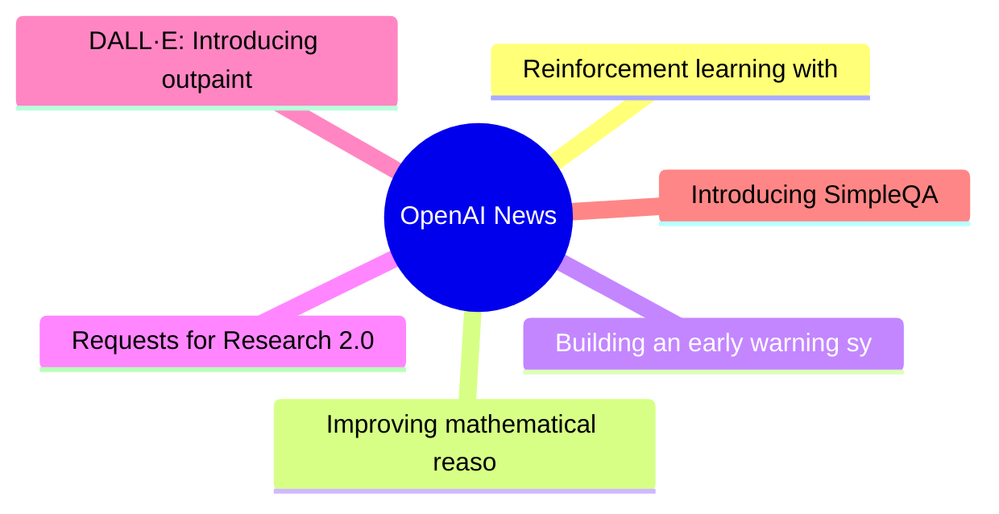
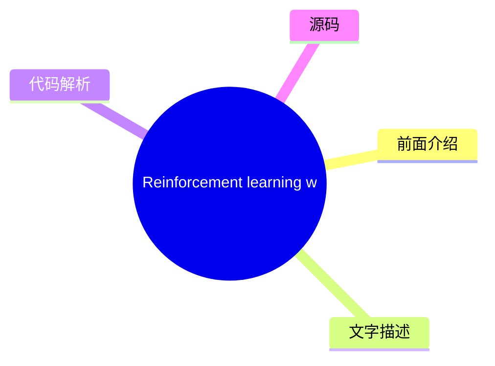
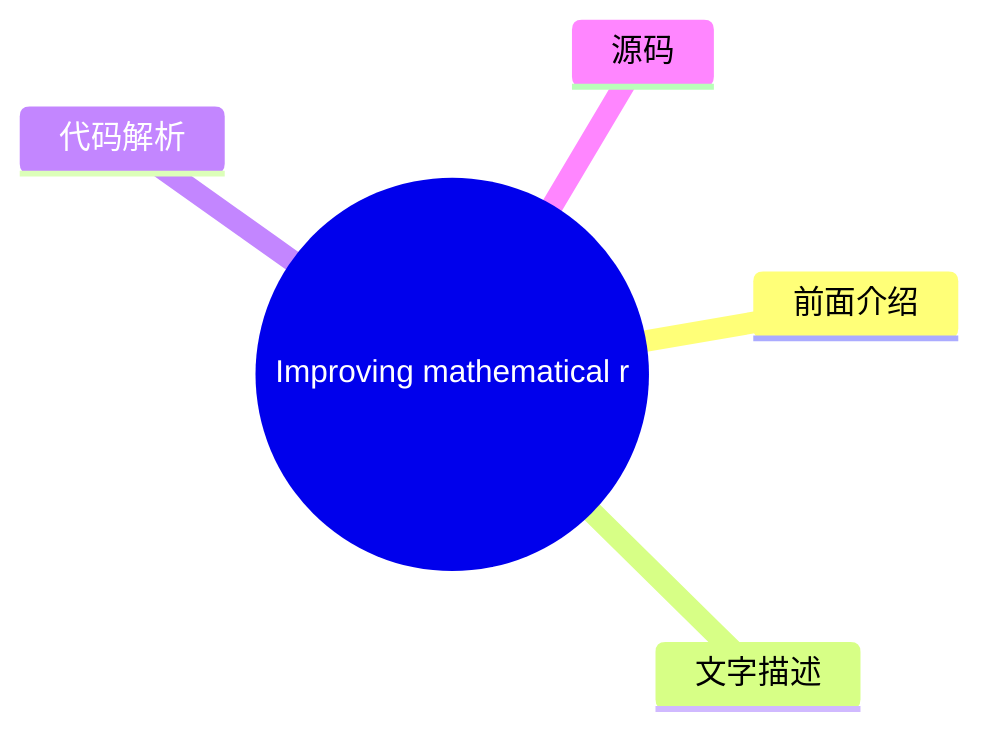
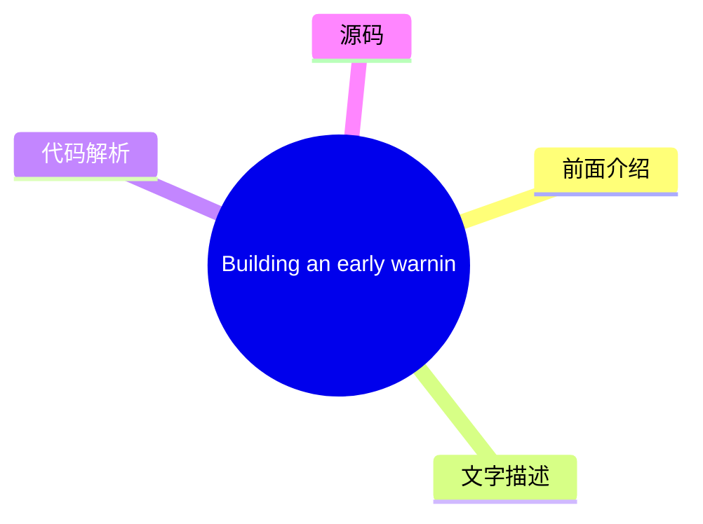
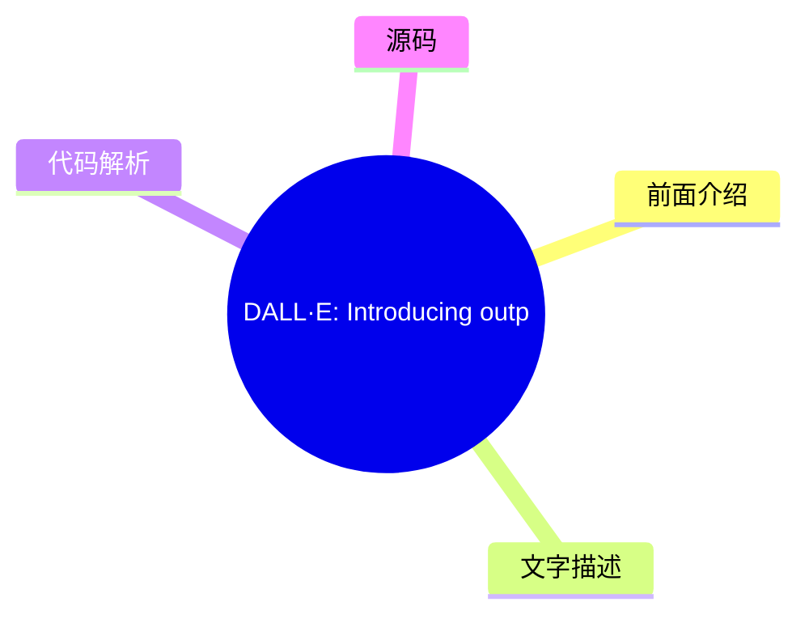
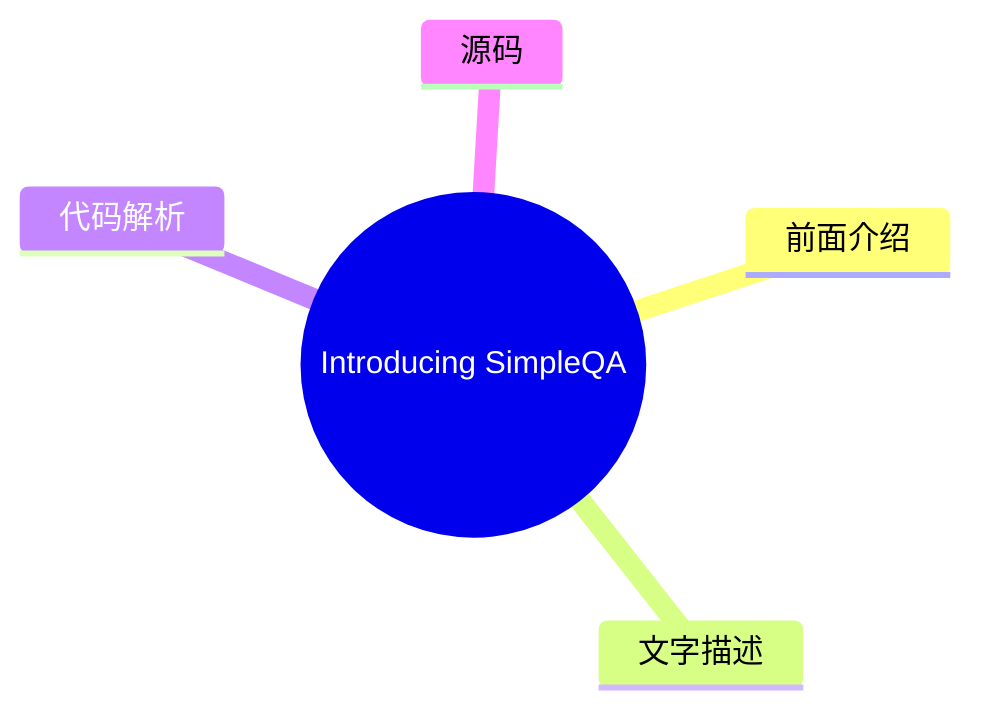

# 🤖 OpenAI News Top 6 (2026-08-02)

## 前面介绍

- 数据源：OpenAI News
- 抓取日期：2026-08-02
- 条目数：6
- 含完整正文：6
- 含代码片段：0
- 组织方式：前面介绍 / 树状图 / 文字描述 / 代码解析 / 源码

## 思维导图

## 详细整理（6 条，6 条含全文，0 条含代码）

### 1. Reinforcement learning with prediction-based rewards
- **链接**: [https://openai.com/index/reinforcement-learning-with-prediction-based-rewards](https://openai.com/index/reinforcement-learning-with-prediction-based-rewards)
- **发布**: Wed, 31 Oct 2018 07:00:00 GMT

#### 前面介绍

- We’ve developed Random Network Distillation (RND), a prediction-based method for encouraging reinforcement learning agents to explore their environments through curiosity, which for the first time exceeds average human performance on Montezuma’s Reve
- 发布时间：Wed, 31 Oct 2018 07:00:00 GMT

#### 树状图

#### 文字描述

- We’ve developed [Random Network Distillation (RND)](/index/reinforcement-learning-with-prediction-based-rewards/#RNDjump), a prediction-based method for encouraging reinforcement learning agents to explore their environments through curiosity, which for the first time exceeds average human performance on [Montezuma’s Revenge(opens in a new window)](https://www.retrogames.cz/pla

#### 代码解析

- 本文未检测到明确代码块，内容更偏新闻、观点或方法论。

#### 源码

#### 中文节选

We’ve developed [Random Network Distillation (RND)](/index/reinforcement-learning-with-prediction-based-rewards/#RNDjump), a prediction-based method for encouraging reinforcement learning agents to explore their environments through curiosity, which for the first time exceeds average human performance on [Montezuma’s Revenge(opens in a new window)](https://www.retrogames.cz/play_124-Atari2600.php?language=EN).

We’ve developed [Random Network Distillation (RND)](/index/reinforcement-learning-with-prediction-based-rewards/#RNDjump), a prediction-based method for encouraging reinforcement learning agents to explore their environments through curiosity, which for the first time A exceeds average human performance on 

[Montezuma’s Revenge(opens in a new window)](https://www.retrogames.cz/play_124-Atari2600.php?language=EN). RND achieves state-of-the-art performance, periodically finds all 24 rooms and solves the first level without using demonstrations or having access to the underlying state of the game.

RND incentivizes visiting [unfamiliar states](/index/reinforcement-learning-with-prediction-based-rewards/#implementationjump) by measuring how hard it is to predict the output of a fixed random neural network on visited states. In unfamiliar states it’s hard to guess the output, and hence the reward is high. It can be applied to any reinforcement learning algorithm, is simple to implement and efficient to scale. Below we release a reference implementation of RND that can reproduce the results from our paper.

For an agent to achieve a desired goal it must first explore what is possible in its environment and what constitutes progress towards the goal. Many games’ reward signals provide a curriculum such that even simple exploration strategies are sufficient for achieving the game’s goal. In the [seminal work introducing DQN(opens in a new window)](https://www.nature.com/articles/nature14236), Montezuma’s Revenge was the **only game where DQN got 0% of the average human score (4.7K)**. Simple exploration strategies are highly unlikely to gather any rewards, or see more than a few of the 24 rooms in the level. Since then advances in Montezuma’s Revenge have been seen by many as synonymous with advances in exploration.

Significant progress was made in [2016(opens in a new window)](https://arxiv.org/abs/1606.01868) by combining DQN with a count-based exploration bonus, resulting in an agent that explored 15 rooms, achieved a high score of 6.6K and an average reward of around 3.7K. Since then, [significant(opens in a new window)](https://arxiv.org/abs/1805.11593) [improvement(opens in a new window)](https://arxiv.org/abs/1805.11592) in the score achieved by an RL agent has come only from exploiting access to [demonstrations(opens in a new window)](https://blog.openai.com/learning-montezumas-revenge-from-a-single-demonstration/) from human [experts(opens in a new window)](https://arxiv.org/abs/1809.03447), or access to the underlying state of the [emu

#### 完整正文（中文）

We’ve developed [Random Network Distillation (RND)](/index/reinforcement-learning-with-prediction-based-rewards/#RNDjump), a prediction-based method for encouraging reinforcement learning agents to explore their environments through curiosity, which for the first time exceeds average human performance on [Montezuma’s Revenge(opens in a new window)](https://www.retrogames.cz/play_124-Atari2600.php?language=EN).

We’ve developed [Random Network Distillation (RND)](/index/reinforcement-learning-with-prediction-based-rewards/#RNDjump), a prediction-based method for encouraging reinforcement learning agents to explore their environments through curiosity, which for the first time A exceeds average human performance on 

[Montezuma’s Revenge(opens in a new window)](https://www.retrogames.cz/play_124-Atari2600.php?language=EN). RND achieves state-of-the-art performance, periodically finds all 24 rooms and solves the first level without using demonstrations or having access to the underlying state of the game.

RND incentivizes visiting [unfamiliar states](/index/reinforcement-learning-with-prediction-based-rewards/#implementationjump) by measuring how hard it is to predict the output of a fixed random neural network on visited states. In unfamiliar states it’s hard to guess the output, and hence the reward is high. It can be applied to any reinforcement learning algorithm, is simple to implement and efficient to scale. Below we release a reference implementation of RND that can reproduce the results from our paper.

为了实现期望的目标，智能体首先必须探索其环境中可能发生的情况以及什么构成了向目标迈进的过程。许多游戏的奖励信号提供了课程，使得简单的探索策略就足以实现游戏目标。在[介绍 DQN 的开创性工作](https://www.nature.com/articles/nature14236)中，蒙兹玛的复仇是 DQN 获得 0% 平均人类分数（4.7K）的**唯一游戏**。简单的探索策略极不可能收集到任何奖励，或者看到关卡中超过 24 个房间中的几个。从那时起，蒙兹玛的复仇的进展被许多人视为探索进展的同义词。

在 2016 年，通过将 DQN 与基于计数的探索奖励相结合，取得了重大进展， resulting in an agent that explored 15 rooms, achieved a high score of 6.6K and an average reward of around 3.7K. Since then, [significant](https://arxiv.org/abs/1805.11593) [improvement](https://arxiv.org/abs/1805.11592) in the score achieved by an RL agent has come only from exploiting access to [demonstrations](https://blog.openai.com/learning-montezumas-revenge-from-a-single-demonstration/) from human [experts](https://arxiv.org/abs/1809.03447), or access to the underlying state of the [emulator](https://blog.openai.com/learning-montezumas-revenge-from-a-single-demonstration/)。

我们运行了一个大规模的 RND 实验，包含 1024 个 rollout 工作进程， resulting in a **mean return of 10K over 9 runs** and a best mean return of 14.5K. Each run discovered between 20 and 22 rooms. In addition one of our smaller scale but longer running experiments yielded one run (out of 10) that achieved a **best return of 17.5K corresponding to passing the first level and finding all 24 rooms**. The graph below compares these two experiments showing the mean return as a function of parameter updates.

The visualization below shows the progress of the smaller scale experiment in discovering the rooms. Curiosity drives the agent to discover new rooms and find ways of increasing the in-game score, and this extrinsic reward drives it to revisit those rooms later in the training.

Prior to developing RND, we, together with collaborators from UC Berkeley, investigated learning without *any* environment-specific rewards. Curiosity gives us an easier way to teach agents to interact with any environment, rather than via an extensively engineered task-specific reward function that we hope corresponds to solving a task. Projects like [ALE(opens in a new window)](https://github.com/mgbellemare/Arcade-Learning-Environment), [Universe(opens in a new window)](https://github.com/openai/universe), [Malmo(opens in a new window)](https://github.com/Microsoft/malmo), [Gym(opens in a new window)](https://github.com/openai/gym), [Gym Retro(opens in a new window)](https://github.com/openai/retro/), [Unity(opens in a new window)](https://github.com/Unity-Technologies/ml-agents), [DeepMind Lab(opens in a new window)](https://github.com/deepmind/lab), [CommAI(opens in a new window)](https://github.com/facebookresearch/CommAI-env) make a large number of simulated environments available for an agent to interact with through a standardized interface. An agent using a generic reward function not specific to the particulars of an environment can acquire a basic level of competency in a wide range of environments, resulting in the agent’s ability to determine what useful behaviors are even in the absence of carefully engineered rewards.

在标准强化学习设置中，在每个离散时间步，智能体向环境发送一个动作，环境通过发出下一个观测值、转换奖励和回合结束指示器来做出响应。在我们之前的论文中，我们要求环境只输出下一个观测值。在那里，智能体从其经验中学习一个下一状态预测模型，并使用预测误差作为内在奖励。因此，它被吸引到不可预测的事物上。例如，只有当分数显示在屏幕上且变化难以预测时，它才会发现游戏分数的变化是奖励性的。智能体通常会发现与新物体的交互是奖励性的，因为此类交互的结果通常比环境的其他方面更难预测。

与之前的工作类似，我们通过选择对观测值进行建模，试图避免对环境的所有方面（无论是否相关）进行建模。令人惊讶的是，我们发现即使是随机特征也效果良好。

我们在 50 多个不同的环境中测试了我们的智能体，并观察到从看似随机的动作到有意与环境交互的一系列能力水平。令我们惊讶的是，在某些环境中，尽管游戏目标没有通过外在奖励传达给智能体，但智能体还是实现了游戏目标。

**Breakout** 在训练初期看到砖块的新配置以及训练数小时后首次通过关卡时，智能体会体验到内在奖励的峰值。

**Pong** 我们训练智能体同时控制两个挡板，它学会了保持球在玩，从而形成长回合。即使在与游戏内 AI 对战时，智能体也试图延长游戏而不是获胜。

**Bowling** The agent learned to play the game better than agents trained to maximize the (clipped) extrinsic reward directly. We think this is because the agent gets attracted to the difficult-to-predict flashing of the scoreboard occurring after the strikes.

**Mario** The intrinsic reward is particularly well-aligned with the game’s objective of advancing through the levels. The agent is rewarded for finding new areas because the details of a newly found area are impossible to predict. As a result the agent discovers 11 levels, finds secret rooms, and even defeats bosses.

Like a gambler at a slot machine attracted to chance outcomes, the agent sometimes gets trapped by its curiosity as the result of the noisy-TV problem. The agent finds a source of randomness in the environment and keeps observing it, always experiencing a high intrinsic reward for such transitions. Watching a TV playing static noise is an example of such a trap. We demonstrate this literally by placing the agent in a Unity maze environment with a TV playing random channels.

While the noisy-TV problem is a concern in theory, for largely deterministic environments like Montezuma’s Revenge, we anticipated that curiosity would drive the agent to discover rooms and interact with objects. We tried several variants of next-state prediction based curiosity combining the exploration bonus with the score from the game.

In these experiments the agent controls the environment through a noisy controller that repeats the last action instead of the current one with some probability. This setup with sticky actions was [suggested(opens in a new window)](https://arxiv.org/abs/1709.06009) as a best practice for training agents on fully deterministic games like Atari to prevent memorization. Sticky actions make the transition from room to room unpredictable.

Since next-state prediction is inherently susceptible to the noisy-TV problem, we identified the following relevant sources of prediction errors:

- **Factor 1**: Prediction error is high where the predictor fails to generalize from previously seen examples. Novel experience then corresponds to high prediction error.

- **Factor 2**: Prediction error is high because the prediction target is stochastic.
- **Factor 3**: Prediction error is high because information necessary for the prediction is missing, or the model class of predictors is too limited to fit the complexity of the target function.

We determined Factor 1 is a useful source of error since it quantifies the novelty of experience, whereas Factors 2 and 3 cause the noisy-TV problem. To avoid Factors 2 and 3, we developed RND, a new exploration bonus that is based on **predicting the output of a fixed and randomly initialized neural network on the next state, given the next state itself**.

The intuition is that predictive models have low error in states similar to the ones they have been trained on. In particular the agent’s predictions of the output of a randomly initialized neural network will be less accurate in novel states than in states the agent visited frequently. The advantage of using a synthetic prediction problem is that we can have it be deterministic (bypassing Factor 2) and inside the class of functions the predictor can represent (bypassing Factor 3) by choosing the predictor to be of the same architecture as the target network. These choices make RND immune to the noisy-TV problem.

We combine the exploration bonus with the extrinsic rewards through a variant of [Proximal Policy Optimization(opens in a new window)](https://arxiv.org/abs/1707.06347) ([PPO(opens in a new window)](https://blog.openai.com/openai-baselines-ppo/#ppo)) that uses **two value heads for the two reward streams**. This allows us to use different discount rates for the different rewards, and combine episodic and non-episodic returns. **With this additional flexibility, our best agent often finds 22 out of the 24 rooms on the first level in Montezuma’s Revenge, and occasionally passes the first level after finding the remaining two rooms**. The same method gets state-of-the-art performance on Venture and Gravitar.

The visualization of the RND bonus below shows a graph of the intrinsic reward over the course of an episode of Montezuma’s Revenge where the agent finds the torch for the first time.

像对“嘈杂电视问题”的敏感度这样的宏观考虑，对于选择一个好的探索算法很重要。然而，我们发现在我们简单的算法中，把看似微小的细节处理好，是让一个从未

...（截断，原文 14022+ 字符）

### 2. Improving mathematical reasoning with process supervision
- **链接**: [https://openai.com/index/improving-mathematical-reasoning-with-process-supervision](https://openai.com/index/improving-mathematical-reasoning-with-process-supervision)
- **发布**: Wed, 31 May 2023 07:00:00 GMT

#### 前面介绍

- We’ve trained a model to achieve a new state-of-the-art in mathematical problem solving by rewarding each correct step of reasoning (“process supervision”) instead of simply rewarding the correct final answer (“outcome supervision”). In addition to b
- 发布时间：Wed, 31 May 2023 07:00:00 GMT

#### 树状图

#### 文字描述

- We’ve trained a model to achieve a new state-of-the-art in mathematical problem solving by rewarding each correct step of reasoning (“process supervision”) instead of simply rewarding the correct final answer (“outcome supervision”). In addition to boosting performance relative to outcome supervision, process supervision also has an important alignment benefit: it directly trai
- ## References
- ## Authors
- ## Contributors Bowen Baker, Teddy Lee, John Schulman, Greg Brockman, Kendra Rimbach, Hannah Wong, Thomas Degry

#### 代码解析

- 本文未检测到明确代码块，内容更偏新闻、观点或方法论。

#### 源码

#### 中文节选

我们训练了一个模型，通过奖励推理的每一个正确步骤（“过程监督”）而不是仅仅奖励正确的最终答案（“结果监督”），在数学问题求解方面取得了新的最先进水平。除了相对于结果监督提升性能外，过程监督还有一个重要的对齐益处：它直接训练模型产生人类认可的思维链。

近年来，大型语言模型在执行复杂多步推理方面的能力有了很大提高。然而，即使是最先进的模型仍然会产生逻辑错误，通常被称为*幻觉*。减轻幻觉是构建对齐通用人工智能（AGI）的关键一步。

我们可以训练奖励模型来检测幻觉，方法是使用*结果监督*（基于最终结果提供反馈）或*过程监督*（为思维链中的每个单独步骤提供反馈）。基于先前的工作 1，我们使用 MATH 数据集作为测试平台，详细比较了这两种方法。我们发现，过程监督带来了显著更好的性能，即使是从结果来看也是如此。为了鼓励相关研究，我们发布了我们的完整过程监督数据集。

[2](#citation-bottom-2)过程监督相比结果监督具有几种对齐优势。由于过程中的每个步骤都受到精确的监督，它直接奖励模型遵循对齐的思维链。过程监督也更可能产生可解释的推理，因为它鼓励模型遵循人类批准的过程。相比之下，结果监督可能会奖励一个不对齐的过程，而且通常更难进行审查。

在某些情况下，AI 系统的更安全方法可能会导致性能下降 3，这种成本被称为

*对齐税*。总体而言，由于部署最强大模型的压力，任何对齐税都可能阻碍对齐方法的采用。我们下面的结果表明，过程监督实际上会产生负面的对齐税，至少在数学领域是这样。这可能会增加过程监督的采用，我们相信这会产生积极的对齐副作用。

我们使用 MATH 测试集中的问题来评估我们的过程监督和结果监督奖励模型。我们为每个问题生成许多解决方案，然后选择每个奖励模型排名最高的解决方案。该图显示了所选解决方案达到正确最终答案的百分比，作为所考虑的解决方案数量的函数。过程监督奖励模型不仅整体表现更好，而且随着我们为每个问题考虑的解决方案越多，性能差距也在扩大。这向我们展示了过程监督奖励模型要可靠得多。

我们在下面展示了 10 个问题和解决方案，以及关于奖励模型优缺点的评论。

It is unk

#### 完整正文（中文）

我们训练了一个模型，通过奖励推理的每一个正确步骤（“过程监督”）而不是仅仅奖励正确的最终答案（“结果监督”），在数学问题求解方面取得了新的最先进水平。除了相对于结果监督提升性能外，过程监督还有一个重要的对齐益处：它直接训练模型产生人类认可的思维链。

近年来，大型语言模型在执行复杂多步推理方面的能力有了很大提高。然而，即使是最先进的模型仍然会产生逻辑错误，通常被称为*幻觉*。减轻幻觉是构建对齐通用人工智能（AGI）的关键一步。

我们可以训练奖励模型来检测幻觉，方法是使用*结果监督*（基于最终结果提供反馈）或*过程监督*（为思维链中的每个单独步骤提供反馈）。基于先前的工作 1，我们使用 MATH 数据集作为测试平台，详细比较了这两种方法。我们发现，过程监督带来了显著更好的性能，即使是从结果来看也是如此。为了鼓励相关研究，我们发布了我们的完整过程监督数据集。

[2](#citation-bottom-2)过程监督相比结果监督具有几种对齐优势。由于过程中的每个步骤都受到精确的监督，它直接奖励模型遵循对齐的思维链。过程监督也更可能产生可解释的推理，因为它鼓励模型遵循人类批准的过程。相比之下，结果监督可能会奖励一个不对齐的过程，而且通常更难进行审查。

在某些情况下，AI 系统的更安全方法可能会导致性能下降 3，这种成本被称为

*alignment tax*. In general, any alignment tax may hinder the adoption of alignment methods, due to pressure to deploy the most capable model. Our results below show that process supervision in fact incurs a negative alignment tax, at least in the math domain. This could increase the adoption of process supervision, which we believe would have positive alignment side-effects.

We evaluate our process-supervised and outcome-supervised reward models using problems from the MATH test set. We generate many solutions for each problem and then pick the solution ranked the highest by each reward model. The graph shows the percentage of chosen solutions that reach the correct final answer, as a function of the number of solutions considered. Not only does the process-supervised reward model perform better across the board, but the performance gap widens as we consider more solutions per problem. This shows us that the process-supervised reward model is much more reliable.

We showcase 10 problems and solutions below, along with commentary about the reward model’s strengths and weaknesses.

It is unknown how broadly these results will generalize beyond the domain of math, and we consider it important for future work to explore the impact of process supervision in other domains. If these results generalize, we may find that process supervision gives us the best of both worlds – a method that is both more performant and more aligned than outcome supervision.

## References

## Authors

## Contributors

Bowen Baker, Teddy Lee, John Schulman, Greg Brockman, Kendra Rimbach, Hannah Wong, Thomas Degry

### 3. Building an early warning system for LLM-aided biological threat creation
- **链接**: [https://openai.com/index/building-an-early-warning-system-for-llm-aided-biological-threat-creation](https://openai.com/index/building-an-early-warning-system-for-llm-aided-biological-threat-creation)
- **发布**: Wed, 31 Jan 2024 08:00:00 GMT

#### 前面介绍

- We’re developing a blueprint for evaluating the risk that a large language model (LLM) could aid someone in creating a biological threat. In an evaluation involving both biology experts and students, we found that GPT-4 provides at most a mild uplift
- 发布时间：Wed, 31 Jan 2024 08:00:00 GMT

#### 树状图

#### 文字描述

- We’re developing a blueprint for evaluating the risk that a large language model (LLM) could aid someone in creating a biological threat. In an evaluation involving both biology experts and students, we found that GPT‑4 provides at most a mild uplift in biological threat creation accuracy. While this uplift is not large enough to be conclusive, our finding is a starting point f

#### 代码解析

- 本文未检测到明确代码块，内容更偏新闻、观点或方法论。

#### 源码

#### 中文节选

We’re developing a blueprint for evaluating the risk that a large language model (LLM) could aid someone in creating a biological threat.

In an evaluation involving both biology experts and students, we found that GPT‑4 provides at most a mild uplift in biological threat creation accuracy. While this uplift is not large enough to be conclusive, our finding is a starting point for continued research and community deliberation.

*Note: As part of our* *Preparedness Framework**, we are investing in the development of improved evaluation methods for AI-enabled safety risks. We believe that these efforts would benefit from broader input, and that methods-sharing could also be of value to the AI risk research community. To this end, we are presenting some of our early work—today, focused on biological risk. We look forward to community feedback, and to sharing more of our ongoing research.* 

**Background.** As OpenAI and other model developers build more capable AI systems, the potential for both beneficial and harmful uses of AI will grow. One potentially harmful use, highlighted by researchers and policymakers, is the ability for AI systems to assist malicious actors in creating biological threats (e.g., see [White House 2023(opens in a new window)](https://www.whitehouse.gov/briefing-room/presidential-actions/2023/10/30/executive-order-on-the-safe-secure-and-trustworthy-development-and-use-of-artificial-intelligence/), [Lovelace 2022(opens in a new window)](https://www.washingtontimes.com/news/2022/sep/12/ai-powered-biological-warfare-biggest-issue-former/), [Sandbrink 2023(opens in a new window)](https://www.vox.com/future-perfect/23820331/chatgpt-bioterrorism-bioweapons-artificial-inteligence-openai-terrorism)). In one discussed hypothetical example, a malicious actor might use a highly-capable model to develop a step-by-step protocol, troubleshoot wet-lab procedures, or even autonomously execute steps of the biothreat creation process when given access to tools like [cloud labs(opens in a new window)](https://www.theguardian.com/science/2022/sep/11/cloud-labs-and-remote-research-arent-the-future-of-science-theyre-here) (see [Carter et al., 2023(opens in a new window)](https://www.nti.org/analysis/articles/the-convergence-of-artificial-intelligence-and-the-life-sciences/)). However, assessing the viability of such hypothetical examples was limited by insufficient evaluations and data.

Following our recently shared [Preparedness Framework(opens in a new window)](https://cdn.openai.com/openai-preparedness-framework-beta.pdf), we are developing methodologies to empirically evaluate these types of risks, to help us understand both where we are today and where we might be in the future. Here, we detail a new evaluation which could help serve as one potential “tripwire” signaling the need for caution and further testing of biological misuse potential. This evaluation aims to measure whether models could meaningfully increase malicious actors’ access

#### 完整正文（中文）

我们正在制定一份评估大型语言模型（LLM）是否可能协助他人制造生物威胁的蓝图。

在一项涉及生物学专家和学生的评估中，我们发现 GPT‑4 对生物威胁制造准确性的提升至多仅为轻微。虽然这种提升尚不足以得出定论，但我们的发现为持续的研究和社区讨论提供了一个起点。

*注：作为* *准备框架** 的一部分，我们正在投资开发用于评估 AI 驱动的安全风险的改进评估方法。我们相信，这些努力将受益于更广泛的投入，且方法共享对 AI 风险研究社区也具有价值。为此，我们正在展示我们的一些早期工作——今天，重点聚焦于生物风险。我们期待社区的反馈，并期待分享更多我们正在进行的研究。*

**Background.** As OpenAI and other model developers build more capable AI systems, the potential for both beneficial and harmful uses of AI will grow. One potentially harmful use, highlighted by researchers and policymakers, is the ability for AI systems to assist malicious actors in creating biological threats (e.g., see [White House 2023(opens in a new window)](https://www.whitehouse.gov/briefing-room/presidential-actions/2023/10/30/executive-order-on-the-safe-secure-and-trustworthy-development-and-use-of-artificial-intelligence/), [Lovelace 2022(opens in a new window)](https://www.washingtontimes.com/news/2022/sep/12/ai-powered-biological-warfare-biggest-issue-former/), [Sandbrink 2023(opens in a new window)](https://www.vox.com/future-perfect/23820331/chatgpt-bioterrorism-bioweapons-artificial-inteligence-openai-terrorism)). In one discussed hypothetical example, a malicious actor might use a highly-capable model to develop a step-by-step protocol, troubleshoot wet-lab procedures, or even autonomously execute steps of the biothreat creation process when given access to tools like [cloud labs(opens in a new window)](https://www.theguardian.com/science/2022/sep/11/cloud-labs-and-remote-research-arent-the-future-of-science-theyre-here) (see [Carter et al., 2023(opens in a new window)](https://www.nti.org/analysis/articles/the-convergence-of-artificial-intelligence-and-the-life-sciences/)). However, assessing the viability of such hypothetical examples was limited by insufficient evaluations and data.

Following our recently shared [Preparedness Framework(opens in a new window)](https://cdn.openai.com/openai-preparedness-framework-beta.pdf), we are developing methodologies to empirically evaluate these types of risks, to help us understand both where we are today and where we might be in the future. Here, we detail a new evaluation which could help serve as one potential “tripwire” signaling the need for caution and further testing of biological misuse potential. This evaluation aims to measure whether models could meaningfully increase malicious actors’ access to dangerous information about biological threat creation, compared to the baseline of existing resources (i.e., the internet).

To evaluate this, we conducted a study with 100 human participants, comprising (a) 50 biology experts with PhDs and professional wet lab experience and (b) 50 student-level participants, with at least one university-level course in biology. Each group of participants was randomly assigned to either a control group, which only had access to the internet, or a treatment group, which had access to GPT‑4 in addition to the internet. Each participant was then asked to complete a set of tasks covering aspects of the end-to-end process for biological threat creation. A To our knowledge, this is the largest to-date human evaluation of AI’s impact on biorisk information.

**Findings.** Our study assessed uplifts in performance for participants with access to GPT‑4 across five metrics (accuracy, completeness, innovation, time taken, and self-rated difficulty) and five stages in the biological threat creation process (ideation, acquisition, magnification, formulation, and release). We found mild uplifts in accuracy and completeness for those with access to the language model. Specifically, on a 10-point scale measuring accuracy of responses, we observed a mean score increase of 0.88 for experts and 0.25 for students compared to the internet-only baseline, and similar uplifts for completeness (0.82 for experts and 0.41 for students). However, the obtained effect sizes were not large enough to be statistically significant, and our study highlighted the need for more research around what performance thresholds indicate a meaningful increase in risk. Moreover, we note that information access alone is insufficient to create a biological threat, and that this evaluation does not test for success in the physical construction of the threats.

Below, we share our evaluation procedure and the results it yielded in more detail. We also discuss several methodological insights related to capability elicitation and security considerations needed to run this type of evaluation with frontier models at scale. We also discuss the limitations of statistical significance as an effective method of measuring model risk, and the importance of new research in assessing the meaningfulness of model evaluation results.

When considering biorisk related to AI systems, there are two main ways in which general purpose AI capabilities could affect biological threat creation (see, e.g., [Nelson and Rose, 2023(opens in a new window)](https://www.longtermresilience.org/post/report-launch-examining-risks-at-the-intersection-of-ai-and-bio) and [Sandbrink, 2023(opens in a new window)](https://arxiv.org/abs/2306.13952)): increased access and increased novelty.

In our evaluation, we prioritized the first axis: evaluating increased access to information on known threats. This is because we believe information access is the most immediate risk given that the core strength of current AI systems is in synthesizing existing language information. To best explore the improved information access scenario, we used three design principles:

**Design principle 1:** Fully understanding information access requires testing with human participants.

Our evaluation needed to reflect the different ways in which a malicious actor might leverage access to a model. To simulate this accurately, human participants needed to drive the evaluation process. This is because language models will often provide better information with a human in the loop to tailor prompts, correct model mistakes, and follow up as necessary (e.g., [Wu et al., 2022(opens in a new window)](https://arxiv.org/pdf/2108.00941.pdf)). This is in contrast to the alternative of using “automated benchmarking,” which provides the model with a fixed rubric of questions and checks accuracy only using a hardcoded answer set and capability elicitation procedure.

**Design principle 2:** Thorough evaluation requires eliciting the full range of model capabilities.

We are interested in the full range of risks from our models, and so wanted to elicit the full capabilities of the model wherever possible in the evaluation. To make sure that the human participants were indeed able to use these capabilities, we provided participants with training on best language model capability elicitation practices, and failure modes to avoid. We also gave participants time to familiarize themselves with the models and ask questions to expert facilitators (see Appendix for details). Finally, to better help the expert participants elicit the capabilities of the GPT‑4 model, we provided that cohort with a custom research-only version of GPT‑4 B—a version that directly (i.e., without refusals) responds to biologically risky questions.

**Design principle 3:** The risk from AI should be measured in terms of *improvement* over existing resources.

Existing research on AI-enabled biological threats has shown that models like GPT‑4 can be prompted or red-teamed to share information related to biological threat creation (see [GPT‑4 system card(opens in a new window)](https://cdn.openai.com/papers/gpt-4-system-card.pdf), [Egan et al., 2023(opens in a new window)](https://www.belfercenter.org/publication/biosecurity-age-ai-whats-risk), [Gopal et al., 2023(opens in a new window)](https://arxiv.org/pdf/2310.18233.pdf)[,(opens in a new window)](https://arxiv.org/abs/2306.03809) [Soice et al, 2023(opens in a new window)](https://arxiv.org/abs/2306.03809), and [Ganguli et al., 2023(opens in a new window)](https://arxiv.org/abs/2209.07858)). Statements from Anthropic indicate that they have produced similar findings related to their models ([Anthropic, 2023(opens in a new window)](https://www.anthropic.com/news/frontier-threats-red-teaming-for-ai-safety)). However, despite this ability to provide such information, it is not clear whether AI models can also *improve* accessibility of this information beyond that of other resources, such as the internet. (The only datapoint here is [Mouton et al. 2024(opens in a new window)](https://www.rand.org/news/press/2024/01/25.html), who describe a red-teaming approach to compare information access from a language model versus existing resources).

To evaluate whether models indeed provide such a counterfactual increase in access to biological threat information, we need to compare their output against the output produced when participants only use the internet, which contains numerous sources of biological threat information. We operationalized this by randomly assigning half the participants into a control group that was free to use only existing sources of knowledge (i.e., the internet—including online databases, articles and internet search engines—as well as any of their prior knowledge), and assigning the other half into a treatment group with full access to both these resources and the GPT‑4 model.

Guided by the above approach to the evaluation design, we now detail the specific methodology of our evaluation. Specifically, we describe the process of sourcing participants, the design of the tasks, and our method of scoring the responses.

To understand the impact that access to AI models may have on actors with differing levels of expertise, we sourced cohorts of both experts and students to participate in our evaluation. In each of these groups, half of the individuals were randomly assigned to answer the question using only the internet while the other half were given internet access in addition to access to a GPT‑4 model. Due to the sensitive nature of the evaluations, we employed extensive vetting of participants, as described in the Appendix.

Biosecurity specialists at Gryphon Scientific developed five research tasks corresponding to the five stages of biological threat creation. These tasks were designed to assess the end-to-end critical knowledge needed to successfully complete each stage in the biological threat creation process. Each participant in the evaluation was then asked to complete all five tasks. We designed each task to be related to a different process and biological agent to reduce information hazards among participants, i.e., harms that could arise from the broad dissemination of certain knowledge. We do not share the list of tasks here due to similar information hazard concerns.

This division into specific tasks also enabled us to (1) produce objective rubrics with correct answers for each task, as compared to a completely open-ended threat creation exercise and (2) more granularly evaluate model helpfulness across different stages of the biological threat creation process. Our tasks were all discrete and specific requests, intended to be easily reproducible and objectively measurable.

Exercises were given to participants in a random order so as to control for the participant’s potential improvement in researching information and/or using the model over the course of the evaluat

...（截断，原文 41943+ 字符）

### 4. Requests for Research 2.0
- **链接**: [https://openai.com/index/requests-for-research-2](https://openai.com/index/requests-for-research-2)
- **发布**: Wed, 31 Jan 2018 08:00:00 GMT

#### 前面介绍

- We’re releasing a new batch of seven unsolved problems which have come up in the course of our research at OpenAI.
- 发布时间：Wed, 31 Jan 2018 08:00:00 GMT

#### 树状图

#### 文字描述

- Like our original [Requests for Research(opens in a new window)](https://github.com/openai/requests-for-research) (which [resulted(opens in a new window)](http://lstm.seas.harvard.edu/latex/) [in(opens in a new window)](http://kvfrans.com/static/trpo.pdf) [several(opens in a new window)](https://github.com/dojoteef/glas) [papers(opens in a new window)](https://arxiv.org/abs/160

#### 代码解析

- 本文未检测到明确代码块，内容更偏新闻、观点或方法论。

#### 源码

#### 中文节选

Like our original [Requests for Research(opens in a new window)](https://github.com/openai/requests-for-research) (which [resulted(opens in a new window)](http://lstm.seas.harvard.edu/latex/) [in(opens in a new window)](http://kvfrans.com/static/trpo.pdf) [several(opens in a new window)](https://github.com/dojoteef/glas) [papers(opens in a new window)](https://arxiv.org/abs/1605.01335)), we expect these problems to be a fun and meaningful way for new people to enter the field, as well as for practitioners to hone their skills (it’s also a great way to get a [job(opens in a new window)](https://www.wired.com/story/meet-the-high-schooler-shaking-up-artificial-intelligence/) at OpenAI). Many will require inventing new ideas. Please [email](mailto:requests-for-research@openai.com) us with questions or solutions you’d like us to publicize!

(Also, if you don’t have deep learning background but want to learn to solve problems like these, please apply for our [Fellowship(opens in a new window)](https://jobs.lever.co/openai/54ddfefe-6483-4bba-a828-11a156eae7eb) program!)

If you’re not sure where to begin, here are some solved starter problems.

⭐ Train an LSTM to solve the `XOR` problem: that is, given a sequence of bits, determine its parity. The [LSTM(opens in a new window)](http://colah.github.io/posts/2015-08-Understanding-LSTMs/) should consume the sequence, one bit at a time, and then output the correct answer at the sequence’s end. Test the two approaches below:

- Generate a dataset of random 100,000 binary strings of length 50. Train the LSTM; what performance do you get?
- Generate a dataset of random 100,000 binary strings, where the length of each string is independently and randomly chosen between 1 and 50. Train the LSTM. Does it succeed? What explains the difference?

⭐ 实现经典 [Snake(opens in a new window)](https://www.youtube.com/watch?v=wDbTP0B94AM) 游戏的克隆，并将其作为一个 [Gym(opens in a new window)](https://github.com/openai/gym) 环境，然后使用你选择的强化学习 [算法(opens in a new window)](https://arxiv.org/abs/1707.06347) 来解决它。向我们 [推文(opens in a new window)](https://twitter.com/openai) 代理玩游戏的视频。你是否能够训练出一个获胜的策略？

⭐⭐ **Slitherin’**。实现并解决经典 [Snake(opens in a new window)](https://www.youtube.com/watch?v=wDbTP0B94AM) 游戏的多人克隆版（可参考 [slither.io(opens in a new window)](https://slither.io/) 获取灵感），并将其作为一个 [Gym(opens in a new window)](https://github.com/openai/gym) 环境。

- 环境：拥有一个相当大的场地，包含多条蛇；蛇在吃掉随机出现的果实时会变长；当蛇与另一条蛇、自身或墙壁发生碰撞时会死亡；当所有蛇都死亡时游戏结束。从两条蛇开始，然后逐步扩展。
- 代理：使用你选择的强化学习算法，通过自我博弈来求解该环境。

#### 完整正文（中文）

就像我们最初的 [Requests for Research(opens in a new window)](https://github.com/openai/requests-for-research)（它 [resulted(opens in a new window)](http://lstm.seas.harvard.edu/latex/) [in(opens in a new window)](http://kvfrans.com/static/trpo.pdf) [several(opens in a new window)](https://github.com/dojoteef/glas) [papers(opens in a new window)](https://arxiv.org/abs/1605.01335)）一样，我们期望这些问题能成为新人进入该领域的一种有趣且有意义的方式，同时也是从业者磨练技能的好方法（这也是在 OpenAI 找到 [job(opens in a new window)](https://www.wired.com/story/meet-the-high-schooler-shaking-up-artificial-intelligence/) 的绝佳途径）。许多问题需要发明新的想法。请通过 [email](mailto:requests-for-research@openai.com) 将您的问题或解决方案发给我们，以便我们进行宣传！

（此外，如果您没有深度学习背景但想学习解决此类问题，请申请我们的 [Fellowship(opens in a new window)](https://jobs.lever.co/openai/54ddfefe-6483-4bba-a828-11a156eae7eb) 项目！）

如果您不确定从哪里开始，这里有一些已解决的入门问题。

⭐ 训练一个 LSTM 来解决 `XOR` 问题：即给定一个位序列，确定其奇偶性。该 [LSTM(opens in a new window)](http://colah.github.io/posts/2015-08-Understanding-LSTMs/) 应该逐位消费该序列，然后在序列结束时输出正确答案。测试以下两种方法：

- 生成一个包含 100,000 个长度为 50 的随机二进制字符串的数据集。训练 LSTM；您能得到什么性能？
- 生成一个包含 100,000 个随机二进制字符串的数据集，其中每个字符串的长度是独立且随机选择的，范围在 1 到 50 之间。训练 LSTM。它成功了吗？是什么解释了这种差异？

⭐ Implement a clone of the classic [Snake(opens in a new window)](https://www.youtube.com/watch?v=wDbTP0B94AM) game as a [Gym(opens in a new window)](https://github.com/openai/gym) environment, and solve it with a [reinforcement learning(opens in a new window)](https://arxiv.org/abs/1707.06347) algorithm of your choice. [Tweet(opens in a new window)](https://twitter.com/openai) us videos of the agent playing. Were you able to train a policy that wins the game?

⭐⭐ **Slitherin’.** Implement and solve a multiplayer clone of the classic [Snake(opens in a new window)](https://www.youtube.com/watch?v=wDbTP0B94AM) game (see [slither.io(opens in a new window)](https://slither.io/) for inspiration) as a [Gym(opens in a new window)](https://github.com/openai/gym) environment.

- Environment: have a reasonably large field with multiple snakes; snakes grow when eating randomly-appearing fruit; a snake dies when colliding with another snake, itself, or the wall; and the game ends when all snakes die. Start with two snakes, and scale from there.
- Agent: solve the environment using self-play with an RL algorithm of [your](/index/competitive-self-play/)[choice(opens in a new window)](https://deepmind.com/blog/alphago-zero-learning-scratch/). You’ll need to experiment with various approaches to overcome self-play instability (which resembles the instability people see with GANs). For example, try training your current policy against a distribution of past policies. Which approach works best?
- Inspect the learned behavior: does the agent learn to competently pursue food and avoid other snakes? Does the agent learn to attack, trap, or gang up against the competing snakes? Tweet us videos of the learned policies!

⭐⭐⭐ **Parameter Averaging in Distributed RL.** Explore the effect of parameter averaging schemes on [sample complexity(opens in a new window)](https://en.wikipedia.org/wiki/Sample_complexity) and amount of communication in RL algorithms. While the simplest solution is to average the gradients from every worker on every update, you can [save(opens in a new window)](https://arxiv.org/abs/1511.06051) on communication bandwidth by independently updating workers and then infrequently averaging parameters. In RL, this may have another benefit: at any given time we’ll have agents with different parameters, which could lead to better exploration behavior. Another possibility is use algorithms like [EASGD(opens in a new window)](https://arxiv.org/abs/1412.6651) that bring parameters partly together each update.

⭐⭐⭐ **Transfer Learning Between Different Games via Generative Models.** Proceed as follows:

- Train 11 good policies for 11 [Atari(opens in a new window)](https://github.com/openai/gym#atari)games. Generate 10,000 trajectories of 1,000 steps each from the policy for each game.
- Fit a generative model (such as the [Transformer(opens in a new window)](https://arxiv.org/abs/1706.03762)) to the trajectories produced by 10 of the games.
- Then fine-tune that model on the 11th game.
- Your goal is to quantify the benefit from pre-training on the 10 games. How large does the model need to be for the pre-training to be useful? How does the size of the effect change when the amount of data from the 11th game is reduced by 10x? By 100x?

⭐⭐⭐ **带有线性注意力的 Transformer。** [Transformer(opens in a new window)](https://arxiv.org/abs/1706.03762) 模型使用带有 softmax 的软注意力。如果我们能改用线性注意力（它可以转换成使用[快速权重(opens in a new window)](https://arxiv.org/abs/1610.06258)的 RNN），我们就可以将该模型用于强化学习。具体来说，在巨大的上下文上使用 Transformer 进行强化学习回放是不切实际的，但运行带有快速权重的 RNN 则非常可行。你的目标：选取任何语言建模任务；训练一个 Transformer；然后找到一种方法，使用具有不同超参数的线性注意力 Transformer 以相同的每个字符/单词比特数达到相同的效果，且不显著增加总参数数量。只有一个注意事项：这最终可能会被证明是不可能的。但一个潜在的提示：带有线性注意力的 Transformer 可能需要比使用 softmax 的注意力高得多的维度的键/值向量，而无需显著增加参数数量即可实现。

⭐⭐⭐ **Learned Data Augmentation.** You could use a learned [VAE(opens in a new window)](https://jaan.io/what-is-variational-autoencoder-vae-tutorial/) of data, to perform “learned data augmentation”. One would first train a VAE on input data, then each training point would be transformed by encoding to a latent space, then applying a simple (e.g. Gaussian) perturbation in latent space, then decoding back to observed space. Could we use such an approach to obtain improved generalization? A potential benefit of such data augmentation is that it could include many nonlinear transformations like viewpoint changes and changes in scene lightning. Can we approximate the set of transformations to which the label is invariant? Check out the [existing(opens in a new window)](https://arxiv.org/abs/1611.01331) [work(opens in a new window)](https://arxiv.org/abs/1702.05538) [on(opens in a new window)](https://arxiv.org/abs/1709.01643) [this(opens in a new window)](https://arxiv.org/abs/1711.04340) [topic(opens in a new window)](https://arxiv.org/abs/1711.00648) [if(opens in a new window)](http://cs231n.stanford.edu/reports/2017/pdfs/300.pdf) [you(opens in a new window)](https://arxiv.org/abs/1710.10564) [want(opens in a new window)](https://papers.nips.cc/paper/7278-learning-to-model-the-tail) a place to get started.

⭐⭐⭐⭐ **强化学习中的正则化。** 实验性研究（并定性解释）不同正则化方法对所选强化学习算法的影响。在监督深度学习中，正则化对于[改善优化](https://openreview.net/pdf?id=rk6qdGgCZ)和防止过拟合极其重要，[dropout](https://en.wikipedia.org/wiki/Convolutional_neural_network#Dropout)、[批归一化](https://gab41.lab41.org/batch-normalization-what-the-hey-d480039a9e3b)和[L2 正则化](http://www.chioka.in/differences-between-l1-and-l2-as-loss-function-and-regularization/)都是非常成功的方法。然而，人们尚未从[策略梯度](http://www.scholarpedia.org/article/Policy_gradient_methods)和[Q-learning](http://mnemstudio.org/path-finding-q-learning-tutorial.htm)等强化学习算法中受益于正则化。巧合的是，人们在强化学习中通常使用比监督学习小得多的模型，因为大型模型表现更差——这可能是因为它们过度拟合了最近的经历。入门的话，[这里](http://sologen.net/papers/RegularizationInReinforcementLearning(PhD-Dissertation-Farahmand).pdf)有一篇相关但较旧的理论研究。

⭐⭐⭐⭐⭐ **奥林匹克不等式问题的自动化求解。** 奥林匹克不等式问题表达简单，但[求解](https://artofproblemsolving.com/articles/files/MildorfInequalities.pdf)它们通常需要巧妙的操作。构建一个奥林匹克不等式问题数据集，并编写一个程序能够解决其中很大一部分问题。机器学习在这里是否有用尚不清楚，但你可能利用学习到的策略来降低分支因子。

### 5. DALL·E: Introducing outpainting
- **链接**: [https://openai.com/index/dall-e-introducing-outpainting](https://openai.com/index/dall-e-introducing-outpainting)
- **发布**: Wed, 31 Aug 2022 07:00:00 GMT

#### 前面介绍

- Extend creativity and tell a bigger story with DALL·E images of any size.
- 发布时间：Wed, 31 Aug 2022 07:00:00 GMT

#### 树状图

#### 文字描述

- Today we’re introducing Outpainting, a new feature which helps users extend their creativity by continuing an image beyond its original borders—adding visual elements in the same style, or taking a story in new directions—simply by using a natural language description. [DALL·E](/index/dall-e-2/)’s Edit feature already enables changes within a generated or uploaded image, a capa

#### 代码解析

- 本文未检测到明确代码块，内容更偏新闻、观点或方法论。

#### 源码

#### 中文节选

今天，我们推出了 Outpainting（外绘）功能，它可以帮助用户通过自然语言描述，将创意延伸至图片原始边界之外——只需添加风格一致的视觉元素，或为故事开辟新的方向。

[DALL·E](/index/dall-e-2/) 的 Edit（编辑）功能已经可以在生成的或上传的图片内进行修改，这一能力被称为 Inpainting（内绘）。现在，借助 Outpainting，用户可以扩展原始图片，创建任意宽高比的大幅图片。Outpainting 会考虑图片现有的视觉元素——包括阴影、反射和纹理——以保持原始图片的上下文。

今天，已有超过一百万人使用 DALL·E（一种从自然语言描述生成原创图片和艺术作品的 AI 系统）作为创意工具。艺术家们已经利用新的 Outpainting 功能创作出了令人惊叹的图片，并在这一过程中帮助我们更好地理解了它的能力。

#### 完整正文（中文）

今天，我们推出了 Outpainting（外绘）功能，它可以帮助用户通过自然语言描述，将创意延伸至图片原始边界之外——只需添加风格一致的视觉元素，或为故事开辟新的方向。

[DALL·E](/index/dall-e-2/) 的 Edit（编辑）功能已经可以在生成的或上传的图片内进行修改，这一能力被称为 Inpainting（内绘）。现在，借助 Outpainting，用户可以扩展原始图片，创建任意宽高比的大幅图片。Outpainting 会考虑图片现有的视觉元素——包括阴影、反射和纹理——以保持原始图片的上下文。

今天，已有超过一百万人使用 DALL·E（一种从自然语言描述生成原创图片和艺术作品的 AI 系统）作为创意工具。艺术家们已经利用新的 Outpainting 功能创作出了令人惊叹的图片，并在这一过程中帮助我们更好地理解了它的能力。

### 6. Introducing SimpleQA
- **链接**: [https://openai.com/index/introducing-simpleqa](https://openai.com/index/introducing-simpleqa)
- **发布**: Wed, 30 Oct 2024 10:00:00 GMT

#### 前面介绍

- A factuality benchmark called SimpleQA that measures the ability for language models to answer short, fact-seeking questions.
- 发布时间：Wed, 30 Oct 2024 10:00:00 GMT

#### 树状图

#### 文字描述

- An open problem in artificial intelligence is how to train models that produce responses that are factually correct. Current language models sometimes produce false outputs or answers unsubstantiated by evidence, a problem known as “hallucinations”. Language models that generate more accurate responses with fewer hallucinations are more trustworthy and can be used in a broader 
- ##### Calibration (Uniform) Another way to measure calibration is to ask the language model the same question 100 times. Since language models may produce different answers upon repeated attempts, we can assess whether the frequency of a particular answer corresponds to its correctness. Higher frequency typically indicates that the model is more confident in its answers, as the
- ##### Accuracy vs Consistency - String Match (Quantile, n=30) SimpleQA is a simple but challenging benchmark for evaluating the factuality of frontier models. A main limitation in SimpleQA is its scope—while SimpleQA is accurate it only measures factuality under the constrained setting of short, fact-seeking queries with a single, verifiable answer. Whether the ability to provi

#### 代码解析

- 本文未检测到明确代码块，内容更偏新闻、观点或方法论。

#### 源码

#### 中文节选

An open problem in artificial intelligence is how to train models that produce responses that are factually correct. Current language models sometimes produce false outputs or answers unsubstantiated by evidence, a problem known as “hallucinations”. Language models that generate more accurate responses with fewer hallucinations are more trustworthy and can be used in a broader range of applications. To measure the factuality of language models, we are [open-sourcing(opens in a new window)](https://github.com/openai/simple-evals/) a new benchmark called SimpleQA.

Factuality is a complicated topic because it is hard to measure—evaluating the factuality of any given arbitrary claim is challenging, and language models can generate long completions that contain dozens of factual claims. In SimpleQA, we will focus on short, fact-seeking queries, which reduces the scope of the benchmark but makes measuring factuality much more tractable.

With SimpleQA, our goal was to create a dataset with the following properties:

- **High correctness.**Reference answers to questions are supported by sources from two independent AI trainers, and questions were written in such a way that the predicted answers are easy to grade.
- **Diversity.**SimpleQA covers a wide range of topics, from science and technology to TV shows and video games.
- **Challenging for frontier models.**Compared to older benchmarks such as- __TriviaQA__(opens in a new window)- __NQ__(opens in a new window)
- **Good researcher UX.**SimpleQA is intended to be fast and simple to run due to its concise questions and answers. Grading is also efficient whether through the OpenAI API or another frontier model API. Additionally, with 4,326 questions, SimpleQA should have relatively low variance as an evaluation benchmark.

We hired AI trainers to browse the web and create short, fact-seeking questions and corresponding answers. To be included in the dataset, each question had to meet a strict set of criteria: it must have a single, indisputable answer for easy grading; the answer to the question should not change over time; and most questions had to induce hallucinations from either GPT‑4o or GPT‑3.5. To further improve the quality of the dataset, a second, independent AI trainer answered each question without seeing the original response. Only questions where both AI trainers’ answers agreed were included.

As a final verification of quality, we had a third AI trainer answer a random sample of 1,000 questions from the dataset. We found that the third AI trainer’s answer matched the original agreed answers 94.4% of the time, with a 5.6% disagreement rate. We then manually inspected these examples, and found that 2.8% of the 5.6% of disagreements were due to grader false negatives or human errors from the third trainer (e.g., incomplete answers or misinterpreting sources), and the remaining 2.8% were due to real issues with the question (e.g., ambiguous questions, or different websites giving conflictin

#### 完整正文（中文）

An open problem in artificial intelligence is how to train models that produce responses that are factually correct. Current language models sometimes produce false outputs or answers unsubstantiated by evidence, a problem known as “hallucinations”. Language models that generate more accurate responses with fewer hallucinations are more trustworthy and can be used in a broader range of applications. To measure the factuality of language models, we are [open-sourcing(opens in a new window)](https://github.com/openai/simple-evals/) a new benchmark called SimpleQA.

Factuality is a complicated topic because it is hard to measure—evaluating the factuality of any given arbitrary claim is challenging, and language models can generate long completions that contain dozens of factual claims. In SimpleQA, we will focus on short, fact-seeking queries, which reduces the scope of the benchmark but makes measuring factuality much more tractable.

With SimpleQA, our goal was to create a dataset with the following properties:

- **High correctness.**Reference answers to questions are supported by sources from two independent AI trainers, and questions were written in such a way that the predicted answers are easy to grade.
- **Diversity.**SimpleQA covers a wide range of topics, from science and technology to TV shows and video games.
- **Challenging for frontier models.**Compared to older benchmarks such as- __TriviaQA__(opens in a new window)- __NQ__(opens in a new window)
- **Good researcher UX.**SimpleQA is intended to be fast and simple to run due to its concise questions and answers. Grading is also efficient whether through the OpenAI API or another frontier model API. Additionally, with 4,326 questions, SimpleQA should have relatively low variance as an evaluation benchmark.

We hired AI trainers to browse the web and create short, fact-seeking questions and corresponding answers. To be included in the dataset, each question had to meet a strict set of criteria: it must have a single, indisputable answer for easy grading; the answer to the question should not change over time; and most questions had to induce hallucinations from either GPT‑4o or GPT‑3.5. To further improve the quality of the dataset, a second, independent AI trainer answered each question without seeing the original response. Only questions where both AI trainers’ answers agreed were included.

As a final verification of quality, we had a third AI trainer answer a random sample of 1,000 questions from the dataset. We found that the third AI trainer’s answer matched the original agreed answers 94.4% of the time, with a 5.6% disagreement rate. We then manually inspected these examples, and found that 2.8% of the 5.6% of disagreements were due to grader false negatives or human errors from the third trainer (e.g., incomplete answers or misinterpreting sources), and the remaining 2.8% were due to real issues with the question (e.g., ambiguous questions, or different websites giving conflicting answers). Hence, we estimate the inherent error rate of this dataset to be approximately 3%.

The pie chart below shows the diversity of topics in the SimpleQA benchmark, with examples of each question shown if you hover over the pie on the pie chart.

To grade questions, we use a prompted ChatGPT classifier that sees both the predicted answer from the model and the ground-truth answer, and then grades the predicted answer as either “correct”, “incorrect”, or “not attempted”.

A definition and corresponding examples for each grade are shown in the table below.

| Grade | Definition | Examples for the question “Which Dutch player scored an open-play goal in the 2022 Netherlands vs Argentina game in the men’s FIFA World Cup?” (Answer: Wout Weghorst) | 
|---|---|---|
| “Correct” | The predicted answer fully contains the ground-truth answer without contradicting the reference answer. | 
 | 

| “Incorrect” | 预测答案以任何方式与真实答案相矛盾，即使这种矛盾是经过修饰的。 |
| 
| “Not attempted” | 真实目标答案未在回答中完全给出，且与参考答案没有矛盾。 |
| 

理想情况下，模型应尽可能多地回答问题（正确数量最多），同时尽量减少错误答案的数量。

利用这种分类，我们就可以在不使用浏览功能的情况下，衡量几个 OpenAI 模型的性能，包括 gpt-4o-mini、o1‑mini、gpt-4o 和 o1‑preview。正如预期的那样，与 gpt-4o 和 o1‑preview 相比，gpt-4o-mini 和 o1‑mini 正确回答的问题较少，这很可能是因为较小的模型通常拥有较少的世界知识。我们还发现，o1‑mini 和 o1‑preview 这两个旨在花费更多时间思考的模型，比 gpt-4o-mini 和 gpt-4o 更频繁地选择“未尝试”回答问题。这可能是因为它们能够利用推理能力来识别自己不知道某个问题的答案的情况，而不是产生幻觉。

像 SimpleQA 这样的事实性基准测试还允许我们测量一种被称为校准的科学现象，或者语言模型是否“知道自己知道什么”。衡量校准的一种方法是直接要求语言模型使用提示词来陈述其对答案的置信度：“请给出你最好的猜测，并说明该答案是正确的置信度百分比。”然后我们可以绘制模型陈述的置信度与模型实际准确度之间的相关性。一个完全校准的模型，其实际准确度将与陈述的置信度相同。例如，对于模型陈述置信度为 75% 的所有提示词，对于一个完全校准的模型来说，准确度将是 75%。

This result is shown in the figure below. The positive correlation between stated confidence and accuracy is a reassuring sign that models have some notion of confidence. We see that o1‑preview is more calibrated than o1‑mini, and gpt4o is more calibrated than gpt4o-mini, which is consistent with [ prior work(opens in a new window)](https://arxiv.org/abs/2207.05221) showing that larger models are more calibrated. However, the fact that performance is well below the line y=x means that models consistently overstate their confidence. Hence, there is a lot of room to improve the calibration of large language models in terms of stated confidence.

##### Calibration (Uniform)

Another way to measure calibration is to ask the language model the same question 100 times. Since language models may produce different answers upon repeated attempts, we can assess whether the frequency of a particular answer corresponds to its correctness. Higher frequency typically indicates that the model is more confident in its answers, as the model is giving the same answer repeatedly. A well-calibrated model would have the same actual accuracy as frequency.

In the plot below, we show the calibration of language models as measured by the frequency of their responses. Here, we simply use string match to group together different answers from the language model. We see across all models that accuracy increases with frequency, and that o1‑preview has the highest level of calibration, where the frequency of the response is roughly equivalent to the accuracy of the response. Similar to calibration via stated confidence plot above, we again see o1‑preview is more calibrated than o1‑mini, and gpt4o is more calibrated than o1‑mini.

##### Accuracy vs Consistency - String Match (Quantile, n=30)

SimpleQA 是一个简单但具有挑战性的基准，用于评估前沿模型的事实性。SimpleQA 的一个主要局限性在于其范围——虽然 SimpleQA 准确，但它仅在短查询且具有单一可验证答案的受限场景下衡量事实性。提供事实性简短回答的能力是否与撰写包含大量事实的长篇回答的能力相关，仍是一个开放的研究问题。我们希望开源 SimpleQA 能推动关于更值得信赖和可靠的 AI 的研究，并邀请研究人员使用它来评估语言模型的事实性，并向我们提供反馈。

