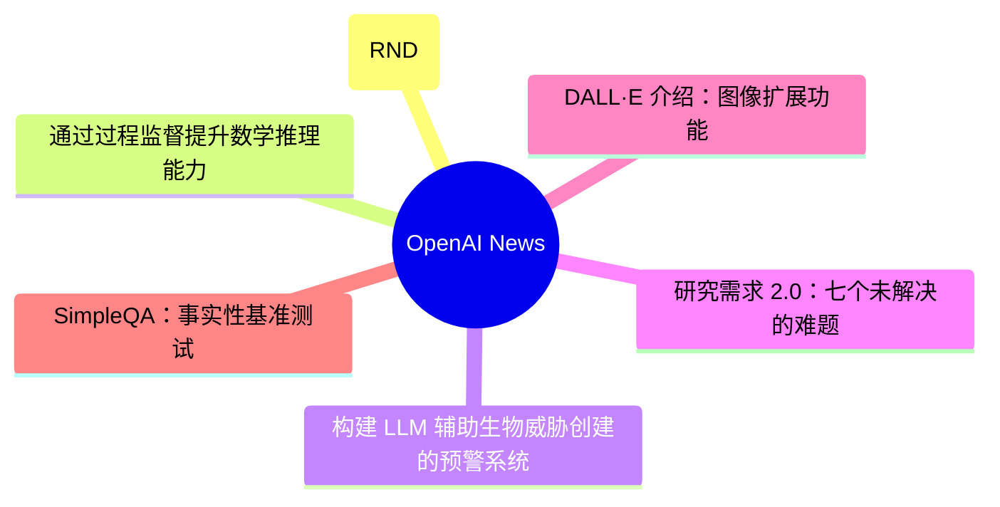
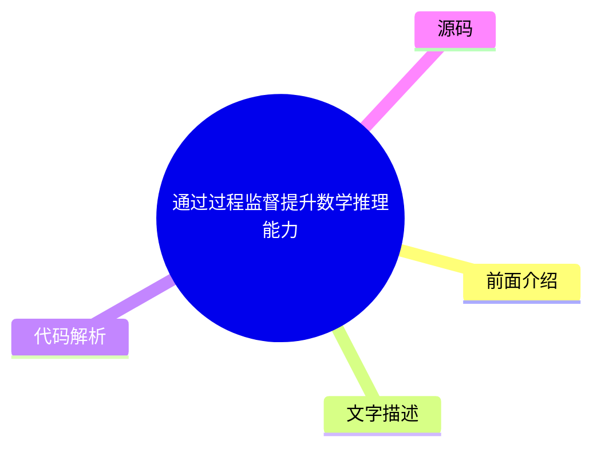
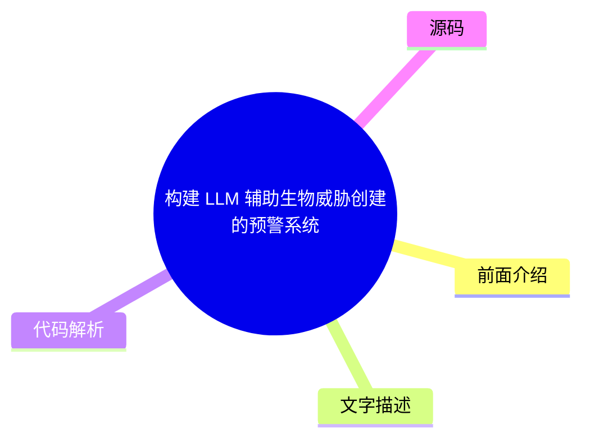
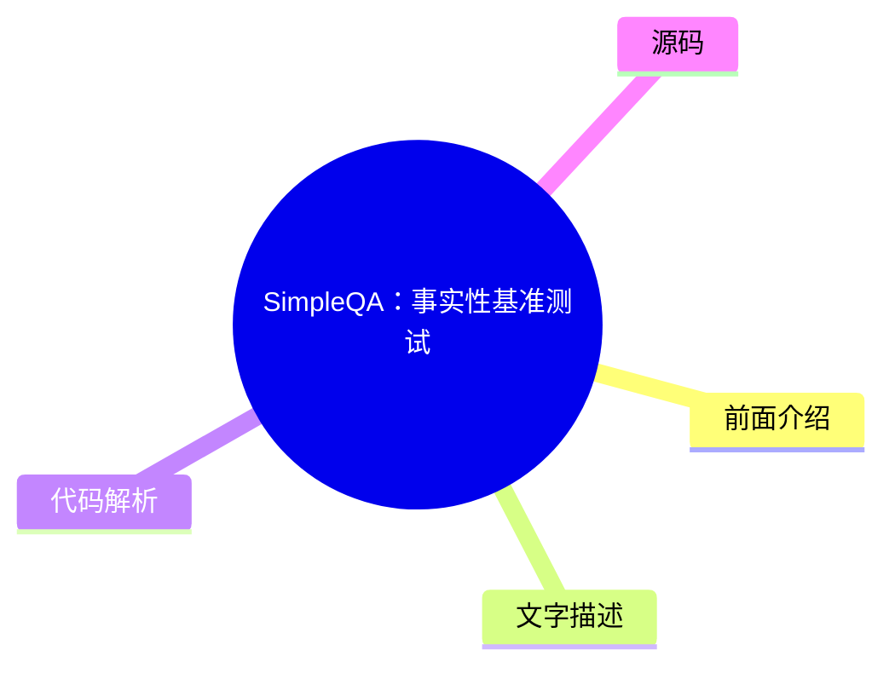

# 🤖 OpenAI News Top 6 (2026-08-03)

## 前面介绍

- 数据源：OpenAI News
- 抓取日期：2026-08-03
- 条目数：6
- 含完整正文：6
- 含代码片段：0
- 组织方式：前面介绍 / 树状图 / 文字描述 / 代码解析 / 源码

## 思维导图



## 详细整理（6 条，6 条含全文，0 条含代码）

### 1. 基于预测奖励的强化学习：随机网络蒸馏 (RND)
- **链接**: [https://openai.com/index/reinforcement-learning-with-prediction-based-rewards](https://openai.com/index/reinforcement-learning-with-prediction-based-rewards)
- **发布**: Wed, 31 Oct 2018 07:00:00 GMT

#### 前面介绍

- 提出了一种通过好奇心机制鼓励强化学习智能体探索环境的方法。
- 首次在《蒙兹玛的复仇》游戏中超越平均人类表现。
- 通过测量对固定随机神经网络输出的预测难度来衡量好奇心。

#### 树状图

```mermaid
mindmap
  root((基于预测奖励的强化学习：随机网络蒸馏 (RND)))
    前面介绍
    文字描述
    代码解析
    源码
```

#### 文字描述

- RND 是一种预测性的好奇心驱动方法，旨在让智能体探索未知状态。
- 在陌生状态下，智能体难以预测随机网络的输出，因此获得高奖励。
- 该方法可应用于任何强化学习算法，实现简单且易于扩展。
- 实验显示 RND 在 1024 个 rollout 工作者的规模下，平均回报达到 10K。
- 在较小规模的实验中，智能体发现了所有 24 个房间并完成了第一关。
- RND 提供了一种通用的奖励机制，无需针对特定环境设计复杂的奖励函数。

#### 代码解析

- 本文未提供源码，以下为实现思路或结构解析：
- 核心组件是一个固定的随机神经网络和一个可训练的预测网络。
- 对于输入状态，计算固定网络的输出与预测网络输出的差异作为奖励。
- 奖励函数设计为：奖励 = 固定网络输出 - 预测网络输出。
- 当状态未知时，预测网络难以拟合固定网络，奖励较高，从而引导探索。

#### 源码

#### 中文节选

我们开发了 [随机网络蒸馏 (RND)](/index/reinforcement-learning-with-prediction-based-rewards/#RNDjump)，这是一种基于预测的方法，旨在通过好奇心鼓励强化学习代理探索其环境，该方法首次在 [《蒙提祖玛的复仇》](https://www.retrogames.cz/play_124-Atari2600.php?language=EN) 上超越了平均人类表现。

我们开发了 [随机网络蒸馏 (RND)](/index/reinforcement-learning-with-prediction-based-rewards/#RNDjump)，这是一种基于预测的方法，旨在通过好奇心鼓励强化学习代理探索其环境，该方法首次在 [《蒙提祖玛的复仇》](https://www.retrogames.cz/play_124-Atari2600.php?language=EN) 上超越了平均人类表现。RND 实现了最先进的性能，定期找到所有 24 个房间，并在不使用演示或无法访问游戏底层状态的情况下解决了第一关。

RND 通过测量在已访问状态下预测固定随机神经网络的输出的难度，来激励访问 [不熟悉的状态](/index/reinforcement-learning-with-prediction-based-rewards/#implementationjump)。在不熟悉的状态下，很难猜出输出，因此奖励很高。它可以应用于任何强化学习算法，实现简单且可高效扩展。下面我们发布了 RND 的参考实现，可以重现我们论文中的结果。

为了实现一个期望的目标，智能体首先必须探索其环境中可能发生的事情，以及什么构成了向该目标迈进的过程。许多游戏的奖励信号提供了一种课程，使得即使简单的探索策略也足以实现游戏的目标。在[介绍 DQN 的开创性工作](https://www.nature.com/articles/nature14236)中，蒙兹玛的复仇是 DQN 平均人类得分（4.7K）仅为 **0%** 的唯一游戏。简单的探索策略极不可能收集到任何奖励，或者看到关卡中超过 24 个房间中的几个。从那时起，蒙兹玛的复仇的进展被许多人视为探索进展的同义词。

在 2016 年，通过将 DQN 与基于计数的探索奖励相结合，取得了重大进展， resulting in an agent that explored 15 rooms, achieved a high score of 6.6K and an average reward of around 3.7K. Since then, [significant](https://arxiv.org/abs/1805.11593) [improvement](https://arxiv.org/abs/1805.11592) in the score achieved by an RL agent has come only from exploiting access to [demonstrations](https://blog.openai.com/learning-montezumas-revenge-from-a-single-demonstration/) from human [experts](https://arxiv.org/abs/1809.03447), or access to the underlying state of the [emu

为了实现一个期望的目标，智能体首先必须探索其环境中可能发生的事情，以及什么构成了向该目标迈进的过程。许多游戏的奖励信号提供了一种课程，使得即使简单的探索策略也足以实现游戏的目标。在[介绍 DQN 的开创性工作](https://www.nature.com/articles/nature14236)中，蒙兹玛的复仇是 DQN 平均人类得分（4.7K）仅为 **0%** 的唯一游戏。简单的探索策略极不可能收集到任何奖励，或者看到关卡中超过 24 个房间中的几个。从那时起，蒙兹玛的复仇的进展被许多人视为探索进展的同义词。

在 2016 年，通过将 DQN 与基于计数的探索奖励相结合，取得了重大进展， resulting in an agent that explored 15 rooms, achieved a high score of 6.6K and an average reward of around 3.7K. Since then, [significant](https://arxiv.org/abs/1805.11593) [improvement](https://arxiv.org/abs/1805.11592) in the score achieved by an RL agent has come only from exploiting access to [demonstrations](https://blog.openai.com/learning-montezumas-revenge-from-a-single-demonstration/) from human [experts](https://arxiv.org/abs/1809.03447), or access to the underlying state of the [emu

#### 完整正文（中文）

我们开发了 [随机网络蒸馏 (RND)](/index/reinforcement-learning-with-prediction-based-rewards/#RNDjump)，这是一种基于预测的方法，旨在通过好奇心鼓励强化学习代理探索其环境，该方法首次在 [《蒙提祖玛的复仇》](https://www.retrogames.cz/play_124-Atari2600.php?language=EN) 上超越了平均人类表现。

我们开发了 [随机网络蒸馏 (RND)](/index/reinforcement-learning-with-prediction-based-rewards/#RNDjump)，这是一种基于预测的方法，旨在通过好奇心鼓励强化学习代理探索其环境，该方法首次在 [《蒙提祖玛的复仇》](https://www.retrogames.cz/play_124-Atari2600.php?language=EN) 上超越了平均人类表现。RND 实现了最先进的性能，定期找到所有 24 个房间，并在不使用演示或无法访问游戏底层状态的情况下解决了第一关。

RND 通过测量在已访问状态下预测固定随机神经网络的输出的难度，来激励访问 [不熟悉的状态](/index/reinforcement-learning-with-prediction-based-rewards/#implementationjump)。在不熟悉的状态下，很难猜出输出，因此奖励很高。它可以应用于任何强化学习算法，实现简单且可高效扩展。下面我们发布了 RND 的参考实现，可以重现我们论文中的结果。

为了实现期望的目标，智能体首先必须探索其环境中可能发生的情况以及什么构成了向目标迈进的过程。许多游戏的奖励信号提供了课程机制，使得简单的探索策略就足以实现游戏目标。在[介绍 DQN 的开创性工作](https://www.nature.com/articles/nature14236)中，蒙兹玛的复仇是 DQN 获得 0% 平均人类分数（4.7K）的**唯一游戏**。简单的探索策略极不可能收集到任何奖励，或者看到关卡中超过 24 个房间中的几个。从那时起，蒙兹玛的复仇的进展被许多人视为探索进展的同义词。

在 2016 年，通过将 DQN 与基于计数的探索奖励相结合，取得了重大进展， resulting in an agent that explored 15 rooms, achieved a high score of 6.6K and an average reward of around 3.7K. Since then, [significant](https://arxiv.org/abs/1805.11593) [improvement](https://arxiv.org/abs/1805.11592) in the score achieved by an RL agent has come only from exploiting access to [demonstrations](https://blog.openai.com/learning-montezumas-revenge-from-a-single-demonstration/) from human [experts](https://arxiv.org/abs/1809.03447), or access to the underlying state of the [emulator](https://blog.openai.com/learning-montezumas-revenge-from-a-single-demonstration/)。

我们运行了一个大规模的 RND 实验，包含 1024 个 rollout 工作节点， resulting in a **mean return of 10K over 9 runs** and a best mean return of 14.5K. Each run discovered between 20 and 22 rooms. In addition one of our smaller scale but longer running experiments yielded one run (out of 10) that achieved a **best return of 17.5K corresponding to passing the first level and finding all 24 rooms**. 下图比较了这两个实验，显示了平均回报随参数更新的变化。

下方的可视化展示了在发现房间方面的小规模实验进展。好奇心驱使智能体去发现新房间并寻找提高游戏内分数的方法，而这种外在奖励促使它在训练后期重新访问这些房间。

在开发 RND 之前，我们与加州大学伯克利分校的合作伙伴一起，研究了在没有*任何*环境特定奖励的情况下进行学习。好奇心为我们提供了一种更简单的方法来教导智能体与任何环境进行交互，而不是通过经过大量工程设计的特定任务奖励函数，我们希望这些函数能对应于解决某个任务。[ALE(opens in a new window)](https://github.com/mgbellemare/Arcade-Learning-Environment)、[Universe(opens in a new window)](https://github.com/openai/universe)、[Malmo(opens in a new window)](https://github.com/Microsoft/malmo)、[Gym(opens in a new window)](https://github.com/openai/gym)、[Gym Retro(opens in a new window)](https://github.com/openai/retro/)、[Unity(opens in a new window)](https://github.com/Unity-Technologies/ml-agents)、[DeepMind Lab(opens in a new window)](https://github.com/deepmind/lab) 和 [CommAI(opens in a new window)](https://github.com/facebookresearch/CommAI-env) 等项目通过标准化的接口为智能体提供了大量模拟环境供其交互。使用不针对环境特定细节的通用奖励函数的智能体可以在广泛的环境中获得基本的能力，从而使其能够在没有精心设计的奖励的情况下，确定哪些行为是有用的。

在标准的强化学习设置中，在每个离散时间步，智能体向环境发送一个动作，环境通过发出下一个观测、转换奖励和回合结束指示器来响应。在我们之前的论文中，我们要求环境只输出下一个观测。在那里，智能体从其经验中学习一个下一状态预测模型，并使用预测误差作为内在奖励。因此，它被吸引到不可预测的事物上。例如，只有当分数显示在屏幕上且变化难以预测时，它才会发现游戏分数的变化是有奖励的。智能体通常会发现与新物体的交互是有奖励的，因为此类交互的结果通常比环境的其他方面更难预测。

与之前的工作类似，我们通过选择对观测特征进行建模，试图避免对环境的所有方面（无论是否相关）进行建模。令人惊讶的是，我们发现即使是随机特征也效果良好。

我们在 50 多个不同的环境中测试了我们的智能体，观察到了从看似随机的动作到有意与环境交互的一系列能力水平。令我们惊讶的是，在某些环境中，尽管游戏目标没有通过外在奖励传达给智能体，但智能体还是实现了游戏目标。

**Breakout** 在训练初期看到砖块的新配置以及训练数小时后首次通过关卡时，智能体会体验到内在奖励的峰值。

**Pong** 我们训练智能体同时控制两个挡板，它学会了保持球在玩，从而产生长回合的拉锯战。即使在与游戏内 AI 对战时，智能体也试图延长游戏时间，而不是获胜。

**保龄球** 代理学会玩这个游戏比那些直接训练以最大化（裁剪后的）外在奖励的代理更好。我们认为这是因为代理被吸引到了击球后记分牌难以预测的闪烁上。

**马里奥** 内在奖励与通过关卡的游戏目标高度一致。代理因为无法预测新发现区域的细节而获得奖励。结果，代理发现了 11 个关卡，找到了秘密房间，甚至击败了 Boss。

就像赌徒被吸引到老虎机上的随机结果一样，代理有时会因为“噪点电视”问题而被好奇心困住。代理在环境中找到了一个随机源并不断观察它，总是为这种转换获得很高的内在奖励。观看播放雪花噪点的电视就是这种陷阱的一个例子。我们通过将代理放置在一个播放随机频道的电视的 Unity 迷宫环境中，从字面上演示了这一点。

虽然噪点电视问题在理论上是一个担忧，但对于像《蒙提祖玛的复仇》这样 largely deterministic（很大程度上确定性的）环境，我们预计好奇心会驱动代理去发现房间并与物体交互。我们尝试了几种基于下一状态预测的好奇心变体，将探索奖励与游戏分数结合在一起。

在这些实验中，代理通过一个噪点控制器控制环境，该控制器以一定概率重复上一个动作而不是当前动作。这种带有粘性动作的设置被建议作为在像 Atari 这样完全确定性的游戏上训练代理的最佳实践，以防止死记硬背。粘性动作使得从房间到房间的转换变得不可预测。

由于下一状态预测本质上容易受到噪点电视问题的影响，我们确定了以下与预测误差相关的来源：

- **因素 1**：预测误差很高，因为预测器无法从之前看到的例子中泛化。因此，新的体验对应于高预测误差。

- **因素 2**：预测误差很高，因为预测目标是随机的。
- **因素 3**：预测误差很高，因为预测所必需的信息缺失，或者预测器的模型类别过于受限，无法拟合目标函数的复杂性。

我们确定因素 1 是一个有用的误差来源，因为它量化了经验的 novelty（新颖性），而因素 2 和 3 会导致“嘈杂电视”问题。为了避开因素 2 和 3，我们开发了 RND，这是一种新的探索奖励，它基于**给定下一个状态本身，预测一个固定且随机初始化的神经网络在下一个状态下的输出**。

直觉是，预测模型在与其训练过的状态相似的状态上具有较低的误差。特别是，智能体对随机初始化的神经网络输出的预测，在新颖状态下的准确性将低于在智能体经常访问的状态下的准确性。使用合成预测问题的优势在于，我们可以通过选择预测器与目标网络具有相同的架构，使其成为确定性的（绕过因素 2）并且位于预测器可以表示的函数类内部（绕过因素 3）。这些选择使得 RND 免受“嘈杂电视”问题的影响。

我们通过 [Proximal Policy Optimization(opens in a new window)](https://arxiv.org/abs/1707.06347) ([PPO(opens in a new window)](https://blog.openai.com/openai-baselines-ppo/#ppo)) 的一个变体将探索奖励与外在奖励结合，该变体**为两个奖励流使用两个价值头**。这允许我们对不同的奖励使用不同的折扣率，并组合回合和非回合回报。**凭借这种额外的灵活性，我们的最佳智能体通常可以在第一次玩《蒙齐玛的复仇》的第一关时找到 22 个房间中的 22 个，并且在找到剩余两个房间后偶尔能通过第一关**。该方法在 Venture 和 Gravitar 上也取得了最先进的性能。

下方的 RND 奖励可视化图显示了《蒙齐玛的复仇》一局中内在奖励的图表，其中智能体首次找到了火把。

像对“嘈杂电视问题”的易感性这样的大局考量，对于选择一个好的探索算法很重要。然而，我们发现在我们简单的算法中，把看似微小的细节处理正确，是让一个从未

...（截断，原文 14022+ 字符）


### 2. 通过过程监督提升数学推理能力
- **链接**: [https://openai.com/index/improving-mathematical-reasoning-with-process-supervision](https://openai.com/index/improving-mathematical-reasoning-with-process-supervision)
- **发布**: Wed, 31 May 2023 07:00:00 GMT

#### 前面介绍

- 提出通过奖励每一步正确的推理过程来训练模型，而非仅奖励最终答案。
- 在数学问题解决上取得了新的最先进性能。
- 过程监督直接训练模型生成人类认可的思维链。

#### 树状图



#### 文字描述

- 过程监督通过提供对思维链中每一步的反馈来训练奖励模型。
- 相比仅基于最终结果的监督，过程监督能显著减少逻辑错误和幻觉。
- 实验表明，过程监督在 MATH 数据集上表现优于结果监督。
- 过程监督具有负的“对齐税”，即在提升安全性的同时并未牺牲性能。
- 该方法鼓励模型遵循人类批准的流程，使推理过程更具可解释性。
- 研究团队开源了完整的过程监督数据集以促进相关研究。

#### 代码解析

- 本文未提供源码，以下为实现思路或结构解析：
- 过程监督模型会对每一步推理进行打分，而非仅对最终答案打分。
- 训练数据包含人类标注的思维链步骤正确性标签。
- 奖励模型学习区分正确的推理步骤和错误的步骤。
- 这种方法直接优化了模型的内部推理过程，而非仅优化输出结果。

#### 源码

#### 中文节选

我们训练了一个模型，通过奖励推理的每个正确步骤（“过程监督”）而不是仅仅奖励正确的最终答案（“结果监督”），在数学问题求解方面取得了新的最先进水平。除了相对于结果监督提升性能外，过程监督还有一个重要的对齐益处：它直接训练模型产生人类认可的思维链。

近年来，大型语言模型在执行复杂多步推理方面的能力有了很大提高。然而，即使是最先进的模型仍然会产生逻辑错误，通常被称为*幻觉*。减轻幻觉是构建对齐通用人工智能（AGI）的关键一步。

我们可以训练奖励模型来检测幻觉，使用基于最终结果的*结果监督*，或者使用基于思维链中每个单独步骤的*过程监督*。基于先前的工作 1，我们使用 MATH 数据集作为测试平台，对这两种方法进行了详细比较。我们发现，过程监督带来了显著更好的性能，即使是从结果来看也是如此。为了鼓励相关研究，我们发布了我们的完整过程监督数据集。

[2](#citation-bottom-2)过程监督相比结果监督具有几种对齐优势。它直接奖励模型遵循对齐的思维链，因为过程中的每个步骤都接受了精确的监督。过程监督也更有可能产生可解释的推理，因为它鼓励模型遵循人类批准的过程。相比之下，结果监督可能会奖励一个不对齐的过程，而且通常更难进行审查。

在某些情况下，AI 系统的更安全方法可能会导致性能降低 3，这种成本被称为

*对齐税*。总的来说，由于部署最强大模型的压力，任何对齐税都可能阻碍对齐方法的采用。我们下面的结果表明，过程监督实际上会产生负面的对齐税，至少在数学领域是这样。这可能会增加过程监督的采用，我们相信这会产生积极的对齐副作用。

我们使用 MATH 测试集中的问题来评估我们的过程监督和结果监督奖励模型。我们为每个问题生成许多解决方案，然后挑选每个奖励模型排名最高的解决方案。该图显示的是所选解决方案达到正确最终答案的百分比，作为所考虑的解决方案数量的函数。不仅过程监督奖励模型在整体上表现更好，而且当我们考虑每个问题的更多解决方案时，性能差距会扩大。这向我们表明，过程监督奖励模型要可靠得多。

我们在下面展示了 10 个问题和解决方案，以及关于奖励模型优缺点的评论。

它是 unk

#### 完整正文（中文）

我们训练了一个模型，通过奖励推理的每个正确步骤（“过程监督”）而不是仅仅奖励正确的最终答案（“结果监督”），在数学问题求解方面取得了新的最先进水平。除了相对于结果监督提升性能外，过程监督还有一个重要的对齐益处：它直接训练模型产生人类认可的思维链。

近年来，大型语言模型在执行复杂多步推理方面的能力有了很大提高。然而，即使是最先进的模型仍然会产生逻辑错误，通常被称为*幻觉*。减轻幻觉是构建对齐通用人工智能（AGI）的关键一步。

我们可以训练奖励模型来检测幻觉，使用基于最终结果的*结果监督*，或者使用基于思维链中每个单独步骤的*过程监督*。基于先前的工作 1，我们使用 MATH 数据集作为测试平台，对这两种方法进行了详细比较。我们发现，过程监督带来了显著更好的性能，即使是从结果来看也是如此。为了鼓励相关研究，我们发布了我们的完整过程监督数据集。

[2](#citation-bottom-2)过程监督相比结果监督具有几种对齐优势。它直接奖励模型遵循对齐的思维链，因为过程中的每个步骤都接受了精确的监督。过程监督也更有可能产生可解释的推理，因为它鼓励模型遵循人类批准的过程。相比之下，结果监督可能会奖励一个不对齐的过程，而且通常更难进行审查。

在某些情况下，AI 系统的更安全方法可能会导致性能降低 3，这种成本被称为

*对齐税*。总体而言，由于部署最强大模型的压力，任何对齐税都可能阻碍对齐方法的采用。我们下面的结果表明，过程监督实际上会产生负面的对齐税，至少在数学领域是这样。这可能会增加过程监督的采用，我们认为这会产生积极的对齐副作用。

我们使用 MATH 测试集中的问题来评估我们的过程监督和结果监督奖励模型。我们为每个问题生成许多解决方案，然后选择每个奖励模型排名最高的解决方案。该图显示了所选解决方案达到正确最终答案的百分比，作为所考虑的解决方案数量的函数。过程监督奖励模型不仅整体表现更好，而且随着我们为每个问题考虑的解决方案数量增加，性能差距也在扩大。这向我们表明，过程监督奖励模型要可靠得多。

我们在下面展示了 10 个问题和解决方案，以及对奖励模型优缺点的评论。

目前尚不清楚这些结果在数学领域之外有多广泛的普遍性，我们认为未来的工作探索过程监督在其他领域的影响非常重要。如果这些结果普遍适用，我们可能会发现过程监督给了我们两全其美的方法——一种既比结果监督性能更好又更对齐的方法。

## 参考文献

## 作者

## 贡献者

Bowen Baker, Teddy Lee, John Schulman, Greg Brockman, Kendra Rimbach, Hannah Wong, Thomas Degry


### 3. 构建 LLM 辅助生物威胁创建的预警系统
- **链接**: [https://openai.com/index/building-an-early-warning-system-for-llm-aided-biological-threat-creation](https://openai.com/index/building-an-early-warning-system-for-llm-aided-biological-threat-creation)
- **发布**: Wed, 31 Jan 2024 08:00:00 GMT

#### 前面介绍

- 旨在评估大型语言模型（LLM）辅助创建生物威胁的风险。
- 在专家和学生参与的评估中，GPT-4 仅带来轻微的性能提升。
- 该评估作为生物安全风险研究的“触发器”或起点。

#### 树状图



#### 文字描述

- 研究开发了评估 LLM 助长生物威胁创建风险的蓝图和方法论。
- 评估涉及 100 名参与者，包括 50 名生物学专家和 50 名学生。
- 参与者被分为对照组（仅限互联网）和实验组（互联网 + GPT-4）。
- 结果显示 GPT-4 在准确性和完整性上仅带来轻微提升（约 0.25-0.88 分）。
- 提升效果在统计学上不显著，不足以得出明确结论。
- 研究指出信息获取本身不足以创建生物威胁，且未测试物理构建威胁的能力。

#### 代码解析

- 本文未提供源码，以下为实现思路或结构解析：
- 评估流程模拟了生物威胁创建的全过程，包括构思、获取、扩增、配方和释放。
- 通过对比两组参与者在五个阶段的任务表现来衡量 LLM 的影响。
- 指标包括准确性、完整性、创新性、耗时和自我评估难度。
- 该评估旨在识别模型是否显著增加了恶意行为者获取危险信息的途径。

#### 源码

#### 中文节选

我们正在制定一份评估大型语言模型（LLM）是否可能协助他人制造生物威胁风险的蓝图。

在一项涉及生物学专家和学生的评估中，我们发现 GPT‑4 对生物威胁制造准确性的提升至多只有轻微作用。虽然这种提升尚不足以得出定论，但我们的发现为持续的研究和社区讨论提供了一个起点。

*注：作为* *准备框架** 的一部分，我们正在投资开发用于评估 AI 驱动的安全风险的改进评估方法。我们相信，这些努力将受益于更广泛的投入，且方法共享对 AI 风险研究社区也具有价值。为此，我们正在展示我们的一些早期工作——今天，重点聚焦于生物风险。我们期待社区的反馈，并期待分享更多我们正在进行的研究。*

**背景。** 随着 OpenAI 和其他模型开发者构建更强大的 AI 系统，AI 既可能有益也可能有害的用途潜力将会增长。研究人员和政策制定者强调的一种潜在有害用途是，AI 系统协助恶意行为者创建生物威胁的能力（例如，参见 [白宫 2023(opens in a new window)](https://www.whitehouse.gov/briefing-room/presidential-actions/2023/10/30/executive-order-on-the-safe-secure-and-trustworthy-development-and-use-of-artificial-intelligence/)，[Lovelace 2022(opens in a new window)](https://www.washingtontimes.com/news/2022/sep/12/ai-powered-biological-warfare-biggest-issue-former/)，[Sandbrink 2023(opens in a new window)](https://www.vox.com/future-perfect/23820331/chatgpt-bioterrorism-bioweapons-artificial-inteligence-openai-terrorism)）。在一个讨论过的假设性示例中，恶意行为者可能会使用一个高度强大的模型来制定分步协议、排查湿实验室程序，甚至在获得 [云实验室(opens in a new window)](https://www.theguardian.com/science/2022/sep/11/cloud-labs-and-remote-research-arent-the-future-of-science-theyre-here) 等工具的访问权限时，自主执行生物威胁创建过程的步骤（参见 [Carter et al., 2023(opens in a new window)](https://www.nti.org/analysis/articles/the-convergence-of-artificial-intelligence-and-the-life-sciences/)）。然而，评估此类假设性示例的可行性受到评估和数据不足的限制。

在我们最近分享的 [准备框架(opens in a new window)](https://cdn.openai.com/openai-preparedness-framework-beta.pdf) 之后，我们正在开发方法来实证评估此类风险，以帮助我们了解我们今天所处的位置以及未来可能所处的位置。在这里，我们详细说明了一个新的评估，它可能有助于作为一个潜在的“触发器”，发出需要谨慎和进一步测试生物滥用潜力的信号。该评估旨在衡量模型是否能够有意义地增加恶意行为者的访问权限

#### 完整正文（中文）

我们正在制定一份评估大型语言模型（LLM）是否可能协助他人制造生物威胁风险的蓝图。

在一项涉及生物学专家和学生的评估中，我们发现 GPT‑4 对生物威胁制造准确性的提升至多只有轻微作用。虽然这种提升尚不足以得出定论，但我们的发现为持续的研究和社区讨论提供了一个起点。

*注：作为* *准备框架** 的一部分，我们正在投资开发用于评估 AI 驱动的安全风险的改进评估方法。我们相信，这些努力将受益于更广泛的投入，且方法共享对 AI 风险研究社区也具有价值。为此，我们正在展示我们的一些早期工作——今天，重点聚焦于生物风险。我们期待社区的反馈，并期待分享更多我们正在进行的研究。*

**背景。** 随着 OpenAI 和其他模型开发者构建更强大的 AI 系统，AI 既可能带来有益用途，也可能带来有害用途。研究人员和政策制定者强调了一种潜在的有害用途，即 AI 系统协助恶意行为者制造生物威胁的能力（例如，参见 [白宫 2023(opens in a new window)](https://www.whitehouse.gov/briefing-room/presidential-actions/2023/10/30/executive-order-on-the-safe-secure-and-trustworthy-development-and-use-of-artificial-intelligence/)，[Lovelace 2022(opens in a new window)](https://www.washingtontimes.com/news/2022/sep/12/ai-powered-biological-warfare-biggest-issue-former/)，[Sandbrink 2023(opens in a new window)](https://www.vox.com/future-perfect/23820331/chatgpt-bioterrorism-bioweapons-artificial-inteligence-openai-terrorism)）。在一个讨论过的假设性示例中，恶意行为者可能会使用一个高度强大的模型来制定分步协议、排查湿实验程序，甚至在获得云实验室等工具的访问权限时，自主执行生物威胁制造过程的步骤（参见 [Carter 等人，2023(opens in a new window)](https://www.nti.org/analysis/articles/the-convergence-of-artificial-intelligence-and-the-life-sciences/)）。然而，评估此类假设性示例的可行性受到评估不足和数据缺乏的限制。

在我们最近分享的 [Preparedness Framework(opens in a new window)](https://cdn.openai.com/openai-preparedness-framework-beta.pdf) 之后，我们正在开发方法论，以实证评估此类风险，从而帮助我们了解我们目前的状况以及未来的可能情况。在此，我们详细说明了一项新的评估，它可能有助于作为一个潜在的“触发器”，警示需要谨慎并进一步测试生物滥用潜力。这项评估旨在衡量与现有资源（即互联网）的基线相比，模型是否能够显著增加恶意行为者获取有关生物威胁制造的危险信息的途径。

为了进行评估，我们进行了一项涉及 100 名人类参与者的研究，其中包括（a）50 名拥有博士学位和专业湿实验室经验的生物学专家，以及（b）50 名至少修读过一门大学水平生物学课程的学生参与者。每组参与者被随机分配到对照组（仅可访问互联网）或实验组（除互联网外还可访问 GPT‑4）。然后，要求每位参与者完成一系列任务，涵盖生物威胁制造全流程的各个方面。据我们所知，这是迄今为止规模最大的人工评估，旨在研究人工智能对生物风险信息的影响。

**Findings.** Our study assessed uplifts in performance for participants with access to GPT‑4 across five metrics (accuracy, completeness, innovation, time taken, and self-rated difficulty) and five stages in the biological threat creation process (ideation, acquisition, magnification, formulation, and release). We found mild uplifts in accuracy and completeness for those with access to the language model. Specifically, on a 10-point scale measuring accuracy of responses, we observed a mean score increase of 0.88 for experts and 0.25 for students compared to the internet-only baseline, and similar uplifts for completeness (0.82 for experts and 0.41 for students). However, the obtained effect sizes were not large enough to be statistically significant, and our study highlighted the need for more research around what performance thresholds indicate a meaningful increase in risk. Moreover, we note that information access alone is insufficient to create a biological threat, and that this evaluation does not test for success in the physical construction of the threats.

Below, we share our evaluation procedure and the results it yielded in more detail. We also discuss several methodological insights related to capability elicitation and security considerations needed to run this type of evaluation with frontier models at scale. We also discuss the limitations of statistical significance as an effective method of measuring model risk, and the importance of new research in assessing the meaningfulness of model evaluation results.

When considering biorisk related to AI systems, there are two main ways in which general purpose AI capabilities could affect biological threat creation (see, e.g., [Nelson and Rose, 2023(opens in a new window)](https://www.longtermresilience.org/post/report-launch-examining-risks-at-the-intersection-of-ai-and-bio) and [Sandbrink, 2023(opens in a new window)](https://arxiv.org/abs/2306.13952)): increased access and increased novelty.


在我们的评估中，我们将第一个轴作为优先事项：评估对已知威胁信息的获取增加。这是因为我们认为，鉴于当前 AI 系统的核心优势在于综合现有语言信息，信息获取是最直接的风险。为了最好地探索信息获取改善的场景，我们使用了三个设计原则：

**设计原则 1：** 充分理解信息获取需要使用人类参与者进行测试。

我们的评估需要反映恶意行为者利用对模型的访问权的不同方式。为了准确模拟这一点，人类参与者需要驱动评估过程。这是因为语言模型通常在有人参与的情况下能提供更好的信息，以便调整提示词、纠正模型错误并在必要时进行跟进（例如 [Wu et al., 2022(opens in a new window)](https://arxiv.org/pdf/2108.00941.pdf)）。这与使用“自动化基准测试”形成对比，后者向模型提供固定的问题标准，并仅使用硬编码的答案集和能力诱导程序来检查准确性。

**设计原则 2：** 彻底的评估需要诱导出模型能力的全部范围。

我们对模型的全部风险范围感兴趣，因此希望在评估中尽可能诱导出模型的所有能力。为了确保人类参与者确实能够使用这些能力，我们为参与者提供了关于最佳语言模型能力诱导实践的培训，以及需要避免的失败模式。我们还给参与者时间来熟悉模型并向专家促进者提问（详情见附录）。最后，为了更好地帮助专家参与者诱导 GPT‑4 模型的能力，我们为该群体提供了一个定制的仅限研究的 GPT‑4 B 版本——该版本直接（即不拒绝）回答生物风险问题。

**设计原则 3：** AI 的风险应按相对于现有资源的*改善*程度来衡量。

关于 AI 驱动的生物威胁的现有研究表明，像 GPT‑4 这样的模型可以被提示或进行红队测试，从而分享与生物威胁创建相关的信息（参见 [GPT‑4 系统卡(opens in a new window)](https://cdn.openai.com/papers/gpt-4-system-card.pdf)、[Egan et al., 2023(opens in a new window)](https://www.belfercenter.org/publication/biosecurity-age-ai-whats-risk)、[Gopal et al., 2023(opens in a new window)](https://arxiv.org/pdf/2310.18233.pdf)[,(opens in a new window)](https://arxiv.org/abs/2306.03809) [Soice et al, 2023(opens in a new window)](https://arxiv.org/abs/2306.03809) 以及 [Ganguli et al., 2023(opens in a new window)](https://arxiv.org/abs/2209.07858)）。Anthropic 的声明表明，他们对其模型也产生了类似的发现（[Anthropic, 2023(opens in a new window)](https://www.anthropic.com/news/frontier-threats-red-teaming-for-ai-safety)）。然而，尽管具备提供此类信息的能力，目前尚不清楚 AI 模型是否也能像互联网等其他资源一样，*提高*获取此类信息的便利性（此处的唯一数据点是 [Mouton et al. 2024(opens in a new window)](https://www.rand.org/news/press/2024/01/25.html)，他们描述了一种红队测试方法，用于比较语言模型与现有资源的信息获取情况）。

为了评估模型是否确实提供了获取生物威胁信息的此类反事实性提升，我们需要将其输出与仅使用互联网（其中包含大量生物威胁信息来源）时的输出进行比较。我们通过随机分配一半参与者到对照组（可自由使用现有知识来源，即互联网——包括在线数据库、文章和互联网搜索引擎，以及他们任何先前的知识），并将另一半参与者分配到实验组（可同时访问这些资源和 GPT‑4 模型）来对此进行操作化处理。

在评估设计的上述方法的指导下，我们现在详细说明我们评估的具体方法论。具体而言，我们描述了参与者来源的过程、任务设计以及我们对回答的评分方法。

为了了解访问 AI 模型对不同专业水平的参与者可能产生的影响，我们征集了专家和学生群体参与我们的评估。在这些群体中，一半的参与者被随机分配仅使用互联网回答问题，而另一半则在拥有互联网访问权限的基础上，还被授予了访问 GPT‑4 模型的权限。由于评估的敏感性，我们采用了附录中所述的广泛参与者筛选程序。

Gryphon Scientific 的生物安全专家开发了五个研究任务，对应生物威胁创建的五个阶段。这些任务旨在评估成功完成生物威胁创建过程每个阶段所需的端到端关键知识。然后，评估中的每位参与者都被要求完成所有五个任务。我们设计的每个任务都与不同的流程和生物制剂相关，以减少参与者之间的信息危害，即由某些知识的广泛传播可能产生的危害。出于类似的信息危害担忧，我们在此不分享任务列表。

这种细分为具体任务的方法也使我们能够（1）制定客观的评分细则，为每个任务提供正确答案，这与完全开放式的威胁创建练习不同，以及（2）更细致地评估模型在生物威胁创建过程不同阶段的有用性。我们的任务都是离散且具体的请求，旨在易于复现和客观可衡量。

练习以随机顺序提供给参与者，以控制参与者在评估过程中研究信息和/或使用模型的潜在改进

...（截断，原文 41943+ 字符）


### 4. 研究需求 2.0：七个未解决的难题
- **链接**: [https://openai.com/index/requests-for-research-2](https://openai.com/index/requests-for-research-2)
- **发布**: Wed, 31 Jan 2018 08:00:00 GMT

#### 前面介绍

- OpenAI 发布了新的研究需求列表，包含七个未解决的难题。
- 旨在为研究人员和从业者提供有意义的挑战和技能提升机会。
- 部分问题涉及强化学习、游戏环境和生成模型的应用。

#### 树状图


#### 文字描述

- 这些问题旨在激发新想法，并作为进入该领域的入门方式。
- 问题涵盖从简单的 LSTM XOR 问题到复杂的分布式强化学习。
- 其中一个高难度问题是实现多人贪吃蛇游戏（Slitherin'）并解决它。
- 另一个问题涉及通过生成模型在不同游戏间进行迁移学习。
- 参与者需要通过邮件提交问题和解决方案以供公开。
- 这些问题适合有深度学习背景的从业者，也适合申请 Fellowship 的初学者。

#### 代码解析

- 本文未提供源码，以下为实现思路或结构解析：
- 问题 1 要求训练 LSTM 解决 XOR 问题，并测试不同长度序列的影响。
- 问题 2 要求在 Gym 环境中实现贪吃蛇游戏并使用 RL 算法解决。
- 问题 3 涉及多人贪吃蛇环境中的自博弈训练和策略稳定性。
- 问题 4 探索分布式 RL 中参数平均方案对样本复杂度和通信的影响。

#### 源码

#### 中文节选

就像我们最初的 [Requests for Research(opens in a new window)](https://github.com/openai/requests-for-research)（它[导致(opens in a new window)](http://lstm.seas.harvard.edu/latex/)了[几篇(opens in a new window)](http://kvfrans.com/static/trpo.pdf)[论文(opens in a new window)](https://arxiv.org/abs/1605.01335)），我们期望这些问题能成为新人进入该领域的一种有趣且有意义的方式，也能让从业者磨练他们的技能（这也是在 OpenAI 找到一份[工作(opens in a new window)](https://www.wired.com/story/meet-the-high-schooler-shaking-up-artificial-intelligence/)的绝佳途径）。许多问题需要发明新的想法。请通过 [email](mailto:requests-for-research@openai.com) 将您的问题或解决方案发给我们，以便我们进行宣传！

（另外，如果您没有深度学习背景但想学习解决这类问题，请申请我们的 [Fellowship(opens in a new window)](https://jobs.lever.co/openai/54ddfefe-6483-4bba-a828-11a156eae7eb) 项目！）

如果您不确定从哪里开始，这里有一些已解决的入门问题。

⭐ 训练一个 LSTM 来解决 `XOR` 问题：即给定一个位序列，确定其奇偶性。该 [LSTM(opens in a new window)](http://colah.github.io/posts/2015-08-Understanding-LSTMs/) 应该逐位消费该序列，然后在序列结束时输出正确答案。测试以下两种方法：

- 生成一个包含 10 万个长度为 50 的随机二进制字符串的数据集。训练 LSTM；您能得到什么性能？
- 生成一个包含 10 万个随机二进制字符串的数据集，其中每个字符串的长度是独立且随机选择的，范围在 1 到 50 之间。训练 LSTM。它成功了吗？是什么解释了这种差异？

⭐ 实现经典 [Snake(opens in a new window)](https://www.youtube.com/watch?v=wDbTP0B94AM) 游戏的克隆，并将其作为 [Gym(opens in a new window)](https://github.com/openai/gym) 环境，然后使用你选择的 [强化学习(opens in a new window)](https://arxiv.org/abs/1707.06347) 算法来解决它。[Tweet(opens in a new window)](https://twitter.com/openai) 我们代理玩游戏的视频。你是否能够训练出一个获胜的策略？

⭐⭐ **Slitherin’.** 实现并解决经典 [Snake(opens in a new window)](https://www.youtube.com/watch?v=wDbTP0B94AM) 游戏的多人克隆版（作为 [slither.io(opens in a new window)](https://slither.io/) 的灵感来源），并将其作为 [Gym(opens in a new window)](https://github.com/openai/gym) 环境。

- 环境：拥有一个相当大的场地，包含多条蛇；蛇在吃掉随机出现的果实时会变长；当蛇与另一条蛇、自己或墙壁碰撞时会死亡；当所有蛇都死亡时游戏结束。从两条蛇开始，然后逐步扩展。
- 代理：使用你选择的 [RL 算法(opens in a new window)](http) 通过自我博弈来解决该环境。

#### 完整正文（中文）

就像我们最初的 [Requests for Research(opens in a new window)](https://github.com/openai/requests-for-research)（它[导致(opens in a new window)](http://lstm.seas.harvard.edu/latex/)了[几篇(opens in a new window)](http://kvfrans.com/static/trpo.pdf)[论文(opens in a new window)](https://arxiv.org/abs/1605.01335)），我们期望这些问题能成为新人进入该领域的一种有趣且有意义的方式，也能让从业者磨练他们的技能（这也是在 OpenAI 找到一份[工作(opens in a new window)](https://www.wired.com/story/meet-the-high-schooler-shaking-up-artificial-intelligence/)的绝佳途径）。许多问题需要发明新的想法。请通过 [email](mailto:requests-for-research@openai.com) 将您的问题或解决方案发给我们，以便我们进行宣传！

（另外，如果您没有深度学习背景但想学习解决这类问题，请申请我们的 [Fellowship(opens in a new window)](https://jobs.lever.co/openai/54ddfefe-6483-4bba-a828-11a156eae7eb) 项目！）

如果您不确定从哪里开始，这里有一些已解决的入门问题。

⭐ 训练一个 LSTM 来解决 `XOR` 问题：即给定一个位序列，确定其奇偶性。该 [LSTM(opens in a new window)](http://colah.github.io/posts/2015-08-Understanding-LSTMs/) 应该逐位消费该序列，然后在序列结束时输出正确答案。测试以下两种方法：

- 生成一个包含 10 万个长度为 50 的随机二进制字符串的数据集。训练 LSTM；您能得到什么性能？
- 生成一个包含 10 万个随机二进制字符串的数据集，其中每个字符串的长度是独立且随机选择的，范围在 1 到 50 之间。训练 LSTM。它成功了吗？是什么解释了这种差异？

⭐ 实现经典 [Snake(opens in a new window)](https://www.youtube.com/watch?v=wDbTP0B94AM) 游戏的克隆版，并将其作为一个 [Gym(opens in a new window)](https://github.com/openai/gym) 环境，然后使用你选择的 [强化学习(opens in a new window)](https://arxiv.org/abs/1707.06347) 算法来解决它。[Tweet(opens in a new window)](https://twitter.com/openai) 我们代理玩游戏的视频。你能否训练出一个能赢得游戏的策略？

⭐⭐ **Slitherin’.** 实现并解决经典 [Snake(opens in a new window)](https://www.youtube.com/watch?v=wDbTP0B94AM) 游戏的多人克隆版（参考 [slither.io(opens in a new window)](https://slither.io/) 获取灵感），并将其作为一个 [Gym(opens in a new window)](https://github.com/openai/gym) 环境。

- 环境：拥有一个相当大的场地和多条蛇；蛇在吃掉随机出现的果实时会变长；当蛇与另一条蛇、自身或墙壁碰撞时会死亡；当所有蛇都死亡时游戏结束。从两条蛇开始，然后逐步扩展。
- 代理：使用你选择的 [算法(opens in a new window)](https://deepmind.com/blog/alphago-zero-learning-scratch/) 通过自我博弈来解决该环境。你需要尝试各种方法来克服自我博弈的不稳定性（这类似于人们在 GAN 中看到的不稳定性）。例如，尝试用当前策略的分布来训练它。哪种方法效果最好？
- 检查学习到的行为：代理是否学会了有效地追逐食物并避开其他蛇？代理是否学会了攻击、困住或联合对抗竞争蛇？[Tweet(opens in a new window)](https://twitter.com/openai) 我们学习到的策略的视频！

⭐⭐⭐ **分布式强化学习中的参数平均。** 探索参数平均方案对 [样本复杂度（在新窗口中打开）](https://en.wikipedia.org/wiki/Sample_complexity) 和 RL 算法中通信量的影响。最简单的解决方案是在每次更新时平均所有工作节点的梯度，但你可以通过独立更新工作节点然后不频繁地平均参数来 [节省（在新窗口中打开）](https://arxiv.org/abs/1511.06051) 通信带宽。在 RL 中，这可能还有另一个好处：在任何给定时间，我们将拥有参数不同的智能体，这可能导致更好的探索行为。另一种可能性是使用像 [EASGD（在新窗口中打开）](https://arxiv.org/abs/1412.6651) 这样的算法，在每次更新时将参数部分地聚合在一起。

⭐⭐⭐ **通过生成模型在不同游戏之间进行迁移学习。** 执行以下步骤：

- 为 11 个 [Atari（在新窗口中打开）](https://github.com/openai/gym#atari) 游戏训练 11 个好的策略。从每个游戏的策略中生成 10,000 条轨迹，每条轨迹包含 1,000 步。
- 拟合一个生成模型（例如 [Transformer（在新窗口中打开）](https://arxiv.org/abs/1706.03762)）到 10 个游戏产生的轨迹上。
- 然后在第 11 个游戏上微调该模型。
- 你的目标是量化在 10 个游戏上进行预训练带来的收益。预训练要发挥作用，模型需要多大？当第 11 个游戏的数据量减少 10 倍时，效果的大小如何变化？减少 100 倍时呢？

⭐⭐⭐ **带线性注意力的 Transformer。** [Transformer(opens in a new window)](https://arxiv.org/abs/1706.03762) 模型使用带有 softmax 的软注意力。如果我们能改用线性注意力（它可以转换成使用 [快速权重(opens in a new window)](https://arxiv.org/abs/1610.06258) 的 RNN），我们就可以将该模型用于强化学习。具体来说，在巨大的上下文上使用 transformer 进行强化学习 rollout 是不切实际的，但运行带有快速权重的 RNN 则非常可行。你的目标：选取任何语言建模任务；训练一个 transformer；然后找到一种方法，使用具有不同超参数的线性注意力 transformer 以相同的每个字符/单词的比特数达到相同的效果，且不显著增加总参数量。只有一个注意事项：这最终可能会被证明是不可能的。但一个潜在的提示：带有线性注意力的 transformer 可能需要比使用 softmax 的注意力高得多的维度的键/值向量，这可以在不显著增加参数数量的情况下实现。

⭐⭐⭐ **学习数据增强。** 你可以使用数据的 [VAE(opens in a new window)](https://jaan.io/what-is-variational-autoencoder-vae-tutorial/) 来执行“学习数据增强”。首先在输入数据上训练一个 VAE，然后每个训练点都会通过编码转换到潜在空间，然后在潜在空间中应用简单的（例如高斯）扰动，再解码回观测空间。我们可以使用这种方法来获得更好的泛化能力吗？这种数据增强的一个潜在好处是，它可以包含许多非线性变换，如视角变化和场景光照的变化。我们可以近似标签不变的一组变换吗？如果你想找一个入门的地方，请查看关于 [这个](https://arxiv.org/abs/1711.04340) [主题](https://arxiv.org/abs/1711.00648) 的 [现有](https://arxiv.org/abs/1611.01331) [工作](https://arxiv.org/abs/1702.05538) [在](https://arxiv.org/abs/1709.01643) [这里](https://arxiv.org/abs/1711.04340) [如果](http://cs231n.stanford.edu/reports/2017/pdfs/300.pdf) [你](https://arxiv.org/abs/1710.10564) [想要](https://papers.nips.cc/paper/7278-learning-to-model-the-tail)。

⭐⭐⭐⭐ **强化学习中的正则化。** 实验性地研究（并定性解释）不同正则化方法对所选 RL 算法的影响。在监督深度学习中，正则化对于[改善优化(opens in a new window)](https://openreview.net/pdf?id=rk6qdGgCZ)和防止过拟合极其重要，非常成功的方法包括[dropout(opens in a new window)](https://en.wikipedia.org/wiki/Convolutional_neural_network#Dropout)、[批归一化(opens in a new window)](https://gab41.lab41.org/batch-normalization-what-the-hey-d480039a9e3b)和[L2 正则化(opens in a new window)](http://www.chioka.in/differences-between-l1-and-l2-as-loss-function-and-regularization/)。然而，人们尚未从[策略梯度(opens in a new window)](http://www.scholarpedia.org/article/Policy_gradient_methods)和[Q-learning(opens in a new window)](http://mnemstudio.org/path-finding-q-learning-tutorial.htm)等强化学习算法中受益于正则化。顺便提一下，人们在 RL 中使用的模型通常比监督学习中使用的要小得多，因为大模型的表现更差——这可能是因为它们过度拟合了最近的经历。入门的话，[这里(opens in a new window)](http://sologen.net/papers/RegularizationInReinforcementLearning(PhD-Dissertation-Farahmand).pdf)有一篇相关但较旧的理论研究。

⭐⭐⭐⭐⭐ **奥林匹克不等式问题的自动化求解。** 奥林匹克不等式问题表达简单，但[求解(opens in a new window)](https://artofproblemsolving.com/articles/files/MildorfInequalities.pdf)它们通常需要巧妙的操作。构建一个奥林匹克不等式问题数据集，并编写一个程序来求解其中很大一部分。机器学习在这里是否有用尚不清楚，但你可以利用学习到的策略来降低分支因子。


### 5. DALL·E 介绍：图像扩展功能
- **链接**: [https://openai.com/index/dall-e-introducing-outpainting](https://openai.com/index/dall-e-introducing-outpainting)
- **发布**: Wed, 31 Aug 2022 07:00:00 GMT

#### 前面介绍

- DALL·E 推出了 Outpainting 功能，允许用户扩展图像边界。
- 用户可以通过自然语言描述，在图像原有风格基础上添加新元素。
- 该功能考虑了阴影、反射和纹理以保持上下文一致性。

#### 树状图


#### 文字描述

- Outpainting 是继 Inpainting（编辑）之后的又一新功能。
- 用户可以创建任意宽高比的大规模图像，而不仅仅是裁剪。
- 该功能利用了图像现有的视觉元素来生成连贯的扩展内容。
- 艺术家已经使用该功能创作了令人印象深刻的图像。
- 目前超过一百万人正在使用 DALL·E 作为创意工具。
- Outpainting 帮助用户讲述更大的故事，拓展创意边界。

#### 代码解析

- 本文未提供源码，以下为实现思路或结构解析：
- Outpainting 的核心是基于文本提示生成图像边界外的像素。
- 模型需要理解图像的边缘特征和风格以保持一致性。
- 生成过程通常涉及将输入图像作为上下文的一部分进行编码。
- 扩展部分通过条件生成模型根据提示词进行像素级预测。

#### 源码

#### 中文节选

今天我们要推出 Outpainting（外绘）功能，这是一个新特性，旨在帮助用户通过自然语言描述，将创意延伸至图像原始边界之外——只需添加同一风格的视觉元素，或为故事开辟新的方向。

[DALL·E](/index/dall-e-2/) 的 Edit（编辑）功能已经可以在生成的或上传的图像内进行修改，这一能力被称为 Inpainting（内绘）。现在，借助 Outpainting，用户可以扩展原始图像，创建任意比例的大幅图像。Outpainting 会考虑图像现有的视觉元素——包括阴影、反射和纹理——以保持原始图像的上下文。

今天，已有超过一百万人将 DALL·E（一种从自然语言描述生成原创图像和艺术作品的 AI 系统）用作创意工具。艺术家们已经利用新的 Outpainting 功能创作了令人惊叹的图像，并在这一过程中帮助我们更好地理解了它的能力。

#### 完整正文（中文）

今天我们要推出 Outpainting（外绘）功能，这是一个新特性，旨在帮助用户通过自然语言描述，将创意延伸至图像原始边界之外——只需添加同一风格的视觉元素，或为故事开辟新的方向。

[DALL·E](/index/dall-e-2/) 的 Edit（编辑）功能已经可以在生成的或上传的图像内进行修改，这一能力被称为 Inpainting（内绘）。现在，借助 Outpainting，用户可以扩展原始图像，创建任意比例的大幅图像。Outpainting 会考虑图像现有的视觉元素——包括阴影、反射和纹理——以保持原始图像的上下文。

今天，已有超过一百万人将 DALL·E（一种从自然语言描述生成原创图像和艺术作品的 AI 系统）用作创意工具。艺术家们已经利用新的 Outpainting 功能创作了令人惊叹的图像，并在这一过程中帮助我们更好地理解了它的能力。


### 6. SimpleQA：事实性基准测试
- **链接**: [https://openai.com/index/introducing-simpleqa](https://openai.com/index/introducing-simpleqa)
- **发布**: Wed, 30 Oct 2024 10:00:00 GMT

#### 前面介绍

- SimpleQA 是一个用于评估语言模型回答简短事实性问题的基准。
- 旨在解决大模型产生幻觉和错误信息的问题。
- 数据集包含 4,326 个问题，覆盖科学、技术、娱乐等多个领域。

#### 树状图



#### 文字描述

- SimpleQA 专注于简短的事实查询，使评估更加可操作。
- 每个问题都有两个独立的 AI 训练师提供的支持性答案。
- 数据集设计旨在诱导 GPT-4o 或 GPT-3.5 产生幻觉，以测试模型。
- 通过第三方训练师验证，数据集的固有错误率估计约为 3%。
- 使用提示的 ChatGPT 分类器对模型答案进行自动评分。
- 实验表明，o1 系列模型倾向于标记“未尝试”而非产生幻觉。

#### 代码解析

- 本文未提供源码，以下为实现思路或结构解析：
- SimpleQA 专注于单一、无可争议答案的简短问题。
- 评估流程涉及将模型答案与真实答案进行对比分类。
- 分类器输出包括“正确”、“不正确”和“未尝试”三种状态。
- 该基准旨在衡量模型在事实性方面的可靠性和诚实度。
- 通过分析模型在简单问题上的表现，可以间接评估其幻觉倾向。

#### 源码

#### 中文节选

人工智能中的一个开放性问题是如何训练出能够产生事实正确回答的模型。当前的语言模型有时会产生虚假输出或缺乏证据支持的答案，这一问题被称为“幻觉”。能够生成更准确且幻觉更少回答的语言模型更具可信度，可用于更广泛的应用场景。为了衡量语言模型的事实性，我们正在开源一个新的基准测试，名为 SimpleQA。

事实性是一个复杂的话题，因为很难对其进行衡量——评估任何给定任意主张的事实性都具有挑战性，而且语言模型可以生成包含数十个事实主张的长篇回答。在 SimpleQA 中，我们将专注于简短的事实查询，这缩小了基准测试的范围，但使得衡量事实性变得更加可行。

通过 SimpleQA，我们的目标是创建一个具有以下属性的数据集：

- **高正确性。**问题的参考答案由两位独立的 AI 训练师提供的来源支持，并且问题的设计方式使得预测答案易于评分。
- **多样性。**SimpleQA 涵盖了广泛的主题，从科学技术到电视节目和电子游戏。
- **对前沿模型具有挑战性。**与较旧的基准测试（如 __TriviaQA__(opens in a new window) 和 __NQ__(opens in a new window)）相比
- **良好的研究人员用户体验。**SimpleQA 的设计旨在使其运行快速且简单，原因在于其简洁的问题和答案。无论通过 OpenAI API 还是其他前沿模型 API，评分都是高效的。此外，拥有 4,326 个问题，SimpleQA 作为评估基准应具有相对较低的方差。

我们聘请了 AI 训练师浏览网络，并创建简短、寻求事实的问题及其对应的答案。为了纳入数据集，每个问题都必须满足一套严格的标准：它必须有一个单一、无可争议的答案以便于评分；问题的答案不应随时间改变；并且大多数问题必须能诱导 GPT‑4o 或 GPT‑3.5 产生幻觉。为了进一步提高数据集的质量，第二位独立的 AI 训练师在未看到原始回答的情况下回答了每个问题。只有当两位 AI 训练师的答案一致时，该问题才被纳入。

作为质量的最终验证，我们让第三位 AI 训练师回答数据集中随机抽取的 1,000 个问题。我们发现，第三位 AI 训练师的答案与原始一致答案匹配的频率为 94.4%，不一致率为 5.6%。随后我们人工检查了这些示例，发现 5.6% 不一致中的 2.8% 是由于评分员的假阴性或第三位训练师的人为错误（例如回答不完整或误解来源）造成的，其余 2.8% 则是由于问题本身存在实际问题（例如问题模棱两可，或不同网站给出了相互冲突的答案）

#### 完整正文（中文）

人工智能中的一个开放性问题是如何训练出能够产生事实正确回答的模型。当前的语言模型有时会产生虚假输出或缺乏证据支持的答案，这一问题被称为“幻觉”。能够生成更准确且幻觉更少回答的语言模型更具可信度，可用于更广泛的应用场景。为了衡量语言模型的事实性，我们正在开源一个新的基准测试，名为 SimpleQA。

事实性是一个复杂的话题，因为很难对其进行衡量——评估任何给定任意主张的事实性都具有挑战性，而且语言模型可以生成包含数十个事实主张的长篇回答。在 SimpleQA 中，我们将专注于简短的事实查询，这缩小了基准测试的范围，但使得衡量事实性变得更加可行。

通过 SimpleQA，我们的目标是创建一个具有以下属性的数据集：

- **高正确性。**问题的参考答案由两位独立的 AI 训练师提供的来源支持，并且问题的设计方式使得预测答案易于评分。
- **多样性。**SimpleQA 涵盖了广泛的主题，从科学技术到电视节目和电子游戏。
- **对前沿模型具有挑战性。**与较旧的基准测试（如 __TriviaQA__(opens in a new window) 和 __NQ__(opens in a new window)）相比
- **良好的研究人员用户体验。**SimpleQA 的设计旨在使其运行快速且简单，原因在于其简洁的问题和答案。无论通过 OpenAI API 还是其他前沿模型 API，评分都是高效的。此外，拥有 4,326 个问题，SimpleQA 作为评估基准应具有相对较低的方差。

我们聘请了 AI 训练师浏览网络，并创建简短、寻求事实的问题及相应的答案。为了纳入数据集，每个问题都必须满足一套严格的准则：它必须有一个单一、无可争议的答案以便于评分；问题的答案不应随时间改变；并且大多数问题必须能诱导 GPT‑4o 或 GPT‑3.5 产生幻觉。为了进一步提高数据集的质量，第二位独立的 AI 训练师在未看到原始回答的情况下回答了每个问题。只有当两位 AI 训练师的答案一致时，该问题才被纳入。

作为质量的最终验证，我们让第三位 AI 训练师回答数据集中随机抽取的 1,000 个问题。我们发现，第三位 AI 训练师的答案与原始一致答案匹配的频率为 94.4%，不匹配率为 5.6%。随后我们人工检查了这些示例，发现 5.6% 的不匹配中有 2.8% 是由于评分员的假阴性或第三位训练师的人为错误（例如回答不完整或误解来源）造成的，其余 2.8% 则是由于问题本身存在实际问题（例如问题模棱两可，或不同网站给出了相互矛盾的答案）。因此，我们估计该数据集的固有错误率约为 3%。

下方的饼图显示了 SimpleQA 基准测试中主题的多样性，如果您将鼠标悬停在饼图上，将显示每个问题的示例。

为了对问题进行评分，我们使用了一个提示过的 ChatGPT 分类器，它同时查看模型的预测答案和真实答案，然后将预测答案评为“正确”、“不正确”或“未尝试”。

下表显示了每个等级的定义和相应示例。

| 等级 | 定义 | 针对“2022年荷兰对阵阿根廷男子世界杯比赛中，哪位荷兰球员打进运动战进球？”（答案：Wout Weghorst）一题的示例 |
|---|---|---|
| “正确” | 预测答案完全包含真实答案，且不与参考答案相矛盾。 |  |

| “Incorrect” | 预测答案以任何方式与真实答案相矛盾，即使这种矛盾是经过修饰的。 |
 | 
| “Not attempted” | 真实目标答案未在回答中完全给出，且与参考答案没有矛盾。 | 
 | 

理想情况下，模型应尽可能多地回答问题（正确数量最多），同时尽量减少错误答案的数量。

利用这种分类，我们可以在不浏览的情况下测量几个 OpenAI 模型的性能，包括 gpt-4o-mini、o1‑mini、gpt-4o 和 o1‑preview。正如预期的那样，与 gpt-4o 和 o1‑preview 相比，gpt-4o-mini 和 o1‑mini 正确回答的问题较少，这可能是因为较小的模型通常世界知识较少。我们还发现，设计上用于花费更多时间思考的 o1‑mini 和 o1‑preview，比 gpt-4o-mini 和 gpt-4o 更频繁地选择“不尝试”回答问题。这可能是因为它们可以利用推理能力来识别自己不知道问题答案的情况，而不是产生幻觉。

像 SimpleQA 这样的事实性基准测试还允许我们测量被称为校准的科学现象，或者语言模型是否“知道自己知道什么”。测量校准的一种方法是直接要求语言模型使用提示词陈述其对答案的置信度：“请给出你最好的猜测，并说明你有百分之多少的把握这是正确答案。”然后我们可以绘制模型陈述的置信度与模型实际准确度之间的相关性。一个完全校准的模型将具有与陈述置信度相同的实际准确度。例如，对于模型陈述置信度为 75% 的所有提示词，对于完全校准的模型来说，准确度将是 75%。

下图展示了这一结果。陈述的置信度与准确度之间的正相关是一个令人放心的迹象，表明模型对置信度有一定的概念。我们看到 o1‑preview 比 o1‑mini 更校准，gpt4o 比 gpt4o‑mini 更校准，这与[先前的研究(opens in a new window)](https://arxiv.org/abs/2207.05221)显示大型模型更校准是一致的。然而，性能远低于 y=x 线这一事实意味着模型一贯高估了它们的置信度。因此，在陈述置信度方面，大型语言模型的校准还有很大的改进空间。

##### 校准（均匀）

衡量校准的另一种方法是让语言模型对同一个问题回答 100 次。由于语言模型在重复尝试时可能会产生不同的答案，我们可以评估特定答案的出现频率是否与其正确性相对应。更高的频率通常表明模型对其答案更有信心，因为模型在重复给出相同的答案。一个校准良好的模型，其实际准确率应与频率相同。

在下图中，我们展示了通过响应频率衡量的语言模型的校准情况。在这里，我们简单地使用字符串匹配将语言模型的不同答案归为一组。我们看到所有模型的准确率都随着频率的增加而增加，o1‑preview 具有最高的校准水平，其响应频率大致等同于响应的准确率。与上述通过陈述置信度的校准图类似，我们再次看到 o1‑preview 比 o1‑mini 更校准，gpt4o 比 o1‑mini 更校准。

##### 准确率与一致性 - 字符串匹配（分位数，n=30）

SimpleQA 是一个简单但具有挑战性的基准测试，用于评估前沿模型的事实性。SimpleQA 的一个主要局限性在于其范围——虽然 SimpleQA 准确，但它仅在短查询且答案单一、可验证的受限场景下衡量事实性。提供事实性简短答案的能力是否与撰写包含大量事实的长篇回答的能力相关，仍是一个开放的研究问题。我们希望开源 SimpleQA 能推动关于更值得信赖和可靠的 AI 的研究，并邀请研究人员使用它来评估语言模型的事实性，并向我们提供反馈。

