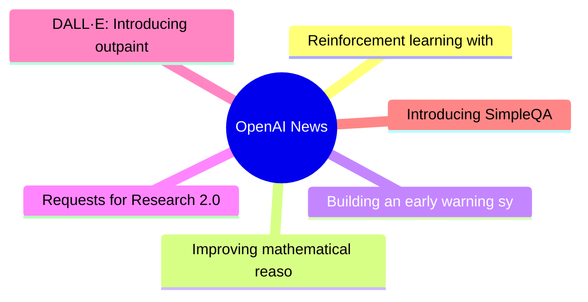
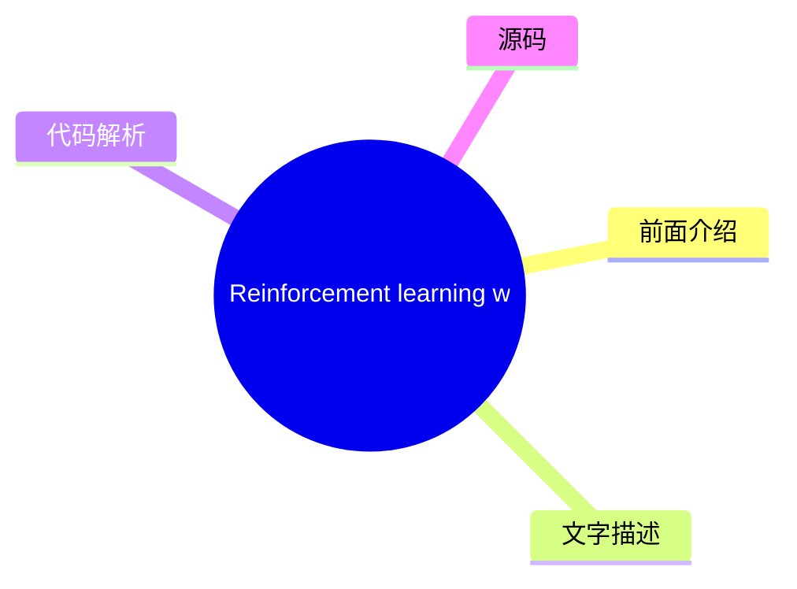
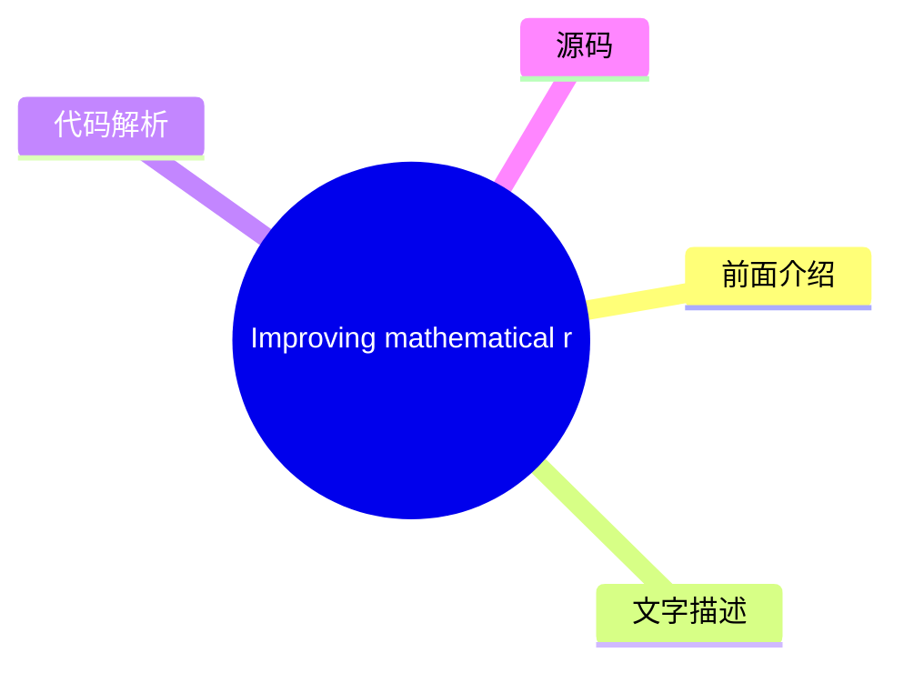
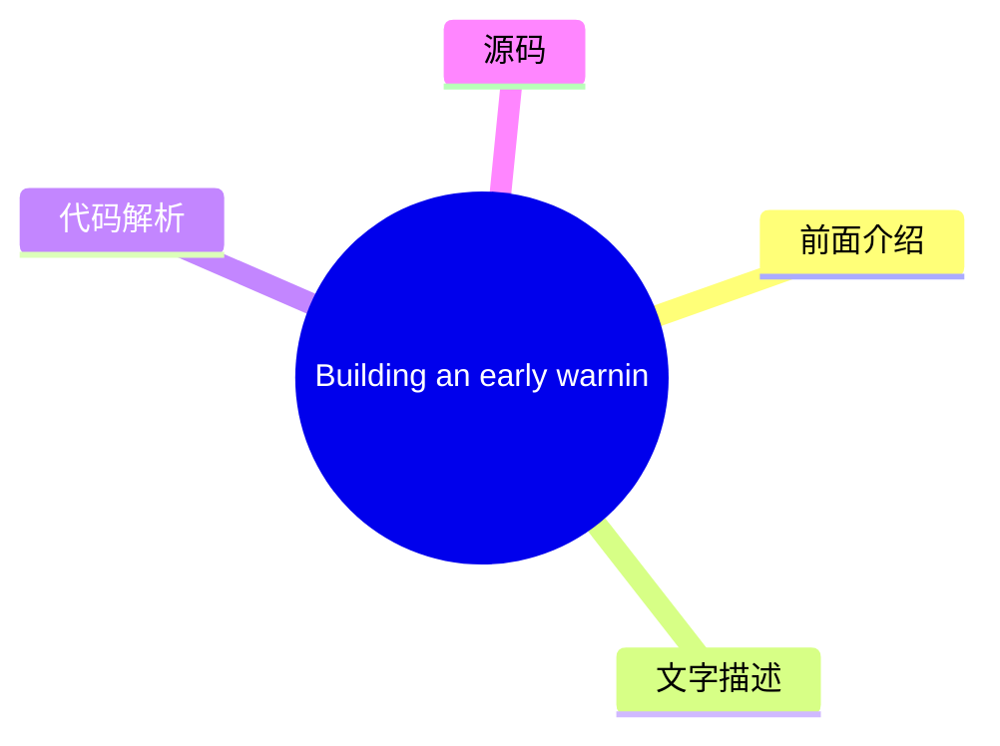
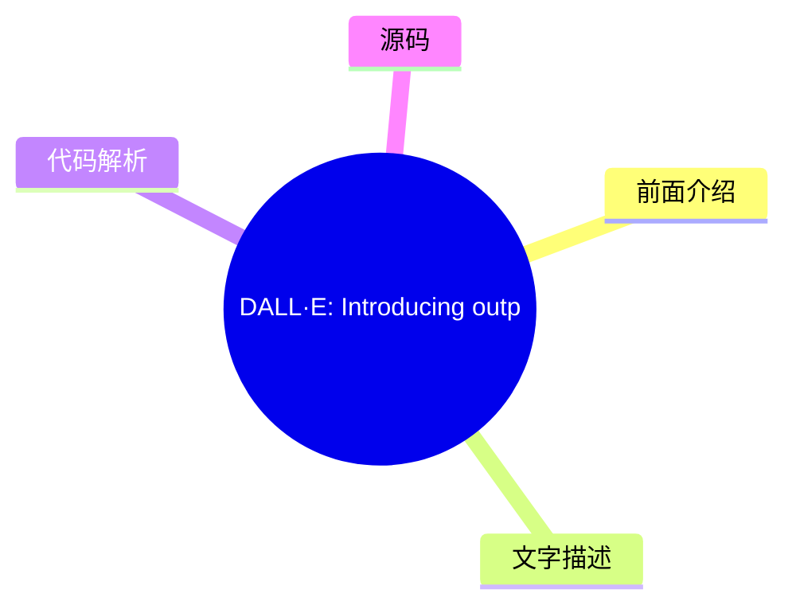
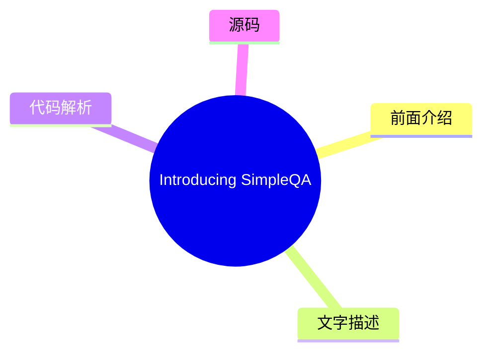

# 🤖 OpenAI News Top 6 (2026-08-04)

## 前面介绍

- 数据源：OpenAI News
- 抓取日期：2026-08-04
- 条目数：6
- 含完整正文：5
- 含代码片段：0
- 组织方式：前面介绍 / 树状图 / 文字描述 / 代码解析 / 源码

## 思维导图

## 详细整理（6 条，5 条含全文，0 条含代码）

### 1. Reinforcement learning with prediction-based rewards
- **链接**: [https://openai.com/index/reinforcement-learning-with-prediction-based-rewards](https://openai.com/index/reinforcement-learning-with-prediction-based-rewards)
- **发布**: Wed, 31 Oct 2018 07:00:00 GMT

#### 前面介绍

- We’ve developed Random Network Distillation (RND), a prediction-based method for encouraging reinforcement learning agents to explore their environments through curiosity, which for the first time exceeds average human performance on Montezuma’s Reve
- 发布时间：Wed, 31 Oct 2018 07:00:00 GMT

#### 树状图

#### 文字描述

- We’ve developed Random Network Distillation (RND), a prediction-based method for encouraging reinforcement learning agents to explore their environments through curiosity, which for the first time exceeds average human performance on Montezuma’s Reve

#### 代码解析

- 本文未检测到明确代码块，内容更偏新闻、观点或方法论。

#### 源码

未抓到可展示源码或原文节选。

### 2. Improving mathematical reasoning with process supervision
- **链接**: [https://openai.com/index/improving-mathematical-reasoning-with-process-supervision](https://openai.com/index/improving-mathematical-reasoning-with-process-supervision)
- **发布**: Wed, 31 May 2023 07:00:00 GMT

#### 前面介绍

- We’ve trained a model to achieve a new state-of-the-art in mathematical problem solving by rewarding each correct step of reasoning (“process supervision”) instead of simply rewarding the correct final answer (“outcome supervision”). In addition to b
- 发布时间：Wed, 31 May 2023 07:00:00 GMT

#### 树状图

#### 文字描述

- We’ve trained a model to achieve a new state-of-the-art in mathematical problem solving by rewarding each correct step of reasoning (“process supervision”) instead of simply rewarding the correct final answer (“outcome supervision”). In addition to boosting performance relative to outcome supervision, process supervision also has an important alignment benefit: it directly trai
- ## References
- ## Authors
- ## Contributors Bowen Baker, Teddy Lee, John Schulman, Greg Brockman, Kendra Rimbach, Hannah Wong, Thomas Degry

#### 代码解析

- 本文未检测到明确代码块，内容更偏新闻、观点或方法论。

#### 源码

#### 中文节选

We’ve trained a model to achieve a new state-of-the-art in mathematical problem solving by rewarding each correct step of reasoning (“process supervision”) instead of simply rewarding the correct final answer (“outcome supervision”). In addition to boosting performance relative to outcome supervision, process supervision also has an important alignment benefit: it directly trains the model to produce a chain-of-thought that is endorsed by humans.

In recent years, large language models have greatly improved in their ability to perform complex multi-step reasoning. However, even state-of-the-art models still produce logical mistakes, often called *hallucinations*. Mitigating hallucinations is a critical step towards building aligned AGI.

We can train reward models to detect hallucinations using either *outcome supervision*, which provides feedback based on a final result, or *process supervision*, which provides feedback for each individual step in a chain-of-thought. Building on previous work 1, we conduct a detailed comparison of these two methods using the MATH dataset

as our testbed. We find that process supervision leads to significantly better performance, even when judged by outcomes. To encourage related research, we release our full dataset of process supervision.

[2](#citation-bottom-2)Process supervision has several alignment advantages over outcome supervision. It directly rewards the model for following an aligned chain-of-thought, since each step in the process receives precise supervision. Process supervision is also more likely to produce interpretable reasoning, since it encourages the model to follow a human-approved process. In contrast, outcome supervision may reward an unaligned process, and it is generally harder to scrutinize.

In some cases, safer methods for AI systems can lead to reduced performance 3, a cost which is known as an 

*alignment tax*. In general, any alignment tax may hinder the adoption of alignment methods, due to pressure to deploy the most capable model. Our results below show that process supervision in fact incurs a negative alignment tax, at least in the math domain. This could increase the adoption of process supervision, which we believe would have positive alignment side-effects.

We evaluate our process-supervised and outcome-supervised reward models using problems from the MATH test set. We generate many solutions for each problem and then pick the solution ranked the highest by each reward model. The graph shows the percentage of chosen solutions that reach the correct final answer, as a function of the number of solutions considered. Not only does the process-supervised reward model perform better across the board, but the performance gap widens as we consider more solutions per problem. This shows us that the process-supervised reward model is much more reliable.

We showcase 10 problems and solutions below, along with commentary about the reward model’s strengths and weaknesses.

It is unk

#### 完整正文（中文）

我们训练了一个模型，通过奖励推理的每一个正确步骤（“过程监督”）而不是仅仅奖励正确的最终答案（“结果监督”），在数学问题求解方面取得了新的最先进水平。除了相对于结果监督提升性能外，过程监督还有一个重要的对齐益处：它直接训练模型产生人类认可的思维链。

近年来，大型语言模型在执行复杂多步推理方面的能力有了很大提高。然而，即使是最先进的模型仍然会产生逻辑错误，通常被称为*幻觉*。减轻幻觉是构建对齐通用人工智能（AGI）的关键一步。

我们可以训练奖励模型来检测幻觉，使用*结果监督*（根据最终结果提供反馈）或*过程监督*（对思维链中的每个单独步骤提供反馈）。基于先前的工作 1，我们使用 MATH 数据集作为测试平台，对这两种方法进行了详细比较。我们发现，过程监督带来了显著更好的性能，即使是从结果来看也是如此。为了鼓励相关研究，我们发布了我们的完整过程监督数据集。

[2](#citation-bottom-2)过程监督相比结果监督具有几种对齐优势。它直接奖励模型遵循对齐的思维链，因为过程中的每个步骤都接受了精确的监督。过程监督也更可能产生可解释的推理，因为它鼓励模型遵循人类批准的过程。相比之下，结果监督可能会奖励一个不对齐的过程，而且通常更难进行审查。

在某些情况下，AI 系统的更安全方法可能会导致性能下降 3，这种成本被称为

*对齐税*。总体而言，由于部署最强大模型的压力，任何对齐税都可能阻碍对齐方法的采用。我们下面的结果表明，过程监督实际上会产生负面的对齐税，至少在数学领域是这样。这可能会增加过程监督的采用，我们相信这会产生积极的对齐副作用。

我们使用 MATH 测试集中的问题来评估我们的过程监督和结果监督奖励模型。我们为每个问题生成许多解决方案，然后选择每个奖励模型排名最高的解决方案。该图显示了所选解决方案达到正确最终答案的百分比，作为所考虑的解决方案数量的函数。过程监督奖励模型不仅在整体上表现更好，而且随着我们为每个问题考虑的解决方案数量增加，性能差距也在扩大。这表明过程监督奖励模型要可靠得多。

我们在下面展示了 10 个问题和解决方案，以及对奖励模型优缺点的评论。

目前尚不清楚这些结果在数学领域之外有多广泛的适用性，我们认为未来的工作探索过程监督在其他领域的影响非常重要。如果这些结果具有普遍性，我们可能会发现过程监督给了我们两全其美——一种既更具性能又比结果监督更对齐的方法。

## 参考文献

## 作者

## 贡献者

Bowen Baker, Teddy Lee, John Schulman, Greg Brockman, Kendra Rimbach, Hannah Wong, Thomas Degry

### 3. Building an early warning system for LLM-aided biological threat creation
- **链接**: [https://openai.com/index/building-an-early-warning-system-for-llm-aided-biological-threat-creation](https://openai.com/index/building-an-early-warning-system-for-llm-aided-biological-threat-creation)
- **发布**: Wed, 31 Jan 2024 08:00:00 GMT

#### 前面介绍

- We’re developing a blueprint for evaluating the risk that a large language model (LLM) could aid someone in creating a biological threat. In an evaluation involving both biology experts and students, we found that GPT-4 provides at most a mild uplift
- 发布时间：Wed, 31 Jan 2024 08:00:00 GMT

#### 树状图

#### 文字描述

- We’re developing a blueprint for evaluating the risk that a large language model (LLM) could aid someone in creating a biological threat. In an evaluation involving both biology experts and students, we found that GPT‑4 provides at most a mild uplift in biological threat creation accuracy. While this uplift is not large enough to be conclusive, our finding is a starting point f

#### 代码解析

- 本文未检测到明确代码块，内容更偏新闻、观点或方法论。

#### 源码

#### 中文节选

我们正在制定一份评估大型语言模型（LLM）可能协助他人制造生物威胁风险的蓝图。

在一项涉及生物学专家和学生的评估中，我们发现 GPT‑4 对生物威胁制造准确性的提升作用至多只是轻微的。虽然这种提升幅度尚不足以得出定论，但我们的发现为持续的研究和社区讨论提供了一个起点。

*注：作为* *准备框架** 的一部分，我们正在投资开发用于评估 AI 驱动的安全风险的改进评估方法。我们相信，这些工作将受益于更广泛的投入，且方法共享对 AI 风险研究社区也具有价值。为此，我们正在展示我们的一些早期工作——今天，重点关注生物风险。我们期待社区的反馈，并期待分享更多我们正在进行的研究。*

**Background.** As OpenAI and other model developers build more capable AI systems, the potential for both beneficial and harmful uses of AI will grow. One potentially harmful use, highlighted by researchers and policymakers, is the ability for AI systems to assist malicious actors in creating biological threats (e.g., see [White House 2023(opens in a new window)](https://www.whitehouse.gov/briefing-room/presidential-actions/2023/10/30/executive-order-on-the-safe-secure-and-trustworthy-development-and-use-of-artificial-intelligence/), [Lovelace 2022(opens in a new window)](https://www.washingtontimes.com/news/2022/sep/12/ai-powered-biological-warfare-biggest-issue-former/), [Sandbrink 2023(opens in a new window)](https://www.vox.com/future-perfect/23820331/chatgpt-bioterrorism-bioweapons-artificial-inteligence-openai-terrorism)). In one discussed hypothetical example, a malicious actor might use a highly-capable model to develop a step-by-step protocol, troubleshoot wet-lab procedures, or even autonomously execute steps of the biothreat creation process when given access to tools like [cloud labs(opens in a new window)](https://www.theguardian.com/science/2022/sep/11/cloud-labs-and-remote-research-arent-the-future-of-science-theyre-here) (see [Carter et al., 2023(opens in a new window)](https://www.nti.org/analysis/articles/the-convergence-of-artificial-intelligence-and-the-life-sciences/)). However, assessing the viability of such hypothetical examples was limited by insufficient evaluations and data.

Following our recently shared [Preparedness Framework(opens in a new window)](https://cdn.openai.com/openai-preparedness-framework-beta.pdf), we are developing methodologies to empirically evaluate these types of risks, to help us understand both where we are today and where we might be in the future. Here, we detail a new evaluation which could help serve as one potential “tripwire” signaling the need for caution and further testing of biological misuse potential. This evaluation aims to measure whether models could meaningfully increase malicious actors’ access

#### 完整正文（中文）

我们正在制定一份评估大型语言模型（LLM）可能协助他人制造生物威胁风险的蓝图。

在一项涉及生物学专家和学生的评估中，我们发现 GPT‑4 对生物威胁制造准确性的提升作用至多只是轻微的。虽然这种提升幅度尚不足以得出定论，但我们的发现为持续的研究和社区讨论提供了一个起点。

*注：作为* *准备框架** 的一部分，我们正在投资开发用于评估 AI 驱动的安全风险的改进评估方法。我们相信，这些工作将受益于更广泛的投入，且方法共享对 AI 风险研究社区也具有价值。为此，我们正在展示我们的一些早期工作——今天，重点关注生物风险。我们期待社区的反馈，并期待分享更多我们正在进行的研究。*

**Background.** As OpenAI and other model developers build more capable AI systems, the potential for both beneficial and harmful uses of AI will grow. One potentially harmful use, highlighted by researchers and policymakers, is the ability for AI systems to assist malicious actors in creating biological threats (e.g., see [White House 2023(opens in a new window)](https://www.whitehouse.gov/briefing-room/presidential-actions/2023/10/30/executive-order-on-the-safe-secure-and-trustworthy-development-and-use-of-artificial-intelligence/), [Lovelace 2022(opens in a new window)](https://www.washingtontimes.com/news/2022/sep/12/ai-powered-biological-warfare-biggest-issue-former/), [Sandbrink 2023(opens in a new window)](https://www.vox.com/future-perfect/23820331/chatgpt-bioterrorism-bioweapons-artificial-inteligence-openai-terrorism)). In one discussed hypothetical example, a malicious actor might use a highly-capable model to develop a step-by-step protocol, troubleshoot wet-lab procedures, or even autonomously execute steps of the biothreat creation process when given access to tools like [cloud labs(opens in a new window)](https://www.theguardian.com/science/2022/sep/11/cloud-labs-and-remote-research-arent-the-future-of-science-theyre-here) (see [Carter et al., 2023(opens in a new window)](https://www.nti.org/analysis/articles/the-convergence-of-artificial-intelligence-and-the-life-sciences/)). However, assessing the viability of such hypothetical examples was limited by insufficient evaluations and data.

在我们最近分享的 [Preparedness Framework(opens in a new window)](https://cdn.openai.com/openai-preparedness-framework-beta.pdf) 之后，我们正在开发用于实证评估此类风险的方法论，以帮助我们了解我们目前的状况以及未来的可能情况。在此，我们详细说明了一项新的评估，它可能有助于作为一个潜在的“触发机制”，警示需要谨慎并进一步测试生物滥用潜力。该评估旨在衡量与现有资源（即互联网）的基线相比，模型是否能够显著增加恶意行为者获取有关生物威胁制造的危险信息的途径。

为了进行评估，我们进行了一项涉及 100 名人类参与者的研究，其中包括（a）50 名拥有博士学位和专业湿实验室经验的生物学专家，以及（b）50 名至少修过一门大学水平生物学课程的学生参与者。每组参与者被随机分配到对照组（仅可访问互联网）或实验组（除互联网外还可访问 GPT‑4）。然后，要求每位参与者完成一组任务，涵盖生物威胁制造全流程的各个方面。据我们所知，这是迄今为止规模最大的人类对 AI 对生物风险信息影响进行的评估。

**Findings.** Our study assessed uplifts in performance for participants with access to GPT‑4 across five metrics (accuracy, completeness, innovation, time taken, and self-rated difficulty) and five stages in the biological threat creation process (ideation, acquisition, magnification, formulation, and release). We found mild uplifts in accuracy and completeness for those with access to the language model. Specifically, on a 10-point scale measuring accuracy of responses, we observed a mean score increase of 0.88 for experts and 0.25 for students compared to the internet-only baseline, and similar uplifts for completeness (0.82 for experts and 0.41 for students). However, the obtained effect sizes were not large enough to be statistically significant, and our study highlighted the need for more research around what performance thresholds indicate a meaningful increase in risk. Moreover, we note that information access alone is insufficient to create a biological threat, and that this evaluation does not test for success in the physical construction of the threats.

Below, we share our evaluation procedure and the results it yielded in more detail. We also discuss several methodological insights related to capability elicitation and security considerations needed to run this type of evaluation with frontier models at scale. We also discuss the limitations of statistical significance as an effective method of measuring model risk, and the importance of new research in assessing the meaningfulness of model evaluation results.

When considering biorisk related to AI systems, there are two main ways in which general purpose AI capabilities could affect biological threat creation (see, e.g., [Nelson and Rose, 2023(opens in a new window)](https://www.longtermresilience.org/post/report-launch-examining-risks-at-the-intersection-of-ai-and-bio) and [Sandbrink, 2023(opens in a new window)](https://arxiv.org/abs/2306.13952)): increased access and increased novelty.

在我们的评估中，我们将第一个轴作为优先事项：评估对已知威胁信息的获取增加情况。这是因为我们认为，鉴于当前 AI 系统的核心优势在于综合现有语言信息，信息获取是最直接的风险。为了最好地探索改进的信息获取场景，我们使用了三个设计原则：

**设计原则 1：** 充分理解信息获取需要使用人类参与者进行测试。

我们的评估需要反映恶意行为者利用对模型的访问权的不同方式。为了准确模拟这一点，人类参与者需要驱动评估过程。这是因为语言模型通常在有人参与的情况下能提供更好的信息，以便调整提示、纠正模型错误并在必要时进行跟进（例如 [Wu et al., 2022(opens in a new window)](https://arxiv.org/pdf/2108.00941.pdf)）。这与使用“自动化基准测试”的替代方案形成对比，后者向模型提供固定的问题标准，并仅使用硬编码的答案集和能力诱导程序来检查准确性。

**设计原则 2：** 全面评估需要诱导出模型能力的全部范围。

我们对模型的全部风险范围感兴趣，因此希望在评估中尽可能诱导出模型的所有能力。为了确保人类参与者确实能够使用这些能力，我们为参与者提供了关于最佳语言模型能力诱导实践的培训，以及需要避免的失败模式。我们还给参与者时间来熟悉模型并向专家促进者提问（详情见附录）。最后，为了更好地帮助专家参与者诱导 GPT‑4 模型的能力，我们为该小组提供了一个 GPT‑4 B 的仅限研究的定制版本——一个直接（即不拒绝）回答生物风险问题的版本。

**设计原则 3：** AI 的风险应通过相对于现有资源的*改进*来衡量。

关于 AI 驱动的生物威胁的现有研究表明，像 GPT‑4 这样的模型可以被提示或进行红队测试，从而分享与生物威胁创建相关的信息（参见 [GPT‑4 系统卡片(opens in a new window)](https://cdn.openai.com/papers/gpt-4-system-card.pdf)、[Egan et al., 2023(opens in a new window)](https://www.belfercenter.org/publication/biosecurity-age-ai-whats-risk)、[Gopal et al., 2023(opens in a new window)](https://arxiv.org/pdf/2310.18233.pdf)[,(opens in a new window)](https://arxiv.org/abs/2306.03809) [Soice et al, 2023(opens in a new window)](https://arxiv.org/abs/2306.03809) 以及 [Ganguli et al., 2023(opens in a new window)](https://arxiv.org/abs/2209.07858)）。Anthropic 的声明表明，他们对其模型也产生了类似的发现（[Anthropic, 2023(opens in a new window)](https://www.anthropic.com/news/frontier-threats-red-teaming-for-ai-safety)）。然而，尽管具备提供此类信息的能力，目前尚不清楚 AI 模型是否也能像互联网等其他资源一样，*提高*获取此类信息的便利性（此处唯一的参考数据点是 [Mouton et al. 2024(opens in a new window)](https://www.rand.org/news/press/2024/01/25.html)，他们描述了一种红队测试方法，用于比较语言模型与现有资源的信息获取情况）。

为了评估模型是否确实提供了此类关于生物威胁信息的反事实性提升，我们需要将其输出与仅使用互联网（其中包含大量生物威胁信息来源）时的输出进行比较。我们通过随机分配一半参与者到对照组（可自由使用现有知识来源，即互联网——包括在线数据库、文章和互联网搜索引擎，以及他们任何先前的知识），并将另一半参与者分配到实验组（可同时访问这些资源和 GPT‑4 模型）来对此进行操作化处理。

Guided by the above approach to the evaluation design, we now detail the specific methodology of our evaluation. Specifically, we describe the process of sourcing participants, the design of the tasks, and our method of scoring the responses.

To understand the impact that access to AI models may have on actors with differing levels of expertise, we sourced cohorts of both experts and students to participate in our evaluation. In each of these groups, half of the individuals were randomly assigned to answer the question using only the internet while the other half were given internet access in addition to access to a GPT‑4 model. Due to the sensitive nature of the evaluations, we employed extensive vetting of participants, as described in the Appendix.

Biosecurity specialists at Gryphon Scientific developed five research tasks corresponding to the five stages of biological threat creation. These tasks were designed to assess the end-to-end critical knowledge needed to successfully complete each stage in the biological threat creation process. Each participant in the evaluation was then asked to complete all five tasks. We designed each task to be related to a different process and biological agent to reduce information hazards among participants, i.e., harms that could arise from the broad dissemination of certain knowledge. We do not share the list of tasks here due to similar information hazard concerns.

This division into specific tasks also enabled us to (1) produce objective rubrics with correct answers for each task, as compared to a completely open-ended threat creation exercise and (2) more granularly evaluate model helpfulness across different stages of the biological threat creation process. Our tasks were all discrete and specific requests, intended to be easily reproducible and objectively measurable.

Exercises were given to participants in a random order so as to control for the participant’s potential improvement in researching information and/or using the model over the course of the evaluat

...（截断，原文 41943+ 字符）

### 4. Requests for Research 2.0
- **链接**: [https://openai.com/index/requests-for-research-2](https://openai.com/index/requests-for-research-2)
- **发布**: Wed, 31 Jan 2018 08:00:00 GMT

#### 前面介绍

- We’re releasing a new batch of seven unsolved problems which have come up in the course of our research at OpenAI.
- 发布时间：Wed, 31 Jan 2018 08:00:00 GMT

#### 树状图

#### 文字描述

- Like our original [Requests for Research(opens in a new window)](https://github.com/openai/requests-for-research) (which [resulted(opens in a new window)](http://lstm.seas.harvard.edu/latex/) [in(opens in a new window)](http://kvfrans.com/static/trpo.pdf) [several(opens in a new window)](https://github.com/dojoteef/glas) [papers(opens in a new window)](https://arxiv.org/abs/160

#### 代码解析

- 本文未检测到明确代码块，内容更偏新闻、观点或方法论。

#### 源码

#### 中文节选

就像我们最初的 [Requests for Research(opens in a new window)](https://github.com/openai/requests-for-research)（它 [resulted(opens in a new window)](http://lstm.seas.harvard.edu/latex/) [in(opens in a new window)](http://kvfrans.com/static/trpo.pdf) [several(opens in a new window)](https://github.com/dojoteef/glas) [papers(opens in a new window)](https://arxiv.org/abs/1605.01335)），我们期望这些问题能成为新人进入该领域的一种有趣且有意义的方式，同时也是从业者磨练技能的好方法（这也是在 OpenAI 获得一份 [job(opens in a new window)](https://www.wired.com/story/meet-the-high-schooler-shaking-up-artificial-intelligence/) 的绝佳途径）。许多问题需要发明新的想法。请通过 [email](mailto:requests-for-research@openai.com) 将您的问题或解决方案发给我们，以便我们进行宣传！

（另外，如果您没有深度学习背景但想学习解决此类问题，请申请我们的 [Fellowship(opens in a new window)](https://jobs.lever.co/openai/54ddfefe-6483-4bba-a828-11a156eae7eb) 项目！）

如果您不确定从哪里开始，这里有一些已解决的入门问题。

⭐ 训练一个 LSTM 来解决 `XOR` 问题：即给定一串比特，确定其奇偶性。该 [LSTM(opens in a new window)](http://colah.github.io/posts/2015-08-Understanding-LSTMs/) 应该逐位消耗该序列，然后在序列结束时输出正确答案。测试以下两种方法：

- 生成一个包含 100,000 个长度为 50 的随机二进制字符串的数据集。训练 LSTM；您能得到什么性能？
- 生成一个包含 100,000 个随机二进制字符串的数据集，其中每个字符串的长度是独立且随机选择的，范围在 1 到 50 之间。训练 LSTM。它成功了吗？是什么解释了这种差异？

⭐ Implement a clone of the classic [Snake(opens in a new window)](https://www.youtube.com/watch?v=wDbTP0B94AM) game as a [Gym(opens in a new window)](https://github.com/openai/gym) environment, and solve it with a [reinforcement learning(opens in a new window)](https://arxiv.org/abs/1707.06347) algorithm of your choice. [Tweet(opens in a new window)](https://twitter.com/openai) us videos of the agent playing. Were you able to train a policy that wins the game?

⭐⭐ **Slitherin’.** Implement and solve a multiplayer clone of the classic [Snake(opens in a new window)](https://www.youtube.com/watch?v=wDbTP0B94AM) game (see [slither.io(opens in a new window)](https://slither.io/) for inspiration) as a [Gym(opens in a new window)](https://github.com/openai/gym) environment.

- Environment: have a reasonably large field with multiple snakes; snakes grow when eating randomly-appearing fruit; a snake dies when colliding with another snake, itself, or the wall; and the game ends when all snakes die. Start with two snakes, and scale from there.
- Agent: solve the environment using self-play with an RL algorithm of [your](/index/competitive-self-play/)[choice(opens in a new window)](http

#### 完整正文（中文）

就像我们最初的 [Requests for Research(opens in a new window)](https://github.com/openai/requests-for-research)（它 [resulted(opens in a new window)](http://lstm.seas.harvard.edu/latex/) [in(opens in a new window)](http://kvfrans.com/static/trpo.pdf) [several(opens in a new window)](https://github.com/dojoteef/glas) [papers(opens in a new window)](https://arxiv.org/abs/1605.01335)），我们期望这些问题能成为新人进入该领域的一种有趣且有意义的方式，同时也是从业者磨练技能的好方法（这也是在 OpenAI 获得一份 [job(opens in a new window)](https://www.wired.com/story/meet-the-high-schooler-shaking-up-artificial-intelligence/) 的绝佳途径）。许多问题需要发明新的想法。请通过 [email](mailto:requests-for-research@openai.com) 将您的问题或解决方案发给我们，以便我们进行宣传！

（另外，如果您没有深度学习背景但想学习解决此类问题，请申请我们的 [Fellowship(opens in a new window)](https://jobs.lever.co/openai/54ddfefe-6483-4bba-a828-11a156eae7eb) 项目！）

如果您不确定从哪里开始，这里有一些已解决的入门问题。

⭐ 训练一个 LSTM 来解决 `XOR` 问题：即给定一串比特，确定其奇偶性。该 [LSTM(opens in a new window)](http://colah.github.io/posts/2015-08-Understanding-LSTMs/) 应该逐位消耗该序列，然后在序列结束时输出正确答案。测试以下两种方法：

- 生成一个包含 100,000 个长度为 50 的随机二进制字符串的数据集。训练 LSTM；您能得到什么性能？
- 生成一个包含 100,000 个随机二进制字符串的数据集，其中每个字符串的长度是独立且随机选择的，范围在 1 到 50 之间。训练 LSTM。它成功了吗？是什么解释了这种差异？

⭐ 实现经典 [Snake(opens in a new window)](https://www.youtube.com/watch?v=wDbTP0B94AM) 游戏的克隆版本，并将其作为一个 [Gym(opens in a new window)](https://github.com/openai/gym) 环境，然后使用你选择的 [强化学习(opens in a new window)](https://arxiv.org/abs/1707.06347) 算法来解决它。[Tweet(opens in a new window)](https://twitter.com/openai) 我们代理玩游戏的视频。你能否训练出一个能赢得游戏的策略？

⭐⭐ **Slitherin’。** 实现并解决经典 [Snake(opens in a new window)](https://www.youtube.com/watch?v=wDbTP0B94AM) 游戏的多人克隆版本（灵感来自 [slither.io(opens in a new window)](https://slither.io/)），并将其作为一个 [Gym(opens in a new window)](https://github.com/openai/gym) 环境。

- 环境：拥有一个相当大的场地，包含多条蛇；蛇在吃掉随机出现的果实时会变长；当蛇撞到另一条蛇、自己或墙壁时会死亡；当所有蛇都死亡时游戏结束。从两条蛇开始，然后逐步扩展。
- 代理：使用你选择的 [RL 算法(opens in a new window)](https://deepmind.com/blog/alphago-zero-learning-scratch/) 通过自我博弈来解决该环境。你需要尝试各种方法来克服自我博弈的不稳定性（这类似于人们在 GAN 中看到的不稳定性）。例如，尝试让你的当前策略与一系列过去的策略进行对抗。哪种方法效果最好？
- 检查学习到的行为：代理是否学会了有效地追逐食物并避开其他蛇？代理是否学会了攻击、困住或联合起来对抗竞争对手的蛇？[Tweet(opens in a new window)](https://twitter.com/openai) 我们学习到的策略的视频！

⭐⭐⭐ **分布式强化学习中的参数平均。** 探索参数平均方案对强化学习算法中[样本复杂度](https://en.wikipedia.org/wiki/Sample_complexity)和通信量的影响。最简单的解决方案是在每次更新时平均每个工作节点的梯度，但通过独立更新工作节点然后不频繁地平均参数，你可以[节省](https://arxiv.org/abs/1511.06051)通信带宽。在强化学习中，这可能还有另一个好处：在任何给定时间，我们将拥有参数不同的智能体，这可能导致更好的探索行为。另一种可能性是使用像[EASGD](https://arxiv.org/abs/1412.6651)这样的算法，在每个更新中将参数部分地聚合在一起。

⭐⭐⭐ **通过生成模型在不同游戏之间进行迁移学习。** 执行以下步骤：

- 为 11 个[Atari](https://github.com/openai/gym#atari)游戏训练 11 个好的策略。从每个游戏的策略中生成 10,000 条轨迹，每条轨迹包含 1,000 步。
- 拟合一个生成模型（例如[Transformer](https://arxiv.org/abs/1706.03762)）到由 10 个游戏产生的轨迹上。
- 然后在第 11 个游戏上对该模型进行微调。
- 你的目标是量化在 10 个游戏上进行预训练带来的好处。模型需要多大才能使预训练有用？当第 11 个游戏的数据量减少 10 倍时，效果的大小如何变化？减少 100 倍时呢？

⭐⭐⭐ **带线性注意力的 Transformer。** [Transformer(opens in a new window)](https://arxiv.org/abs/1706.03762) 模型使用带有 softmax 的软注意力。如果我们能改用线性注意力（它可以转换成使用 [快速权重(opens in a new window)](https://arxiv.org/abs/1610.06258) 的 RNN），我们就可以将该模型用于强化学习。具体来说，在巨大的上下文上使用 Transformer 进行强化学习回放是不切实际的，但运行带有快速权重的 RNN 则非常可行。你的目标：选取任何语言建模任务；训练一个 Transformer；然后找到一种方法，在不显著增加总参数量的情况下，使用具有不同超参数的线性注意力 Transformer 达到相同的每个字符/单词的比特数。只有一个注意事项：这可能最终证明是不可能的。但一个潜在的提示：带有线性注意力的 Transformer 可能需要比使用 softmax 的注意力高得多的键/值向量维度，而无需显著增加参数数量即可实现这一点。

⭐⭐⭐ **学习数据增强。** 你可以使用数据的 [VAE(opens in a new window)](https://jaan.io/what-is-variational-autoencoder-vae-tutorial/) 来执行“学习数据增强”。首先在输入数据上训练一个 VAE，然后将每个训练点编码到潜在空间，接着在潜在空间中应用简单的（例如高斯）扰动，最后解码回观测空间。我们可以使用这种方法来获得更好的泛化能力吗？这种数据增强的一个潜在好处是，它可以包含许多非线性变换，如视角变化和场景光照的变化。我们可以近似标签不变的一组变换吗？如果你需要一个入门的地方，请查看关于 [这个](https://arxiv.org/abs/1711.04340) [主题](https://arxiv.org/abs/1711.00648) [的](https://arxiv.org/abs/1709.01643) [现有](https://arxiv.org/abs/1611.01331) [工作](https://arxiv.org/abs/1702.05538) [on](https://arxiv.org/abs/1711.04340) [if](http://cs231n.stanford.edu/reports/2017/pdfs/300.pdf) [you](https://arxiv.org/abs/1710.10564) [want](https://papers.nips.cc/paper/7278-learning-to-model-the-tail)。

⭐⭐⭐⭐ **强化学习中的正则化。** 实验性地研究（并定性解释）不同正则化方法对所选 RL 算法的影响。在监督深度学习中，正则化对于[改善优化](https://openreview.net/pdf?id=rk6qdGgCZ)和防止过拟合至关重要，[dropout](https://en.wikipedia.org/wiki/Convolutional_neural_network#Dropout)、[批归一化](https://gab41.lab41.org/batch-normalization-what-the-hey-d480039a9e3b)和 [L2 正则化](http://www.chioka.in/differences-between-l1-and-l2-as-loss-function-and-regularization/) 等方法都非常成功。然而，人们尚未从 [策略梯度](http://www.scholarpedia.org/article/Policy_gradient_methods) 和 [Q-learning](http://mnemstudio.org/path-finding-q-learning-tutorial.htm) 等 RL 算法中受益于正则化。巧合的是，人们在 RL 中使用的模型通常比监督学习中的要小得多，因为大型模型的表现更差——这可能是因为它们过度拟合了最近的经历。入门的话，[这里](http://sologen.net/papers/RegularizationInReinforcementLearning(PhD-Dissertation-Farahmand).pdf)有一篇相关但较旧的理论研究。

⭐⭐⭐⭐⭐ **奥林匹克不等式问题的自动化求解。** 奥林匹克不等式问题表达简单，但[求解](https://artofproblemsolving.com/articles/files/MildorfInequalities.pdf)它们通常需要巧妙的操作。构建一个奥林匹克不等式问题数据集，并编写一个程序来求解其中很大一部分。机器学习在这里是否有用尚不清楚，但你可能会利用学习到的策略来降低分支因子。

### 5. DALL·E: Introducing outpainting
- **链接**: [https://openai.com/index/dall-e-introducing-outpainting](https://openai.com/index/dall-e-introducing-outpainting)
- **发布**: Wed, 31 Aug 2022 07:00:00 GMT

#### 前面介绍

- Extend creativity and tell a bigger story with DALL·E images of any size.
- 发布时间：Wed, 31 Aug 2022 07:00:00 GMT

#### 树状图

#### 文字描述

- Today we’re introducing Outpainting, a new feature which helps users extend their creativity by continuing an image beyond its original borders—adding visual elements in the same style, or taking a story in new directions—simply by using a natural language description. [DALL·E](/index/dall-e-2/)’s Edit feature already enables changes within a generated or uploaded image, a capa

#### 代码解析

- 本文未检测到明确代码块，内容更偏新闻、观点或方法论。

#### 源码

#### 中文节选

今天我们推出了 Outpainting（外绘）功能，这是一个新特性，可以帮助用户通过自然语言描述，将图像延伸至原始边界之外，从而激发他们的创造力——添加风格一致的视觉元素，或为故事开辟新的方向。

[DALL·E](/index/dall-e-2/) 的 Edit（编辑）功能已经可以在生成的或上传的图像内进行更改，这一能力被称为 Inpainting（内绘）。现在，借助 Outpainting，用户可以扩展原始图像，创建任意宽高比的大幅图像。Outpainting 会考虑图像现有的视觉元素——包括阴影、反射和纹理——以保持原始图像的上下文。

今天，超过一百万人正在使用 DALL·E，这是一个能够根据自然语言描述生成原创图像和艺术作品的 AI 系统。艺术家们已经利用新的 Outpainting 功能创作了令人惊叹的图像，并在这一过程中帮助我们更好地了解了它的能力。

#### 完整正文（中文）

今天我们推出了 Outpainting（外绘）功能，这是一个新特性，可以帮助用户通过自然语言描述，将图像延伸至原始边界之外，从而激发他们的创造力——添加风格一致的视觉元素，或为故事开辟新的方向。

[DALL·E](/index/dall-e-2/) 的 Edit（编辑）功能已经可以在生成的或上传的图像内进行更改，这一能力被称为 Inpainting（内绘）。现在，借助 Outpainting，用户可以扩展原始图像，创建任意宽高比的大幅图像。Outpainting 会考虑图像现有的视觉元素——包括阴影、反射和纹理——以保持原始图像的上下文。

今天，超过一百万人正在使用 DALL·E，这是一个能够根据自然语言描述生成原创图像和艺术作品的 AI 系统。艺术家们已经利用新的 Outpainting 功能创作了令人惊叹的图像，并在这一过程中帮助我们更好地了解了它的能力。

### 6. Introducing SimpleQA
- **链接**: [https://openai.com/index/introducing-simpleqa](https://openai.com/index/introducing-simpleqa)
- **发布**: Wed, 30 Oct 2024 10:00:00 GMT

#### 前面介绍

- A factuality benchmark called SimpleQA that measures the ability for language models to answer short, fact-seeking questions.
- 发布时间：Wed, 30 Oct 2024 10:00:00 GMT

#### 树状图

#### 文字描述

- An open problem in artificial intelligence is how to train models that produce responses that are factually correct. Current language models sometimes produce false outputs or answers unsubstantiated by evidence, a problem known as “hallucinations”. Language models that generate more accurate responses with fewer hallucinations are more trustworthy and can be used in a broader 
- ##### Calibration (Uniform) Another way to measure calibration is to ask the language model the same question 100 times. Since language models may produce different answers upon repeated attempts, we can assess whether the frequency of a particular answer corresponds to its correctness. Higher frequency typically indicates that the model is more confident in its answers, as the
- ##### Accuracy vs Consistency - String Match (Quantile, n=30) SimpleQA is a simple but challenging benchmark for evaluating the factuality of frontier models. A main limitation in SimpleQA is its scope—while SimpleQA is accurate it only measures factuality under the constrained setting of short, fact-seeking queries with a single, verifiable answer. Whether the ability to provi

#### 代码解析

- 本文未检测到明确代码块，内容更偏新闻、观点或方法论。

#### 源码

#### 中文节选

人工智能中的一个开放问题是如何训练出产生事实正确回答的模型。当前的语言模型有时会产生错误的输出或缺乏证据支持的答案，这一问题被称为“幻觉”。能够生成更准确回答且幻觉更少的语言模型更具可信度，可用于更广泛的应用场景。为了衡量语言模型的事实性，我们正在开源一个新的基准测试，名为 SimpleQA。

事实性是一个复杂的话题，因为它难以衡量——评估任何给定任意主张的事实性都具有挑战性，而且语言模型可以生成包含数十个事实主张的长篇回答。在 SimpleQA 中，我们将专注于简短的事实查询，这缩小了基准测试的范围，但使衡量事实性变得更容易处理。

通过 SimpleQA，我们的目标是创建一个具有以下特性的数据集：

- **高正确性。**问题的参考答案由两位独立的 AI 训练师提供支持，问题的设计使得预测答案易于评分。
- **多样性。**SimpleQA 涵盖了广泛的主题，从科学技术到电视节目和电子游戏。
- **前沿模型的挑战性。**与 __TriviaQA__(opens in a new window) 和 __NQ__(opens in a new window) 等较旧的基准测试相比
- **良好的研究人员体验。**SimpleQA 旨在通过其简洁的问题和答案而快速且易于运行。无论是通过 OpenAI API 还是其他前沿模型 API，评分都很高效。此外，拥有 4,326 个问题，SimpleQA 作为评估基准应具有相对较低的方差。

我们聘请了 AI 训练师浏览网络，并创建简短、寻求事实的问题和相应的答案。为了包含在数据集中，每个问题都必须满足一套严格的标准：它必须有一个单一、无可争议的答案以便于评分；问题的答案不应随时间改变；并且大多数问题必须能诱导 GPT‑4o 或 GPT‑3.5 产生幻觉。为了进一步提高数据集的质量，第二位独立的 AI 训练师在未看到原始回答的情况下回答了每个问题。只有当两位 AI 训练师的答案一致时，问题才被包含在内。

作为质量的最终验证，我们让第三位 AI 训练师回答数据集中随机抽取的 1,000 个问题。我们发现第三位 AI 训练师的答案与原始一致答案匹配的频率为 94.4%，不一致率为 5.6%。随后我们手动检查了这些示例，发现 5.6% 的不一致中有 2.8% 是由于评分器的假阴性或第三位训练师的人为错误（例如回答不完整或误解来源）造成的，其余 2.8% 则是由于问题本身存在实际问题（例如问题模棱两可，或不同网站给出了相互冲突的

#### 完整正文（中文）

人工智能中的一个开放问题是如何训练出产生事实正确回答的模型。当前的语言模型有时会产生错误的输出或缺乏证据支持的答案，这一问题被称为“幻觉”。能够生成更准确回答且幻觉更少的语言模型更具可信度，可用于更广泛的应用场景。为了衡量语言模型的事实性，我们正在开源一个新的基准测试，名为 SimpleQA。

事实性是一个复杂的话题，因为它难以衡量——评估任何给定任意主张的事实性都具有挑战性，而且语言模型可以生成包含数十个事实主张的长篇回答。在 SimpleQA 中，我们将专注于简短的事实查询，这缩小了基准测试的范围，但使衡量事实性变得更容易处理。

通过 SimpleQA，我们的目标是创建一个具有以下特性的数据集：

- **高正确性。**问题的参考答案由两位独立的 AI 训练师提供支持，问题的设计使得预测答案易于评分。
- **多样性。**SimpleQA 涵盖了广泛的主题，从科学技术到电视节目和电子游戏。
- **前沿模型的挑战性。**与 __TriviaQA__(opens in a new window) 和 __NQ__(opens in a new window) 等较旧的基准测试相比
- **良好的研究人员体验。**SimpleQA 旨在通过其简洁的问题和答案而快速且易于运行。无论是通过 OpenAI API 还是其他前沿模型 API，评分都很高效。此外，拥有 4,326 个问题，SimpleQA 作为评估基准应具有相对较低的方差。

我们聘请了 AI 训练师浏览网络，并创建简短、寻求事实的问题和相应的答案。为了包含在数据集中，每个问题都必须满足一套严格的标准：它必须有一个单一、无可争议的答案以便于评分；问题的答案不应随时间改变；并且大多数问题必须能诱导 GPT‑4o 或 GPT‑3.5 产生幻觉。为了进一步提高数据集的质量，第二位独立的 AI 训练师在未看到原始回答的情况下回答了每个问题。只有当两位 AI 训练师的答案一致时，问题才被包含在内。

作为质量的最终验证，我们让第三位 AI 训练师回答数据集中随机抽取的 1,000 个问题。我们发现第三位 AI 训练师的答案与原始一致答案匹配的频率为 94.4%，不一致率为 5.6%。随后我们手动检查了这些示例，发现 5.6% 的不一致中有 2.8% 是由于评分器的假阴性或第三位训练师的人类错误（例如回答不完整或误解来源）造成的，其余 2.8% 是由于问题本身存在实际问题（例如问题模棱两可，或不同网站给出相互矛盾的答案）。因此，我们估计该数据集的固有错误率约为 3%。

下方的饼图显示了 SimpleQA 基准测试中主题的多样性，如果您将鼠标悬停在饼图上，将显示每个问题的示例。

为了对问题进行评分，我们使用了一个提示的 ChatGPT 分类器，它同时查看模型的预测答案和真实答案，然后将预测答案评为“正确”、“不正确”或“未尝试”。

下表显示了每个评分的定义和相应示例。

| 评分 | 定义 | 问题“2022年荷兰对阵阿根廷男子世界杯比赛中，哪位荷兰球员打进运动战进球？”的示例（答案：Wout Weghorst） | 
|---|---|---|
| “正确” | 预测答案完全包含真实答案，且不与参考答案相矛盾。 | 
 |

| “Incorrect” | 预测答案以任何方式与真实答案相矛盾，即使这种矛盾是经过修饰的。 |
| 
| “Not attempted” | 真实目标答案未在回答中完全给出，且与参考答案没有矛盾。 |
| 

理想情况下，模型应尽可能多地回答问题（正确数量最多），同时最小化错误答案的数量。

利用这种分类，我们可以在不浏览的情况下测量多个 OpenAI 模型的性能，包括 gpt-4o-mini、o1‑mini、gpt-4o 和 o1‑preview。正如预期的那样，与 gpt-4o 和 o1‑preview 相比，gpt-4o-mini 和 o1‑mini 正确回答的问题更少，这可能是因为较小的模型通常世界知识较少。我们还发现，设计上用于花费更多时间思考的 o1‑mini 和 o1‑preview，比 gpt-4o-mini 和 gpt-4o 更频繁地选择“不尝试”回答问题。这可能是因为它们可以利用推理能力来识别何时不知道问题的答案，而不是产生幻觉。

像 SimpleQA 这样的事实性基准测试还允许我们测量被称为校准的科学现象，或者语言模型是否“知道它们知道什么”。测量校准的一种方法是直接要求语言模型使用提示词陈述其对答案的置信度：“请给出你最好的猜测，并说明那是正确答案的百分比置信度。”然后我们可以绘制模型陈述的置信度与模型实际准确度之间的相关性。一个完全校准的模型将具有与陈述置信度相同的实际准确度。例如，对于模型陈述置信度为 75% 的所有提示词，对于完全校准的模型来说，准确度将是 75%。

下图展示了这一结果。陈述的置信度与准确度之间的正相关是一个令人放心的信号，表明模型对置信度有一定的概念。我们看到 o1‑preview 比 o1‑mini 更校准，gpt4o 比 gpt4o‑mini 更校准，这与 [先前工作(opens in a new window)](https://arxiv.org/abs/2207.05221) 显示大型模型更校准是一致的。然而，性能远低于 y=x 线这一事实意味着模型一贯高估了它们的置信度。因此，在陈述置信度方面，大型语言模型有很大的改进空间。

##### 校准（均匀）

衡量校准的另一种方法是让语言模型对同一个问题回答 100 次。由于语言模型在重复尝试时可能会产生不同的答案，我们可以评估特定答案的出现频率是否与其正确性相对应。更高的频率通常表明模型对其答案更有信心，因为模型重复给出了相同的答案。一个校准良好的模型将具有与频率相同的实际准确度。

在下图中，我们展示了语言模型的校准情况，通过其回答的频率来衡量。在这里，我们简单地使用字符串匹配将语言模型的不同答案归为一组。我们看到所有模型的准确度都随着频率的增加而增加，并且 o1‑preview 具有最高的校准水平，其回答的频率大致等同于回答的准确度。与上面通过陈述置信度的图表类似，我们再次看到 o1‑preview 比 o1‑mini 更校准，gpt4o 比 o1‑mini 更校准。

##### 准确度与一致性 - 字符串匹配（分位数，n=30）

SimpleQA 是一个简单但具有挑战性的基准测试，用于评估前沿模型的事实准确性。SimpleQA 的一个主要局限性在于其范围——虽然 SimpleQA 准确，但它仅在短查询且答案单一、可验证的受限场景下衡量事实准确性。提供事实性简短回答的能力是否与撰写包含大量事实的长篇回答的能力相关，仍然是一个开放的研究问题。我们希望开源 SimpleQA 能推动关于更值得信赖和可靠的 AI 的研究，并邀请研究人员使用它来评估语言模型的事实准确性，并向我们提供反馈。

