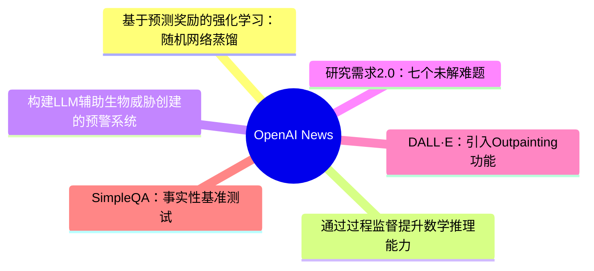
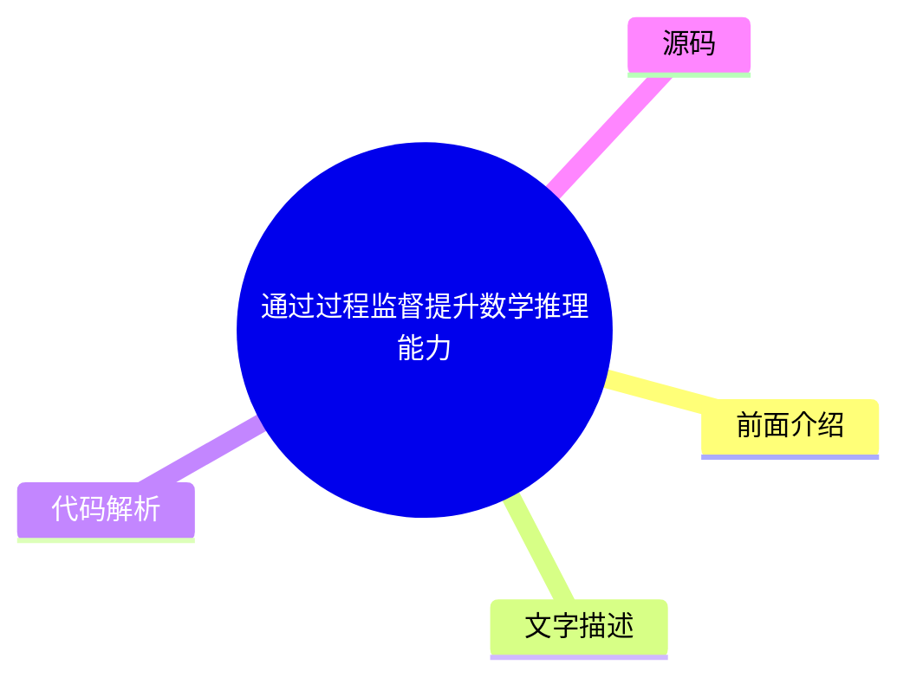
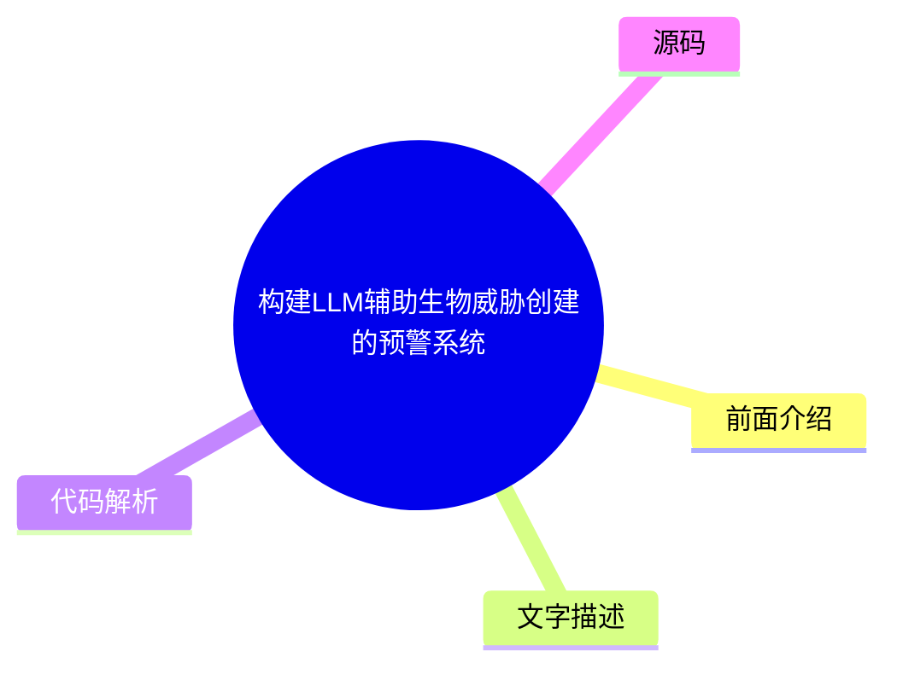
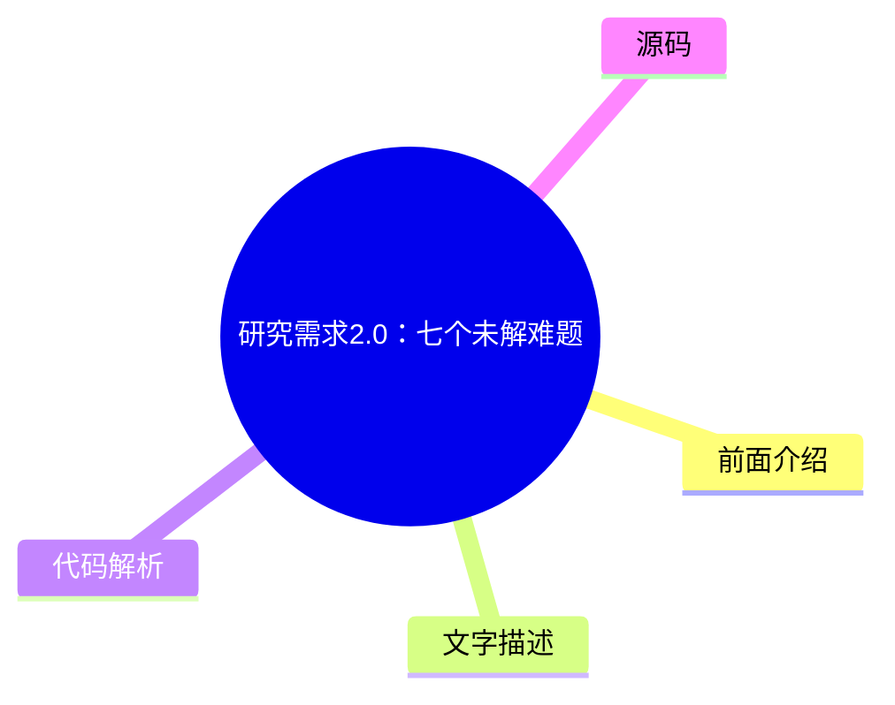
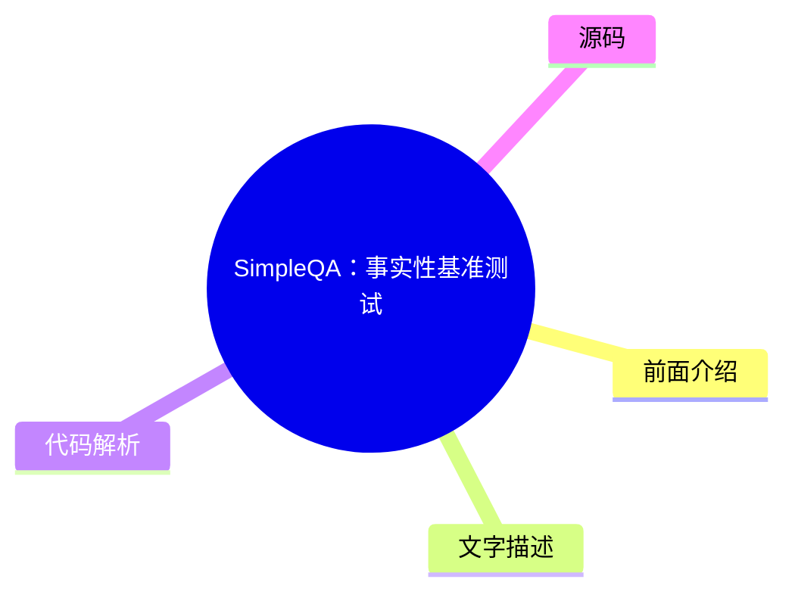

# 🤖 OpenAI News Top 6 (2026-08-05)

## 前面介绍

- 数据源：OpenAI News
- 抓取日期：2026-08-05
- 条目数：6
- 含完整正文：6
- 含代码片段：0
- 组织方式：前面介绍 / 树状图 / 文字描述 / 代码解析 / 源码

## 思维导图

## 详细整理（6 条，6 条含全文，0 条含代码）

### 1. 基于预测奖励的强化学习：随机网络蒸馏
- **链接**: [https://openai.com/index/reinforcement-learning-with-prediction-based-rewards](https://openai.com/index/reinforcement-learning-with-prediction-based-rewards)
- **发布**: Wed, 31 Oct 2018 07:00:00 GMT

#### 前面介绍

- 提出了一种通过好奇心机制鼓励强化学习智能体探索环境的预测方法
- 在《蒙兹玛的复仇》游戏中首次超越平均人类表现
- 可应用于任何强化学习算法，简单高效且易于扩展

#### 树状图

#### 文字描述

- RND通过测量固定随机神经网络在已访问状态上的输出预测难度来激励智能体访问陌生状态
- 在陌生状态下难以预测输出，因此奖励较高，从而引导智能体探索未知区域
- 实验显示RND在1024个并行工作节点下运行，平均回报达到10K，最佳回报达到14.5K
- 在较小规模的实验中，有10次运行中的1次成功发现了所有24个房间并通关第一关
- 该方法无需演示或访问模拟器的底层状态即可解决复杂的探索问题

#### 代码解析

- 本文未提供源码，以下为实现思路或结构解析

#### 源码

#### 中文节选

我们开发了 [随机网络蒸馏 (RND)](/index/reinforcement-learning-with-prediction-based-rewards/#RNDjump)，这是一种基于预测的方法，旨在通过好奇心鼓励强化学习智能体探索其环境，这在 [《蒙兹玛的复仇》](https://www.retrogames.cz/play_124-Atari2600.php?language=EN) 上首次超越了平均人类表现。

我们开发了 [随机网络蒸馏 (RND)](/index/reinforcement-learning-with-prediction-based-rewards/#RNDjump)，这是一种基于预测的方法，旨在通过好奇心鼓励强化学习智能体探索其环境，这在 [《蒙兹玛的复仇》](https://www.retrogames.cz/play_124-Atari2600.php?language=EN) 上首次超越了平均人类表现。RND 实现了最先进的性能，定期找到所有 24 个房间并解决了第一关，且无需使用演示或访问游戏的底层状态。

RND 通过测量在访问过的状态下预测固定随机神经网络的输出的难度，来激励访问 [陌生状态](/index/reinforcement-learning-with-prediction-based-rewards/#implementationjump)。在陌生状态下，很难猜出输出，因此奖励很高。它可以应用于任何强化学习算法，实现简单且可高效扩展。下面我们发布了 RND 的参考实现，可以重现我们论文中的结果。

为了使智能体实现期望的目标，它必须首先探索其环境中可能发生的事情以及什么构成了向目标迈进的过程。许多游戏的奖励信号提供了一种课程，使得即使是简单的探索策略也足以实现游戏的目标。在[介绍 DQN 的开创性工作](https://www.nature.com/articles/nature14236)中，蒙兹玛的复仇是 DQN 获得 0% 平均人类分数（4.7K）的**唯一游戏**。简单的探索策略极不可能收集到任何奖励，或者看到关卡中超过 24 个房间中的几个。从那时起，蒙兹玛的复仇的进展被许多人视为探索进展的同义词。

在[2016 年](https://arxiv.org/abs/1606.01868)通过将 DQN 与基于计数的探索奖励相结合，取得了重大进展， resulting in an agent that explored 15 rooms, achieved a high score of 6.6K and an average reward of around 3.7K. Since then, [significant](https://arxiv.org/abs/1805.11593) [improvement](https://arxiv.org/abs/1805.11592) in the score achieved by an RL agent has come only from exploiting access to [demonstrations](https://blog.openai.com/learning-montezumas-revenge-from-a-single-demonstration/) from human [experts](https://arxiv.org/abs/1809.03447), or access to the underlying state of the [emu

#### 完整正文（中文）

我们开发了 [随机网络蒸馏 (RND)](/index/reinforcement-learning-with-prediction-based-rewards/#RNDjump)，这是一种基于预测的方法，旨在通过好奇心鼓励强化学习智能体探索其环境，这在 [《蒙兹玛的复仇》](https://www.retrogames.cz/play_124-Atari2600.php?language=EN) 上首次超越了平均人类表现。

我们开发了 [随机网络蒸馏 (RND)](/index/reinforcement-learning-with-prediction-based-rewards/#RNDjump)，这是一种基于预测的方法，旨在通过好奇心鼓励强化学习智能体探索其环境，这在 [《蒙兹玛的复仇》](https://www.retrogames.cz/play_124-Atari2600.php?language=EN) 上首次超越了平均人类表现。RND 实现了最先进的性能，定期找到所有 24 个房间并解决了第一关，且无需使用演示或访问游戏的底层状态。

RND 通过测量在访问过的状态下预测固定随机神经网络的输出的难度，来激励访问 [陌生状态](/index/reinforcement-learning-with-prediction-based-rewards/#implementationjump)。在陌生状态下，很难猜出输出，因此奖励很高。它可以应用于任何强化学习算法，实现简单且可高效扩展。下面我们发布了 RND 的参考实现，可以重现我们论文中的结果。

For an agent to achieve a desired goal it must first explore what is possible in its environment and what constitutes progress towards the goal. Many games’ reward signals provide a curriculum such that even simple exploration strategies are sufficient for achieving the game’s goal. In the [seminal work introducing DQN(opens in a new window)](https://www.nature.com/articles/nature14236), Montezuma’s Revenge was the **only game where DQN got 0% of the average human score (4.7K)**. Simple exploration strategies are highly unlikely to gather any rewards, or see more than a few of the 24 rooms in the level. Since then advances in Montezuma’s Revenge have been seen by many as synonymous with advances in exploration.

Significant progress was made in [2016(opens in a new window)](https://arxiv.org/abs/1606.01868) by combining DQN with a count-based exploration bonus, resulting in an agent that explored 15 rooms, achieved a high score of 6.6K and an average reward of around 3.7K. Since then, [significant(opens in a new window)](https://arxiv.org/abs/1805.11593) [improvement(opens in a new window)](https://arxiv.org/abs/1805.11592) in the score achieved by an RL agent has come only from exploiting access to [demonstrations(opens in a new window)](https://blog.openai.com/learning-montezumas-revenge-from-a-single-demonstration/) from human [experts(opens in a new window)](https://arxiv.org/abs/1809.03447), or access to the underlying state of the [emulator(opens in a new window)](https://blog.openai.com/learning-montezumas-revenge-from-a-single-demonstration/).

We ran a large scale RND experiment with 1024 rollout workers resulting in a **mean return of 10K over 9 runs** and a best mean return of 14.5K. Each run discovered between 20 and 22 rooms. In addition one of our smaller scale but longer running experiments yielded one run (out of 10) that achieved a **best return of 17.5K corresponding to passing the first level and finding all 24 rooms**. The graph below compares these two experiments showing the mean return as a function of parameter updates.

下方的可视化展示了较小规模实验中探索房间的进展。好奇心驱使代理发现新房间并寻找提高游戏内得分的方法，而这种外在奖励促使它在训练后期重新访问这些房间。

在开发 RND 之前，我们与加州大学伯克利分校的合作伙伴一起，研究了在没有任何环境特定奖励的情况下进行学习。好奇心为我们提供了一种更简单的方法来教导代理与任何环境进行交互，而不是通过我们希望对应于解决任务的经过大量工程设计的特定任务奖励函数。像 [ALE(opens in a new window)](https://github.com/mgbellemare/Arcade-Learning-Environment)、[Universe(opens in a new window)](https://github.com/openai/universe)、[Malmo(opens in a new window)](https://github.com/Microsoft/malmo)、[Gym(opens in a new window)](https://github.com/openai/gym)、[Gym Retro(opens in a new window)](https://github.com/openai/retro/)、[Unity(opens in a new window)](https://github.com/Unity-Technologies/ml-agents)、[DeepMind Lab(opens in a new window)](https://github.com/deepmind/lab)、[CommAI(opens in a new window)](https://github.com/facebookresearch/CommAI-env) 这样的项目，通过标准化的接口使大量模拟环境可供代理进行交互。使用不特定于环境细节的通用奖励函数的代理可以在广泛的环境中获得基本的能力水平，从而使得代理能够在缺乏精心设计的奖励的情况下确定哪些行为是有用的。

In standard reinforcement learning set-ups, at every discrete time-step the agent sends an action to the environment, and the environment responds by emitting the next observation, transition reward and an indicator of episode end. In our [previous paper(opens in a new window)](https://arxiv.org/abs/1808.04355) we require the environment to [output(opens in a new window)](https://arxiv.org/abs/1606.01868) [only(opens in a new window)](https://pathak22.github.io/noreward-rl/) the next observation. There, the agent learns a next-state predictor model from its experience, and uses the error of the prediction as an intrinsic reward. As a result it is attracted to the unpredictable. For example, it will find a change in a game score to be rewarding only if the score is displayed on the screen and the change is hard to predict. The agent will typically find interactions with new objects rewarding, as the outcomes of such interactions are usually harder to predict than other aspects of the environment.

Similar to [prior(opens in a new window)](https://arxiv.org/abs/1507.00814) [work(opens in a new window)](https://pathak22.github.io/noreward-rl/), we tried to avoid modeling all aspects of the environment, whether they are relevant or not, by choosing to model features of the observation. Surprisingly, we found that even *random features* worked well.

We tested our agent across 50+ different environments and observed a range of competence levels from seemingly random actions to deliberately interacting with the environment. To our surprise, in some environments the agent achieved the game’s objective even though the game’s objective was not communicated to it through an extrinsic reward.

**Breakout** The agent experiences spikes of intrinsic reward when it sees a new configuration of bricks early on in training and when it passes the level for the first time after training for several hours.

**Pong** We trained the agent to control both paddles at the same time and it learned to keep the ball in play resulting in long rallies. Even when trained against the in-game AI, the agent tried to prolong the game rather than win.

**Bowling** The agent learned to play the game better than agents trained to maximize the (clipped) extrinsic reward directly. We think this is because the agent gets attracted to the difficult-to-predict flashing of the scoreboard occurring after the strikes.

**Mario** The intrinsic reward is particularly well-aligned with the game’s objective of advancing through the levels. The agent is rewarded for finding new areas because the details of a newly found area are impossible to predict. As a result the agent discovers 11 levels, finds secret rooms, and even defeats bosses.

Like a gambler at a slot machine attracted to chance outcomes, the agent sometimes gets trapped by its curiosity as the result of the noisy-TV problem. The agent finds a source of randomness in the environment and keeps observing it, always experiencing a high intrinsic reward for such transitions. Watching a TV playing static noise is an example of such a trap. We demonstrate this literally by placing the agent in a Unity maze environment with a TV playing random channels.

While the noisy-TV problem is a concern in theory, for largely deterministic environments like Montezuma’s Revenge, we anticipated that curiosity would drive the agent to discover rooms and interact with objects. We tried several variants of next-state prediction based curiosity combining the exploration bonus with the score from the game.

In these experiments the agent controls the environment through a noisy controller that repeats the last action instead of the current one with some probability. This setup with sticky actions was [suggested(opens in a new window)](https://arxiv.org/abs/1709.06009) as a best practice for training agents on fully deterministic games like Atari to prevent memorization. Sticky actions make the transition from room to room unpredictable.

Since next-state prediction is inherently susceptible to the noisy-TV problem, we identified the following relevant sources of prediction errors:

- **Factor 1**: Prediction error is high where the predictor fails to generalize from previously seen examples. Novel experience then corresponds to high prediction error.

- **因素 2**：预测误差很高，因为预测目标是随机的。
- **因素 3**：预测误差很高，因为预测所必需的信息缺失，或者预测器的模型类别过于有限，无法拟合目标函数的复杂性。

我们确定因素 1 是一个有用的误差来源，因为它量化了经验的 novelty（新颖性），而因素 2 和 3 则会导致“嘈杂电视”问题。为了避开因素 2 和 3，我们开发了 RND，这是一种新的探索奖励，它基于**给定下一个状态本身，预测固定且随机初始化的神经网络在下一个状态下的输出**。

直觉是，预测模型在与其训练过的状态相似的状态中具有较低的误差。特别是，代理对随机初始化的神经网络输出的预测，在新颖状态中不如在代理经常访问的状态中准确。使用合成预测问题的优势在于，我们可以通过选择预测器与目标网络具有相同的架构，使其成为确定性的（绕过因素 2）并且位于预测器可以表示的函数类内部（绕过因素 3）。这些选择使得 RND 不受嘈杂电视问题的影响。

我们通过 [Proximal Policy Optimization(opens in a new window)](https://arxiv.org/abs/1707.06347) ([PPO(opens in a new window)](https://blog.openai.com/openai-baselines-ppo/#ppo)) 的一个变体，将探索奖励与外在奖励结合起来，该变体**为两个奖励流使用两个价值头**。这使我们能够为不同的奖励使用不同的折扣率，并组合回合和非回合回报。**凭借这种额外的灵活性，我们的最佳代理通常可以在 Montezuma’s Revenge 的第一关找到 22 个房间中的 22 个，并且在找到剩余两个房间后偶尔能通过第一关**。该方法在 Venture 和 Gravitar 上也取得了最先进的性能。

下方的 RND 奖励可视化显示了 Montezuma’s Revenge 的一个回合中内在奖励的图表，其中代理首次找到了火把。

像对“嘈杂电视问题”的敏感度这样的大局考量，对于选择一个好的探索算法很重要。然而，我们发现在我们简单的算法中，把看似微小的细节弄对，是让一个从未

...（截断，原文 14022+ 字符）

### 2. 通过过程监督提升数学推理能力
- **链接**: [https://openai.com/index/improving-mathematical-reasoning-with-process-supervision](https://openai.com/index/improving-mathematical-reasoning-with-process-supervision)
- **发布**: Wed, 31 May 2023 07:00:00 GMT

#### 前面介绍

- 提出通过奖励推理过程中的每一步正确步骤来训练模型
- 相比仅奖励最终答案的结果监督，过程监督能显著提升数学问题解决性能
- 过程监督具有对齐优势，直接训练模型生成人类认可的思维链
- 实验表明过程监督在数学领域不仅性能更好，而且没有产生对齐税

#### 树状图

#### 文字描述

- 过程监督通过提供对思维链中每个步骤的反馈来检测幻觉，而结果监督仅基于最终结果
- 在MATH数据集上的对比实验显示，过程监督的奖励模型表现更优，且随着考虑的解越多，性能差距越大
- 过程监督鼓励模型遵循人类批准的流程，从而产生更可解释的推理过程
- 结果监督可能奖励不合规的过程，且通常更难审查，而过程监督直接奖励合规步骤

#### 代码解析

- 本文未提供源码，以下为实现思路或结构解析

#### 源码

#### 中文节选

我们训练了一个模型，通过奖励推理的每个正确步骤（“过程监督”）而不是仅仅奖励正确的最终答案（“结果监督”），在数学问题求解方面取得了新的最先进水平。除了相对于结果监督提升性能外，过程监督还有一个重要的对齐益处：它直接训练模型生成人类认可的思维链。

近年来，大型语言模型在执行复杂多步推理方面的能力有了很大提高。然而，即使是最先进的模型仍然会产生逻辑错误，通常被称为*幻觉*。减轻幻觉是构建对齐通用人工智能（AGI）的关键一步。

我们可以训练奖励模型来检测幻觉，方法是使用*结果监督*（根据最终结果提供反馈）或*过程监督*（为思维链中的每个单独步骤提供反馈）。基于先前的工作 1，我们使用 MATH 数据集作为测试平台，对这两种方法进行了详细比较。我们发现，过程监督带来了显著更好的性能，即使是从结果来看也是如此。为了鼓励相关研究，我们发布了我们的完整过程监督数据集。

[2](#citation-bottom-2)过程监督相比结果监督具有几种对齐优势。由于过程中的每个步骤都受到精确的监督，它直接奖励模型遵循对齐的思维链。过程监督也更有可能产生可解释的推理，因为它鼓励模型遵循人类批准的过程。相比之下，结果监督可能会奖励一个不对齐的过程，而且通常更难进行审查。

在某些情况下，AI 系统的更安全方法可能会导致性能下降 3，这种成本被称为

*对齐税*。总的来说，由于部署最强大模型的压力，任何对齐税都可能阻碍对齐方法的采用。我们下面的结果表明，过程监督实际上会产生负面的对齐税，至少在数学领域是这样。这可能会增加过程监督的采用，我们相信这会产生积极的对齐副作用。

我们使用 MATH 测试集中的问题来评估我们的过程监督和结果监督奖励模型。我们为每个问题生成许多解决方案，然后挑选每个奖励模型排名最高的解决方案。该图显示了所选解决方案达到正确最终答案的百分比，作为所考虑的解决方案数量的函数。过程监督奖励模型不仅整体表现更好，而且随着我们为每个问题考虑的解决方案越多，性能差距也会扩大。这向我们表明，过程监督奖励模型要可靠得多。

我们在下面展示了 10 个问题和解决方案，以及关于奖励模型优缺点的评论。

It is unk

#### 完整正文（中文）

我们训练了一个模型，通过奖励推理的每个正确步骤（“过程监督”）而不是仅仅奖励正确的最终答案（“结果监督”），在数学问题求解方面取得了新的最先进水平。除了相对于结果监督提升性能外，过程监督还有一个重要的对齐益处：它直接训练模型生成人类认可的思维链。

近年来，大型语言模型在执行复杂多步推理方面的能力有了很大提高。然而，即使是最先进的模型仍然会产生逻辑错误，通常被称为*幻觉*。减轻幻觉是构建对齐通用人工智能（AGI）的关键一步。

我们可以训练奖励模型来检测幻觉，方法是使用*结果监督*（根据最终结果提供反馈）或*过程监督*（为思维链中的每个单独步骤提供反馈）。基于先前的工作 1，我们使用 MATH 数据集作为测试平台，对这两种方法进行了详细比较。我们发现，过程监督带来了显著更好的性能，即使是从结果来看也是如此。为了鼓励相关研究，我们发布了我们的完整过程监督数据集。

[2](#citation-bottom-2)过程监督相比结果监督具有几种对齐优势。由于过程中的每个步骤都受到精确的监督，它直接奖励模型遵循对齐的思维链。过程监督也更有可能产生可解释的推理，因为它鼓励模型遵循人类批准的过程。相比之下，结果监督可能会奖励一个不对齐的过程，而且通常更难进行审查。

在某些情况下，AI 系统的更安全方法可能会导致性能下降 3，这种成本被称为

*alignment tax*. In general, any alignment tax may hinder the adoption of alignment methods, due to pressure to deploy the most capable model. Our results below show that process supervision in fact incurs a negative alignment tax, at least in the math domain. This could increase the adoption of process supervision, which we believe would have positive alignment side-effects.

We evaluate our process-supervised and outcome-supervised reward models using problems from the MATH test set. We generate many solutions for each problem and then pick the solution ranked the highest by each reward model. The graph shows the percentage of chosen solutions that reach the correct final answer, as a function of the number of solutions considered. Not only does the process-supervised reward model perform better across the board, but the performance gap widens as we consider more solutions per problem. This shows us that the process-supervised reward model is much more reliable.

We showcase 10 problems and solutions below, along with commentary about the reward model’s strengths and weaknesses.

It is unknown how broadly these results will generalize beyond the domain of math, and we consider it important for future work to explore the impact of process supervision in other domains. If these results generalize, we may find that process supervision gives us the best of both worlds – a method that is both more performant and more aligned than outcome supervision.

## References

## Authors

## Contributors

Bowen Baker, Teddy Lee, John Schulman, Greg Brockman, Kendra Rimbach, Hannah Wong, Thomas Degry

### 3. 构建LLM辅助生物威胁创建的预警系统
- **链接**: [https://openai.com/index/building-an-early-warning-system-for-llm-aided-biological-threat-creation](https://openai.com/index/building-an-early-warning-system-for-llm-aided-biological-threat-creation)
- **发布**: Wed, 31 Jan 2024 08:00:00 GMT

#### 前面介绍

- 开发了一套评估大语言模型辅助创建生物威胁风险的评估框架
- 在涉及生物学专家和学生的评估中，发现GPT-4对威胁创建准确性的提升非常有限
- 该评估旨在作为潜在的“触发器”，提示需要谨慎对待生物误用的潜在风险
- 研究强调了信息获取本身不足以制造生物威胁，且评估未测试物理构建威胁的成功率

#### 树状图

#### 文字描述

- 评估框架旨在衡量模型是否比现有互联网资源更能显著增加恶意行为者获取危险信息的渠道
- 研究涉及100名参与者，分为专家组和学生组，分别进行生物威胁创建流程的测试
- 结果显示GPT-4在准确性和完整性上仅带来轻微提升（专家组准确率提升0.88分），但效果不显著
- 研究指出需要更多研究来确定性能阈值是否意味着风险有实质性增加，并强调了持续研究的必要性

#### 代码解析

- 本文未提供源码，以下为实现思路或结构解析

#### 源码

#### 中文节选

我们正在制定一份评估大型语言模型（LLM）可能协助他人制造生物威胁风险的蓝图。

在一项涉及生物学专家和学生的评估中，我们发现 GPT‑4 对生物威胁制造准确性的提升作用至多仅为轻微。虽然这种提升幅度尚不足以得出定论，但我们的发现为持续的研究和社区讨论提供了一个起点。

*注：作为* *准备框架** 的一部分，我们正在投资开发用于评估 AI 驱动的安全风险的改进评估方法。我们相信这些努力将受益于更广泛的投入，且方法共享对 AI 风险研究社区也具有价值。为此，我们正在展示我们的一些早期工作——今天，重点聚焦于生物风险。我们期待社区的反馈，并期待分享更多我们正在进行的研究。*

**背景。** 随着 OpenAI 和其他模型开发者构建更强大的 AI 系统，AI 既可能带来有益用途，也可能带来有害用途。研究人员和政策制定者强调的一种潜在有害用途是，AI 系统协助恶意行为者制造生物威胁的能力（例如，参见 [白宫 2023(opens in a new window)](https://www.whitehouse.gov/briefing-room/presidential-actions/2023/10/30/executive-order-on-the-safe-secure-and-trustworthy-development-and-use-of-artificial-intelligence/)，[Lovelace 2022(opens in a new window)](https://www.washingtontimes.com/news/2022/sep/12/ai-powered-biological-warfare-biggest-issue-former/)，[Sandbrink 2023(opens in a new window)](https://www.vox.com/future-perfect/23820331/chatgpt-bioterrorism-bioweapons-artificial-inteligence-openai-terrorism)）。在一个讨论过的假设性示例中，恶意行为者可能会使用一个高度强大的模型来制定分步协议、排查湿实验程序，甚至在获得云实验室等工具的访问权限时，自主执行生物威胁制造过程的步骤（参见 [Carter 等人，2023(opens in a new window)](https://www.nti.org/analysis/articles/the-convergence-of-artificial-intelligence-and-the-life-sciences/)）。然而，评估此类假设性示例的可行性受到评估和数据不足的限制。

在我们最近分享的 [准备度框架(opens in a new window)](https://cdn.openai.com/openai-preparedness-framework-beta.pdf) 之后，我们正在开发方法论，以实证评估此类风险，帮助我们了解我们今天所处的位置以及未来的可能情况。在这里，我们详细说明了一项新的评估，它可能有助于作为一个潜在的“触发机制”，警示需要谨慎并进一步测试生物滥用潜力。这项评估旨在衡量模型是否能够显著增加恶意行为者的获取能力

#### 完整正文（中文）

我们正在制定一份评估大型语言模型（LLM）可能协助他人制造生物威胁风险的蓝图。

在一项涉及生物学专家和学生的评估中，我们发现 GPT‑4 对生物威胁制造准确性的提升作用至多仅为轻微。虽然这种提升幅度尚不足以得出定论，但我们的发现为持续的研究和社区讨论提供了一个起点。

*注：作为* *准备框架** 的一部分，我们正在投资开发用于评估 AI 驱动的安全风险的改进评估方法。我们相信这些努力将受益于更广泛的投入，且方法共享对 AI 风险研究社区也具有价值。为此，我们正在展示我们的一些早期工作——今天，重点聚焦于生物风险。我们期待社区的反馈，并期待分享更多我们正在进行的研究。*

**背景。** 随着 OpenAI 和其他模型开发者构建更强大的 AI 系统，AI 既可能带来有益用途，也可能产生有害用途。研究人员和政策制定者强调了一种潜在的有害用途，即 AI 系统协助恶意行为者制造生物威胁的能力（例如，参见 [白宫 2023(opens in a new window)](https://www.whitehouse.gov/briefing-room/presidential-actions/2023/10/30/executive-order-on-the-safe-secure-and-trustworthy-development-and-use-of-artificial-intelligence/)，[Lovelace 2022(opens in a new window)](https://www.washingtontimes.com/news/2022/sep/12/ai-powered-biological-warfare-biggest-issue-former/)，[Sandbrink 2023(opens in a new window)](https://www.vox.com/future-perfect/23820331/chatgpt-bioterrorism-bioweapons-artificial-inteligence-openai-terrorism)）。在一个讨论过的假设性示例中，恶意行为者可能会使用一个高度强大的模型来制定分步协议、排查湿实验程序，甚至在获得云实验室等工具的访问权限时，自主执行生物威胁制造过程的步骤（参见 [Carter 等人，2023(opens in a new window)](https://www.nti.org/analysis/articles/the-convergence-of-artificial-intelligence-and-the-life-sciences/)）。然而，评估此类假设性示例的可行性受到了评估和数据不足的限制。

在我们最近分享的 [Preparedness Framework(opens in a new window)](https://cdn.openai.com/openai-preparedness-framework-beta.pdf) 之后，我们正在开发用于实证评估此类风险的方法论，以帮助我们了解我们目前的状况以及未来的可能情况。在此，我们详细说明了一项新的评估，它可能有助于作为一个潜在的“触发器”，警示需要谨慎并进一步测试生物滥用潜力。该评估旨在衡量与现有资源（即互联网）的基线相比，模型是否能够显著增加恶意行为者获取有关生物威胁制造的危险信息的途径。

为了进行评估，我们进行了一项涉及 100 名人类参与者的研究，其中包括（a）50 名拥有博士学位和专业湿实验室经验的生物学专家和（b）50 名至少修过一门大学水平生物学课程的学生参与者。每组参与者被随机分配到对照组（仅能访问互联网）或实验组（除互联网外还能访问 GPT‑4）。然后，要求每位参与者完成一组任务，涵盖生物威胁制造端到端流程的各个方面。据我们所知，这是迄今为止规模最大的人类评估，用于衡量人工智能对生物风险信息的影响。

**发现。** 我们的研究评估了在生物威胁创建过程的五个阶段（构思、获取、放大、制定和发布）中，获得 GPT‑4 访问权限的参与者在五个指标（准确性、完整性、创新性、耗时和自我评估难度）上的性能提升。我们发现，对于获得语言模型访问权限的参与者，其准确性和完整性有轻微提升。具体而言，在衡量回答准确性的 10 分制量表上，与仅使用互联网的基线相比，专家的平均得分增加了 0.88，学生增加了 0.25；完整性的提升情况相似（专家为 0.82，学生为 0.41）。然而，获得的效果量不够大，无法达到统计学上的显著性，我们的研究强调了需要更多研究来确定什么性能阈值表明风险有实质性增加。此外，我们指出仅靠信息获取不足以制造生物威胁，且此次评估并未测试在威胁物理构建方面的成功情况。

下面，我们更详细地分享我们的评估流程及其产生结果。我们还讨论了与能力诱导和大规模评估前沿模型所需的安全考量相关的几个方法学见解。我们还讨论了统计显著性作为衡量模型风险的有效方法的局限性，以及在新研究中评估模型评估结果意义的重要性。

在考虑与 AI 系统相关的生物风险时，通用 AI 能力影响生物威胁创建主要有两种方式（例如参见 [Nelson and Rose, 2023(opens in a new window)](https://www.longtermresilience.org/post/report-launch-examining-risks-at-the-intersection-of-ai-and-bio) 和 [Sandbrink, 2023(opens in a new window)](https://arxiv.org/abs/2306.13952)）：增加获取途径和增加新颖性。

在我们的评估中，我们将第一个轴作为优先事项：评估对已知威胁信息的获取增加。这是因为我们认为，鉴于当前 AI 系统的核心优势在于综合现有语言信息，信息获取是最直接的风险。为了最好地探索改进的信息获取场景，我们使用了三个设计原则：

**设计原则 1：** 充分理解信息获取需要使用人类参与者进行测试。

我们的评估需要反映恶意行为者利用对模型的访问权可能采取的不同方式。为了准确模拟这一点，人类参与者需要驱动评估过程。这是因为语言模型通常在有人参与的情况下能提供更好的信息，以便调整提示词、纠正模型错误并在必要时进行跟进（例如 [Wu et al., 2022(opens in a new window)](https://arxiv.org/pdf/2108.00941.pdf)）。这与使用“自动化基准测试”的替代方案形成对比，后者向模型提供固定的问题评分标准，并仅使用硬编码的答案集和能力诱导程序来检查准确性。

**设计原则 2：** 彻底的评估需要诱导出模型能力的全部范围。

我们对模型的全部风险范围感兴趣，因此希望在评估中尽可能诱导出模型的所有能力。为了确保人类参与者确实能够使用这些能力，我们向参与者提供了关于最佳语言模型能力诱导实践的培训，以及需要避免的失败模式。我们还给参与者时间来熟悉模型并向专家引导员提问（详情见附录）。最后，为了更好地帮助专家参与者诱导 GPT‑4 模型的能力，我们为该小组提供了一个自定义的仅限研究使用的 GPT‑4 B 版本——该版本直接（即不拒绝）回答生物风险问题。

**设计原则 3：** AI 的风险应通过相对于现有资源的*改进*来衡量。

关于 AI 驱动的生物威胁，现有研究表明，像 GPT‑4 这样的模型可以被提示或进行红队测试，从而分享与生物威胁创建相关的信息（参见 [GPT‑4 系统卡(opens in a new window)](https://cdn.openai.com/papers/gpt-4-system-card.pdf)、[Egan et al., 2023(opens in a new window)](https://www.belfercenter.org/publication/biosecurity-age-ai-whats-risk)、[Gopal et al., 2023(opens in a new window)](https://arxiv.org/pdf/2310.18233.pdf)[,(opens in a new window)](https://arxiv.org/abs/2306.03809) [Soice et al, 2023(opens in a new window)](https://arxiv.org/abs/2306.03809) 以及 [Ganguli et al., 2023(opens in a new window)](https://arxiv.org/abs/2209.07858)）。Anthropic 的声明表明，他们对其模型也产生了类似的发现（[Anthropic, 2023(opens in a new window)](https://www.anthropic.com/news/frontier-threats-red-teaming-for-ai-safety)）。然而，尽管具备提供此类信息的能力，目前尚不清楚 AI 模型是否也能像互联网等其他资源一样，*提高*获取此类信息的便利性。（此处唯一的参考数据点是 [Mouton et al. 2024(opens in a new window)](https://www.rand.org/news/press/2024/01/25.html)，他们描述了一种红队测试方法，用于比较语言模型与现有资源的信息获取情况）。

为了评估模型是否确实提供了获取生物威胁信息的此类反事实性提升，我们需要将其输出与仅使用互联网（其中包含大量生物威胁信息来源）所产生的输出进行比较。我们通过随机分配参与者来操作化这一过程：将一半参与者分配到对照组，使其仅能使用现有的知识来源（即互联网——包括在线数据库、文章和互联网搜索引擎，以及他们任何先前的知识），并将另一半参与者分配到实验组，使其能够同时访问这些资源和 GPT‑4 模型。

在上述评估设计方法的指导下，我们现在详细说明我们评估的具体方法论。具体而言，我们描述了参与者来源的过程、任务设计以及我们对回答进行评分的方法。

为了了解访问 AI 模型可能对具有不同专业水平的参与者产生的影响，我们征集了专家和学生群体参与我们的评估。在这两组中，一半的参与者被随机分配仅使用互联网回答问题，而另一半则被给予互联网访问权限，并额外获得 GPT‑4 模型的访问权限。由于评估的敏感性，我们采用了附录中所述的广泛参与者筛选程序。

Gryphon Scientific 的生物安全专家开发了五个研究任务，对应生物威胁创建的五个阶段。这些任务旨在评估成功完成生物威胁创建过程中每个阶段所需的端到端关键知识。然后，评估中的每位参与者被要求完成所有五个任务。我们设计了每个任务，使其与不同的流程和生物制剂相关，以减少参与者之间的信息危害，即由某些知识的广泛传播可能产生的危害。出于类似的信息危害担忧，我们在此不分享任务列表。

这种划分为具体任务的方法使我们能够（1）制定客观的评分标准并为每个任务提供正确答案，这与完全开放式的威胁创建练习不同，以及（2）更细致地评估模型在生物威胁创建过程不同阶段的有用性。我们的任务都是离散且具体的请求，旨在易于复现并客观可衡量。

练习以随机顺序提供给参与者，以控制参与者在评估过程中研究信息和/或使用模型的潜在改进

...（截断，原文 41943+ 字符）

### 4. 研究需求2.0：七个未解难题
- **链接**: [https://openai.com/index/requests-for-research-2](https://openai.com/index/requests-for-research-2)
- **发布**: Wed, 31 Jan 2018 08:00:00 GMT

#### 前面介绍

- 发布了一系列在OpenAI研究过程中出现的未解难题
- 旨在为研究人员提供挑战，同时也为新人进入该领域提供机会
- 包含从简单到复杂的各种问题，如LSTM解决XOR问题、多玩家贪吃蛇游戏等
- 部分问题涉及分布式强化学习中的参数平均和跨游戏的迁移学习

#### 树状图

#### 文字描述

- 问题1要求训练LSTM解决XOR问题，并测试固定长度与可变长度序列对性能的影响
- 问题2要求实现贪吃蛇游戏的Gym环境，并使用强化学习算法解决它
- 问题3（Slitherin）要求实现多玩家贪吃蛇游戏，并使用自博弈解决环境
- 问题4探讨分布式强化学习中的参数平均方案对样本复杂度和通信量的影响
- 问题5涉及通过生成模型在不同游戏间进行迁移学习，量化预训练的收益

#### 代码解析

- 本文未提供源码，以下为实现思路或结构解析

#### 源码

#### 中文节选

就像我们最初的 [Requests for Research(opens in a new window)](https://github.com/openai/requests-for-research)（它[导致(opens in a new window)](http://lstm.seas.harvard.edu/latex/)了[几篇(opens in a new window)](http://kvfrans.com/static/trpo.pdf)[论文(opens in a new window)](https://arxiv.org/abs/1605.01335)），我们期望这些问题能成为新人进入该领域的一种有趣且有意义的方式，同时也是从业者磨练技能的好方法（这也是在 OpenAI 获得一份[工作(opens in a new window)](https://www.wired.com/story/meet-the-high-schooler-shaking-up-artificial-intelligence/)的绝佳途径）。许多问题需要发明新的想法。请通过 [email](mailto:requests-for-research@openai.com) 将您的问题或解决方案发给我们，以便我们进行宣传！

（此外，如果您没有深度学习背景但想学习解决此类问题，请申请我们的 [Fellowship(opens in a new window)](https://jobs.lever.co/openai/54ddfefe-6483-4bba-a828-11a156eae7eb) 项目！）

如果您不确定从哪里开始，这里有一些已解决的入门问题。

⭐ 训练一个 LSTM 来解决 `XOR` 问题：即给定一个位序列，确定其奇偶性。该 [LSTM(opens in a new window)](http://colah.github.io/posts/2015-08-Understanding-LSTMs/) 应该逐位消耗该序列，然后在序列结束时输出正确答案。测试以下两种方法：

- 生成一个包含 100,000 个长度为 50 的随机二进制字符串的数据集。训练 LSTM；您能得到什么性能？
- 生成一个包含 100,000 个随机二进制字符串的数据集，其中每个字符串的长度是独立且随机选择的，范围在 1 到 50 之间。训练 LSTM。它成功了吗？是什么解释了这种差异？

⭐ 实现经典 [Snake(opens in a new window)](https://www.youtube.com/watch?v=wDbTP0B94AM) 游戏的克隆版，并将其作为一个 [Gym(opens in a new window)](https://github.com/openai/gym) 环境，然后使用你选择的强化学习 [算法(opens in a new window)](https://arxiv.org/abs/1707.06347) 来解决它。[Tweet(opens in a new window)](https://twitter.com/openai) 我们代理玩游戏的视频。你是否能够训练出一个获胜的策略？

⭐⭐ **Slitherin’.** 实现并解决经典 [Snake(opens in a new window)](https://www.youtube.com/watch?v=wDbTP0B94AM) 游戏的多人克隆版（参考 [slither.io(opens in a new window)](https://slither.io/) 获取灵感），并将其作为一个 [Gym(opens in a new window)](https://github.com/openai/gym) 环境。

- 环境：拥有一个相当大的场地，包含多条蛇；蛇在吃掉随机出现的果实时会变长；当蛇与另一条蛇、自身或墙壁发生碰撞时会死亡；当所有蛇都死亡时游戏结束。从两条蛇开始，然后逐步扩展。
- 代理：使用你选择的强化学习算法，通过自我博弈来解决该环境。

#### 完整正文（中文）

就像我们最初的 [Requests for Research(opens in a new window)](https://github.com/openai/requests-for-research)（它[导致(opens in a new window)](http://lstm.seas.harvard.edu/latex/)了[几篇(opens in a new window)](http://kvfrans.com/static/trpo.pdf)[论文(opens in a new window)](https://arxiv.org/abs/1605.01335)），我们期望这些问题能成为新人进入该领域的一种有趣且有意义的方式，同时也是从业者磨练技能的好方法（这也是在 OpenAI 获得一份[工作(opens in a new window)](https://www.wired.com/story/meet-the-high-schooler-shaking-up-artificial-intelligence/)的绝佳途径）。许多问题需要发明新的想法。请通过 [email](mailto:requests-for-research@openai.com) 将您的问题或解决方案发给我们，以便我们进行宣传！

（此外，如果您没有深度学习背景但想学习解决此类问题，请申请我们的 [Fellowship(opens in a new window)](https://jobs.lever.co/openai/54ddfefe-6483-4bba-a828-11a156eae7eb) 项目！）

如果您不确定从哪里开始，这里有一些已解决的入门问题。

⭐ 训练一个 LSTM 来解决 `XOR` 问题：即给定一个位序列，确定其奇偶性。该 [LSTM(opens in a new window)](http://colah.github.io/posts/2015-08-Understanding-LSTMs/) 应该逐位消耗该序列，然后在序列结束时输出正确答案。测试以下两种方法：

- 生成一个包含 100,000 个长度为 50 的随机二进制字符串的数据集。训练 LSTM；您能得到什么性能？
- 生成一个包含 100,000 个随机二进制字符串的数据集，其中每个字符串的长度是独立且随机选择的，范围在 1 到 50 之间。训练 LSTM。它成功了吗？是什么解释了这种差异？

⭐ 实现经典 [Snake(opens in a new window)](https://www.youtube.com/watch?v=wDbTP0B94AM) 游戏的克隆版，并将其作为一个 [Gym(opens in a new window)](https://github.com/openai/gym) 环境，然后使用你选择的强化学习 [算法(opens in a new window)](https://arxiv.org/abs/1707.06347) 来解决它。向我们 [推文(Tweet)](https://twitter.com/openai) 代理玩游戏的视频。你能否训练出一个能赢得游戏的策略？

⭐⭐ **Slitherin’.** 实现并解决经典 [Snake(opens in a new window)](https://www.youtube.com/watch?v=wDbTP0B94AM) 游戏的多人克隆版（可参考 [slither.io(opens in a new window)](https://slither.io/) 作为灵感），并将其作为一个 [Gym(opens in a new window)](https://github.com/openai/gym) 环境。

- 环境：拥有一个相当大的场地，包含多条蛇；蛇在吃掉随机出现的果实时会变长；当蛇与另一条蛇、自己或墙壁发生碰撞时会死亡；当所有蛇都死亡时游戏结束。从两条蛇开始，然后逐步扩展。
- 代理：使用你选择的 RL 算法，通过自我博弈来求解该环境。你需要尝试各种方法来克服自我博弈的不稳定性（这类似于人们在 GAN 中看到的不稳定性）。例如，尝试让你的当前策略与一系列过去策略的分布进行对抗。哪种方法效果最好？
- 检查学习到的行为：代理是否学会了有效地追逐食物并避开其他蛇？代理是否学会了攻击、围堵或联合对抗竞争对手的蛇？向我们推文展示学习到策略的视频！

⭐⭐⭐ **分布式强化学习中的参数平均。** 探索参数平均方案对 [样本复杂度（在新窗口中打开）](https://en.wikipedia.org/wiki/Sample_complexity) 和 RL 算法中通信量的影响。最简单的解决方案是在每次更新时平均来自每个工作节点的梯度，但你可以通过独立更新工作节点然后不频繁地平均参数来 [节省（在新窗口中打开）](https://arxiv.org/abs/1511.06051) 通信带宽。在 RL 中，这可能还有另一个好处：在任何给定时间，我们将拥有参数不同的智能体，这可能会导致更好的探索行为。另一种可能性是使用像 [EASGD（在新窗口中打开）](https://arxiv.org/abs/1412.6651) 这样的算法，它们在每次更新时将参数部分地聚合在一起。

⭐⭐⭐ **通过生成模型在不同游戏间进行迁移学习。** 执行以下步骤：

- 为 11 个 [Atari（在新窗口中打开）](https://github.com/openai/gym#atari) 游戏训练 11 个好的策略。从每个游戏的策略中生成 10,000 条轨迹，每条轨迹包含 1,000 步。
- 拟合一个生成模型（例如 [Transformer（在新窗口中打开）](https://arxiv.org/abs/1706.03762)）到由 10 个游戏产生的轨迹上。
- 然后在第 11 个游戏上对该模型进行微调。
- 你的目标是量化在 10 个游戏上进行预训练带来的好处。预训练要有多大才有效？当第 11 个游戏的数据量减少 10 倍时？减少 100 倍时，效果的大小如何变化？

⭐⭐⭐ **带线性注意力的 Transformer。** [Transformer(opens in a new window)](https://arxiv.org/abs/1706.03762) 模型使用带有 softmax 的软注意力。如果我们能改用线性注意力（它可以转换成使用 [快速权重(opens in a new window)](https://arxiv.org/abs/1610.06258) 的 RNN），我们就可以将该模型用于强化学习。具体来说，在巨大的上下文上使用 Transformer 进行强化学习 rollout 是不切实际的，但运行带有快速权重的 RNN 则非常可行。你的目标：选取任何语言建模任务；训练一个 Transformer；然后找到一种方法，使用具有不同超参数的线性注意力 Transformer 以相同的每个字符/单词比特数达到相同的效果，且不显著增加总参数数量。只有一个注意事项：这可能最终证明是不可能的。但一个潜在的提示：带有线性注意力的 Transformer 可能需要比使用 softmax 的注意力高得多的键/值向量维度，这可以在不显著增加参数数量的情况下实现。

⭐⭐⭐ **学习数据增强。** 你可以使用数据的**VAE**（在**新窗口中打开**）来执行“学习数据增强”。首先在输入数据上训练一个 VAE，然后将每个训练点编码到潜在空间，然后在潜在空间中应用简单的（例如高斯）扰动，再解码回观测空间。我们可以使用这种方法来获得更好的泛化能力吗？这种数据增强的一个潜在好处是，它可以包含许多非线性变换，如视角变化和场景光照的变化。我们可以近似标签不变的一组变换吗？如果你需要一个入门的地方，请查看关于**这个**（在**新窗口中打开**）**主题**（在**新窗口中打开**）的**现有**（在**新窗口中打开**）**工作**（在**新窗口中打开**）**成果**（在**新窗口中打开**）。

⭐⭐⭐⭐ **强化学习中的正则化。** 实验性研究（并定性解释）不同正则化方法对所选 RL 算法的影响。在监督深度学习中，正则化对于[改善优化(opens in a new window)](https://openreview.net/pdf?id=rk6qdGgCZ)和防止过拟合非常重要，非常成功的方法包括[dropout(opens in a new window)](https://en.wikipedia.org/wiki/Convolutional_neural_network#Dropout)、[批归一化(opens in a new window)](https://gab41.lab41.org/batch-normalization-what-the-hey-d480039a9e3b)和[L2 正则化(opens in a new window)](http://www.chioka.in/differences-between-l1-and-l2-as-loss-function-and-regularization/)。然而，人们尚未从策略梯度和 Q-learning 等强化学习算法中受益于正则化。顺便提一下，人们在 RL 中使用的模型通常比监督学习中使用的要小得多，因为大型模型表现更差——这可能是因为它们过度拟合了最近的经历。入门的话，[这里(opens in a new window)](http://sologen.net/papers/RegularizationInReinforcementLearning(PhD-Dissertation-Farahmand).pdf)有一篇相关但较旧的理论研究。

⭐⭐⭐⭐⭐ **奥林匹克不等式问题的自动化求解。** 奥林匹克不等式问题表达简单，但[求解(opens in a new window)](https://artofproblemsolving.com/articles/files/MildorfInequalities.pdf)它们通常需要巧妙的操作。构建一个奥林匹克不等式问题数据集，并编写一个程序来求解其中很大一部分。机器学习在这里是否有用尚不清楚，但你可以利用学习到的策略来降低分支因子。

### 5. DALL·E：引入Outpainting功能
- **链接**: [https://openai.com/index/dall-e-introducing-outpainting](https://openai.com/index/dall-e-introducing-outpainting)
- **发布**: Wed, 31 Aug 2022 07:00:00 GMT

#### 前面介绍

- DALL·E推出Outpainting功能，允许用户将图像扩展到原始边界之外
- 用户可以通过自然语言描述，在保持原有风格和上下文（如阴影、纹理）的情况下添加视觉元素
- 该功能支持创建任意比例的大规模图像，帮助用户讲述更大的故事
- 已有超过100万人使用DALL·E，艺术家们已利用该功能创作了令人印象深刻的图像

#### 树状图

#### 文字描述

- Outpainting是继Inpainting（编辑功能）之后的又一新功能，专注于图像的扩展而非修改
- 系统会考虑图像现有的视觉元素，确保扩展后的内容与原图风格和上下文保持一致
- 该功能旨在激发用户的创造力，通过自然语言描述引导图像向新的方向发展
- 艺术家们通过使用Outpainting更好地理解了其能力范围，并创作了令人惊叹的作品

#### 代码解析

- 本文未提供源码，以下为实现思路或结构解析

#### 源码

#### 中文节选

今天我们推出了 Outpainting（外绘）功能，这是一种新特性，它通过使用自然语言描述，帮助用户在图像原始边界之外继续创作——添加风格一致的视觉元素，或为故事开辟新的方向。

[DALL·E](/index/dall-e-2/) 的 Edit（编辑）功能已经可以在生成的或上传的图像内进行修改，这一能力被称为 Inpainting（内绘）。现在，借助 Outpainting，用户可以扩展原始图像，创建任意宽高比的大幅图像。Outpainting 会考虑图像现有的视觉元素——包括阴影、反射和纹理——以保持原始图像的上下文。

今天，已有超过一百万人将 DALL·E（一种能够根据自然语言描述生成原创图像和艺术作品的 AI 系统）作为创意工具使用。艺术家们已经利用新的 Outpainting 功能创作了令人惊叹的图像，并在这一过程中帮助我们更好地了解了它的能力。

#### 完整正文（中文）

今天我们推出了 Outpainting（外绘）功能，这是一种新特性，它通过使用自然语言描述，帮助用户在图像原始边界之外继续创作——添加风格一致的视觉元素，或为故事开辟新的方向。

[DALL·E](/index/dall-e-2/) 的 Edit（编辑）功能已经可以在生成的或上传的图像内进行修改，这一能力被称为 Inpainting（内绘）。现在，借助 Outpainting，用户可以扩展原始图像，创建任意宽高比的大幅图像。Outpainting 会考虑图像现有的视觉元素——包括阴影、反射和纹理——以保持原始图像的上下文。

今天，已有超过一百万人将 DALL·E（一种能够根据自然语言描述生成原创图像和艺术作品的 AI 系统）作为创意工具使用。艺术家们已经利用新的 Outpainting 功能创作了令人惊叹的图像，并在这一过程中帮助我们更好地了解了它的能力。

### 6. SimpleQA：事实性基准测试
- **链接**: [https://openai.com/index/introducing-simpleqa](https://openai.com/index/introducing-simpleqa)
- **发布**: Wed, 30 Oct 2024 10:00:00 GMT

#### 前面介绍

- SimpleQA是一个用于测量语言模型回答简短事实性查询能力的基准测试
- 该基准专注于短查询，旨在解决评估事实性这一复杂且困难的问题
- 数据集包含4,326个问题，具有高正确性、多样性和对前沿模型的挑战性
- 通过AI训练师创建问题，并要求两个独立训练师达成一致，以确保数据质量

#### 树状图

#### 文字描述

- SimpleQA旨在通过关注短查询来降低评估难度，使事实性测量更加可操作
- 问题设计要求有单一、无可争议的答案，且答案不随时间变化，且容易评分
- 数据集涵盖了从科学技术到电视节目和视频游戏的广泛话题
- 通过提示ChatGPT分类器对预测答案进行评分，分为正确、错误或未尝试
- 实验显示o1-mini和o1-preview倾向于选择“未尝试”而非产生幻觉，这表明它们具备识别无知的推理能力

#### 代码解析

- 本文未提供源码，以下为实现思路或结构解析

#### 源码

#### 中文节选

人工智能中的一个开放问题是如何训练出产生事实正确响应的模型。当前的语言模型有时会产生虚假输出或缺乏证据支持的答案，这一问题被称为“幻觉”。能够生成更准确、幻觉更少响应的语言模型更具可信度，可用于更广泛的应用场景。为了衡量语言模型的事实性，我们正在[开源](https://github.com/openai/simple-evals/)一个新的基准测试，名为 SimpleQA。

事实性是一个复杂的话题，因为它难以衡量——评估任何给定任意主张的事实性具有挑战性，而且语言模型可以生成包含数十个事实主张的长篇补全内容。在 SimpleQA 中，我们将专注于简短的事实查询，这缩小了基准测试的范围，但使衡量事实性变得更容易处理。

通过 SimpleQA，我们的目标是创建一个具有以下属性的数据集：

- **高正确性。**问题的参考答案由两位独立的 AI 训练师提供的来源支持，问题的设计使得预测答案易于评分。
- **多样性。**SimpleQA 涵盖了广泛的主题，从科技到电视节目和电子游戏。
- **前沿模型的挑战性。**与较旧的基准测试（如 [TriviaQA](https://github.com/mandarjoshi/triviaqa-qa-generation) 和 [NQ](https://github.com/openai/simple-evals/)）相比
- **良好的研究人员体验。**SimpleQA 旨在通过其简洁的问题和答案而快速且易于运行。无论是通过 OpenAI API 还是其他前沿模型 API，评分也是高效的。此外，拥有 4,326 个问题，SimpleQA 作为评估基准应具有相对较低的方差。

我们聘请了 AI 训练师浏览网络，创建简短、寻求事实的问题和相应的答案。为了包含在数据集中，每个问题都必须满足一套严格的准则：它必须有一个单一、无可争议的答案以便于评分；问题的答案不应随时间改变；并且大多数问题必须能诱导 GPT‑4o 或 GPT‑3.5 产生幻觉。为了进一步提高数据集的质量，第二位独立的 AI 训练师在未看到原始回答的情况下回答了每个问题。只有当两位 AI 训练师的答案一致时，问题才被包含在内。

作为质量的最终验证，我们让第三位 AI 训练师回答数据集中随机抽取的 1,000 个问题。我们发现第三位 AI 训练师的答案与原始一致答案匹配的频率为 94.4%，不一致率为 5.6%。随后我们人工检查了这些示例，发现 5.6% 的不一致中有 2.8% 是由于评分器的假阴性或第三位训练师的人为错误（例如回答不完整或误解来源）造成的，其余 2.8% 则是由于问题本身存在实际问题（例如模棱两可的问题，或不同网站给出冲突的

#### 完整正文（中文）

人工智能中的一个开放问题是如何训练出产生事实正确响应的模型。当前的语言模型有时会产生虚假输出或缺乏证据支持的答案，这一问题被称为“幻觉”。能够生成更准确、幻觉更少响应的语言模型更具可信度，可用于更广泛的应用场景。为了衡量语言模型的事实性，我们正在[开源](https://github.com/openai/simple-evals/)一个新的基准测试，名为 SimpleQA。

事实性是一个复杂的话题，因为它难以衡量——评估任何给定任意主张的事实性具有挑战性，而且语言模型可以生成包含数十个事实主张的长篇补全内容。在 SimpleQA 中，我们将专注于简短的事实查询，这缩小了基准测试的范围，但使衡量事实性变得更容易处理。

通过 SimpleQA，我们的目标是创建一个具有以下属性的数据集：

- **高正确性。**问题的参考答案由两位独立的 AI 训练师提供的来源支持，问题的设计使得预测答案易于评分。
- **多样性。**SimpleQA 涵盖了广泛的主题，从科技到电视节目和电子游戏。
- **前沿模型的挑战性。**与较旧的基准测试（如 [TriviaQA](https://github.com/mandarjoshi/triviaqa-qa-generation) 和 [NQ](https://github.com/openai/simple-evals/)）相比
- **良好的研究人员体验。**SimpleQA 旨在通过其简洁的问题和答案而快速且易于运行。无论是通过 OpenAI API 还是其他前沿模型 API，评分也是高效的。此外，拥有 4,326 个问题，SimpleQA 作为评估基准应具有相对较低的方差。

我们聘请了 AI 训练师浏览网络，创建简短、寻求事实的问题及其对应的答案。为了包含在数据集中，每个问题都必须满足一套严格的标准：它必须有一个单一、无可争议的答案以便于评分；问题的答案不应随时间改变；并且大多数问题必须能诱导 GPT‑4o 或 GPT‑3.5 产生幻觉。为了进一步提高数据集的质量，第二位独立的 AI 训练师在不查看原始回答的情况下回答了每个问题。只有当两位 AI 训练师的答案一致时，该问题才被包含在内。

作为质量的最终验证，我们让第三位 AI 训练师回答数据集中随机抽取的 1,000 个问题。我们发现，第三位 AI 训练师的答案与原始一致答案匹配的频率为 94.4%，不匹配率为 5.6%。随后我们手动检查了这些示例，发现这 5.6% 的不匹配中有 2.8% 是由于评分器的假阴性或第三位训练师的人为错误（例如回答不完整或误解来源）造成的，其余 2.8% 则是由于问题本身存在实际问题（例如问题模棱两可，或不同网站给出了相互矛盾的答案）。因此，我们估计该数据集的固有错误率约为 3%。

下方的饼图显示了 SimpleQA 基准测试中主题的多样性，如果您将鼠标悬停在饼图上，将显示每个问题的示例。

为了对问题进行评分，我们使用了一个提示的 ChatGPT 分类器，它同时查看模型的预测答案和真实答案，然后将预测答案评为“正确”、“不正确”或“未尝试”。

下表显示了每个等级的定义和对应示例。

| 等级 | 定义 | 问题“2022年男子国际足联世界杯荷兰对阵阿根廷比赛中，哪位荷兰球员打进运动战进球？”的示例（答案：Wout Weghorst） | 
|---|---|---|
| “正确” | 预测答案完全包含真实答案，且不与参考答案相矛盾。 | 
 |

| “Incorrect” | 预测答案以任何方式与真实答案相矛盾，即使这种矛盾是经过修饰的。 | 
 | 
| “Not attempted” | 真实目标答案未在答案中完全给出，且与参考答案没有矛盾。 | 
 | 

理想情况下，模型应尽可能多地回答问题（正确数量最多），同时最小化错误答案的数量。

利用这种分类，我们可以在不浏览的情况下测量几个 OpenAI 模型的性能，包括 gpt-4o-mini、o1‑mini、gpt-4o 和 o1‑preview。正如预期的那样，与 gpt-4o 和 o1‑preview 相比，gpt-4o-mini 和 o1‑mini 正确回答的问题较少，这可能是因为较小的模型通常拥有较少的世界知识。我们还发现，设计上花费更多时间思考的 o1‑mini 和 o1‑preview 比 gpt-4o-mini 和 gpt-4o 更频繁地选择“不尝试”回答问题。这可能是因为它们可以利用推理能力来识别自己不知道某个问题的答案的情况，而不是产生幻觉。

像 SimpleQA 这样的事实性基准测试还允许我们测量一种被称为校准的科学现象，或者语言模型是否“知道自己知道什么”。测量校准的一种方法是直接要求语言模型使用提示词陈述其对答案的置信度：“请给出你最好的猜测，并附上该答案正确的置信度百分比。”然后我们可以绘制模型陈述的置信度与模型实际准确度之间的相关性。一个完全校准的模型将具有与陈述置信度相同的实际准确度。例如，在模型陈述置信度为 75% 的所有提示词上，对于完全校准的模型，准确度将是 75%。

下图展示了这一结果。陈述置信度与准确度之间的正相关是一个令人放心的信号，表明模型对置信度有一定的概念。我们看到 o1‑preview 比 o1‑mini 更校准，gpt4o 比 gpt4o‑mini 更校准，这与[先前的研究(opens in a new window)](https://arxiv.org/abs/2207.05221)显示大型模型更校准是一致的。然而，性能远低于 y=x 线这一事实意味着模型持续高估了它们的置信度。因此，在陈述置信度方面，大型语言模型的校准还有很大的改进空间。

##### 校准（均匀）

衡量校准的另一种方法是让语言模型对同一个问题回答 100 次。由于语言模型在重复尝试时可能会产生不同的答案，我们可以评估特定答案的出现频率是否与其正确性相对应。更高的频率通常表明模型对其答案更有信心，因为模型反复给出相同的答案。一个校准良好的模型将具有与频率相同的实际准确度。

在下图中，我们通过响应频率来衡量语言模型的校准情况。在这里，我们简单地使用字符串匹配将语言模型的不同答案归为一组。我们看到所有模型的准确度都随着频率的增加而增加，o1‑preview 具有最高的校准水平，其响应频率大致等同于响应的准确度。与上述通过陈述置信度的校准图类似，我们再次看到 o1‑preview 比 o1‑mini 更校准，gpt4o 比 o1‑mini 更校准。

##### 准确度与一致性 - 字符串匹配（分位数，n=30）

SimpleQA 是一个简单但具有挑战性的基准测试，用于评估前沿模型的事实性。SimpleQA 的一个主要局限性在于其范围——虽然 SimpleQA 准确，但它仅在短查询且答案单一、可验证的受限场景下衡量事实性。提供事实性简短答案的能力是否与撰写包含大量事实的长篇回答的能力相关，仍是一个开放的研究问题。我们希望开源 SimpleQA 能推动关于更值得信赖和可靠的 AI 的研究，并邀请研究人员使用它来评估语言模型的事实性，并向我们提供反馈。

