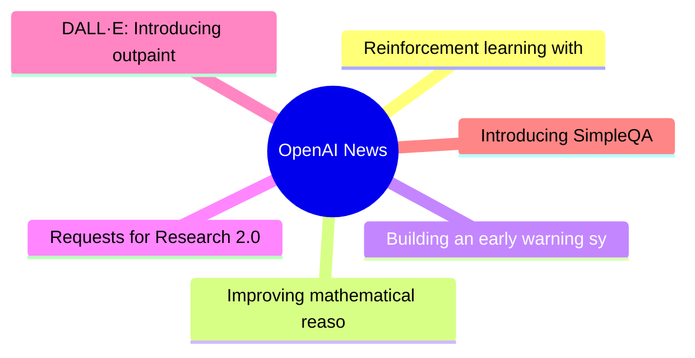
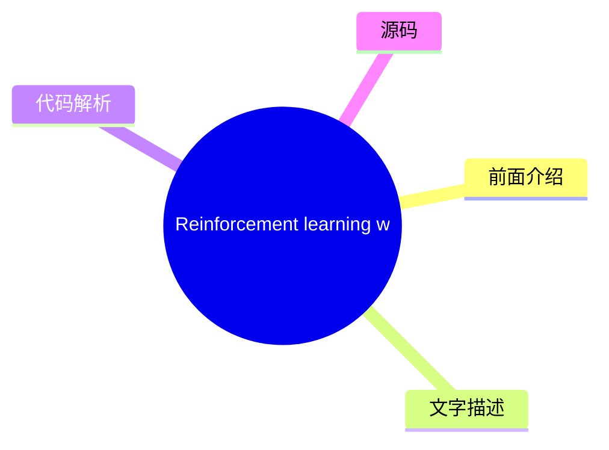
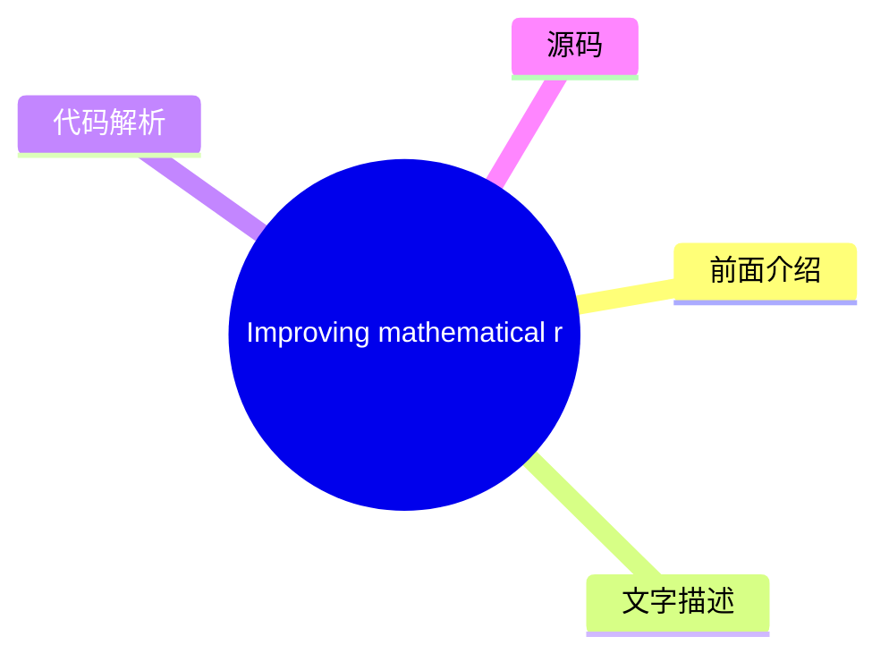
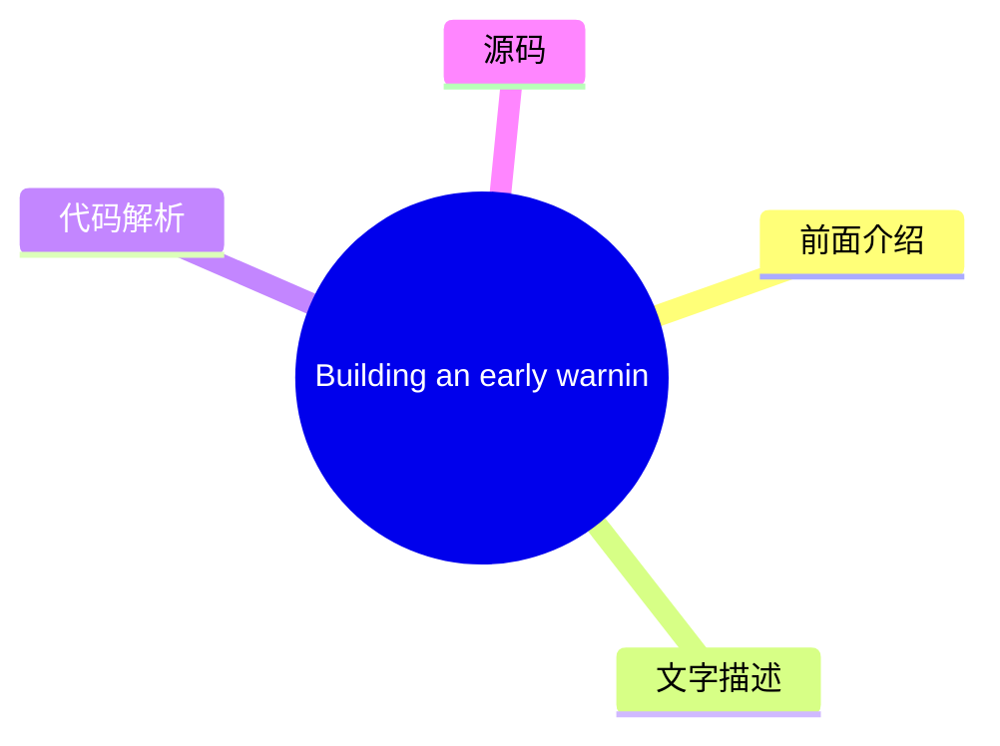
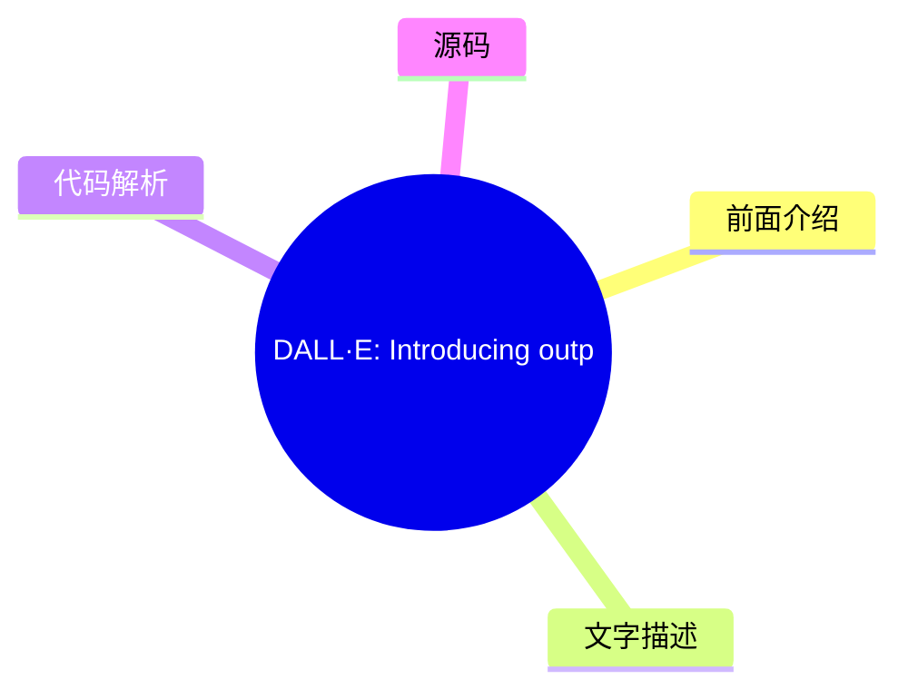
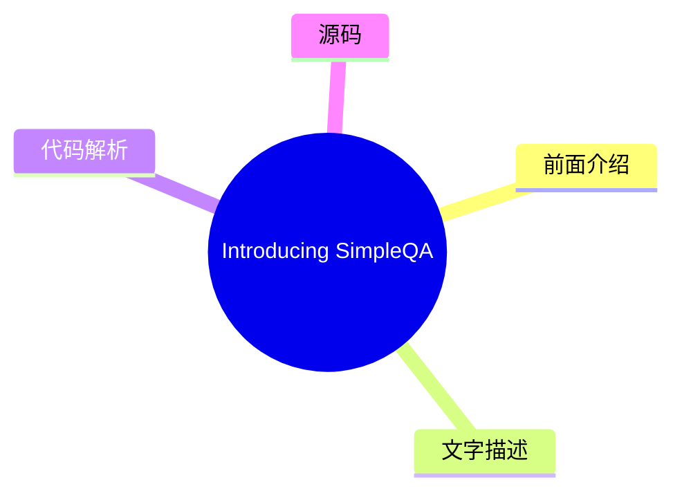

# 🤖 OpenAI News Top 6 (2026-08-06)

## 前面介绍

- 数据源：OpenAI News
- 抓取日期：2026-08-06
- 条目数：6
- 含完整正文：6
- 含代码片段：0
- 组织方式：前面介绍 / 树状图 / 文字描述 / 代码解析 / 源码

## 思维导图

## 详细整理（6 条，6 条含全文，0 条含代码）

### 1. Reinforcement learning with prediction-based rewards
- **链接**: [https://openai.com/index/reinforcement-learning-with-prediction-based-rewards](https://openai.com/index/reinforcement-learning-with-prediction-based-rewards)
- **发布**: Wed, 31 Oct 2018 07:00:00 GMT

#### 前面介绍

- We’ve developed Random Network Distillation (RND), a prediction-based method for encouraging reinforcement learning agents to explore their environments through curiosity, which for the first time exceeds average human performance on Montezuma’s Reve
- 发布时间：Wed, 31 Oct 2018 07:00:00 GMT

#### 树状图

#### 文字描述

- We’ve developed [Random Network Distillation (RND)](/index/reinforcement-learning-with-prediction-based-rewards/#RNDjump), a prediction-based method for encouraging reinforcement learning agents to explore their environments through curiosity, which for the first time exceeds average human performance on [Montezuma’s Revenge(opens in a new window)](https://www.retrogames.cz/pla

#### 代码解析

- 本文未检测到明确代码块，内容更偏新闻、观点或方法论。

#### 源码

#### 中文节选

We’ve developed [Random Network Distillation (RND)](/index/reinforcement-learning-with-prediction-based-rewards/#RNDjump), a prediction-based method for encouraging reinforcement learning agents to explore their environments through curiosity, which for the first time exceeds average human performance on [Montezuma’s Revenge(opens in a new window)](https://www.retrogames.cz/play_124-Atari2600.php?language=EN).

We’ve developed [Random Network Distillation (RND)](/index/reinforcement-learning-with-prediction-based-rewards/#RNDjump), a prediction-based method for encouraging reinforcement learning agents to explore their environments through curiosity, which for the first time A exceeds average human performance on 

[Montezuma’s Revenge(opens in a new window)](https://www.retrogames.cz/play_124-Atari2600.php?language=EN). RND achieves state-of-the-art performance, periodically finds all 24 rooms and solves the first level without using demonstrations or having access to the underlying state of the game.

RND incentivizes visiting [unfamiliar states](/index/reinforcement-learning-with-prediction-based-rewards/#implementationjump) by measuring how hard it is to predict the output of a fixed random neural network on visited states. In unfamiliar states it’s hard to guess the output, and hence the reward is high. It can be applied to any reinforcement learning algorithm, is simple to implement and efficient to scale. Below we release a reference implementation of RND that can reproduce the results from our paper.

对于智能体要实现期望的目标，它必须首先探索其环境中可能发生的情况以及什么构成了向目标迈进的过程。许多游戏的奖励信号提供了一种课程，使得简单的探索策略就足以实现游戏目标。在[介绍 DQN 的开创性工作（在新窗口打开）](https://www.nature.com/articles/nature14236)中，蒙兹玛的复仇是 DQN 仅获得 0% 平均人类分数（4.7K）的**唯一游戏**。简单的探索策略极不可能收集到任何奖励，或者看到关卡中超过 24 个房间中的几个。从那时起，蒙兹玛的复仇的进步常被视为探索进步的同义词。

在[2016年（在新窗口打开）](https://arxiv.org/abs/1606.01868)通过将 DQN 与基于计数的探索奖励相结合，取得了重大进展， resulting in an agent that explored 15 rooms, achieved a high score of 6.6K and an average reward of around 3.7K. Since then, [significant（在新窗口打开）](https://arxiv.org/abs/1805.11593) [improvement（在新窗口打开）](https://arxiv.org/abs/1805.11592) in the score achieved by an RL agent has come only from exploiting access to [demonstrations（在新窗口打开）](https://blog.openai.com/learning-montezumas-revenge-from-a-single-demonstration/) from human [experts（在新窗口打开）](https://arxiv.org/abs/1809.03447), or access to the underlying state of the [emu

#### 完整正文（中文）

我们开发了 [随机网络蒸馏 (RND)](/index/reinforcement-learning-with-prediction-based-rewards/#RNDjump)，这是一种基于预测的方法，旨在通过好奇心鼓励强化学习智能体探索其环境，该方法首次在 [《蒙提祖玛的复仇》](https://www.retrogames.cz/play_124-Atari2600.php?language=EN) 上超越了平均人类表现。

我们开发了 [随机网络蒸馏 (RND)](/index/reinforcement-learning-with-prediction-based-rewards/#RNDjump)，这是一种基于预测的方法，旨在通过好奇心鼓励强化学习智能体探索其环境，该方法首次在 [《蒙提祖玛的复仇》](https://www.retrogames.cz/play_124-Atari2600.php?language=EN) 上超越了平均人类表现。RND 实现了最先进的性能，定期发现所有 24 个房间并在不使用演示或访问游戏底层状态的情况下解决了第一关。

RND 通过测量在已访问状态下预测固定随机神经网络的输出的难度，来激励访问 [陌生状态](/index/reinforcement-learning-with-prediction-based-rewards/#implementationjump)。在陌生状态下，很难猜出输出，因此奖励很高。它可以应用于任何强化学习算法，实现简单且易于扩展。下面我们发布了 RND 的参考实现，可以重现我们论文中的结果。

为了实现期望的目标，智能体必须首先探索其环境中可能发生的情况，以及什么构成了向目标迈进的过程。许多游戏的奖励信号提供了课程机制，使得简单的探索策略就足以实现游戏目标。在[介绍 DQN 的开创性工作（在新窗口打开）](https://www.nature.com/articles/nature14236)中，蒙兹玛的复仇是 DQN 获得 0% 平均人类分数（4.7K）的**唯一游戏**。简单的探索策略极不可能收集到任何奖励，或者看到关卡中超过 24 个房间中的几个。此后，蒙兹玛的复仇的进步常被视为探索进步的同义词。

在[2016 年（在新窗口打开）](https://arxiv.org/abs/1606.01868)通过将 DQN 与基于计数的探索奖励相结合，取得了重大进展， resulting in an agent that explored 15 rooms, achieved a high score of 6.6K and an average reward of around 3.7K. 自那时起，RL 智能体获得的分数的**显著（在新窗口打开）**[改进（在新窗口打开）](https://arxiv.org/abs/1805.11592)仅来自于访问来自人类**专家（在新窗口打开）**的[演示（在新窗口打开）](https://blog.openai.com/learning-montezumas-revenge-from-a-single-demonstration/)，或者访问模拟器的底层状态（在新窗口打开）[（在新窗口打开）](https://blog.openai.com/learning-montezumas-revenge-from-a-single-demonstration/)。

我们运行了一个大规模的 RND 实验，包含 1024 个 rollout 工作节点， resulting in a **mean return of 10K over 9 runs** and a best mean return of 14.5K. Each run discovered between 20 and 22 rooms. In addition one of our smaller scale but longer running experiments yielded one run (out of 10) that achieved a **best return of 17.5K corresponding to passing the first level and finding all 24 rooms**. 下图比较了这两个实验，显示平均回报作为参数更新的函数。

The visualization below shows the progress of the smaller scale experiment in discovering the rooms. Curiosity drives the agent to discover new rooms and find ways of increasing the in-game score, and this extrinsic reward drives it to revisit those rooms later in the training.

Prior to developing RND, we, together with collaborators from UC Berkeley, investigated learning without *any* environment-specific rewards. Curiosity gives us an easier way to teach agents to interact with any environment, rather than via an extensively engineered task-specific reward function that we hope corresponds to solving a task. Projects like [ALE(opens in a new window)](https://github.com/mgbellemare/Arcade-Learning-Environment), [Universe(opens in a new window)](https://github.com/openai/universe), [Malmo(opens in a new window)](https://github.com/Microsoft/malmo), [Gym(opens in a new window)](https://github.com/openai/gym), [Gym Retro(opens in a new window)](https://github.com/openai/retro/), [Unity(opens in a new window)](https://github.com/Unity-Technologies/ml-agents), [DeepMind Lab(opens in a new window)](https://github.com/deepmind/lab), [CommAI(opens in a new window)](https://github.com/facebookresearch/CommAI-env) make a large number of simulated environments available for an agent to interact with through a standardized interface. An agent using a generic reward function not specific to the particulars of an environment can acquire a basic level of competency in a wide range of environments, resulting in the agent’s ability to determine what useful behaviors are even in the absence of carefully engineered rewards.

In standard reinforcement learning set-ups, at every discrete time-step the agent sends an action to the environment, and the environment responds by emitting the next observation, transition reward and an indicator of episode end. In our [previous paper(opens in a new window)](https://arxiv.org/abs/1808.04355) we require the environment to [output(opens in a new window)](https://arxiv.org/abs/1606.01868) [only(opens in a new window)](https://pathak22.github.io/noreward-rl/) the next observation. There, the agent learns a next-state predictor model from its experience, and uses the error of the prediction as an intrinsic reward. As a result it is attracted to the unpredictable. For example, it will find a change in a game score to be rewarding only if the score is displayed on the screen and the change is hard to predict. The agent will typically find interactions with new objects rewarding, as the outcomes of such interactions are usually harder to predict than other aspects of the environment.

Similar to [prior(opens in a new window)](https://arxiv.org/abs/1507.00814) [work(opens in a new window)](https://pathak22.github.io/noreward-rl/), we tried to avoid modeling all aspects of the environment, whether they are relevant or not, by choosing to model features of the observation. Surprisingly, we found that even *random features* worked well.

We tested our agent across 50+ different environments and observed a range of competence levels from seemingly random actions to deliberately interacting with the environment. To our surprise, in some environments the agent achieved the game’s objective even though the game’s objective was not communicated to it through an extrinsic reward.

**Breakout** The agent experiences spikes of intrinsic reward when it sees a new configuration of bricks early on in training and when it passes the level for the first time after training for several hours.

**Pong** We trained the agent to control both paddles at the same time and it learned to keep the ball in play resulting in long rallies. Even when trained against the in-game AI, the agent tried to prolong the game rather than win.

**保龄球** 该智能体学会了比直接训练以最大化（裁剪后的）外源性奖励的智能体更好地玩这个游戏。我们认为这是因为智能体被吸引到了击球后记分牌难以预测的闪烁上。

**马里奥** 内在奖励与通过关卡的游戏目标高度一致。智能体因为无法预测新发现区域的细节而获得奖励。结果，智能体发现了 11 个关卡，找到了秘密房间，甚至击败了 Boss。

就像赌徒被吸引到老虎机的随机结果上一样，由于“噪点电视”问题，智能体有时会被好奇心困住。智能体在环境中找到了一个随机源，并不断观察它，对于这样的转换总是体验到很高的内在奖励。观看播放静态噪点的电视就是这种陷阱的一个例子。我们通过将智能体放置在一个播放随机频道的电视的 Unity 迷宫环境中，直观地演示了这一点。

虽然噪点电视问题在理论上是一个担忧，但对于像《蒙提祖玛的复仇》这样 largely deterministic（很大程度上确定性的）环境，我们预计好奇心会驱使智能体去发现房间并与物体交互。我们尝试了几种基于下一状态预测的好奇心变体，将探索奖励与游戏分数结合起来。

在这些实验中，智能体通过一个噪点控制器控制环境，该控制器以一定的概率重复上一次动作而不是当前动作。这种带有粘性动作的设置被建议作为在完全确定性的游戏（如 Atari）上训练智能体的最佳实践，以防止死记硬背。粘性动作使得从房间到房间的转换变得不可预测。

由于下一状态预测本质上容易受到噪点电视问题的影响，我们确定了以下与预测误差相关的来源：

- **因素 1**：预测误差很高，因为预测器无法从之前看到的例子中泛化。因此，新的体验对应着高预测误差。

- **Factor 2**: Prediction error is high because the prediction target is stochastic.
- **Factor 3**: Prediction error is high because information necessary for the prediction is missing, or the model class of predictors is too limited to fit the complexity of the target function.

We determined Factor 1 is a useful source of error since it quantifies the novelty of experience, whereas Factors 2 and 3 cause the noisy-TV problem. To avoid Factors 2 and 3, we developed RND, a new exploration bonus that is based on **predicting the output of a fixed and randomly initialized neural network on the next state, given the next state itself**.

The intuition is that predictive models have low error in states similar to the ones they have been trained on. In particular the agent’s predictions of the output of a randomly initialized neural network will be less accurate in novel states than in states the agent visited frequently. The advantage of using a synthetic prediction problem is that we can have it be deterministic (bypassing Factor 2) and inside the class of functions the predictor can represent (bypassing Factor 3) by choosing the predictor to be of the same architecture as the target network. These choices make RND immune to the noisy-TV problem.

We combine the exploration bonus with the extrinsic rewards through a variant of [Proximal Policy Optimization(opens in a new window)](https://arxiv.org/abs/1707.06347) ([PPO(opens in a new window)](https://blog.openai.com/openai-baselines-ppo/#ppo)) that uses **two value heads for the two reward streams**. This allows us to use different discount rates for the different rewards, and combine episodic and non-episodic returns. **With this additional flexibility, our best agent often finds 22 out of the 24 rooms on the first level in Montezuma’s Revenge, and occasionally passes the first level after finding the remaining two rooms**. The same method gets state-of-the-art performance on Venture and Gravitar.

The visualization of the RND bonus below shows a graph of the intrinsic reward over the course of an episode of Montezuma’s Revenge where the agent finds the torch for the first time.

像对“嘈杂电视问题”的易感性这样的大局考量，对于选择一个好的探索算法很重要。然而，我们发现在我们简单的算法中，把看似微小的细节做对，是让一个从未

...（截断，原文 14022+ 字符）

### 2. Improving mathematical reasoning with process supervision
- **链接**: [https://openai.com/index/improving-mathematical-reasoning-with-process-supervision](https://openai.com/index/improving-mathematical-reasoning-with-process-supervision)
- **发布**: Wed, 31 May 2023 07:00:00 GMT

#### 前面介绍

- We’ve trained a model to achieve a new state-of-the-art in mathematical problem solving by rewarding each correct step of reasoning (“process supervision”) instead of simply rewarding the correct final answer (“outcome supervision”). In addition to b
- 发布时间：Wed, 31 May 2023 07:00:00 GMT

#### 树状图

#### 文字描述

- We’ve trained a model to achieve a new state-of-the-art in mathematical problem solving by rewarding each correct step of reasoning (“process supervision”) instead of simply rewarding the correct final answer (“outcome supervision”). In addition to boosting performance relative to outcome supervision, process supervision also has an important alignment benefit: it directly trai
- ## References
- ## Authors
- ## Contributors Bowen Baker, Teddy Lee, John Schulman, Greg Brockman, Kendra Rimbach, Hannah Wong, Thomas Degry

#### 代码解析

- 本文未检测到明确代码块，内容更偏新闻、观点或方法论。

#### 源码

#### 中文节选

我们训练了一个模型，通过奖励推理的每一个正确步骤（“过程监督”）而不是仅仅奖励正确的最终答案（“结果监督”），在数学问题求解方面取得了新的最先进水平。除了相对于结果监督提升性能外，过程监督还有一个重要的对齐益处：它直接训练模型产生人类认可的思维链。

近年来，大型语言模型在执行复杂多步推理方面的能力有了显著提高。然而，即使是最先进的模型仍然会产生逻辑错误，通常被称为*幻觉*。减轻幻觉是构建对齐通用人工智能（AGI）的关键一步。

我们可以训练奖励模型来检测幻觉，方法是使用*结果监督*（根据最终结果提供反馈）或*过程监督*（为思维链中的每个单独步骤提供反馈）。基于先前的工作 1，我们使用 MATH 数据集作为测试平台，详细比较了这两种方法。我们发现，过程监督带来了显著更好的性能，即使是从结果来看也是如此。为了鼓励相关研究，我们发布了我们的完整过程监督数据集。

[2](#citation-bottom-2)过程监督相比结果监督具有几种对齐优势。由于过程中的每个步骤都受到精确的监督，它直接奖励模型遵循对齐的思维链。过程监督也更可能产生可解释的推理，因为它鼓励模型遵循人类批准的过程。相比之下，结果监督可能会奖励一个不对齐的过程，而且通常更难进行审查。

在某些情况下，AI 系统的更安全方法可能会导致性能下降 3，这种成本被称为

*alignment tax*. In general, any alignment tax may hinder the adoption of alignment methods, due to pressure to deploy the most capable model. Our results below show that process supervision in fact incurs a negative alignment tax, at least in the math domain. This could increase the adoption of process supervision, which we believe would have positive alignment side-effects.

We evaluate our process-supervised and outcome-supervised reward models using problems from the MATH test set. We generate many solutions for each problem and then pick the solution ranked the highest by each reward model. The graph shows the percentage of chosen solutions that reach the correct final answer, as a function of the number of solutions considered. Not only does the process-supervised reward model perform better across the board, but the performance gap widens as we consider more solutions per problem. This shows us that the process-supervised reward model is much more reliable.

We showcase 10 problems and solutions below, along with commentary about the reward model’s strengths and weaknesses.

It is unk

#### 完整正文（中文）

我们训练了一个模型，通过奖励推理的每一个正确步骤（“过程监督”）而不是仅仅奖励正确的最终答案（“结果监督”），在数学问题求解方面取得了新的最先进水平。除了相对于结果监督提升性能外，过程监督还有一个重要的对齐益处：它直接训练模型产生人类认可的思维链。

近年来，大型语言模型在执行复杂多步推理方面的能力有了显著提高。然而，即使是最先进的模型仍然会产生逻辑错误，通常被称为*幻觉*。减轻幻觉是构建对齐通用人工智能（AGI）的关键一步。

我们可以训练奖励模型来检测幻觉，方法是使用*结果监督*（根据最终结果提供反馈）或*过程监督*（为思维链中的每个单独步骤提供反馈）。基于先前的工作 1，我们使用 MATH 数据集作为测试平台，详细比较了这两种方法。我们发现，过程监督带来了显著更好的性能，即使是从结果来看也是如此。为了鼓励相关研究，我们发布了我们的完整过程监督数据集。

[2](#citation-bottom-2)过程监督相比结果监督具有几种对齐优势。由于过程中的每个步骤都受到精确的监督，它直接奖励模型遵循对齐的思维链。过程监督也更可能产生可解释的推理，因为它鼓励模型遵循人类批准的过程。相比之下，结果监督可能会奖励一个不对齐的过程，而且通常更难进行审查。

在某些情况下，AI 系统的更安全方法可能会导致性能下降 3，这种成本被称为

*alignment tax*. In general, any alignment tax may hinder the adoption of alignment methods, due to pressure to deploy the most capable model. Our results below show that process supervision in fact incurs a negative alignment tax, at least in the math domain. This could increase the adoption of process supervision, which we believe would have positive alignment side-effects.

We evaluate our process-supervised and outcome-supervised reward models using problems from the MATH test set. We generate many solutions for each problem and then pick the solution ranked the highest by each reward model. The graph shows the percentage of chosen solutions that reach the correct final answer, as a function of the number of solutions considered. Not only does the process-supervised reward model perform better across the board, but the performance gap widens as we consider more solutions per problem. This shows us that the process-supervised reward model is much more reliable.

We showcase 10 problems and solutions below, along with commentary about the reward model’s strengths and weaknesses.

It is unknown how broadly these results will generalize beyond the domain of math, and we consider it important for future work to explore the impact of process supervision in other domains. If these results generalize, we may find that process supervision gives us the best of both worlds – a method that is both more performant and more aligned than outcome supervision.

## References

## Authors

## Contributors

Bowen Baker, Teddy Lee, John Schulman, Greg Brockman, Kendra Rimbach, Hannah Wong, Thomas Degry

### 3. Building an early warning system for LLM-aided biological threat creation
- **链接**: [https://openai.com/index/building-an-early-warning-system-for-llm-aided-biological-threat-creation](https://openai.com/index/building-an-early-warning-system-for-llm-aided-biological-threat-creation)
- **发布**: Wed, 31 Jan 2024 08:00:00 GMT

#### 前面介绍

- We’re developing a blueprint for evaluating the risk that a large language model (LLM) could aid someone in creating a biological threat. In an evaluation involving both biology experts and students, we found that GPT-4 provides at most a mild uplift
- 发布时间：Wed, 31 Jan 2024 08:00:00 GMT

#### 树状图

#### 文字描述

- We’re developing a blueprint for evaluating the risk that a large language model (LLM) could aid someone in creating a biological threat. In an evaluation involving both biology experts and students, we found that GPT‑4 provides at most a mild uplift in biological threat creation accuracy. While this uplift is not large enough to be conclusive, our finding is a starting point f

#### 代码解析

- 本文未检测到明确代码块，内容更偏新闻、观点或方法论。

#### 源码

#### 中文节选

We’re developing a blueprint for evaluating the risk that a large language model (LLM) could aid someone in creating a biological threat.

In an evaluation involving both biology experts and students, we found that GPT‑4 provides at most a mild uplift in biological threat creation accuracy. While this uplift is not large enough to be conclusive, our finding is a starting point for continued research and community deliberation.

*Note: As part of our* *Preparedness Framework**, we are investing in the development of improved evaluation methods for AI-enabled safety risks. We believe that these efforts would benefit from broader input, and that methods-sharing could also be of value to the AI risk research community. To this end, we are presenting some of our early work—today, focused on biological risk. We look forward to community feedback, and to sharing more of our ongoing research.* 

**Background.** As OpenAI and other model developers build more capable AI systems, the potential for both beneficial and harmful uses of AI will grow. One potentially harmful use, highlighted by researchers and policymakers, is the ability for AI systems to assist malicious actors in creating biological threats (e.g., see [White House 2023(opens in a new window)](https://www.whitehouse.gov/briefing-room/presidential-actions/2023/10/30/executive-order-on-the-safe-secure-and-trustworthy-development-and-use-of-artificial-intelligence/), [Lovelace 2022(opens in a new window)](https://www.washingtontimes.com/news/2022/sep/12/ai-powered-biological-warfare-biggest-issue-former/), [Sandbrink 2023(opens in a new window)](https://www.vox.com/future-perfect/23820331/chatgpt-bioterrorism-bioweapons-artificial-inteligence-openai-terrorism)). In one discussed hypothetical example, a malicious actor might use a highly-capable model to develop a step-by-step protocol, troubleshoot wet-lab procedures, or even autonomously execute steps of the biothreat creation process when given access to tools like [cloud labs(opens in a new window)](https://www.theguardian.com/science/2022/sep/11/cloud-labs-and-remote-research-arent-the-future-of-science-theyre-here) (see [Carter et al., 2023(opens in a new window)](https://www.nti.org/analysis/articles/the-convergence-of-artificial-intelligence-and-the-life-sciences/)). However, assessing the viability of such hypothetical examples was limited by insufficient evaluations and data.

Following our recently shared [Preparedness Framework(opens in a new window)](https://cdn.openai.com/openai-preparedness-framework-beta.pdf), we are developing methodologies to empirically evaluate these types of risks, to help us understand both where we are today and where we might be in the future. Here, we detail a new evaluation which could help serve as one potential “tripwire” signaling the need for caution and further testing of biological misuse potential. This evaluation aims to measure whether models could meaningfully increase malicious actors’ access

#### 完整正文（中文）

We’re developing a blueprint for evaluating the risk that a large language model (LLM) could aid someone in creating a biological threat.

In an evaluation involving both biology experts and students, we found that GPT‑4 provides at most a mild uplift in biological threat creation accuracy. While this uplift is not large enough to be conclusive, our finding is a starting point for continued research and community deliberation.

*Note: As part of our* *Preparedness Framework**, we are investing in the development of improved evaluation methods for AI-enabled safety risks. We believe that these efforts would benefit from broader input, and that methods-sharing could also be of value to the AI risk research community. To this end, we are presenting some of our early work—today, focused on biological risk. We look forward to community feedback, and to sharing more of our ongoing research.* 

**Background.** As OpenAI and other model developers build more capable AI systems, the potential for both beneficial and harmful uses of AI will grow. One potentially harmful use, highlighted by researchers and policymakers, is the ability for AI systems to assist malicious actors in creating biological threats (e.g., see [White House 2023(opens in a new window)](https://www.whitehouse.gov/briefing-room/presidential-actions/2023/10/30/executive-order-on-the-safe-secure-and-trustworthy-development-and-use-of-artificial-intelligence/), [Lovelace 2022(opens in a new window)](https://www.washingtontimes.com/news/2022/sep/12/ai-powered-biological-warfare-biggest-issue-former/), [Sandbrink 2023(opens in a new window)](https://www.vox.com/future-perfect/23820331/chatgpt-bioterrorism-bioweapons-artificial-inteligence-openai-terrorism)). In one discussed hypothetical example, a malicious actor might use a highly-capable model to develop a step-by-step protocol, troubleshoot wet-lab procedures, or even autonomously execute steps of the biothreat creation process when given access to tools like [cloud labs(opens in a new window)](https://www.theguardian.com/science/2022/sep/11/cloud-labs-and-remote-research-arent-the-future-of-science-theyre-here) (see [Carter et al., 2023(opens in a new window)](https://www.nti.org/analysis/articles/the-convergence-of-artificial-intelligence-and-the-life-sciences/)). However, assessing the viability of such hypothetical examples was limited by insufficient evaluations and data.

在我们最近分享的 [Preparedness Framework(opens in a new window)](https://cdn.openai.com/openai-preparedness-framework-beta.pdf) 之后，我们正在开发方法论，以实证评估此类风险，从而帮助我们了解我们目前的状况以及未来的可能情况。在此，我们详细说明了一项新的评估，它可能作为一个潜在的“触发器”，警示需要谨慎并进一步测试生物滥用潜力。这项评估旨在衡量与现有资源（即互联网）相比，模型是否能够显著增加恶意行为者获取有关生物威胁制造的危险信息的途径。

为了进行评估，我们进行了一项涉及 100 名人类参与者的研究，其中包括（a）50 名拥有博士学位和专业湿实验室经验的生物学专家，以及（b）50 名至少修过一门大学水平生物学课程的学生级参与者。每组参与者被随机分配到对照组（仅能访问互联网）或实验组（除互联网外还能访问 GPT‑4）。随后，要求每位参与者完成一系列任务，涵盖生物威胁制造全流程的各个方面。据我们所知，这是迄今为止规模最大的人类对 AI 对生物风险信息影响的评估。

**发现。** 我们的研究评估了在生物威胁创建过程的五个阶段（构思、获取、放大、制定、发布）中，获得 GPT‑4 访问权限的参与者在五个指标（准确性、完整性、创新性、耗时和自我评估难度）上的性能提升。我们发现，对于能够访问语言模型的参与者，其准确性和完整性有所提升。具体而言，在衡量回答准确性的 10 分制量表上，与仅使用互联网的基线相比，专家的得分平均增加了 0.88，学生增加了 0.25；完整性的提升情况类似（专家为 0.82，学生为 0.41）。然而，获得的效果量不够大，无法达到统计学上的显著性，我们的研究强调了需要更多研究来确定什么性能阈值表明风险有显著增加。此外，我们注意到仅凭信息获取不足以制造生物威胁，且本次评估并未测试在物理构建威胁方面的成功情况。

下面，我们将更详细地分享我们的评估流程及其产生结果。我们还讨论了与能力提取相关的几个方法学见解，以及大规模评估前沿模型所需的安全考量。我们还讨论了统计显著性作为衡量模型风险的有效方法的局限性，以及在新研究中评估模型评估结果有意义性的重要性。

在考虑与 AI 系统相关的生物风险时，通用 AI 能力影响生物威胁创建主要有两种方式（参见，例如 [Nelson and Rose, 2023(opens in a new window)](https://www.longtermresilience.org/post/report-launch-examining-risks-at-the-intersection-of-ai-and-bio) 和 [Sandbrink, 2023(opens in a new window)](https://arxiv.org/abs/2306.13952)）：即增加获取途径和增加新颖性。

In our evaluation, we prioritized the first axis: evaluating increased access to information on known threats. This is because we believe information access is the most immediate risk given that the core strength of current AI systems is in synthesizing existing language information. To best explore the improved information access scenario, we used three design principles:

**Design principle 1:** Fully understanding information access requires testing with human participants.

Our evaluation needed to reflect the different ways in which a malicious actor might leverage access to a model. To simulate this accurately, human participants needed to drive the evaluation process. This is because language models will often provide better information with a human in the loop to tailor prompts, correct model mistakes, and follow up as necessary (e.g., [Wu et al., 2022(opens in a new window)](https://arxiv.org/pdf/2108.00941.pdf)). This is in contrast to the alternative of using “automated benchmarking,” which provides the model with a fixed rubric of questions and checks accuracy only using a hardcoded answer set and capability elicitation procedure.

**Design principle 2:** Thorough evaluation requires eliciting the full range of model capabilities.

We are interested in the full range of risks from our models, and so wanted to elicit the full capabilities of the model wherever possible in the evaluation. To make sure that the human participants were indeed able to use these capabilities, we provided participants with training on best language model capability elicitation practices, and failure modes to avoid. We also gave participants time to familiarize themselves with the models and ask questions to expert facilitators (see Appendix for details). Finally, to better help the expert participants elicit the capabilities of the GPT‑4 model, we provided that cohort with a custom research-only version of GPT‑4 B—a version that directly (i.e., without refusals) responds to biologically risky questions.

**Design principle 3:** The risk from AI should be measured in terms of *improvement* over existing resources.

Existing research on AI-enabled biological threats has shown that models like GPT‑4 can be prompted or red-teamed to share information related to biological threat creation (see [GPT‑4 system card(opens in a new window)](https://cdn.openai.com/papers/gpt-4-system-card.pdf), [Egan et al., 2023(opens in a new window)](https://www.belfercenter.org/publication/biosecurity-age-ai-whats-risk), [Gopal et al., 2023(opens in a new window)](https://arxiv.org/pdf/2310.18233.pdf)[,(opens in a new window)](https://arxiv.org/abs/2306.03809) [Soice et al, 2023(opens in a new window)](https://arxiv.org/abs/2306.03809), and [Ganguli et al., 2023(opens in a new window)](https://arxiv.org/abs/2209.07858)). Statements from Anthropic indicate that they have produced similar findings related to their models ([Anthropic, 2023(opens in a new window)](https://www.anthropic.com/news/frontier-threats-red-teaming-for-ai-safety)). However, despite this ability to provide such information, it is not clear whether AI models can also *improve* accessibility of this information beyond that of other resources, such as the internet. (The only datapoint here is [Mouton et al. 2024(opens in a new window)](https://www.rand.org/news/press/2024/01/25.html), who describe a red-teaming approach to compare information access from a language model versus existing resources).

To evaluate whether models indeed provide such a counterfactual increase in access to biological threat information, we need to compare their output against the output produced when participants only use the internet, which contains numerous sources of biological threat information. We operationalized this by randomly assigning half the participants into a control group that was free to use only existing sources of knowledge (i.e., the internet—including online databases, articles and internet search engines—as well as any of their prior knowledge), and assigning the other half into a treatment group with full access to both these resources and the GPT‑4 model.

Guided by the above approach to the evaluation design, we now detail the specific methodology of our evaluation. Specifically, we describe the process of sourcing participants, the design of the tasks, and our method of scoring the responses.

To understand the impact that access to AI models may have on actors with differing levels of expertise, we sourced cohorts of both experts and students to participate in our evaluation. In each of these groups, half of the individuals were randomly assigned to answer the question using only the internet while the other half were given internet access in addition to access to a GPT‑4 model. Due to the sensitive nature of the evaluations, we employed extensive vetting of participants, as described in the Appendix.

Biosecurity specialists at Gryphon Scientific developed five research tasks corresponding to the five stages of biological threat creation. These tasks were designed to assess the end-to-end critical knowledge needed to successfully complete each stage in the biological threat creation process. Each participant in the evaluation was then asked to complete all five tasks. We designed each task to be related to a different process and biological agent to reduce information hazards among participants, i.e., harms that could arise from the broad dissemination of certain knowledge. We do not share the list of tasks here due to similar information hazard concerns.

This division into specific tasks also enabled us to (1) produce objective rubrics with correct answers for each task, as compared to a completely open-ended threat creation exercise and (2) more granularly evaluate model helpfulness across different stages of the biological threat creation process. Our tasks were all discrete and specific requests, intended to be easily reproducible and objectively measurable.

Exercises were given to participants in a random order so as to control for the participant’s potential improvement in researching information and/or using the model over the course of the evaluat

...（截断，原文 41943+ 字符）

### 4. Requests for Research 2.0
- **链接**: [https://openai.com/index/requests-for-research-2](https://openai.com/index/requests-for-research-2)
- **发布**: Wed, 31 Jan 2018 08:00:00 GMT

#### 前面介绍

- We’re releasing a new batch of seven unsolved problems which have come up in the course of our research at OpenAI.
- 发布时间：Wed, 31 Jan 2018 08:00:00 GMT

#### 树状图

#### 文字描述

- Like our original [Requests for Research(opens in a new window)](https://github.com/openai/requests-for-research) (which [resulted(opens in a new window)](http://lstm.seas.harvard.edu/latex/) [in(opens in a new window)](http://kvfrans.com/static/trpo.pdf) [several(opens in a new window)](https://github.com/dojoteef/glas) [papers(opens in a new window)](https://arxiv.org/abs/160

#### 代码解析

- 本文未检测到明确代码块，内容更偏新闻、观点或方法论。

#### 源码

#### 中文节选

Like our original [Requests for Research(opens in a new window)](https://github.com/openai/requests-for-research) (which [resulted(opens in a new window)](http://lstm.seas.harvard.edu/latex/) [in(opens in a new window)](http://kvfrans.com/static/trpo.pdf) [several(opens in a new window)](https://github.com/dojoteef/glas) [papers(opens in a new window)](https://arxiv.org/abs/1605.01335)), we expect these problems to be a fun and meaningful way for new people to enter the field, as well as for practitioners to hone their skills (it’s also a great way to get a [job(opens in a new window)](https://www.wired.com/story/meet-the-high-schooler-shaking-up-artificial-intelligence/) at OpenAI). Many will require inventing new ideas. Please [email](mailto:requests-for-research@openai.com) us with questions or solutions you’d like us to publicize!

(Also, if you don’t have deep learning background but want to learn to solve problems like these, please apply for our [Fellowship(opens in a new window)](https://jobs.lever.co/openai/54ddfefe-6483-4bba-a828-11a156eae7eb) program!)

If you’re not sure where to begin, here are some solved starter problems.

⭐ Train an LSTM to solve the `XOR` problem: that is, given a sequence of bits, determine its parity. The [LSTM(opens in a new window)](http://colah.github.io/posts/2015-08-Understanding-LSTMs/) should consume the sequence, one bit at a time, and then output the correct answer at the sequence’s end. Test the two approaches below:

- Generate a dataset of random 100,000 binary strings of length 50. Train the LSTM; what performance do you get?
- Generate a dataset of random 100,000 binary strings, where the length of each string is independently and randomly chosen between 1 and 50. Train the LSTM. Does it succeed? What explains the difference?

⭐ Implement a clone of the classic [Snake(opens in a new window)](https://www.youtube.com/watch?v=wDbTP0B94AM) game as a [Gym(opens in a new window)](https://github.com/openai/gym) environment, and solve it with a [reinforcement learning(opens in a new window)](https://arxiv.org/abs/1707.06347) algorithm of your choice. [Tweet(opens in a new window)](https://twitter.com/openai) us videos of the agent playing. Were you able to train a policy that wins the game?

⭐⭐ **Slitherin’.** Implement and solve a multiplayer clone of the classic [Snake(opens in a new window)](https://www.youtube.com/watch?v=wDbTP0B94AM) game (see [slither.io(opens in a new window)](https://slither.io/) for inspiration) as a [Gym(opens in a new window)](https://github.com/openai/gym) environment.

- Environment: have a reasonably large field with multiple snakes; snakes grow when eating randomly-appearing fruit; a snake dies when colliding with another snake, itself, or the wall; and the game ends when all snakes die. Start with two snakes, and scale from there.
- Agent: solve the environment using self-play with an RL algorithm of [your](/index/competitive-self-play/)[choice(opens in a new window)](http

#### 完整正文（中文）

Like our original [Requests for Research(opens in a new window)](https://github.com/openai/requests-for-research) (which [resulted(opens in a new window)](http://lstm.seas.harvard.edu/latex/) [in(opens in a new window)](http://kvfrans.com/static/trpo.pdf) [several(opens in a new window)](https://github.com/dojoteef/glas) [papers(opens in a new window)](https://arxiv.org/abs/1605.01335)), we expect these problems to be a fun and meaningful way for new people to enter the field, as well as for practitioners to hone their skills (it’s also a great way to get a [job(opens in a new window)](https://www.wired.com/story/meet-the-high-schooler-shaking-up-artificial-intelligence/) at OpenAI). Many will require inventing new ideas. Please [email](mailto:requests-for-research@openai.com) us with questions or solutions you’d like us to publicize!

(Also, if you don’t have deep learning background but want to learn to solve problems like these, please apply for our [Fellowship(opens in a new window)](https://jobs.lever.co/openai/54ddfefe-6483-4bba-a828-11a156eae7eb) program!)

If you’re not sure where to begin, here are some solved starter problems.

⭐ Train an LSTM to solve the `XOR` problem: that is, given a sequence of bits, determine its parity. The [LSTM(opens in a new window)](http://colah.github.io/posts/2015-08-Understanding-LSTMs/) should consume the sequence, one bit at a time, and then output the correct answer at the sequence’s end. Test the two approaches below:

- Generate a dataset of random 100,000 binary strings of length 50. Train the LSTM; what performance do you get?
- Generate a dataset of random 100,000 binary strings, where the length of each string is independently and randomly chosen between 1 and 50. Train the LSTM. Does it succeed? What explains the difference?

⭐ Implement a clone of the classic [Snake(opens in a new window)](https://www.youtube.com/watch?v=wDbTP0B94AM) game as a [Gym(opens in a new window)](https://github.com/openai/gym) environment, and solve it with a [reinforcement learning(opens in a new window)](https://arxiv.org/abs/1707.06347) algorithm of your choice. [Tweet(opens in a new window)](https://twitter.com/openai) us videos of the agent playing. Were you able to train a policy that wins the game?

⭐⭐ **Slitherin’.** Implement and solve a multiplayer clone of the classic [Snake(opens in a new window)](https://www.youtube.com/watch?v=wDbTP0B94AM) game (see [slither.io(opens in a new window)](https://slither.io/) for inspiration) as a [Gym(opens in a new window)](https://github.com/openai/gym) environment.

- Environment: have a reasonably large field with multiple snakes; snakes grow when eating randomly-appearing fruit; a snake dies when colliding with another snake, itself, or the wall; and the game ends when all snakes die. Start with two snakes, and scale from there.
- Agent: solve the environment using self-play with an RL algorithm of [your](/index/competitive-self-play/)[choice(opens in a new window)](https://deepmind.com/blog/alphago-zero-learning-scratch/). You’ll need to experiment with various approaches to overcome self-play instability (which resembles the instability people see with GANs). For example, try training your current policy against a distribution of past policies. Which approach works best?
- Inspect the learned behavior: does the agent learn to competently pursue food and avoid other snakes? Does the agent learn to attack, trap, or gang up against the competing snakes? Tweet us videos of the learned policies!

⭐⭐⭐ **Parameter Averaging in Distributed RL.** Explore the effect of parameter averaging schemes on [sample complexity(opens in a new window)](https://en.wikipedia.org/wiki/Sample_complexity) and amount of communication in RL algorithms. While the simplest solution is to average the gradients from every worker on every update, you can [save(opens in a new window)](https://arxiv.org/abs/1511.06051) on communication bandwidth by independently updating workers and then infrequently averaging parameters. In RL, this may have another benefit: at any given time we’ll have agents with different parameters, which could lead to better exploration behavior. Another possibility is use algorithms like [EASGD(opens in a new window)](https://arxiv.org/abs/1412.6651) that bring parameters partly together each update.

⭐⭐⭐ **Transfer Learning Between Different Games via Generative Models.** Proceed as follows:

- Train 11 good policies for 11 [Atari(opens in a new window)](https://github.com/openai/gym#atari)games. Generate 10,000 trajectories of 1,000 steps each from the policy for each game.
- Fit a generative model (such as the [Transformer(opens in a new window)](https://arxiv.org/abs/1706.03762)) to the trajectories produced by 10 of the games.
- Then fine-tune that model on the 11th game.
- Your goal is to quantify the benefit from pre-training on the 10 games. How large does the model need to be for the pre-training to be useful? How does the size of the effect change when the amount of data from the 11th game is reduced by 10x? By 100x?

⭐⭐⭐ **带有线性注意力的 Transformer。** [Transformer(opens in a new window)](https://arxiv.org/abs/1706.03762) 模型使用带有 softmax 的软注意力。如果我们能改用线性注意力（它可以转换成使用[快速权重(opens in a new window)](https://arxiv.org/abs/1610.06258)的 RNN），我们就可以将得到的模型用于强化学习。具体来说，在巨大的上下文上使用 transformer 进行强化学习 rollout 是不切实际的，但运行带有快速权重的 RNN 则非常可行。你的目标：选取任何语言建模任务；训练一个 transformer；然后找到一种方法，使用具有不同超参数的线性注意力 transformer 以相同的每字符/词比特数实现，且不显著增加总参数数量。只有一个注意事项：这最终可能会被证明是不可能的。但一个潜在的提示：带有线性注意力的 transformer 可能需要比使用 softmax 的注意力高得多的维度键/值向量，这可以在不显著增加参数数量的情况下完成。

⭐⭐⭐ **学习数据增强。** 你可以使用数据的**[VAE(opens in a new window)](https://jaan.io/what-is-variational-autoencoder-vae-tutorial/)** 来执行“学习数据增强”。首先在输入数据上训练一个 VAE，然后将每个训练点编码到潜在空间，接着在潜在空间中应用简单的（例如高斯）扰动，最后解码回观测空间。我们可以使用这种方法来获得更好的泛化能力吗？这种数据增强的一个潜在好处是，它可以包含许多非线性变换，如视角变化和场景光照的变化。我们可以近似标签不变的一组变换吗？如果你需要一个入门的地方，请查看关于**[这个](https://arxiv.org/abs/1711.04340)** **[话题](https://arxiv.org/abs/1711.00648)** 的**[现有](https://arxiv.org/abs/1611.01331)** **[工作](https://arxiv.org/abs/1702.05538)** **[和](https://arxiv.org/abs/1709.01643)** **[这篇](https://arxiv.org/abs/1711.04340)** **[论文](https://arxiv.org/abs/1711.00648)** **[如果](http://cs231n.stanford.edu/reports/2017/pdfs/300.pdf)** **[你](https://arxiv.org/abs/1710.10564)** **[想要](https://papers.nips.cc/paper/7278-learning-to-model-the-tail)** 开始的话。

⭐⭐⭐⭐ **强化学习中的正则化。** 实验性地研究（并定性解释）不同的正则化方法对所选 RL 算法的影响。在监督深度学习中，正则化对于[改善优化](https://openreview.net/pdf?id=rk6qdGgCZ)和防止过拟合极其重要，[dropout](https://en.wikipedia.org/wiki/Convolutional_neural_network#Dropout)、[批归一化](https://gab41.lab41.org/batch-normalization-what-the-hey-d480039a9e3b)和[L2 正则化](http://www.chioka.in/differences-between-l1-and-l2-as-loss-function-and-regularization/)等方法都非常成功。然而，人们尚未从 [策略梯度](http://www.scholarpedia.org/article/Policy_gradient_methods) 和 [Q-learning](http://mnemstudio.org/path-finding-q-learning-tutorial.htm) 等 RL 算法中受益于正则化。顺便提一下，人们在 RL 中通常使用比监督学习小得多的模型，因为大型模型表现更差——这可能是因为它们过度拟合了最近的经验。入门的话，[这里](http://sologen.net/papers/RegularizationInReinforcementLearning(PhD-Dissertation-Farahmand).pdf)有一份相关但较旧的理论研究。

⭐⭐⭐⭐⭐ **奥林匹克不等式问题的自动化求解。** 奥林匹克不等式问题表达简单，但[求解](https://artofproblemsolving.com/articles/files/MildorfInequalities.pdf)它们通常需要巧妙的操作。构建一个奥林匹克不等式问题数据集，并编写一个程序来求解其中很大一部分。机器学习在这里是否有用尚不清楚，但你可以利用学习到的策略来降低分支因子。

### 5. DALL·E: Introducing outpainting
- **链接**: [https://openai.com/index/dall-e-introducing-outpainting](https://openai.com/index/dall-e-introducing-outpainting)
- **发布**: Wed, 31 Aug 2022 07:00:00 GMT

#### 前面介绍

- Extend creativity and tell a bigger story with DALL·E images of any size.
- 发布时间：Wed, 31 Aug 2022 07:00:00 GMT

#### 树状图

#### 文字描述

- Today we’re introducing Outpainting, a new feature which helps users extend their creativity by continuing an image beyond its original borders—adding visual elements in the same style, or taking a story in new directions—simply by using a natural language description. [DALL·E](/index/dall-e-2/)’s Edit feature already enables changes within a generated or uploaded image, a capa

#### 代码解析

- 本文未检测到明确代码块，内容更偏新闻、观点或方法论。

#### 源码

#### 中文节选

Today we’re introducing Outpainting, a new feature which helps users extend their creativity by continuing an image beyond its original borders—adding visual elements in the same style, or taking a story in new directions—simply by using a natural language description.

[DALL·E](/index/dall-e-2/)’s Edit feature already enables changes within a generated or uploaded image, a capability known as Inpainting. Now, with Outpainting, users can extend the original image, creating large-scale images in any aspect ratio. Outpainting takes into account the image’s existing visual elements—including shadows, reflections, and textures—to maintain the context of the original image.

More than one million people are using DALL·E, the AI system that generates original images and artwork from a natural language description, as a creative tool today. Artists have already created remarkable images with the new Outpainting feature, and helped us better understand its capabilities in the process.

#### 完整正文（中文）

Today we’re introducing Outpainting, a new feature which helps users extend their creativity by continuing an image beyond its original borders—adding visual elements in the same style, or taking a story in new directions—simply by using a natural language description.

[DALL·E](/index/dall-e-2/)’s Edit feature already enables changes within a generated or uploaded image, a capability known as Inpainting. Now, with Outpainting, users can extend the original image, creating large-scale images in any aspect ratio. Outpainting takes into account the image’s existing visual elements—including shadows, reflections, and textures—to maintain the context of the original image.

More than one million people are using DALL·E, the AI system that generates original images and artwork from a natural language description, as a creative tool today. Artists have already created remarkable images with the new Outpainting feature, and helped us better understand its capabilities in the process.

### 6. Introducing SimpleQA
- **链接**: [https://openai.com/index/introducing-simpleqa](https://openai.com/index/introducing-simpleqa)
- **发布**: Wed, 30 Oct 2024 10:00:00 GMT

#### 前面介绍

- A factuality benchmark called SimpleQA that measures the ability for language models to answer short, fact-seeking questions.
- 发布时间：Wed, 30 Oct 2024 10:00:00 GMT

#### 树状图

#### 文字描述

- An open problem in artificial intelligence is how to train models that produce responses that are factually correct. Current language models sometimes produce false outputs or answers unsubstantiated by evidence, a problem known as “hallucinations”. Language models that generate more accurate responses with fewer hallucinations are more trustworthy and can be used in a broader 
- ##### Calibration (Uniform) Another way to measure calibration is to ask the language model the same question 100 times. Since language models may produce different answers upon repeated attempts, we can assess whether the frequency of a particular answer corresponds to its correctness. Higher frequency typically indicates that the model is more confident in its answers, as the
- ##### Accuracy vs Consistency - String Match (Quantile, n=30) SimpleQA is a simple but challenging benchmark for evaluating the factuality of frontier models. A main limitation in SimpleQA is its scope—while SimpleQA is accurate it only measures factuality under the constrained setting of short, fact-seeking queries with a single, verifiable answer. Whether the ability to provi

#### 代码解析

- 本文未检测到明确代码块，内容更偏新闻、观点或方法论。

#### 源码

#### 中文节选

An open problem in artificial intelligence is how to train models that produce responses that are factually correct. Current language models sometimes produce false outputs or answers unsubstantiated by evidence, a problem known as “hallucinations”. Language models that generate more accurate responses with fewer hallucinations are more trustworthy and can be used in a broader range of applications. To measure the factuality of language models, we are [open-sourcing(opens in a new window)](https://github.com/openai/simple-evals/) a new benchmark called SimpleQA.

Factuality is a complicated topic because it is hard to measure—evaluating the factuality of any given arbitrary claim is challenging, and language models can generate long completions that contain dozens of factual claims. In SimpleQA, we will focus on short, fact-seeking queries, which reduces the scope of the benchmark but makes measuring factuality much more tractable.

With SimpleQA, our goal was to create a dataset with the following properties:

- **High correctness.**Reference answers to questions are supported by sources from two independent AI trainers, and questions were written in such a way that the predicted answers are easy to grade.
- **Diversity.**SimpleQA covers a wide range of topics, from science and technology to TV shows and video games.
- **Challenging for frontier models.**Compared to older benchmarks such as- __TriviaQA__(opens in a new window)- __NQ__(opens in a new window)
- **Good researcher UX.**SimpleQA is intended to be fast and simple to run due to its concise questions and answers. Grading is also efficient whether through the OpenAI API or another frontier model API. Additionally, with 4,326 questions, SimpleQA should have relatively low variance as an evaluation benchmark.

我们聘请了 AI 训练师浏览网络，并创建简短、寻求事实的问题及其对应的答案。为了包含在数据集中，每个问题都必须满足一套严格的标准：它必须有一个单一、无可争议的答案以便于评分；问题的答案不应随时间改变；并且大多数问题必须能诱导 GPT‑4o 或 GPT‑3.5 产生幻觉。为了进一步提高数据集的质量，第二位独立的 AI 训练师在未看到原始回答的情况下回答了每个问题。只有当两位 AI 训练师的答案一致时，问题才被包含在内。

作为质量的最终验证，我们让第三位 AI 训练师回答数据集中随机抽取的 1,000 个问题。我们发现，第三位 AI 训练师的答案与原始一致答案匹配的频率为 94.4%，不一致率为 5.6%。随后我们人工检查了这些示例，发现 5.6% 的不一致中有 2.8% 是由于评分器的假阴性或第三位训练师的人为错误（例如回答不完整或误解来源）造成的，其余 2.8% 则是由于问题本身存在实际问题（例如问题模棱两可，或不同网站给出了相互冲突的

#### 完整正文（中文）

An open problem in artificial intelligence is how to train models that produce responses that are factually correct. Current language models sometimes produce false outputs or answers unsubstantiated by evidence, a problem known as “hallucinations”. Language models that generate more accurate responses with fewer hallucinations are more trustworthy and can be used in a broader range of applications. To measure the factuality of language models, we are [open-sourcing(opens in a new window)](https://github.com/openai/simple-evals/) a new benchmark called SimpleQA.

Factuality is a complicated topic because it is hard to measure—evaluating the factuality of any given arbitrary claim is challenging, and language models can generate long completions that contain dozens of factual claims. In SimpleQA, we will focus on short, fact-seeking queries, which reduces the scope of the benchmark but makes measuring factuality much more tractable.

With SimpleQA, our goal was to create a dataset with the following properties:

- **High correctness.**Reference answers to questions are supported by sources from two independent AI trainers, and questions were written in such a way that the predicted answers are easy to grade.
- **Diversity.**SimpleQA covers a wide range of topics, from science and technology to TV shows and video games.
- **Challenging for frontier models.**Compared to older benchmarks such as- __TriviaQA__(opens in a new window)- __NQ__(opens in a new window)
- **Good researcher UX.**SimpleQA is intended to be fast and simple to run due to its concise questions and answers. Grading is also efficient whether through the OpenAI API or another frontier model API. Additionally, with 4,326 questions, SimpleQA should have relatively low variance as an evaluation benchmark.

我们聘请了 AI 训练师浏览网络，并创建简短、寻求事实的问题及其对应的答案。为了纳入数据集，每个问题都必须满足一套严格的准则：它必须有一个单一、无可争议的答案以便于评分；问题的答案不应随时间改变；并且大多数问题必须能诱导 GPT‑4o 或 GPT‑3.5 产生幻觉。为了进一步提高数据集的质量，第二位独立的 AI 训练师回答了每个问题，且未看到原始回答。只有当两位 AI 训练师的答案一致时，该问题才被纳入。

作为质量的最终验证，我们让第三位 AI 训练师回答数据集中随机抽取的 1,000 个问题。我们发现，第三位 AI 训练师的答案与原始一致答案匹配的频率为 94.4%，不匹配率为 5.6%。随后我们手动检查了这些示例，发现 5.6% 中的 2.8% 是由于评分器的假阴性或第三位训练师的人为错误（例如回答不完整或误解来源）造成的，其余 2.8% 则是由于问题本身存在实际问题（例如问题模棱两可，或不同网站给出了相互矛盾的答案）。因此，我们估计该数据集的固有错误率约为 3%。

下方的饼图显示了 SimpleQA 基准测试中主题的多样性，如果您将鼠标悬停在饼图上，将显示每个问题的示例。

为了对问题进行评分，我们使用了一个提示的 ChatGPT 分类器，它同时查看模型的预测答案和真实答案，然后将预测答案评为“正确”、“不正确”或“未尝试”。

下表显示了每个等级的定义和对应示例。

| 等级 | 定义 | 问题“在 2022 年荷兰对阵阿根廷的男子 FIFA 世界杯比赛中，哪位荷兰球员打进了一粒运动战进球？”（答案：Wout Weghorst）的示例 |
|---|---|---|
| “正确” | 预测答案完全包含真实答案，且不与参考答案相矛盾。 |  |

| “Incorrect” | The predicted answer contradicts the ground-truth answer in any way, even if the contradiction is hedged. | 
 | 
| “Not attempted” | The ground truth target is not fully given in the answer, and there are no contradictions with the reference answer. | 
 | 

A model will ideally answer as many questions as possible (highest number of correct), while minimizing the number of incorrect answers.

Using this classification, we can then measure the performance of several OpenAI models without browsing, including gpt-4o-mini, o1‑mini, gpt-4o, and o1‑preview. As expected, gpt-4o-mini and o1‑mini answer fewer questions correctly compared to gpt-4o and o1‑preview, likely because smaller models typically have less world knowledge. We also see that o1‑mini and o1‑preview, which are designed to spend more time thinking, choose to "not attempt" questions more often than gpt-4o-mini and gpt-4o. This may be because they can use their reasoning capacity to recognize when they don’t know the answer to a question, instead of hallucinating.

A factuality benchmark like SimpleQA also allows us to measure the scientific phenomenon known as calibration, or whether language models “know what they know.” One way to measure calibration is to directly ask the language model to state its confidence in its answer using the prompt: “Please give your best guess, along with your confidence as a percentage that that is the correct answer.” Then we can plot the correlation between the stated confidence of the model, and how accurate the model actually was. A perfectly calibrated model would have the same actual accuracy as stated confidence. For instance, on all prompts where the model stated a confidence of 75%, the accuracy would be 75% for a perfectly calibrated model.

下图展示了这一结果。陈述的置信度与准确率之间的正相关是一个令人放心的迹象，表明模型对置信度有一定的概念。我们看到 o1‑preview 比 o1‑mini 更校准，gpt4o 比 gpt4o‑mini 更校准，这与[先前的工作(opens in a new window)](https://arxiv.org/abs/2207.05221)显示大型模型更校准是一致的。然而，性能远低于 y=x 线这一事实意味着模型一贯高估了它们的置信度。因此，在陈述置信度方面，大型语言模型有很大的改进空间。

##### 校准（均匀）

衡量校准的另一种方法是让语言模型对同一个问题回答 100 次。由于语言模型在重复尝试时可能会产生不同的答案，我们可以评估特定答案的出现频率是否与其正确性相对应。更高的频率通常表明模型对其答案更有信心，因为模型反复给出相同的答案。一个校准良好的模型将具有与频率相同的实际准确率。

在下图中，我们通过响应频率来衡量语言模型的校准情况。在这里，我们简单地使用字符串匹配将语言模型的不同答案归为一组。我们看到所有模型的准确率都随着频率的增加而增加，o1‑preview 具有最高的校准水平，其响应频率大致等同于响应的准确率。与上述通过陈述置信度的校准图类似，我们再次看到 o1‑preview 比 o1‑mini 更校准，gpt4o 比 o1‑mini 更校准。

##### 准确率与一致性 - 字符串匹配（分位数，n=30）

SimpleQA is a simple but challenging benchmark for evaluating the factuality of frontier models. A main limitation in SimpleQA is its scope—while SimpleQA is accurate it only measures factuality under the constrained setting of short, fact-seeking queries with a single, verifiable answer. Whether the ability to provide factual short answers correlates with the ability to write lengthy responses filled with numerous facts remains an open research question. We hope that open-sourcing SimpleQA drives the research on more trustworthy and reliable AI forward, and we invite researchers to evaluate the factuality of language models with it, and to provide us feedback.

