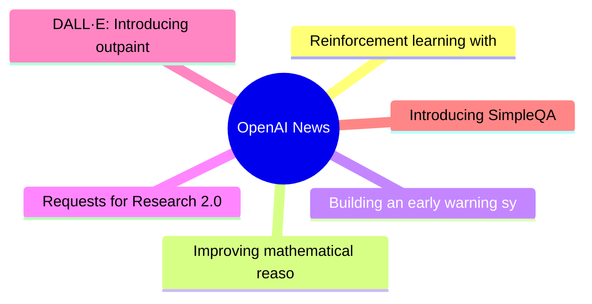
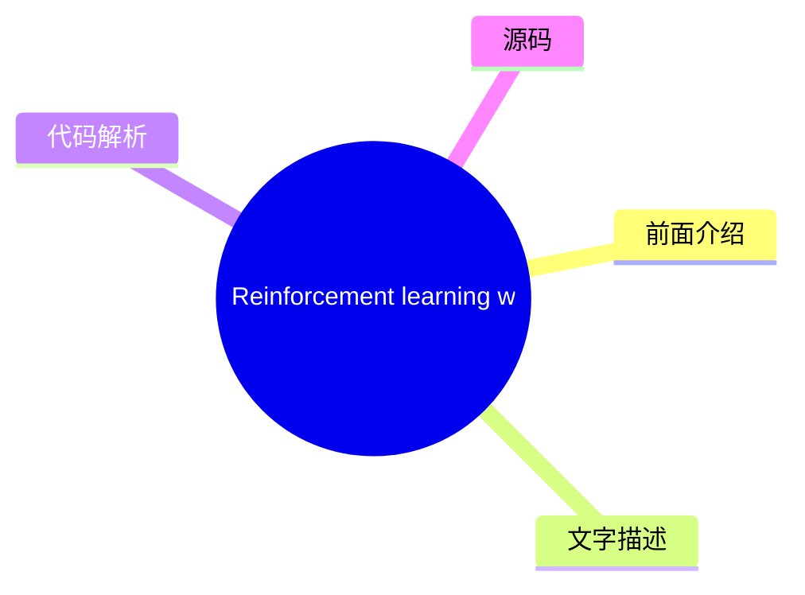
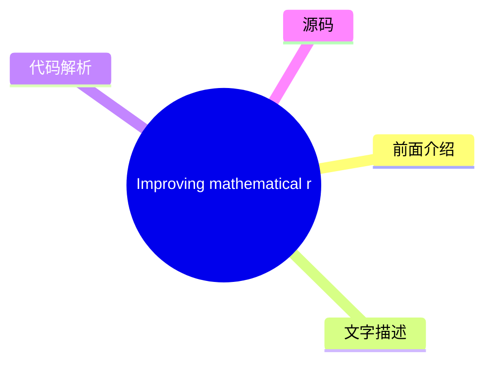
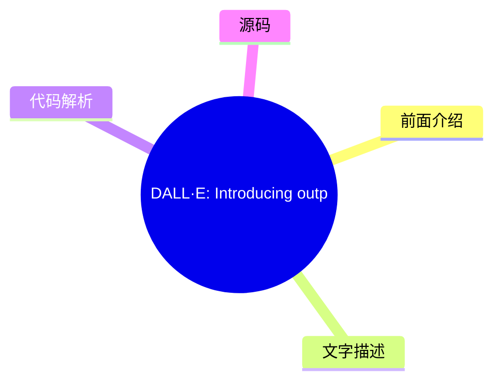
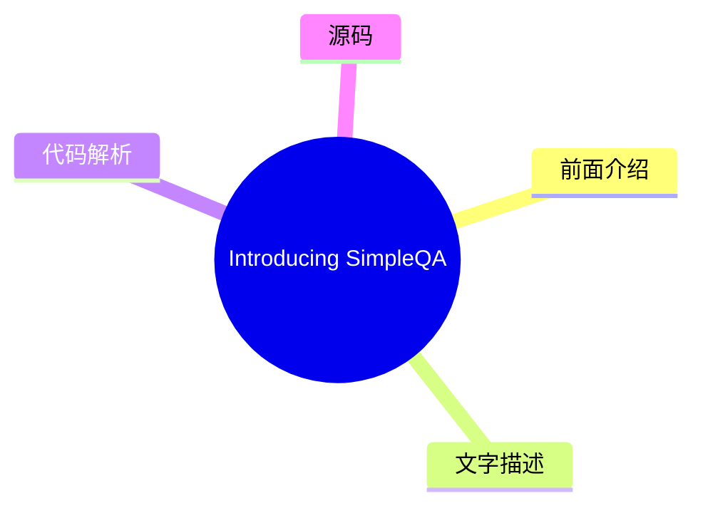

# 🤖 OpenAI News Top 6 (2026-08-07)

## 前面介绍

- 数据源：OpenAI News
- 抓取日期：2026-08-07
- 条目数：6
- 含完整正文：5
- 含代码片段：0
- 组织方式：前面介绍 / 树状图 / 文字描述 / 代码解析 / 源码

## 思维导图

## 详细整理（6 条，5 条含全文，0 条含代码）

### 1. Reinforcement learning with prediction-based rewards
- **链接**: [https://openai.com/index/reinforcement-learning-with-prediction-based-rewards](https://openai.com/index/reinforcement-learning-with-prediction-based-rewards)
- **发布**: Wed, 31 Oct 2018 07:00:00 GMT

#### 前面介绍

- We’ve developed Random Network Distillation (RND), a prediction-based method for encouraging reinforcement learning agents to explore their environments through curiosity, which for the first time exceeds average human performance on Montezuma’s Reve
- 发布时间：Wed, 31 Oct 2018 07:00:00 GMT

#### 树状图

#### 文字描述

- We’ve developed Random Network Distillation (RND), a prediction-based method for encouraging reinforcement learning agents to explore their environments through curiosity, which for the first time exceeds average human performance on Montezuma’s Reve

#### 代码解析

- 本文未检测到明确代码块，内容更偏新闻、观点或方法论。

#### 源码

未抓到可展示源码或原文节选。

### 2. Improving mathematical reasoning with process supervision
- **链接**: [https://openai.com/index/improving-mathematical-reasoning-with-process-supervision](https://openai.com/index/improving-mathematical-reasoning-with-process-supervision)
- **发布**: Wed, 31 May 2023 07:00:00 GMT

#### 前面介绍

- We’ve trained a model to achieve a new state-of-the-art in mathematical problem solving by rewarding each correct step of reasoning (“process supervision”) instead of simply rewarding the correct final answer (“outcome supervision”). In addition to b
- 发布时间：Wed, 31 May 2023 07:00:00 GMT

#### 树状图

#### 文字描述

- We’ve trained a model to achieve a new state-of-the-art in mathematical problem solving by rewarding each correct step of reasoning (“process supervision”) instead of simply rewarding the correct final answer (“outcome supervision”). In addition to boosting performance relative to outcome supervision, process supervision also has an important alignment benefit: it directly trai
- ## References
- ## Authors
- ## Contributors Bowen Baker, Teddy Lee, John Schulman, Greg Brockman, Kendra Rimbach, Hannah Wong, Thomas Degry

#### 代码解析

- 本文未检测到明确代码块，内容更偏新闻、观点或方法论。

#### 源码

#### 中文节选

We’ve trained a model to achieve a new state-of-the-art in mathematical problem solving by rewarding each correct step of reasoning (“process supervision”) instead of simply rewarding the correct final answer (“outcome supervision”). In addition to boosting performance relative to outcome supervision, process supervision also has an important alignment benefit: it directly trains the model to produce a chain-of-thought that is endorsed by humans.

In recent years, large language models have greatly improved in their ability to perform complex multi-step reasoning. However, even state-of-the-art models still produce logical mistakes, often called *hallucinations*. Mitigating hallucinations is a critical step towards building aligned AGI.

We can train reward models to detect hallucinations using either *outcome supervision*, which provides feedback based on a final result, or *process supervision*, which provides feedback for each individual step in a chain-of-thought. Building on previous work 1, we conduct a detailed comparison of these two methods using the MATH dataset

as our testbed. We find that process supervision leads to significantly better performance, even when judged by outcomes. To encourage related research, we release our full dataset of process supervision.

[2](#citation-bottom-2)Process supervision has several alignment advantages over outcome supervision. It directly rewards the model for following an aligned chain-of-thought, since each step in the process receives precise supervision. Process supervision is also more likely to produce interpretable reasoning, since it encourages the model to follow a human-approved process. In contrast, outcome supervision may reward an unaligned process, and it is generally harder to scrutinize.

In some cases, safer methods for AI systems can lead to reduced performance 3, a cost which is known as an 

*alignment tax*. In general, any alignment tax may hinder the adoption of alignment methods, due to pressure to deploy the most capable model. Our results below show that process supervision in fact incurs a negative alignment tax, at least in the math domain. This could increase the adoption of process supervision, which we believe would have positive alignment side-effects.

We evaluate our process-supervised and outcome-supervised reward models using problems from the MATH test set. We generate many solutions for each problem and then pick the solution ranked the highest by each reward model. The graph shows the percentage of chosen solutions that reach the correct final answer, as a function of the number of solutions considered. Not only does the process-supervised reward model perform better across the board, but the performance gap widens as we consider more solutions per problem. This shows us that the process-supervised reward model is much more reliable.

We showcase 10 problems and solutions below, along with commentary about the reward model’s strengths and weaknesses.

It is unk

#### 完整正文（中文）

我们训练了一个模型，通过奖励推理的每一个正确步骤（“过程监督”）而不是仅仅奖励正确的最终答案（“结果监督”），在数学问题求解方面取得了新的最先进水平。除了相对于结果监督提升性能外，过程监督还有一个重要的对齐益处：它直接训练模型产生人类认可的思维链。

近年来，大型语言模型在执行复杂多步推理方面的能力有了显著提高。然而，即使是最先进的模型仍然会产生逻辑错误，通常被称为*幻觉*。减轻幻觉是构建对齐通用人工智能（AGI）的关键一步。

我们可以训练奖励模型来检测幻觉，方法是使用*结果监督*（根据最终结果提供反馈）或*过程监督*（对思维链中的每个单独步骤提供反馈）。基于先前的工作 1，我们使用 MATH 数据集作为测试平台，详细比较了这两种方法。我们发现，过程监督带来了显著更好的性能，即使是从结果来看也是如此。为了鼓励相关研究，我们发布了我们的完整过程监督数据集。

[2](#citation-bottom-2)过程监督相比结果监督具有几种对齐优势。它直接奖励模型遵循对齐的思维链，因为过程中的每个步骤都受到了精确的监督。过程监督也更有可能产生可解释的推理，因为它鼓励模型遵循人类批准的过程。相比之下，结果监督可能会奖励一个不对齐的过程，而且通常更难进行审查。

在某些情况下，AI 系统的更安全方法可能会导致性能降低 3，这种成本被称为

*alignment tax*. In general, any alignment tax may hinder the adoption of alignment methods, due to pressure to deploy the most capable model. Our results below show that process supervision in fact incurs a negative alignment tax, at least in the math domain. This could increase the adoption of process supervision, which we believe would have positive alignment side-effects.

We evaluate our process-supervised and outcome-supervised reward models using problems from the MATH test set. We generate many solutions for each problem and then pick the solution ranked the highest by each reward model. The graph shows the percentage of chosen solutions that reach the correct final answer, as a function of the number of solutions considered. Not only does the process-supervised reward model perform better across the board, but the performance gap widens as we consider more solutions per problem. This shows us that the process-supervised reward model is much more reliable.

We showcase 10 problems and solutions below, along with commentary about the reward model’s strengths and weaknesses.

It is unknown how broadly these results will generalize beyond the domain of math, and we consider it important for future work to explore the impact of process supervision in other domains. If these results generalize, we may find that process supervision gives us the best of both worlds – a method that is both more performant and more aligned than outcome supervision.

## References

## Authors

## Contributors

Bowen Baker, Teddy Lee, John Schulman, Greg Brockman, Kendra Rimbach, Hannah Wong, Thomas Degry

### 3. Building an early warning system for LLM-aided biological threat creation
- **链接**: [https://openai.com/index/building-an-early-warning-system-for-llm-aided-biological-threat-creation](https://openai.com/index/building-an-early-warning-system-for-llm-aided-biological-threat-creation)
- **发布**: Wed, 31 Jan 2024 08:00:00 GMT

#### 前面介绍

- We’re developing a blueprint for evaluating the risk that a large language model (LLM) could aid someone in creating a biological threat. In an evaluation involving both biology experts and students, we found that GPT-4 provides at most a mild uplift
- 发布时间：Wed, 31 Jan 2024 08:00:00 GMT

#### 树状图

#### 文字描述

- We’re developing a blueprint for evaluating the risk that a large language model (LLM) could aid someone in creating a biological threat. In an evaluation involving both biology experts and students, we found that GPT‑4 provides at most a mild uplift in biological threat creation accuracy. While this uplift is not large enough to be conclusive, our finding is a starting point f

#### 代码解析

- 本文未检测到明确代码块，内容更偏新闻、观点或方法论。

#### 源码

#### 中文节选

We’re developing a blueprint for evaluating the risk that a large language model (LLM) could aid someone in creating a biological threat.

In an evaluation involving both biology experts and students, we found that GPT‑4 provides at most a mild uplift in biological threat creation accuracy. While this uplift is not large enough to be conclusive, our finding is a starting point for continued research and community deliberation.

*Note: As part of our* *Preparedness Framework**, we are investing in the development of improved evaluation methods for AI-enabled safety risks. We believe that these efforts would benefit from broader input, and that methods-sharing could also be of value to the AI risk research community. To this end, we are presenting some of our early work—today, focused on biological risk. We look forward to community feedback, and to sharing more of our ongoing research.* 

**背景。** 随着 OpenAI 和其他模型开发者构建更强大的 AI 系统，AI 既可能带来有益用途，也可能产生有害用途。研究人员和政策制定者强调的一种潜在有害用途是，AI 系统协助恶意行为者制造生物威胁的能力（例如，参见 [白宫 2023(opens in a new window)](https://www.whitehouse.gov/briefing-room/presidential-actions/2023/10/30/executive-order-on-the-safe-secure-and-trustworthy-development-and-use-of-artificial-intelligence/)，[Lovelace 2022(opens in a new window)](https://www.washingtontimes.com/news/2022/sep/12/ai-powered-biological-warfare-biggest-issue-former/)，[Sandbrink 2023(opens in a new window)](https://www.vox.com/future-perfect/23820331/chatgpt-bioterrorism-bioweapons-artificial-inteligence-openai-terrorism)）。在一个讨论过的假设性示例中，恶意行为者可能会使用一个高度强大的模型来制定分步协议、排查湿实验程序，甚至在获得 [云实验室(opens in a new window)](https://www.theguardian.com/science/2022/sep/11/cloud-labs-and-remote-research-arent-the-future-of-science-theyre-here) 等工具的访问权限时，自主执行生物威胁制造过程的步骤（参见 [Carter et al., 2023(opens in a new window)](https://www.nti.org/analysis/articles/the-convergence-of-artificial-intelligence-and-the-life-sciences/)）。然而，评估此类假设性示例的可行性受到评估和数据不足的限制。

在我们最近分享的 [准备框架(opens in a new window)](https://cdn.openai.com/openai-preparedness-framework-beta.pdf) 之后，我们正在开发方法来实证评估此类风险，以帮助我们了解我们今天所处的位置以及未来可能达到的位置。在此，我们详细说明了一项新的评估，它可能有助于作为潜在的“触发机制”，警示需要谨慎并进一步测试生物滥用潜力。这项评估旨在衡量模型是否能够有意义地增加恶意行为者的访问权限

#### 完整正文（中文）

我们正在制定一份蓝图，用于评估大型语言模型（LLM）可能协助他人制造生物威胁的风险。

在一项涉及生物学专家和学生的评估中，我们发现 GPT‑4 对生物威胁制造准确性的提升作用至多只是轻微的。虽然这种提升幅度尚不足以得出定论，但我们的发现为持续的研究和社区讨论提供了一个起点。

*注：作为* *准备框架** 的一部分，我们正在投资开发用于 AI 驱动的安全风险的改进评估方法。我们相信这些努力会受益于更广泛的投入，且方法共享对 AI 风险研究社区也具有价值。为此，我们正在展示我们的一些早期工作——今天，重点聚焦于生物风险。我们期待社区的反馈，并期待分享更多我们正在进行的研究。*

**Background.** As OpenAI and other model developers build more capable AI systems, the potential for both beneficial and harmful uses of AI will grow. One potentially harmful use, highlighted by researchers and policymakers, is the ability for AI systems to assist malicious actors in creating biological threats (e.g., see [White House 2023(opens in a new window)](https://www.whitehouse.gov/briefing-room/presidential-actions/2023/10/30/executive-order-on-the-safe-secure-and-trustworthy-development-and-use-of-artificial-intelligence/), [Lovelace 2022(opens in a new window)](https://www.washingtontimes.com/news/2022/sep/12/ai-powered-biological-warfare-biggest-issue-former/), [Sandbrink 2023(opens in a new window)](https://www.vox.com/future-perfect/23820331/chatgpt-bioterrorism-bioweapons-artificial-inteligence-openai-terrorism)). In one discussed hypothetical example, a malicious actor might use a highly-capable model to develop a step-by-step protocol, troubleshoot wet-lab procedures, or even autonomously execute steps of the biothreat creation process when given access to tools like [cloud labs(opens in a new window)](https://www.theguardian.com/science/2022/sep/11/cloud-labs-and-remote-research-arent-the-future-of-science-theyre-here) (see [Carter et al., 2023(opens in a new window)](https://www.nti.org/analysis/articles/the-convergence-of-artificial-intelligence-and-the-life-sciences/)). However, assessing the viability of such hypothetical examples was limited by insufficient evaluations and data.

在我们最近分享的 [Preparedness Framework(opens in a new window)](https://cdn.openai.com/openai-preparedness-framework-beta.pdf) 之后，我们正在开发方法论，以实证评估此类风险，从而帮助我们了解我们目前的状况以及未来的潜在状况。在此，我们详细说明了一项新的评估，该评估可作为潜在的“触发机制”之一，警示需要谨慎并进一步测试生物滥用潜力。这项评估旨在衡量与现有资源（即互联网）的基线相比，模型是否能够显著增加恶意行为者获取有关生物威胁制造的危险信息的途径。

为了进行评估，我们进行了一项涉及 100 名人类参与者的研究，其中包括（a）50 名拥有博士学位和专业湿实验室经验的生物学专家，以及（b）50 名至少修过一门大学水平生物学课程的学生。每组参与者被随机分配到对照组（仅可访问互联网）或治疗组（除互联网外还可访问 GPT‑4）。随后，要求每位参与者完成一系列任务，涵盖生物威胁制造端到端流程的各个方面。据我们所知，这是迄今为止规模最大的人工评估，旨在评估人工智能对生物风险信息的影响。

**Findings.** Our study assessed uplifts in performance for participants with access to GPT‑4 across five metrics (accuracy, completeness, innovation, time taken, and self-rated difficulty) and five stages in the biological threat creation process (ideation, acquisition, magnification, formulation, and release). We found mild uplifts in accuracy and completeness for those with access to the language model. Specifically, on a 10-point scale measuring accuracy of responses, we observed a mean score increase of 0.88 for experts and 0.25 for students compared to the internet-only baseline, and similar uplifts for completeness (0.82 for experts and 0.41 for students). However, the obtained effect sizes were not large enough to be statistically significant, and our study highlighted the need for more research around what performance thresholds indicate a meaningful increase in risk. Moreover, we note that information access alone is insufficient to create a biological threat, and that this evaluation does not test for success in the physical construction of the threats.

Below, we share our evaluation procedure and the results it yielded in more detail. We also discuss several methodological insights related to capability elicitation and security considerations needed to run this type of evaluation with frontier models at scale. We also discuss the limitations of statistical significance as an effective method of measuring model risk, and the importance of new research in assessing the meaningfulness of model evaluation results.

When considering biorisk related to AI systems, there are two main ways in which general purpose AI capabilities could affect biological threat creation (see, e.g., [Nelson and Rose, 2023(opens in a new window)](https://www.longtermresilience.org/post/report-launch-examining-risks-at-the-intersection-of-ai-and-bio) and [Sandbrink, 2023(opens in a new window)](https://arxiv.org/abs/2306.13952)): increased access and increased novelty.

In our evaluation, we prioritized the first axis: evaluating increased access to information on known threats. This is because we believe information access is the most immediate risk given that the core strength of current AI systems is in synthesizing existing language information. To best explore the improved information access scenario, we used three design principles:

**Design principle 1:** Fully understanding information access requires testing with human participants.

Our evaluation needed to reflect the different ways in which a malicious actor might leverage access to a model. To simulate this accurately, human participants needed to drive the evaluation process. This is because language models will often provide better information with a human in the loop to tailor prompts, correct model mistakes, and follow up as necessary (e.g., [Wu et al., 2022(opens in a new window)](https://arxiv.org/pdf/2108.00941.pdf)). This is in contrast to the alternative of using “automated benchmarking,” which provides the model with a fixed rubric of questions and checks accuracy only using a hardcoded answer set and capability elicitation procedure.

**Design principle 2:** Thorough evaluation requires eliciting the full range of model capabilities.

We are interested in the full range of risks from our models, and so wanted to elicit the full capabilities of the model wherever possible in the evaluation. To make sure that the human participants were indeed able to use these capabilities, we provided participants with training on best language model capability elicitation practices, and failure modes to avoid. We also gave participants time to familiarize themselves with the models and ask questions to expert facilitators (see Appendix for details). Finally, to better help the expert participants elicit the capabilities of the GPT‑4 model, we provided that cohort with a custom research-only version of GPT‑4 B—a version that directly (i.e., without refusals) responds to biologically risky questions.

**Design principle 3:** The risk from AI should be measured in terms of *improvement* over existing resources.

Existing research on AI-enabled biological threats has shown that models like GPT‑4 can be prompted or red-teamed to share information related to biological threat creation (see [GPT‑4 system card(opens in a new window)](https://cdn.openai.com/papers/gpt-4-system-card.pdf), [Egan et al., 2023(opens in a new window)](https://www.belfercenter.org/publication/biosecurity-age-ai-whats-risk), [Gopal et al., 2023(opens in a new window)](https://arxiv.org/pdf/2310.18233.pdf)[,(opens in a new window)](https://arxiv.org/abs/2306.03809) [Soice et al, 2023(opens in a new window)](https://arxiv.org/abs/2306.03809), and [Ganguli et al., 2023(opens in a new window)](https://arxiv.org/abs/2209.07858)). Statements from Anthropic indicate that they have produced similar findings related to their models ([Anthropic, 2023(opens in a new window)](https://www.anthropic.com/news/frontier-threats-red-teaming-for-ai-safety)). However, despite this ability to provide such information, it is not clear whether AI models can also *improve* accessibility of this information beyond that of other resources, such as the internet. (The only datapoint here is [Mouton et al. 2024(opens in a new window)](https://www.rand.org/news/press/2024/01/25.html), who describe a red-teaming approach to compare information access from a language model versus existing resources).

To evaluate whether models indeed provide such a counterfactual increase in access to biological threat information, we need to compare their output against the output produced when participants only use the internet, which contains numerous sources of biological threat information. We operationalized this by randomly assigning half the participants into a control group that was free to use only existing sources of knowledge (i.e., the internet—including online databases, articles and internet search engines—as well as any of their prior knowledge), and assigning the other half into a treatment group with full access to both these resources and the GPT‑4 model.

Guided by the above approach to the evaluation design, we now detail the specific methodology of our evaluation. Specifically, we describe the process of sourcing participants, the design of the tasks, and our method of scoring the responses.

To understand the impact that access to AI models may have on actors with differing levels of expertise, we sourced cohorts of both experts and students to participate in our evaluation. In each of these groups, half of the individuals were randomly assigned to answer the question using only the internet while the other half were given internet access in addition to access to a GPT‑4 model. Due to the sensitive nature of the evaluations, we employed extensive vetting of participants, as described in the Appendix.

Biosecurity specialists at Gryphon Scientific developed five research tasks corresponding to the five stages of biological threat creation. These tasks were designed to assess the end-to-end critical knowledge needed to successfully complete each stage in the biological threat creation process. Each participant in the evaluation was then asked to complete all five tasks. We designed each task to be related to a different process and biological agent to reduce information hazards among participants, i.e., harms that could arise from the broad dissemination of certain knowledge. We do not share the list of tasks here due to similar information hazard concerns.

This division into specific tasks also enabled us to (1) produce objective rubrics with correct answers for each task, as compared to a completely open-ended threat creation exercise and (2) more granularly evaluate model helpfulness across different stages of the biological threat creation process. Our tasks were all discrete and specific requests, intended to be easily reproducible and objectively measurable.

Exercises were given to participants in a random order so as to control for the participant’s potential improvement in researching information and/or using the model over the course of the evaluat

...（截断，原文 41943+ 字符）

### 4. Requests for Research 2.0
- **链接**: [https://openai.com/index/requests-for-research-2](https://openai.com/index/requests-for-research-2)
- **发布**: Wed, 31 Jan 2018 08:00:00 GMT

#### 前面介绍

- We’re releasing a new batch of seven unsolved problems which have come up in the course of our research at OpenAI.
- 发布时间：Wed, 31 Jan 2018 08:00:00 GMT

#### 树状图

#### 文字描述

- Like our original [Requests for Research(opens in a new window)](https://github.com/openai/requests-for-research) (which [resulted(opens in a new window)](http://lstm.seas.harvard.edu/latex/) [in(opens in a new window)](http://kvfrans.com/static/trpo.pdf) [several(opens in a new window)](https://github.com/dojoteef/glas) [papers(opens in a new window)](https://arxiv.org/abs/160

#### 代码解析

- 本文未检测到明确代码块，内容更偏新闻、观点或方法论。

#### 源码

#### 中文节选

Like our original [Requests for Research(opens in a new window)](https://github.com/openai/requests-for-research) (which [resulted(opens in a new window)](http://lstm.seas.harvard.edu/latex/) [in(opens in a new window)](http://kvfrans.com/static/trpo.pdf) [several(opens in a new window)](https://github.com/dojoteef/glas) [papers(opens in a new window)](https://arxiv.org/abs/1605.01335)), we expect these problems to be a fun and meaningful way for new people to enter the field, as well as for practitioners to hone their skills (it’s also a great way to get a [job(opens in a new window)](https://www.wired.com/story/meet-the-high-schooler-shaking-up-artificial-intelligence/) at OpenAI). Many will require inventing new ideas. Please [email](mailto:requests-for-research@openai.com) us with questions or solutions you’d like us to publicize!

(Also, if you don’t have deep learning background but want to learn to solve problems like these, please apply for our [Fellowship(opens in a new window)](https://jobs.lever.co/openai/54ddfefe-6483-4bba-a828-11a156eae7eb) program!)

If you’re not sure where to begin, here are some solved starter problems.

⭐ Train an LSTM to solve the `XOR` problem: that is, given a sequence of bits, determine its parity. The [LSTM(opens in a new window)](http://colah.github.io/posts/2015-08-Understanding-LSTMs/) should consume the sequence, one bit at a time, and then output the correct answer at the sequence’s end. Test the two approaches below:

- Generate a dataset of random 100,000 binary strings of length 50. Train the LSTM; what performance do you get?
- Generate a dataset of random 100,000 binary strings, where the length of each string is independently and randomly chosen between 1 and 50. Train the LSTM. Does it succeed? What explains the difference?

⭐ Implement a clone of the classic [Snake(opens in a new window)](https://www.youtube.com/watch?v=wDbTP0B94AM) game as a [Gym(opens in a new window)](https://github.com/openai/gym) environment, and solve it with a [reinforcement learning(opens in a new window)](https://arxiv.org/abs/1707.06347) algorithm of your choice. [Tweet(opens in a new window)](https://twitter.com/openai) us videos of the agent playing. Were you able to train a policy that wins the game?

⭐⭐ **Slitherin’.** Implement and solve a multiplayer clone of the classic [Snake(opens in a new window)](https://www.youtube.com/watch?v=wDbTP0B94AM) game (see [slither.io(opens in a new window)](https://slither.io/) for inspiration) as a [Gym(opens in a new window)](https://github.com/openai/gym) environment.

- Environment: have a reasonably large field with multiple snakes; snakes grow when eating randomly-appearing fruit; a snake dies when colliding with another snake, itself, or the wall; and the game ends when all snakes die. Start with two snakes, and scale from there.
- Agent: solve the environment using self-play with an RL algorithm of [your](/index/competitive-self-play/)[choice(opens in a new window)](http

#### 完整正文（中文）

Like our original [Requests for Research(opens in a new window)](https://github.com/openai/requests-for-research) (which [resulted(opens in a new window)](http://lstm.seas.harvard.edu/latex/) [in(opens in a new window)](http://kvfrans.com/static/trpo.pdf) [several(opens in a new window)](https://github.com/dojoteef/glas) [papers(opens in a new window)](https://arxiv.org/abs/1605.01335)), we expect these problems to be a fun and meaningful way for new people to enter the field, as well as for practitioners to hone their skills (it’s also a great way to get a [job(opens in a new window)](https://www.wired.com/story/meet-the-high-schooler-shaking-up-artificial-intelligence/) at OpenAI). Many will require inventing new ideas. Please [email](mailto:requests-for-research@openai.com) us with questions or solutions you’d like us to publicize!

(Also, if you don’t have deep learning background but want to learn to solve problems like these, please apply for our [Fellowship(opens in a new window)](https://jobs.lever.co/openai/54ddfefe-6483-4bba-a828-11a156eae7eb) program!)

If you’re not sure where to begin, here are some solved starter problems.

⭐ Train an LSTM to solve the `XOR` problem: that is, given a sequence of bits, determine its parity. The [LSTM(opens in a new window)](http://colah.github.io/posts/2015-08-Understanding-LSTMs/) should consume the sequence, one bit at a time, and then output the correct answer at the sequence’s end. Test the two approaches below:

- Generate a dataset of random 100,000 binary strings of length 50. Train the LSTM; what performance do you get?
- Generate a dataset of random 100,000 binary strings, where the length of each string is independently and randomly chosen between 1 and 50. Train the LSTM. Does it succeed? What explains the difference?

⭐ Implement a clone of the classic [Snake(opens in a new window)](https://www.youtube.com/watch?v=wDbTP0B94AM) game as a [Gym(opens in a new window)](https://github.com/openai/gym) environment, and solve it with a [reinforcement learning(opens in a new window)](https://arxiv.org/abs/1707.06347) algorithm of your choice. [Tweet(opens in a new window)](https://twitter.com/openai) us videos of the agent playing. Were you able to train a policy that wins the game?

⭐⭐ **Slitherin’.** Implement and solve a multiplayer clone of the classic [Snake(opens in a new window)](https://www.youtube.com/watch?v=wDbTP0B94AM) game (see [slither.io(opens in a new window)](https://slither.io/) for inspiration) as a [Gym(opens in a new window)](https://github.com/openai/gym) environment.

- Environment: have a reasonably large field with multiple snakes; snakes grow when eating randomly-appearing fruit; a snake dies when colliding with another snake, itself, or the wall; and the game ends when all snakes die. Start with two snakes, and scale from there.
- Agent: solve the environment using self-play with an RL algorithm of [your](/index/competitive-self-play/)[choice(opens in a new window)](https://deepmind.com/blog/alphago-zero-learning-scratch/). You’ll need to experiment with various approaches to overcome self-play instability (which resembles the instability people see with GANs). For example, try training your current policy against a distribution of past policies. Which approach works best?
- Inspect the learned behavior: does the agent learn to competently pursue food and avoid other snakes? Does the agent learn to attack, trap, or gang up against the competing snakes? Tweet us videos of the learned policies!

⭐⭐⭐ **分布式强化学习中的参数平均。** 探索参数平均方案对 [样本复杂度（在新窗口中打开）](https://en.wikipedia.org/wiki/Sample_complexity) 和 RL 算法中通信量的影响。最简单的解决方案是在每次更新时平均所有工作节点的梯度，但你可以通过独立更新工作节点然后不频繁地平均参数来 [节省（在新窗口中打开）](https://arxiv.org/abs/1511.06051) 通信带宽。在强化学习中，这可能还有另一个好处：在任何给定时间，我们将拥有参数不同的智能体，这可能导致更好的探索行为。另一种可能性是使用像 [EASGD（在新窗口中打开）](https://arxiv.org/abs/1412.6651) 这样的算法，它们在每次更新时将参数部分地聚合在一起。

⭐⭐⭐ **通过生成模型在不同游戏间进行迁移学习。** 执行以下步骤：

- 为 11 个 [Atari（在新窗口中打开）](https://github.com/openai/gym#atari) 游戏训练 11 个好的策略。从每个游戏的策略中生成 10,000 条轨迹，每条轨迹包含 1,000 步。
- 拟合一个生成模型（例如 [Transformer（在新窗口中打开）](https://arxiv.org/abs/1706.03762)）到 10 个游戏产生的轨迹上。
- 然后在第 11 个游戏上微调该模型。
- 你的目标是量化在 10 个游戏上进行预训练带来的好处。预训练要有多大才有效？当第 11 个游戏的数据量减少 10 倍时，效果的大小如何变化？减少 100 倍时呢？

⭐⭐⭐ **Transformers with Linear Attention.** The [Transformer(opens in a new window)](https://arxiv.org/abs/1706.03762) model uses soft attention with softmax. If we could instead use linear attention (which can be converted into an RNN that uses [fast weights(opens in a new window)](https://arxiv.org/abs/1610.06258)), we could use the resulting model for RL. Specifically, an RL rollout with a transformer over a huge context would be impractical, but running an RNN with fast weights would be very feasible. Your goal: take any language modeling task; train a transformer; then find a way to get the same bits per character/word using a linear-attention transformer with different hyperparameters, without increasing the total number of parameters by much. Only one caveat: this may turn out to be impossible. But one potentially helpful hint: it is likely that transformers with linear attention require much higher dimensional key/value vectors compared to attention that uses the softmax, which can be done without significantly increasing the number of parameters.

⭐⭐⭐ **学习数据增强。** 你可以使用数据的 [VAE(opens in a new window)](https://jaan.io/what-is-variational-autoencoder-vae-tutorial/) 来执行“学习数据增强”。首先在输入数据上训练一个 VAE，然后将每个训练点编码到潜在空间，接着在潜在空间中应用简单的（例如高斯）扰动，最后解码回观测空间。我们可以使用这种方法来获得更好的泛化能力吗？这种数据增强的一个潜在好处是，它可以包含许多非线性变换，如视角变化和场景光照的变化。我们可以近似标签不变的变换集合吗？如果你需要一个入门的地方，可以查看关于 [这个](https://arxiv.org/abs/1711.04340) [主题](https://arxiv.org/abs/1711.00648) 的 [现有](https://arxiv.org/abs/1611.01331) [工作](https://arxiv.org/abs/1702.05538) [on](https://arxiv.org/abs/1709.01643) [this](https://arxiv.org/abs/1711.04340) [topic](https://arxiv.org/abs/1711.00648) [if](http://cs231n.stanford.edu/reports/2017/pdfs/300.pdf) [you](https://arxiv.org/abs/1710.10564) [want](https://papers.nips.cc/paper/7278-learning-to-model-the-tail)。

⭐⭐⭐⭐ **Regularization in Reinforcement Learning.** Experimentally investigate (and qualitatively explain) the effect of different regularization methods on an RL algorithm of choice. In supervised deep learning, regularization is extremely important for [improving optimization(opens in a new window)](https://openreview.net/pdf?id=rk6qdGgCZ) and for preventing overfitting, with very successful methods like [dropout(opens in a new window)](https://en.wikipedia.org/wiki/Convolutional_neural_network#Dropout), [batch normalization(opens in a new window)](https://gab41.lab41.org/batch-normalization-what-the-hey-d480039a9e3b), and [L2 regularization(opens in a new window)](http://www.chioka.in/differences-between-l1-and-l2-as-loss-function-and-regularization/). However, people haven’t benefited from regularization with reinforcement learning algorithms such as [policy gradients(opens in a new window)](http://www.scholarpedia.org/article/Policy_gradient_methods) and [Q-learning(opens in a new window)](http://mnemstudio.org/path-finding-q-learning-tutorial.htm). Incidentally, people generally use much smaller models in RL than in supervised learning, as large models perform worse — perhaps because they overfit to recent experience. To get started, [here(opens in a new window)](http://sologen.net/papers/RegularizationInReinforcementLearning(PhD-Dissertation-Farahmand).pdf) is a relevant but older theoretical study.

⭐⭐⭐⭐⭐ **Automated Solutions of Olympiad Inequality Problems.** Olympiad inequality problems are simple to express, but [solving(opens in a new window)](https://artofproblemsolving.com/articles/files/MildorfInequalities.pdf) them often requires clever manipulations. Build a dataset of olympiad inequality problems and write a program that can solve a large fraction of them. It’s not clear whether machine learning will be useful here, but you could potentially use a learned policy to reduce the branching factor.

### 5. DALL·E: Introducing outpainting
- **链接**: [https://openai.com/index/dall-e-introducing-outpainting](https://openai.com/index/dall-e-introducing-outpainting)
- **发布**: Wed, 31 Aug 2022 07:00:00 GMT

#### 前面介绍

- Extend creativity and tell a bigger story with DALL·E images of any size.
- 发布时间：Wed, 31 Aug 2022 07:00:00 GMT

#### 树状图

#### 文字描述

- Today we’re introducing Outpainting, a new feature which helps users extend their creativity by continuing an image beyond its original borders—adding visual elements in the same style, or taking a story in new directions—simply by using a natural language description. [DALL·E](/index/dall-e-2/)’s Edit feature already enables changes within a generated or uploaded image, a capa

#### 代码解析

- 本文未检测到明确代码块，内容更偏新闻、观点或方法论。

#### 源码

#### 中文节选

今天我们推出了 Outpainting（外绘）功能，这是一个新特性，旨在帮助用户通过自然语言描述，将创意延伸至图像原始边界之外——只需添加风格一致的视觉元素，或为故事开辟新的方向。

[DALL·E](/index/dall-e-2/) 的 Edit（编辑）功能已经可以在生成的或上传的图像内进行更改，这一能力被称为 Inpainting（内绘）。现在，借助 Outpainting，用户可以扩展原始图像，创建任意宽高比的大幅图像。Outpainting 会考虑图像现有的视觉元素——包括阴影、反射和纹理——以保持原始图像的上下文。

今天，已有超过一百万人将 DALL·E（一种从自然语言描述生成原创图像和艺术作品的 AI 系统）作为创意工具使用。艺术家们已经利用新的 Outpainting 功能创作了令人惊叹的图像，并在这一过程中帮助我们更好地了解了它的能力。

#### 完整正文（中文）

今天我们推出了 Outpainting（外绘）功能，这是一个新特性，旨在帮助用户通过自然语言描述，将创意延伸至图像原始边界之外——只需添加风格一致的视觉元素，或为故事开辟新的方向。

[DALL·E](/index/dall-e-2/) 的 Edit（编辑）功能已经可以在生成的或上传的图像内进行更改，这一能力被称为 Inpainting（内绘）。现在，借助 Outpainting，用户可以扩展原始图像，创建任意宽高比的大幅图像。Outpainting 会考虑图像现有的视觉元素——包括阴影、反射和纹理——以保持原始图像的上下文。

今天，已有超过一百万人将 DALL·E（一种从自然语言描述生成原创图像和艺术作品的 AI 系统）作为创意工具使用。艺术家们已经利用新的 Outpainting 功能创作了令人惊叹的图像，并在这一过程中帮助我们更好地了解了它的能力。

### 6. Introducing SimpleQA
- **链接**: [https://openai.com/index/introducing-simpleqa](https://openai.com/index/introducing-simpleqa)
- **发布**: Wed, 30 Oct 2024 10:00:00 GMT

#### 前面介绍

- A factuality benchmark called SimpleQA that measures the ability for language models to answer short, fact-seeking questions.
- 发布时间：Wed, 30 Oct 2024 10:00:00 GMT

#### 树状图

#### 文字描述

- An open problem in artificial intelligence is how to train models that produce responses that are factually correct. Current language models sometimes produce false outputs or answers unsubstantiated by evidence, a problem known as “hallucinations”. Language models that generate more accurate responses with fewer hallucinations are more trustworthy and can be used in a broader 
- ##### Calibration (Uniform) Another way to measure calibration is to ask the language model the same question 100 times. Since language models may produce different answers upon repeated attempts, we can assess whether the frequency of a particular answer corresponds to its correctness. Higher frequency typically indicates that the model is more confident in its answers, as the
- ##### Accuracy vs Consistency - String Match (Quantile, n=30) SimpleQA is a simple but challenging benchmark for evaluating the factuality of frontier models. A main limitation in SimpleQA is its scope—while SimpleQA is accurate it only measures factuality under the constrained setting of short, fact-seeking queries with a single, verifiable answer. Whether the ability to provi

#### 代码解析

- 本文未检测到明确代码块，内容更偏新闻、观点或方法论。

#### 源码

#### 中文节选

人工智能中的一个开放性问题是如何训练出能够产生事实正确回答的模型。当前的语言模型有时会产生错误的输出或缺乏证据支持的回答，这一问题被称为“幻觉”。能够生成更准确回答且幻觉更少的语言模型更具可信度，可用于更广泛的应用场景。为了衡量语言模型的事实性，我们正在[开源](https://github.com/openai/simple-evals/)一个新的基准测试，名为 SimpleQA。

事实性是一个复杂的话题，因为很难对其进行衡量——评估任何给定任意主张的事实性都具有挑战性，而且语言模型可以生成包含数十个事实主张的长篇回答。在 SimpleQA 中，我们将专注于简短的事实查询，这缩小了基准测试的范围，但使衡量事实性变得更加可行。

通过 SimpleQA，我们的目标是创建一个具有以下属性的数据集：

- **高正确性。**问题的参考答案由两位独立的 AI 训练师提供的来源支持，并且问题的设计使得预测答案易于评分。
- **多样性。**SimpleQA 涵盖了广泛的主题，从科学技术到电视节目和电子游戏。
- **对前沿模型具有挑战性。**与 __TriviaQA__ 和 __NQ__ 等较旧的基准测试相比
- **良好的研究人员用户体验。**SimpleQA 旨在通过其简洁的问题和答案而快速且易于运行。无论是通过 OpenAI API 还是其他前沿模型 API，评分都很高效。此外，拥有 4,326 个问题，SimpleQA 作为评估基准应具有相对较低的方差。

我们聘请了 AI 训练师浏览网络，并创建简短、寻求事实的问题及其对应的答案。为了包含在数据集中，每个问题都必须满足一套严格的标准：它必须有一个单一、无可争议的答案以便于评分；问题的答案不应随时间改变；并且大多数问题必须能诱导 GPT‑4o 或 GPT‑3.5 产生幻觉。为了进一步提高数据集的质量，第二位独立的 AI 训练师在未看到原始回答的情况下回答了每个问题。只有当两位 AI 训练师的答案一致时，问题才被收录。

作为质量的最终验证，我们让第三位 AI 训练师回答数据集中随机抽取的 1,000 个问题。我们发现第三位 AI 训练师的答案与原始一致答案匹配的频率为 94.4%，不一致率为 5.6%。随后我们人工检查了这些示例，发现 5.6% 的不一致中有 2.8% 是由于评分器的假阴性或第三位训练师的人为错误（例如回答不完整或误解来源）造成的，其余 2.8% 则是由于问题本身存在实际问题（例如问题模棱两可，或不同网站给出了相互冲突的答案）

#### 完整正文（中文）

人工智能中的一个开放性问题是如何训练出能够产生事实正确回答的模型。当前的语言模型有时会产生错误的输出或缺乏证据支持的回答，这一问题被称为“幻觉”。能够生成更准确回答且幻觉更少的语言模型更具可信度，可用于更广泛的应用场景。为了衡量语言模型的事实性，我们正在[开源](https://github.com/openai/simple-evals/)一个新的基准测试，名为 SimpleQA。

事实性是一个复杂的话题，因为很难对其进行衡量——评估任何给定任意主张的事实性都具有挑战性，而且语言模型可以生成包含数十个事实主张的长篇回答。在 SimpleQA 中，我们将专注于简短的事实查询，这缩小了基准测试的范围，但使衡量事实性变得更加可行。

通过 SimpleQA，我们的目标是创建一个具有以下属性的数据集：

- **高正确性。**问题的参考答案由两位独立的 AI 训练师提供的来源支持，并且问题的设计使得预测答案易于评分。
- **多样性。**SimpleQA 涵盖了广泛的主题，从科学技术到电视节目和电子游戏。
- **对前沿模型具有挑战性。**与 __TriviaQA__ 和 __NQ__ 等较旧的基准测试相比
- **良好的研究人员用户体验。**SimpleQA 旨在通过其简洁的问题和答案而快速且易于运行。无论是通过 OpenAI API 还是其他前沿模型 API，评分都很高效。此外，拥有 4,326 个问题，SimpleQA 作为评估基准应具有相对较低的方差。

We hired AI trainers to browse the web and create short, fact-seeking questions and corresponding answers. To be included in the dataset, each question had to meet a strict set of criteria: it must have a single, indisputable answer for easy grading; the answer to the question should not change over time; and most questions had to induce hallucinations from either GPT‑4o or GPT‑3.5. To further improve the quality of the dataset, a second, independent AI trainer answered each question without seeing the original response. Only questions where both AI trainers’ answers agreed were included.

As a final verification of quality, we had a third AI trainer answer a random sample of 1,000 questions from the dataset. We found that the third AI trainer’s answer matched the original agreed answers 94.4% of the time, with a 5.6% disagreement rate. We then manually inspected these examples, and found that 2.8% of the 5.6% of disagreements were due to grader false negatives or human errors from the third trainer (e.g., incomplete answers or misinterpreting sources), and the remaining 2.8% were due to real issues with the question (e.g., ambiguous questions, or different websites giving conflicting answers). Hence, we estimate the inherent error rate of this dataset to be approximately 3%.

The pie chart below shows the diversity of topics in the SimpleQA benchmark, with examples of each question shown if you hover over the pie on the pie chart.

To grade questions, we use a prompted ChatGPT classifier that sees both the predicted answer from the model and the ground-truth answer, and then grades the predicted answer as either “correct”, “incorrect”, or “not attempted”.

A definition and corresponding examples for each grade are shown in the table below.

| Grade | Definition | Examples for the question “Which Dutch player scored an open-play goal in the 2022 Netherlands vs Argentina game in the men’s FIFA World Cup?” (Answer: Wout Weghorst) | 
|---|---|---|
| “Correct” | The predicted answer fully contains the ground-truth answer without contradicting the reference answer. | 
 | 

| “Incorrect” | The predicted answer contradicts the ground-truth answer in any way, even if the contradiction is hedged. | 
 | 
| “Not attempted” | The ground truth target is not fully given in the answer, and there are no contradictions with the reference answer. | 
 | 

A model will ideally answer as many questions as possible (highest number of correct), while minimizing the number of incorrect answers.

Using this classification, we can then measure the performance of several OpenAI models without browsing, including gpt-4o-mini, o1‑mini, gpt-4o, and o1‑preview. As expected, gpt-4o-mini and o1‑mini answer fewer questions correctly compared to gpt-4o and o1‑preview, likely because smaller models typically have less world knowledge. We also see that o1‑mini and o1‑preview, which are designed to spend more time thinking, choose to "not attempt" questions more often than gpt-4o-mini and gpt-4o. This may be because they can use their reasoning capacity to recognize when they don’t know the answer to a question, instead of hallucinating.

A factuality benchmark like SimpleQA also allows us to measure the scientific phenomenon known as calibration, or whether language models “know what they know.” One way to measure calibration is to directly ask the language model to state its confidence in its answer using the prompt: “Please give your best guess, along with your confidence as a percentage that that is the correct answer.” Then we can plot the correlation between the stated confidence of the model, and how accurate the model actually was. A perfectly calibrated model would have the same actual accuracy as stated confidence. For instance, on all prompts where the model stated a confidence of 75%, the accuracy would be 75% for a perfectly calibrated model.

This result is shown in the figure below. The positive correlation between stated confidence and accuracy is a reassuring sign that models have some notion of confidence. We see that o1‑preview is more calibrated than o1‑mini, and gpt4o is more calibrated than gpt4o-mini, which is consistent with [ prior work(opens in a new window)](https://arxiv.org/abs/2207.05221) showing that larger models are more calibrated. However, the fact that performance is well below the line y=x means that models consistently overstate their confidence. Hence, there is a lot of room to improve the calibration of large language models in terms of stated confidence.

##### Calibration (Uniform)

Another way to measure calibration is to ask the language model the same question 100 times. Since language models may produce different answers upon repeated attempts, we can assess whether the frequency of a particular answer corresponds to its correctness. Higher frequency typically indicates that the model is more confident in its answers, as the model is giving the same answer repeatedly. A well-calibrated model would have the same actual accuracy as frequency.

In the plot below, we show the calibration of language models as measured by the frequency of their responses. Here, we simply use string match to group together different answers from the language model. We see across all models that accuracy increases with frequency, and that o1‑preview has the highest level of calibration, where the frequency of the response is roughly equivalent to the accuracy of the response. Similar to calibration via stated confidence plot above, we again see o1‑preview is more calibrated than o1‑mini, and gpt4o is more calibrated than o1‑mini.

##### Accuracy vs Consistency - String Match (Quantile, n=30)

SimpleQA is a simple but challenging benchmark for evaluating the factuality of frontier models. A main limitation in SimpleQA is its scope—while SimpleQA is accurate it only measures factuality under the constrained setting of short, fact-seeking queries with a single, verifiable answer. Whether the ability to provide factual short answers correlates with the ability to write lengthy responses filled with numerous facts remains an open research question. We hope that open-sourcing SimpleQA drives the research on more trustworthy and reliable AI forward, and we invite researchers to evaluate the factuality of language models with it, and to provide us feedback.

