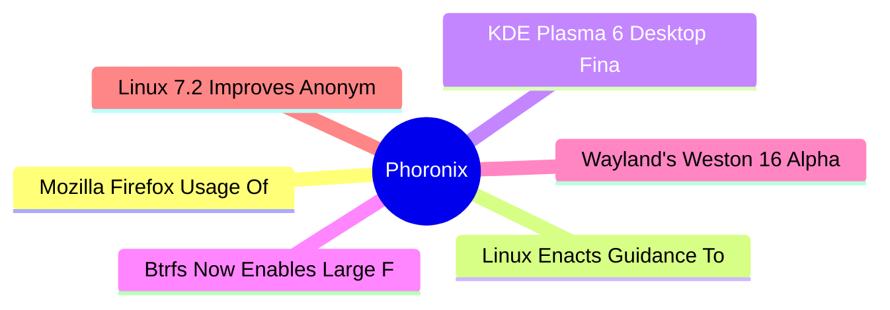

# ⚙️ Phoronix Top 6 (2026-06-17)

## 思维导图

## 列表（6 条）

### 1. Mozilla Firefox Usage Of zlib-rs For Better Safety & Performance
- **链接**: [https://www.phoronix.com/news/Mozilla-Firefox-zlib-rs-Usage](https://www.phoronix.com/news/Mozilla-Firefox-zlib-rs-Usage)
- **作者**: Michael Larabel
- **发布**: Tue, 16 Jun 2026 20:46:00 -0400
- **简介**: Since the release in May of Firefox 151, Mozilla has been relying on the zlib-rs library for Gzip compression/decompression. This subtle change to use this Rust-based Zlib implementation has yielded some performance bene

### 2. Linux Enacts Guidance To Tighten Acceptance Of New File-Systems Into The Kernel
- **链接**: [https://www.phoronix.com/news/Linux-New-File-System-Docs](https://www.phoronix.com/news/Linux-New-File-System-Docs)
- **作者**: Michael Larabel
- **发布**: Tue, 16 Jun 2026 17:16:42 -0400
- **简介**: There is no shortage of different file-systems available for Linux. New file-systems continue to come about in the open-source world but ultimately many of them end up not being well maintained or having very limited use

### 3. KDE Plasma 6 Desktop Finally Comes To Slackware
- **链接**: [https://www.phoronix.com/news/Slackware-KDE-Plasma-6](https://www.phoronix.com/news/Slackware-KDE-Plasma-6)
- **作者**: Michael Larabel
- **发布**: Tue, 16 Jun 2026 16:29:33 -0400
- **简介**: It's been a while since there has been any Slackware news to pass along, but this week they've finally landed the KDE Plasma 6 desktop in this legendary Linux distribution...

### 4. Btrfs Now Enables Large Folios By Default, Lands Huge Folios With Linux 7.2
- **链接**: [https://www.phoronix.com/news/Linux-7.2-Btrfs](https://www.phoronix.com/news/Linux-7.2-Btrfs)
- **作者**: Michael Larabel
- **发布**: Tue, 16 Jun 2026 16:20:11 -0400
- **简介**: The Btrfs file-system feature updates have been merged for the Linux 7.2 kernel with a few noteworthy changes for this copy-on-write file-system...

### 5. Wayland's Weston 16 Alpha Brings HDR Improvements, Vulkan Renderer Fixes
- **链接**: [https://www.phoronix.com/news/Wayland-Weston-16-Alpha](https://www.phoronix.com/news/Wayland-Weston-16-Alpha)
- **作者**: Michael Larabel
- **发布**: Tue, 16 Jun 2026 13:52:15 -0400
- **简介**: Wayland developers have prepared the release of Weston 16.0 Alpha 1 for this reference Wayland compositor with new features...

### 6. Linux 7.2 Improves Anonymous/Unnamed Pipe Performance For Shell Pipelines & More
- **链接**: [https://www.phoronix.com/news/Linux-72-Faster-Anon-Pipe-Write](https://www.phoronix.com/news/Linux-72-Faster-Anon-Pipe-Write)
- **作者**: Michael Larabel
- **发布**: Tue, 16 Jun 2026 13:05:44 -0400
- **简介**: Yet another performance optimization merged for the in-development Linux 7.2 kernel is improving the speed of anon_pipe_write, the kernel function used for writing data into anonymous/unnamed pipes such as when using she
